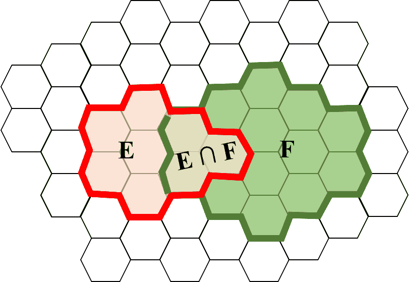

# 条件概率

> 原文：[`chrispiech.github.io/probabilityForComputerScientists/en/part1/cond_prob/`](https://chrispiech.github.io/probabilityForComputerScientists/en/part1/cond_prob/)

* * *

在英语中，条件概率表示为“在已经观察到某些其他事件 F 的情况下，事件 E 发生的可能性是什么”。它是机器学习和概率中的一个关键概念，因为它允许我们在面对新证据时更新我们的概率。

当你基于一个事件的发生进行条件化时，你进入了该事件已经发生的世界。正式地说，一旦你基于 $F$ 进行条件化，现在可能的结果只有与 $F$ 一致的结果。换句话说，你的样本空间现在将缩减为 $F$。顺便提一下，在事件 $F$ 发生的宇宙中，所有概率规则仍然适用！

***定义***：条件概率。

在事件 F 已经发生的情况下（即基于事件 F 的条件），事件 E 发生的概率：$$ \p(E |F) = \frac{\p(E \and F)}{\p(F)} $$

让我们通过一个可视化来理解为什么条件概率公式是正确的。再次考虑事件 $E$ 和 $F$，它们的可能结果都是样本空间中 50 个等可能结果的子集，每个结果都表示为一个六边形：

基于事件 F 的条件意味着我们已经进入了事件 F 已经发生的世界（此时，F，它有 14 个等可能的结果，已成为我们的新样本空间）。在事件 F 发生的条件下，事件 E 发生的条件概率是 E 的结果中与 F 一致的部分。在这种情况下，我们可以直观地看到这些是 $E \and F$ 中的三个结果。因此，我们有：$$ \p(E |F) = \frac{\p(E \and F)}{\p(F)} = \frac{3/50}{14/50} = \frac{3}{14} \approx 0.21 $$ 即使这个视觉示例（具有等可能结果空间）对于获得直觉很有用，但条件概率无论样本空间是否有等可能结果都适用！

## 条件概率示例

让我们用一个现实世界的例子来更好地理解条件概率：电影推荐。想象一下，像 Netflix 这样的流媒体服务想要根据用户观看了一部不同的电影$F$（比如[Amélie](https://en.wikipedia.org/wiki/Am%C3%A9lie)）来计算用户观看电影$E$（例如，[Life is Beautiful](https://en.wikipedia.org/wiki/Life_Is_Beautiful)）的概率。首先，让我们回答一个更简单的问题：用户观看电影 Life is Beautiful，$E$的概率是多少？我们可以使用概率的定义和一个电影观看数据集[[1](https://www.kaggle.com/netflix-inc/netflix-prize-data)]来解决这个问题：$$ \begin{align} \p(E) &= \lim_{n \rightarrow \infty} \frac{\text{count}(E)}{n} \approx \frac{\text{# people who watched movie $E$}}{\text{# people on Netflix}} \\ &= \frac{1,234,231}{50,923,123} \approx 0.02 \end{align} $$ 实际上，我们可以为许多电影$E$做同样的事情：

$\p(E) = 0.02$$\p(E) = 0.01$$\p(E) = 0.05$$\p(E) = 0.09$$\p(E) = 0.03$

现在来一个更有趣的问题。在已知用户观看了 Amélie($F$)的情况下，用户观看电影 Life is Beautiful($E$)的概率是多少？我们可以使用条件概率的定义。$$ \begin{align} \p(E|F) &= \frac{\p(E \and F)}{\p(F)} && \text{条件概率的定义}\\ &\approx \frac{ (\text{# who watched $E \and F$}) / (\text{# of people on Netflix}) }{ (\text{# who watched movie $F$}) / (\text{# people on Netflix}) } && \text{概率的定义} \\ &\approx \frac{\text{# of people who watched both $E \and F$}}{\text{# of people who watched movie $F$}} && \text{简化} \end{align} $$ 如果我们让$F$表示某人观看电影 Amélie 的事件，我们现在可以计算$\p(E|F)$，即某人观看电影$E$的条件概率：

$\p(E|F) = 0.09$$\p(E|F) = 0.03$$\p(E|F) = 0.05$$\p(E|F) = 0.02$$\p(E|F)$ = 1.00

为什么在观察到某人观看了 Amélie($F$)之后，有些概率上升，有些概率下降，而有些概率保持不变？如果你知道某人观看了 Amélie，他们更有可能观看 Life is Beautiful，而不太可能观看 Star Wars。我们对这个人的信息有了新的了解！

## 条件范式

当你基于一个事件进行条件化时，你进入了一个该事件已经发生的世界。在这个新的世界中，所有概率定律仍然适用。因此，只要你在同一事件上保持一致的条件化，我们所学到的每一个工具仍然适用。让我们看看当我们对事件进行一致的条件化时（在这种情况下是 $G$）的一些老朋友：

| 规则名称 | 原始规则 | 基于 $G$ 的规则 |
| --- | --- | --- |
| 概率公理 1 | $0 ≤ \p(E) ≤ 1$ | $0 ≤ \p(E | G) ≤ 1$ |
| 概率公理 2 | $\p(S) = 1$ | $\p(S | G) = 1$ |
| 概率公理 3 | 对于互斥事件，$\p(E \lor F) = \p(E) + \p(F)$ | 对于互斥事件，$\p(E \lor F | G) = \p(E | G) + \p(F | G)$ |
| Identity 1 | $\p(E^c) = 1 - \p(E)$ | $\p(E^c | G) = 1 - \p(E | G)$ |

## 基于多个事件的条件化

条件范式也适用于条件概率的定义！再次，如果我们一致地基于某个事件 $G$ 的发生进行条件化，规则仍然适用：$$ \p(E|F, G) = \frac{\p(E \land F| G)}{\p(F| G)} $$ 术语 $\p(E|F, G)$ 是对多个事件条件化的新符号。你应该将这个术语读作“在 F 和 G 都已发生的情况下，E 发生的概率”。这个方程表明，在 $G$ 发生的世界中，$E|F$ 的条件概率定义仍然适用。你认为 $\p(E|F, G)$ 应该等于 $\p(E|F)$ 吗？答案是：有时是，有时不是。
