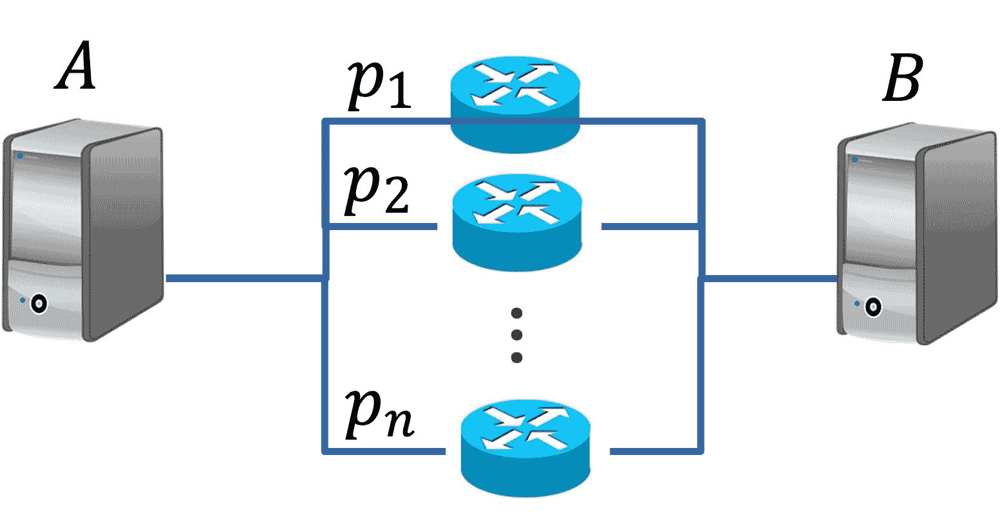

# 独立性

> [`chrispiech.github.io/probabilityForComputerScientists/en/part1/independence/`](https://chrispiech.github.io/probabilityForComputerScientists/en/part1/independence/)

* * *

到目前为止，我们已经讨论了互斥作为两个或更多事件可以拥有的一个重要的“属性”。在本章中，我们将向您介绍第二个属性：独立性。独立性可能是需要考虑的最重要属性之一！就像互斥一样，如果你能确立这个属性适用（无论是通过逻辑还是通过声明为假设），这将使分析概率计算变得容易得多！

**定义：** 独立性

如果知道一个事件的结局不会改变你对另一个事件是否发生的信念，那么这两个事件被认为是独立的。例如，你可能会说两个独立的骰子滚动是相互独立的：第一个骰子的结果不会给你关于第二个骰子结果的信息——反之亦然。

$$ \p(E | F) = \p(E) $$

## 另一种定义

通过使用称为链式法则的方程，可以推导出独立性的另一个定义，我们将在稍后学习，在两个事件独立的情况下。考虑两个独立事件$A$和$B$：$$\begin{align*} \P(A,B) &= \p(A) \cdot \p(B|A) && \href{ ../../part1/prob_and/}{\text{链式法则}} \\ &= \p(A) \cdot \p(B) && \text{独立性} \end{align*}$$

## 独立性是对称的

这个定义是[对称的](https://en.wikipedia.org/wiki/Symmetric_relation)。如果$E$与$F$独立，那么$F$也与$E$独立。我们可以从被称为贝叶斯定理的法律开始证明$\p(F | E) = \p(F)$意味着$\p(E | F) = \p(E)$，我们将在稍后介绍：$$\begin{align*} \p(E | F) &= \frac{\p(F|E) \cdot \p(E)}{\p(F)} && \text{贝叶斯定理} \\ &= \frac{\p(F) \cdot \p(E)}{\p(F)} && \p(F | E) = \p(F) \\ &= \p(E) && \text{约简} \end{align*}$$

## 广义独立性

如果对于每个包含$r$个元素（其中$r \leq n$）的子集：$$ \p(E_{1'}, E_{2'}, \dots, E_{r'}) = \prod_{i=1}^r \p(E_i') $$

例如，考虑 5 次抛硬币得到 5 个正面的概率，其中我们假设每次抛硬币都是相互独立的。

设$H_i$为第$i$次抛硬币得到正面的事件：$$\begin{align*} \p(H_1,&H_2,H_3,H_4,H_5) \\ &= \p(H_1) \cdot \p(H_2) \cdots \p(H_5) && \text{独立性} \\ &= \prod_{i=1}⁵ \p(H_i) && \text{乘积符号}\\ &= \prod_{i=1}⁵ \frac{1}{2} \\ &= \frac{1}{2}⁵ \\ &= 0.03125 \end{align*}$$

## 如何建立独立性

你如何证明两个或更多事件是独立的？默认选项是数学上证明。如果你能证明 $\p(E | F) = \p(E)$，那么你就已经证明了这两个事件是独立的。当处理来自数据的概率时，很少有事情会完全符合独立性的数学定义。这可能有两个原因：首先，从数据或模拟计算出来的事件并不完全精确，可能无法知道 $\p(E)$ 和 $\p(E |F)$ 之间的差异是由于概率估计的不准确，还是事件之间的依赖性。其次，在我们的复杂世界中，许多事物实际上相互影响，即使只是微小的程度。尽管如此，我们经常做出错误但有用的独立性假设。由于独立性使得人类和机器计算复合概率变得容易得多，你可以宣布这些事件是独立的。这可能意味着你的计算结果略有错误——但这种“建模假设”可能使得出结果变得可行。

独立性是一个属性，如果你认为一个事件不太可能影响你对另一个事件发生的信念（或者如果这种影响是可以忽略不计的），那么通常会“假设”它是独立的。让我们通过一个例子来更好地理解。

## 示例：并行网络

在网络中，例如互联网，计算机可以发送信息。通常，在两台计算机之间有多个路径（由路由器介导），只要有一条路径是可用的，就可以发送信息。考虑以下具有 $n$ 个 ***独立*** 路由器的并行网络，每个路由器有 $p_i$ 的概率可以正常工作（其中 1 ≤ $𝑖$ ≤ $𝑛$）。设 $E$ 为从 $A$ 到 $B$ 存在一条可用路径的事件。$\p(E)$ 是多少？！

*一个简单的网络，连接了两台计算机，A 和 B。*设 $F_i$ 为路由器 $i$ 失效的事件。注意，问题指出路由器是独立的，因此我们假设事件 $F_i$ 之间都是独立的。 $$\begin{align*} \p(E) &= \p(\text{至少有一个路由器工作}) \\ &= 1 - \p(\text{所有路由器都失败}) \\ &= 1 - \p(F_1 \text{ 和 } F_2 \text{ 和 } \dots \text{ 和 } F_n) \\ &= 1 - \prod_{i=1}^n \p(F_i) && \text{事件 } F_i \text{ 的独立性}\\ &= 1 - \prod_{i=1}^n 1 - p_i \end{align*}$$ 其中 $p_i$ 是路由器 $i$ 正常工作的概率。

## 独立性与互补性

给定独立事件 $A$ 和 $B$，我们可以证明 $A$ 和 $B^C$ 是独立的。形式上，我们想要证明：$\P( A B^C) = \P( A)\P(B^C)$。这需要从一条称为总概率定律的规则开始，我们将在稍后介绍。 $$\begin{align*} \P (AB^C ) &= \P (A) - \P (AB) && \href{ ../../part1/law_total/}{\text{LOTP}} \\ &= \P (A) - \P (A)\P (B) &&\text{独立性}\\ &= \P (A)[1 - \P (B)]&&\text{代数}\\ &= \P (A)\P(B^C)&&\href{ ../..//part1/probability/}{\text{恒等式 1}}\\ \end{align*}$$

## 条件独立性

我们之前看到，如果你始终对事件进行条件化，概率定律仍然成立。因此，独立性的定义也适用于条件事件的宇宙。我们使用术语“条件独立性”来指代在始终条件化时独立的事件。例如，如果有人声称事件 $E_1, E_2, E_3$ 在给定事件 $F$ 的条件下是条件独立的，这意味着 $$ \p(E_1, E_2, E_3 | F) = P(E_1|F) \cdot P(E_2|F) \cdot P(E_3|F) $$ 这可以用乘积符号更简洁地表示为 $$ \p(E_1, E_2, E_3 | F) = \prod_{i=1}³ P(E_i|F) $$

**警告：** 当对事件进行条件化时，概率的规则保持不变，但事件之间的独立性*属性*可能会改变。在条件化一个事件时，原本相关的事件可能变得独立，而原本独立的事件可能变得相关。例如，如果事件 $E_1, E_2, E_3$ 在给定事件 $F$ 的条件下是条件独立的，那么不一定有 $$ \p(E_1,E_2,E_3) = \prod_{i=1}³ P(E_i) $$ 因为此时我们不再对 $F$ 进行条件化。
