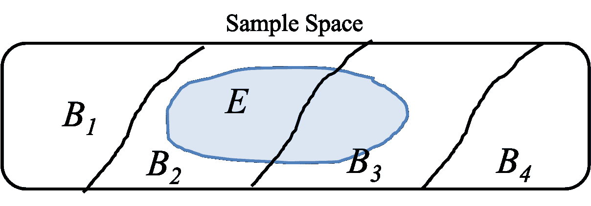

# 总概率定律

> 原文：[`chrispiech.github.io/probabilityForComputerScientists/en/part1/law_total/`](https://chrispiech.github.io/probabilityForComputerScientists/en/part1/law_total/)

* * *

有一次，一个敏锐的人观察到，当我们看一张图片时，就像我们为条件概率所看到的图片：

那个事件 $E$ 可以被认为有两个部分，一部分在 $F$ 中，$(E \and F)$，另一部分不在 $F$ 中，$(E \and F\c)$。这是因为 $F$ 和 $F\c$ 是（a）相互排斥的结果集合，它们（b）一起覆盖整个样本空间。经过进一步的研究，这被证明在数学上是正确的，并且引起了极大的欢庆：

$$ \begin{align} \p(E) &= \p(E \and F) + \p(E \and F\c) \end{align} $$

这个观察结果在结合链式法则时特别有用，它产生了一个非常有用的工具，被赋予了响亮的名字，即总概率定律：$$ \begin{align} \p(E) &= \p(E \and F) + \p(E \and F\c) \\ &= \p(E | F) \p(F) + \p(E | F\c) \p(F\c) \\ \end{align} $$

**总概率定律 (LOTP)**

如果我们将上述观察结果与链式法则结合起来，我们得到一个非常有用的公式，简称为总概率定律 (LOTP)：$$ \begin{align} \p(E) &= \p(E | F) \p(F) + \p(E | F\c) \p(F\c) \end{align} $$

存在着更一般的规则。如果你能将样本空间划分为任意数量的相互排斥的事件：$B_1, B_2, \dots B_n$，使得样本空间中的每个结果都落在这些事件之一中，那么：$$ \begin{align} \p(E) &= \sum_{i=1}^n \p(E \and B_i) && \text{扩展我们的观察}\\ &= \sum_{i=1}^n \p(E | B_i) \p(B_i) && \text{在每个项上使用链式法则} \end{align} $$

### 对多个背景事件的推广

事件 $F$ 和 $F^C$ 总是相互排斥的，并且它们总是覆盖整个样本空间，无论 $F$ 代表什么！如果你能找到超过两个相互排斥的背景事件，并且它们的并集覆盖整个样本空间（结果的全集），那么你可以使用总概率定律的推广版本。

为了推广总概率定律，想象我们可以将样本空间划分为几个相互排斥的背景事件 $( B_1, B_2, \dots, B_n )$，其中这些集合覆盖整个样本空间。在这种情况下，任何事件 $E$ 都可以通过考虑 $E$ 在这些不相交集合中的可能性来分解。

在上面的图像中，你可以计算出$\p(E)$等于$$\p\Big[(E \and B_1) \text{ }\or \text{ }(E \and B_2)\text{ } \or \text{ } \dots \text{ } \or \text{ }(E \and B_n)\big]$$在现实世界中有很多案例，其中（a）在背景事件$B_i$和样本空间的离散化背景下思考事件$E$的概率要容易得多，样本空间可以划分为几个互斥的背景事件$B_i$。让我们从一个包含三个事件$B_1, B_2, B_3$的例子开始。假设你正在尝试确定随机选择的人测试呈阳性某种疾病的可能性，$\p(E)$。人口可以被划分为三个互斥的群体：

1.  $B_1$: 高风险个体（例如，已知接触过该疾病的个体）

1.  $B_2$: 中等风险个体（例如，有该疾病家族史但没有直接接触的人）

1.  $B_3$: 低风险个体（例如，没有已知风险因素的普通人群）

这些组中每个组测试呈阳性疾病的概率都不同，一个随机个体测试呈阳性的总概率可以分解如下：$$ \begin{align} \P(E) &= \P(E \and B_1) + \P(E \and B_2) + \P(E \and B_3) && \text{LOTP}\\ &= \P(E | B_1)P(B_1) + \P(E | B_2)P(B_2) + \P(E | B_3)P(B_3) && \text{Chain Rule}\\ &= \sum_{i=1}^{3} P(E \mid B_i)P(B_i) && \text{Sum Notation} \end{align} $$

其中：

+   $P(E | B_1)$ 是在一个人属于高风险组的情况下测试呈阳性的概率

+   $P(E | B_2)$ 是在中等风险组中某个人测试呈阳性的概率，

+   $P(E | B_3)$ 是在一个人属于低风险组的情况下测试呈阳性的概率。

+   $ P(B_1)$, $P(B_2)$ 和 $P(B_3)$ 是一个人属于高风险、中等风险和低风险组的概率。

这之所以有效，是因为每个人都可以属于以下背景事件之一（$B_1, B_2, B_3$），换句话说，这些集合覆盖了样本空间。此外，每个人只属于一个集合，因此它们是互斥的。这很有帮助，因为在这种背景下，在背景事件中思考测试呈阳性事件$E$的概率更容易，你已知患者的风险程度。
