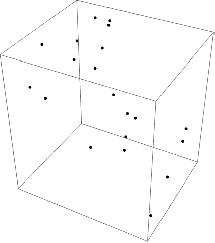

# 维度灾难

> 原文：[`chrispiech.github.io/probabilityForComputerScientists/en/examples/curse_of_dimensionality/#part1_examples/`](https://chrispiech.github.io/probabilityForComputerScientists/en/examples/curse_of_dimensionality/#part1_examples/)

* * *

在机器学习中，就像计算机科学的许多领域一样，经常涉及到高维点，高维空间具有一些令人惊讶的概率性质。

随机值 $X_i$ 是一个均匀分布的值（Uni(0, 1)）。

维度为 $d$ 的随机点是一个包含 $d$ 个随机值的列表：$[X_1 \dots X_d]$。

随机值 $X_i$ 如果小于 0.01 或大于 0.99，则认为它接近边缘。随机值接近边缘的概率是多少？

设 $E$ 为随机值接近边缘的事件。$P(E) = P(X_i < 0.01) + P(X_i > 0.99) = 0.02$

维度为 $3$ 的随机点 $[X_1, X_2, X_3]$ 如果其任意一个值接近边缘，则认为它接近边缘。一个 3 维的点接近边缘的概率是多少？

这个事件等价于点的所有维度都不接近边缘的补集，即：$1 - (1 - P(E))³ = 1 - 0.98³ \approx 0.058$

维度为 $100$ 的随机点 $[X_1, \dots X_{100}]$ 如果其任意一个值接近边缘，则认为它接近边缘。一个 100 维的点接近边缘的概率是多少？

同样地，结果是：$1 - (1 - P(E))^{100} = 1 - 0.98^{100} \approx 0.867$ 高维点有许多其他现象：例如，点之间的欧几里得距离开始收敛。
