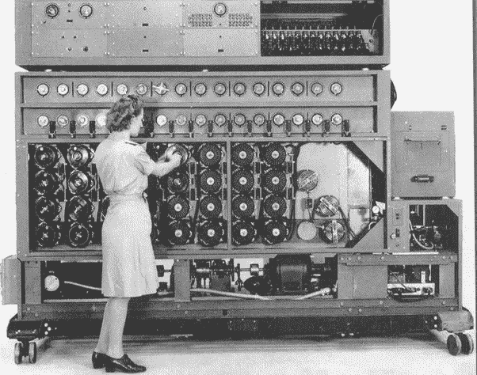

# Enigma Machine

> 原文：[`chrispiech.github.io/probabilityForComputerScientists/en/examples/enigma/`](https://chrispiech.github.io/probabilityForComputerScientists/en/examples/enigma/)

* * *

最早的计算机之一是在二战期间建造的，用于破解纳粹的“Enigma”密码。这是一个难题，因为用于制作秘密密码的“Enigma”机器有如此多的独特配置。纳粹每天都会选择一个新的配置，如果盟军能够找出每天的配置，他们就能阅读所有敌人的信息。一种解决方案是尝试所有配置，直到找到一个可以产生可读德语的配置。这引发了一个问题：有多少种配置？

*二战期间建造的用于搜索不同 Enigma 配置的机器。*

Enigma 机器有三个转子。每个转子可以设置为 26 个不同位置中的一个。三个转子有多少种独特的配置？

使用计数步骤规则：$26 \cdot 26 \cdot 26 = 26³ = 17,576$。

更重要的是，这台机器有一个插板，可以交换字母的电信号。在插板上，线可以连接任何一对字母以产生新的配置。线不能连接到自身。线是不可区分的。从‘K’到‘L’的线与从‘L’到‘K’的线是不可区分的。我们将逐步考虑任意数量的线。

*Enigma 插板。由于电气原因，每个字母有两个插孔，每个插头有两个触点。从语义上讲，这相当于每个字母一个插头位置。*

**一根线**: 有多少种方式可以放置恰好一根连接两个字母的线？

从 26 个字母中选择 2 个是一个组合。使用组合公式：${26 \choose 2} = 325$。

**两根线**: 有多少种方式可以放置恰好两根线？回想一下，线不被认为是可区分的。每个字母最多只能连接一根线，因此你不能有一根线连接‘K’到‘L’，另一根线连接‘L’到‘X’。

放置第一根线有${26 \choose 2}$种方式，放置第二根线有${24 \choose 2}$种方式。然而，由于线是不可区分的，我们双倍计算了每一种可能性。因为每一种可能性都被计算了两次，所以我们应该除以 2：$$ \text{总数} = \frac{ {26 \choose 2} \cdot {24 \choose 2} }{2} = 44,850 $$

**三根线**: 有多少种方式可以放置**恰好**三根线？

放置第一根线有 ${26 \choose 2}$ 种方式，放置第二根线有 ${24 \choose 2}$ 种方式。现在放置第三根线有 ${22 \choose 2}$ 种方式。然而，由于线是不可区分的，并且我们的步数计数隐含地将其视为可区分的，所以我们已经对每种可能性进行了重复计数。每个三个字母的组合被重复计数了多少次？这是三个不同对象的排列数：3! $$ \text{Total} = \frac{ {26 \choose 2} \cdot {24 \choose 2} \cdot {22 \choose 2}}{3!} = 3,453,450 $$ 另一种得到相同答案的方法是：首先选择要配对的字母，然后进行配对。选择正在布线的字母有 ${26 \choose 6}$ 种方式。然后我们需要配对这些字母。考虑配对字母的一种方法是首先对它们进行排列（6!种方式），然后配对前两个字母，然后是下一对，再下一对，依此类推。例如，如果我们的字母是 {A,B,C,D,E,F}，并且我们的排列是 BADCEF，那么这对应于将 B 连接到 A，D 连接到 C，E 连接到 F。我们过度计数了很多。首先，由于配对顺序不重要，我们过度计数了 3!倍。其次，由于每个配对内字母的顺序不重要，我们过度计数了$2³$倍。$$ \text{Total} = {26 \choose 6} \frac{6!}{3! \cdot 2³} = 3,453,450 $$

**任意线**：放置 $k$ 根线，从而连接 $2 \cdot k$ 个字母，有多少种方式？在二战期间，德国人总是使用固定数量的线。但有一种担忧是，如果他们发现恩尼格玛机被破解，他们可以简单地使用任意数量的线。

使用恰好 $i$ 根线的组合方式与使用恰好 $j$ 根线的组合方式互斥，如果 $i \neq j$（因为没有任何一种方式可以同时使用恰好 $i$ 和 $j$ 根线）。因此，$\text{Total} = \sum_{k=0}^{13} \text{Total}_k$，其中 Total$_k$ 是使用恰好 $k$ 根线的组合方式的数量。继续我们关于使用确切数量的线的逻辑：$$ \text{Total}_k = \frac{\prod_{i=1}^{k} {28 - 2i \choose 2} }{k!} $$ 将所有内容整合起来：$$ \begin{align} \text{Total} &= \sum_{k=0}^{13} \text{Total}_k \\ &= \sum_{k=0}^{13} \frac{\prod_{i=1}^{k} {28 - 2i \choose 2} }{k!} \\ &= 532,985,208,200,576 \end{align} $$

在二战中实际使用的恩尼格玛机有 10 根线连接 20 个字母，允许有 150,738,274,937,250 种独特的配置。恩尼格玛机还从 5 个转子集中选择了 3 个转子，这又增加了${5 \choose 3} = 60$的另一个因子。

当你将设置转子方式的数量与设置插线板的方式数量相加，你就能得到恩尼格玛机配置的总数。将这个过程视为两个步骤，我们可以将之前计算出的两个数字相乘：17,576 · 150,738,274,937,250 · 60 $\approx 159 \cdot 10^{18}$ 唯一设置。因此，艾伦·图灵和他的团队在布莱奇利公园继续建造了一台可以帮助测试许多配置的机器——这是第一台计算机的前身。
