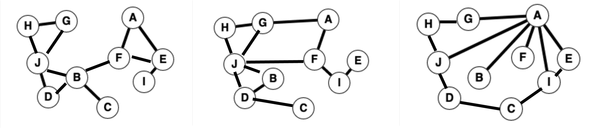

# 计算随机图

> 原文：[`chrispiech.github.io/probabilityForComputerScientists/en/examples/counting_graphs/`](https://chrispiech.github.io/probabilityForComputerScientists/en/examples/counting_graphs/)

* * *

在这个例子中，我们将探索随机生成图的密度（也称为网络）。这是斯坦福大学 2022 年秋季期中考试中的一个问题。为了让我们开始，这里有三个不同的网络，每个网络都有 10 个节点和 12 条随机边：

**计算边的位置**：首先，让我们确定随机网络中边的位置数量。考虑一个具有 10 个节点的网络。计算无向边的可能位置数。回想一下，从节点 A 到节点 B 的无向边与从节点 B 到节点 A 的边是相同的。你可以假设边不会连接到自身。

每条边连接 2 个节点，每个节点有 10 种可能的选择，所以答案是 $$ \binom{10}{2} = 45.$$

**计算放置边的方案**：现在让我们向网络中添加随机边！假设相同的网络（具有 10 个节点）有 12 条随机边。如果每对节点等可能地有一条边，我们有多少种独特的方式来选择 12 条边的位置？

令 $k = \binom{10}{2}$ 为边的可能位置数，我们有 12 条不同的（无向）边，所以有 $\binom k {12}$ 种放置边的方案。

**节点度数的概率**：现在我们有一个随机生成的图，让我们来探索节点的度数！在具有 10 个节点和 12 条边的相同网络中，随机选择一个节点。我们的节点恰好具有度数 $i$ 的概率是多少？注意 $0 \leq i \leq 9$。回想一下，由于图中只有 10 个节点，所以从我们选择的节点只能连接到 9 个节点。

令 $E$ 为我们的节点恰好有 $i$ 个连接的事件。我们将首先使用 $|E| / |S|$ 来计算 $P(E)$ 的分布。样本空间是选择 12 条边的方案集合，事件空间是选择边的方案集合，使得我们恰好选择了与当前节点（有 9 个可能连接的边）相连的 $i$ 条边。为了构建事件空间 $E$，我们可以考虑一个两步过程：

1.  从与我们的节点相连的 9 个可能边位置中选择 $i$ 条边。

1.  选择剩余的 $12 - i$ 条边的位置。这些边可以连接到除了与我们的节点相连的 9 条边之外的任何 $k$ 个位置。

因此答案是 $$\begin{align*} P(E) &= \frac{|E|}{|S|} \\ &= \frac{\binom{9}{i} \binom{k-9}{12-i}}{\binom k {12}}. \end{align*}$$
