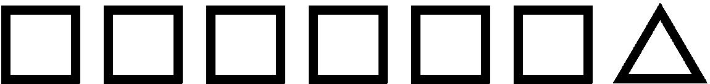
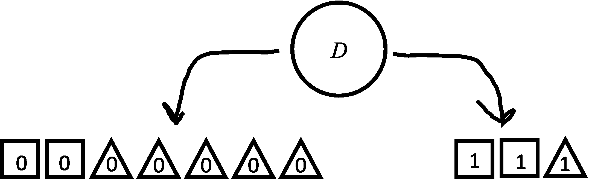

# 集合多样性（基尼不纯度）

> 原文：[`chrispiech.github.io/probabilityForComputerScientists/en/examples/diversity_shapes/`](https://chrispiech.github.io/probabilityForComputerScientists/en/examples/diversity_shapes/)

* * *

在这个问题中，我们将询问一个简单的问题：从集合中选择两个对象时，它们不同的概率是多少。这个统计量，正式称为[基尼不纯度](https://en.wikipedia.org/wiki/Diversity_index#Gini%E2%80%93Simpson_index)，在随机森林算法和社会科学中都有应用。这是 2023 年秋季斯坦福期中考试的问题。

a) 考虑以下形状集合。如果你选择两个形状**带替换**，两个形状**相同**的概率是多少？注意，可能得到两个三角形：在你选择第一个三角形后，将其放回形状集合中，它可以再次被选择。

定义样本空间为选择两个形状的 49 种不同结果（第一个形状有 7 种选择，第二个形状也有 7 种选择）。注意，在我们构建样本空间的过程中，我们选择了将形状视为彼此完全不同。因此，$S$中的结果是一个不同形状的有序元组。例如，$S$中的一个结果是（Shape$_4$，Shape$_2$）。$|S| = 7 \times 7 = 49$。注意，$S$中的所有结果都是等可能的（这就是我们为什么将形状视为不同的原因）。

令$E$为$S$中两个形状匹配的子集，令$A$为有两个正方形的事件，令$B$为有两个三角形的事件。注意，$A$和$B$是互斥的。根据计数步骤规则，$|A| = 6 \cdot 6 = 36$，因为创建事件$A$的结果需要两个步骤：选择一个正方形然后选择另一个正方形。同样地，$|B| = 1 \cdot 1 = 1$。

$$ $$\begin{align*} P(\text{same}) &= \frac{|E|}{|S|}\\ &= \frac{|A| + |B|}{|S|}\\ &= \frac{36 + 1}{49}\\ &= \frac{37}{49} \end{align*}$$ $$

b) 考虑以下形状集合。如果你选择两个形状**带替换**，两个形状**不同**的概率是多少？注意，上一个问题是询问两个形状相同的概率。两个不同物品的概率被称为集合的[基尼不纯度](https://en.wikipedia.org/wiki/Diversity_index#Gini%E2%80%93Simpson_index)。

定义相同的样本空间为选择两个形状的 49 种不同结果（第一个形状有 7 种选择，第二个形状也有 7 种选择）。$|S| = 7 \times 7 = 49$。注意，$S$中的所有结果都是等可能的。

令$E$为$S$中两个形状匹配的子集。

令$A$为有两个正方形的集合事件。

令$B$为有两个三角形的事件。

设 $C$ 为有两个星星的事件。注意 $A$、$B$ 和 $C$ 是互斥的。根据计数步骤规则

$|A| = 4 \cdot 4 = 16$

$|B| = 2 \cdot 2 = 4$

$|C| = 1 \cdot 1 = 1$

$$ $$\begin{align*} P(\text{different}) &= 1 - P(\text{same})\\ &= 1 - \frac{|E|}{|S|}\\ &= 1- \frac{|A| + |B| + |C|}{|S|}\\ &= 1- \frac{16 + 4 + 1}{49}\\ &= 1- \frac{21}{49} = \frac{4}{7} \end{align*}$$ $$

### 决策树中的基尼不纯度

注意：这个下一个问题与上面的问题并没有显著不同。这个问题的目的是向你展示基尼不纯度的概念如何与决策树相联系。

[决策树](https://en.wikipedia.org/wiki/Decision_tree#:~:text=9%20External%20links-,Overview,taken%20after%20computing%20all%20attributes)（及其大哥随机森林）是一些最流行的分类人工智能算法，它们不使用深度神经网络。它们是基于数据，节点到节点构建的。一旦构建，它们就可以用来做出分类决策。在构建决策树时的关键决策是决定下一个要添加哪个节点。做出这个决定的一种方法是通过选择新节点，使得最终在决策树末尾聚集在一起的形状的基尼不纯度最大程度地减少。

*此外：这个特定的节点是根据一个值（这与形状略有关系）来分割形状的。值为 0 的形状进入左子节点，值为 1 的形状进入右子节点。*

c) 考虑上图中的节点。设 $G_L$ 为从左侧形状中选择两个形状不同的概率（基尼不纯度），设 $G_R$ 为从右侧形状中选择两个形状不同的概率（再次是基尼不纯度）。max($G_L, G_R$) 的值是多少？我们只使用形状类型来计算基尼不纯度。这个值代表用于在左右节点之间排序的特征，在这个问题中可以忽略。

首先，让我们将一组形状的 $G$ 的计算进行推广。设 $n$ 为该集合中形状的数量。设 $n_i$ 为集合中类型为 $i$ 的形状的数量。计算两个共享区域相同与两个形状不同概率的问题将比计算两个形状不同概率的问题更容易。如果我们设置样本空间 $S$ 为所有选择两个形状的方式的集合（将每个形状视为不同的，并将选择视为有序的）。事件空间 $E$ 然后是形状相同的事件的子集。因为选择相同类型的形状与选择另一种类型的相同形状是互斥的，我们可以通过计算每种类型形状的两个形状相同的概率并将它们相加来计算两个形状相同的概率：$$ $$\begin{align*} G &= 1- P(\text{same})\\ &= 1 - \frac{|E|}{|S|}\\ &= 1 - \frac{\sum_{i}^n n_i²}{|S|}\\ \end{align*}$$ $$

$ G_L = 1 - \frac{2² + 5²}{7²}$ 和 $G_R = 1 - \frac{2² + 1²}{3²}$. 对于那些好奇的人来说，$G_R$ 是这两个中的较大者。

### 进一步学习

注意：在中期考试中，学生被要求计算“期望”基尼系数，而不是最大值。这使用了期望，一个我们将在下一节学习的概念。我们还要求计算泊松随机变量的基尼不纯度，这是一个来自第三部分的概念。
