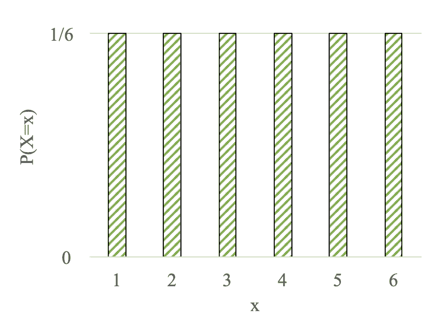
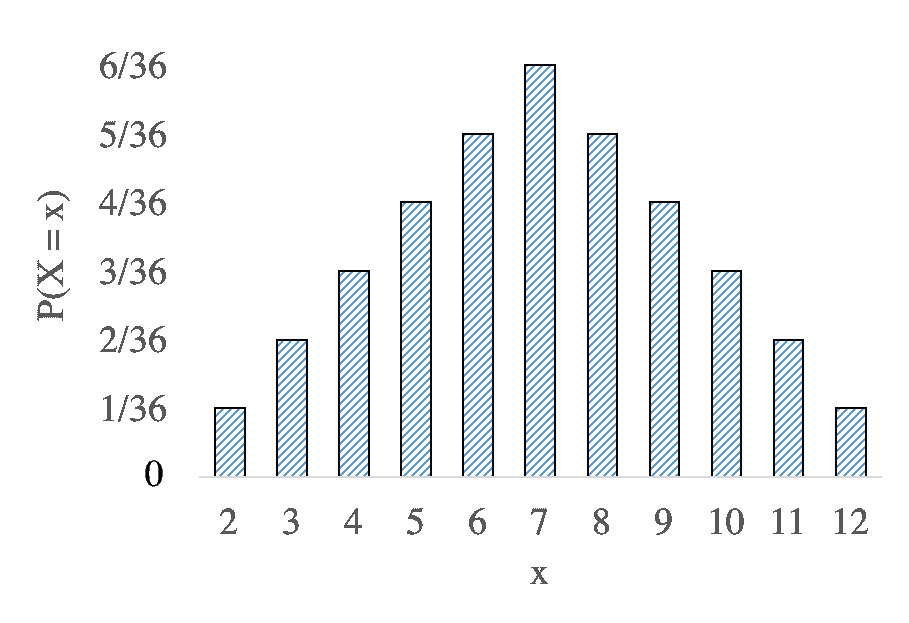
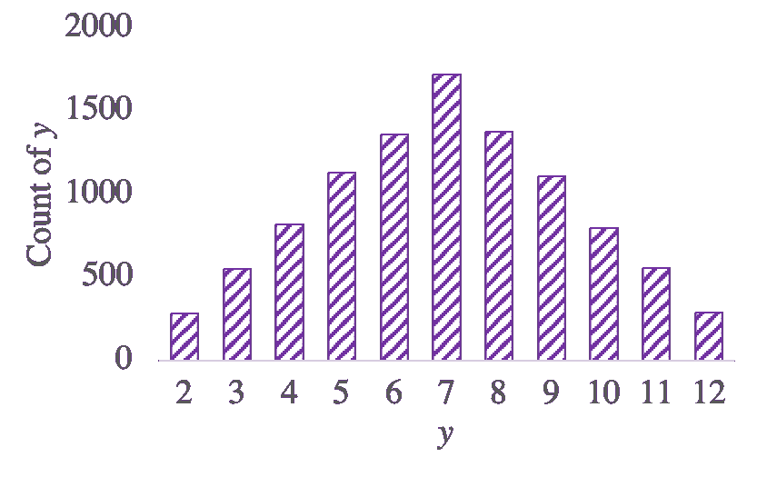

# 概率质量函数

> 原文：[`chrispiech.github.io/probabilityForComputerScientists/en/part2/pmf/`](https://chrispiech.github.io/probabilityForComputerScientists/en/part2/pmf/)

* * *

对于一个随机变量，最重要的信息是：每个结果的可能性有多大？对于离散随机变量，这种信息被称为“**概率质量函数**”。概率质量函数（PMF）提供了随机变量每个可能赋值的“质量”（即数量）的概率。

形式上，概率质量函数是随机变量可能取的值和随机变量取该值的概率之间的映射。在数学中，我们称这些关联为函数。表示函数的方法有很多：你可以写一个方程，你可以画一个图，你甚至可以在列表中存储许多样本。让我们先从将 PMF 视为图表开始，其中 $x$ 轴是随机变量可能取的值，$y$ 轴是随机变量取该值的概率。

在下面的例子中，左侧我们展示了一个概率质量函数（PMF），以图表的形式表示随机变量：$X$ = 六面骰子掷出的值。右侧我们展示了一个对比示例，即随机变量 $X$ = 两个骰子之和的 PMF：

*左：单个六面骰子掷出的 PMF。右：两个骰子之和的 PMF*。

在等可能概率部分中的两个骰子之和的例子。再次强调，这些图中提供的信息是随机变量取不同值的可能性。在右侧的图中，$x$ 轴上的值 "$6$" 与 $y$ 轴上的概率 $\frac{5}{36}$ 相关联。这个 $x$ 轴指的是事件“两个骰子之和为 6”或 $Y=6$。$y$ 轴告诉我们该事件的概率是 $\frac{5}{36}$。完整地说：$\p(Y=6) = \frac{5}{36}$。值 "$2$" 与 "$\frac{1}{36}$" 相关联，这告诉我们 $\p(Y=2) = \frac{1}{36}$，两个骰子之和为 2 的概率是 $\frac{1}{36}$。没有与 "$1$" 相关联的值，因为两个骰子之和不能为 1。如果你觉得这种表示法令人困惑，请回顾随机变量部分。

这里是相同信息以方程形式表示：

$$ \begin{align} \p(X=x) = \frac{1}{6} && \text{ if } 1 \leq x \leq 6 \end{align} $$$$ \p(Y=y) = \begin{cases} \frac{(y-1)}{36} && \text{ if } 1 \leq y \leq 7\\ \frac{(13-y)}{36} && \text{ if } 8 \leq y \leq 12 \end{cases} $$

作为最后的例子，这里是用 Python 代码表示的 $Y$ 的概率质量函数（PMF），即两个骰子之和：

```py
def pmf_sum_two_dice(y):
    # Returns the probability that the sum of two dice is y
    if y < 2 or y > 12:
        return 0
    if y <= 7:
        return (y-1) / 36
    else:
        return (13-y) / 36
```

## 符号

你可能会觉得 $\p(Y=y)$ 的表示法是多余的。在概率研究论文和更高级的工作中，数学家们经常使用缩写 $\p(y)$ 来表示 $\p(Y=y)$。这种缩写假设小写值（例如 $y$）有一个大写字母对应物（例如 $Y$），即使它没有明确写出，也代表一个随机变量。在这本书中，我们将经常使用事件 $\P(Y=y)$ 的完整形式，但偶尔也会使用缩写 $\p(y)$。

## 概率之和必须为 1

对于一个变量（称之为 $X$）要成为合适的随机变量，它必须满足的条件是：如果你将 $\p(X = k)$ 的值对所有可能的值 $k$ 进行求和，结果必须是 1：$$ \sum_{k} \p(X = k) = 1 $$

为了进一步理解这一点，让我们推导一下为什么是这样。一个随机变量取某个值是一个事件（例如 $X = 2$）。这些事件中的每一个都是互斥的，因为随机变量将取恰好一个值。这些互斥的情况定义了整个样本空间。为什么？因为 $X$ 必须取 *某个* 值。

## 数据到直方图到概率质量函数

存储似然函数（记住，PMF 是离散随机变量似然函数的名称）的一个令人惊讶的方法就是简单地列出数据。我们模拟了将两个骰子相加 10,000 次来生成这个示例数据集：

`[8, 4, 9, 7, 7, 7, 7, 5, 6, 8, 11, 5, 7, 7, 7, 6, 7, 8, 8, 9, 9, 4, 6, 7, 10, 12, 6, 7, 8, 9, 3, 7, 4, 9, 2, 8, 5, 8, 9, 6, 8, 7, 10, 7, 6, 7, 7, 5, 4, 6, 9, 5, 7, 4, 2, 11, 10, 11, 8, 4, 11, 9, 7, 10, 12, 4, 8, 5, 11, 5, 3, 9, 7, 5, 5, 5, 3, 8, 6, 11, 11, 2, 7, 7, 6, 5, 4, 6, 3, 8, 5, 8, 7, 6, 9, 4, 3, 7, 6, 6, 6, 5, 6, 10, 5, 9, 9, 8, 8, 7, 4, 8, 4, 9, 8, 5, 10, 10, 9, 7, 9, 7, 7, 10, 4, 7, 8, 4, 7, 8, 9, 11, 7, 9, 10, 10, 2, 7, 9, 4, 8, 8, 12, 9, 5, 11, 10, 7, 6, 4, 8, 9, 9, 6, 5, 6, 5, 6, 11, 7, 3, 10, 7, 3, 7, 7, 10, 3, 6, 8, 6, 8, 5, 10, 2, 7, 4, 8, 11, 9, 3, 4, 2, 8, 8, 6, 6, 12, 11, 10, 10, 10, 8, 4, 9, 4, 4, 6, 6, 7, 8, 2, 5, 7, 6, 9, 5, 5, 8, 4, 7, 7, 7, 6, 5, 6, 8, 6, 5, 7, 8, 4, 9, 8, 8, 9, 7, 2, 8, 3, 5, 5, 10, 7, 9, 12, 6, 4, 5, 7, 6, 4, 7, 6, 10, 3, 8, 5, 7, 7, 3, 6, 7, 7, 6, 6, 9, 12, 9, 10, 7, 10, 8, 10, 3, 9, 9, 4, 7, 8, 6, 8, 12, 5, 6, 2, 4, 4, 5, 5, 8, 7, 9, 10, 6, 7, 10, 7, 6, 8, 9, 8, 10, 3, 7, 8, 8, 8, 4, 7, 7, 8, 3, 8, 5, 9, 2, 8, 6, 11, 7, 8, 7, 6, 8, 5, 5, 3, 6, 7, 9, 7, 11, 5, 8, 2, 11, 9, 9, 7, 12, 8, 6, 9, 7, 7, 5, 7, 6, 9,

注意，这些数据本身代表了对概率质量函数的一个近似。如果你想近似$\p(Y=3)$，你只需简单地计算你的数据中“3”出现的次数。这是基于概率定义的一个近似。以下是数据的完整[直方图](https://en.wikipedia.org/wiki/Histogram)，显示了每个值出现的次数：



标准化直方图（其中每个值都除以你的数据列表长度）是对 PMF 的一个近似。对于离散数字的数据集，直方图显示了每个值的计数（在这种情况下为$y$）。根据概率的定义，如果你将这个计数除以进行的实验次数，你将得到事件$\p(Y=y)$的概率的一个近似。在我们的例子中，我们的数据集中有 10,000 个元素。3 出现的次数是 552 次。注意：$$\begin{align} \frac{\text{count}(Y=3)}{n} &= \frac{552}{10000} = 0.0552 \\ \p(Y=3) &= \frac{4}{36} = 0.0555 \end{align} $$

在这种情况下，因为我们进行了 10,000 次试验，直方图是对概率质量函数（PMF）的一个非常好的近似。我们以骰子点数之和为例，因为它容易理解。现实世界中的数据集通常代表更令人兴奋的事件。
