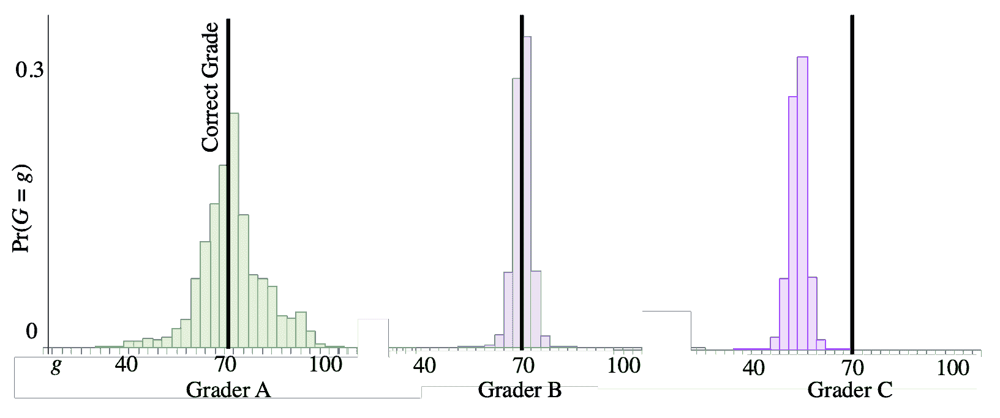

# 方差

> 原文：[`chrispiech.github.io/probabilityForComputerScientists/en/part2/variance/`](https://chrispiech.github.io/probabilityForComputerScientists/en/part2/variance/)

* * *

***定义***：随机变量的方差

方差是衡量随机变量围绕均值的“分散”程度的度量。对于期望值 $\E[X] = µ$ 的随机变量 X，其方差为：$$ \var(X) = \E[(X–µ)²] $$ 从语义上讲，这是样本与分布均值的平均距离。在计算方差时，我们通常使用方差方程的不同（等价）形式：$$ \begin{align} \var(X) &= \E[X²] - \E[X]² \end{align} $$

在上一节中，我们展示了期望是随机变量的一个有用总结（它计算随机变量的“加权平均”）。接下来要理解随机变量的最重要的属性之一是方差：即分散程度的度量。

首先，让我们考虑三组评分者的概率质量函数。当每个评分者对一个旨在获得 70/100 分的作业进行评分时，他们各自都有可能给出的评分的概率分布。

 *三种类型同行评分者的分布。数据来自一个大规模在线课程。*

组 $C$ 中评分者的分布有不同的*期望值*。他们在评分一个价值 70 分的作业时给出的平均分数是 55/100。这显然不是很好！但评分者 $A$ 和 $B$ 之间的区别是什么？他们都有相同的期望值（等于正确分数）。组 $A$ 中的评分者有更高的“分散”。在评分一个价值 70 分的作业时，他们有合理的可能性给出 100 分，或者给出 40 分。组 $B$ 中的评分者分散度较小。大部分概率质量都接近 70。你希望有像组 $B$ 那样的评分者：在期望上他们给出正确分数，并且他们有较低的分散度。顺便说一句：组 $B$ 的分数来自一个基于同行评分的概率算法。

理论家想要一个数字来描述分散程度。他们发明了方差，它是随机变量可能取的值与随机变量均值之间的距离的平均值。对于距离函数有许多合理的选择，概率理论家选择了均值的平方偏差：$$ \var(X) = \E[(X–µ)²] $$

***证明***：$\var(X) = \E[X²] - \E[X]²$

使用 $\E[X²] - \E[X]²$ 来计算方差要容易得多。你当然不需要知道为什么它是一个等价的表达式，但如果你想知道，这里是有证明。

$$ \begin{align} \var(X) &= \E[(X–µ)²] && \text{注意：} \mu = \E[X]\\ &= \sum_x(x-\mu)² \p(x) && \text{期望的定义}\\ &= \sum_x (x² -2\mu x + \mu²) \P(x) && \text{展开平方}\\ &= \sum_x x²\P(x)- 2\mu \sum_x x \P(x) + \mu² \sum_x \P(x) && \text{传播求和}\\ &= \sum_x x²\P(x)- 2\mu \E[X] + \mu² \sum_x \P(x) && \text{代入期望的定义}\\ &= \E[X²]- 2\mu \E[X] + \mu² && \text{因为 } g(x) = x² \\ &= \E[X²]- 2\mu² + \mu² && \text{因为 }\sum_x \P(x) = 1\\ &= \E[X²]- \mu² && \text{消去}\\ \end{align} $$

## 标准差

方差在比较两个分布的“分散程度”时特别有用，并且它有一个有用的特性，即易于计算。一般来说，较大的方差意味着围绕平均值的偏差更多——分散程度更大。然而，如果你看前面的例子，方差的单位是点的平方。这使得数值难以解释。52 点$²$的分散程度意味着什么？一个更可解释的分散程度度量是方差的平方根，我们称之为标准差 $\std(X) = \sqrt{\var(X)}$。我们评分者的标准差是 7.2 点。在这个例子中，人们发现用点而不是点$²$来考虑分散程度更容易。顺便说一下，标准差是样本（从分布中）到平均值的平均距离，使用的是[欧几里得距离](https://en.wikipedia.org/wiki/Euclidean_distance)函数。

### 连续随机变量中的方差

在课程阅读的后期，我们将学习连续随机变量。这些类型随机变量的方差非常相似。有关详细信息，请参阅连续随机变量。
