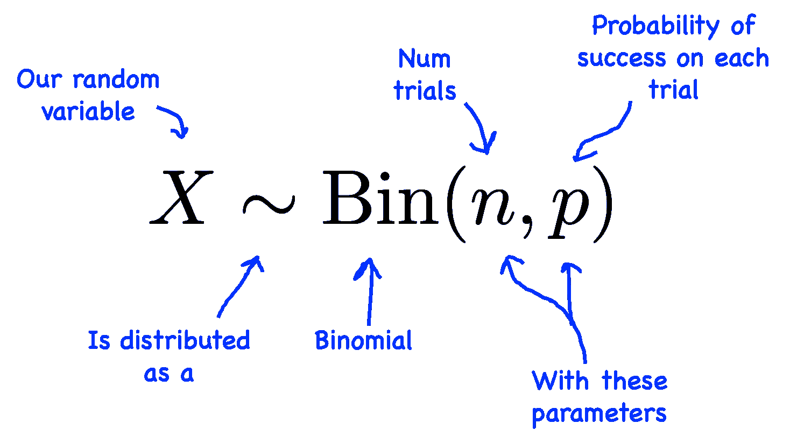
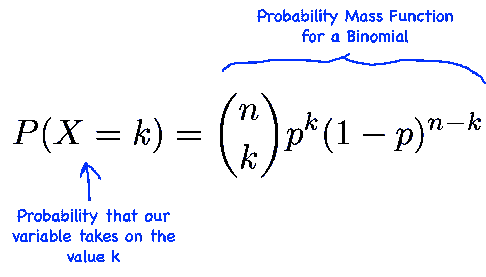

# 二项分布

> 原文：[`chrispiech.github.io/probabilityForComputerScientists/en/part2/binomial/`](https://chrispiech.github.io/probabilityForComputerScientists/en/part2/binomial/)

* * *

在本节中，我们将讨论二项分布。首先，想象以下例子。考虑一个实验的$n$次独立试验，其中每次试验成功的概率为$p$。设$X$为$n$次试验中的成功次数。这种情况在自然界中非常普遍，因此已经对这种现象进行了大量研究。像$X$这样的随机变量被称为二项随机变量。如果你能识别出某个过程符合这种描述，你就可以继承许多已经证明的性质，如 PMF 公式、期望和方差！



这里有一些二项随机变量的例子：

+   # $n$次抛硬币中正面的次数

+   # 在随机生成的长度为$n$的位字符串中 1 的个数

+   # 在 1000 个计算机集群中磁盘崩溃的次数，假设磁盘崩溃是独立发生的

**二项随机变量**

| 符号： | $X \sim \Bin(n, p)$ |
| --- | --- |
| 描述： | 在$n$个相同、独立的实验中，每个实验成功的概率为$p$，成功的次数。 |
| 参数： | $n \in \{0, 1, \dots\}$，实验的数量。$p \in [0, 1]$，单个实验成功的概率。 |
| 支持集： | $x \in \{0, 1, \dots, n\}$ |
| PMF 公式： | $$\p(X=x) = {n \choose x}p^x(1-p)^{n-x}$$ |
| 期望： | $\E[X] = n \cdot p$ |
| 方差： | $\var(X) = n \cdot p \cdot (1-p)$ |
| PMF 图： |

参数$n$：参数$p$：

<canvas id="binomialPmf" style="max-height: 400px"></canvas>

考虑二项分布的一种方式是将其视为$n$个伯努利变量的和。假设$Y_i \sim \Ber(p)$是一个指示伯努利随机变量，如果实验$i$成功则$Y_i$为 1。那么如果$X$是$n$次实验中的总成功次数，$X \sim \Bin(n, p)$：$$ X = \sum_{i=1}^n Y_i $$

回想一下，$Y_i$的结果将是 1 或 0，所以一种思考$X$的方式是将其视为这些 1 和 0 的总和。

## 二项概率质量函数

关于二项分布，最重要的属性是它的概率质量函数：



回想一下，我们在第一部分推导了这个公式。有一个完整的例子是关于$n$次抛硬币中$k$次正面的概率，其中每次抛硬币正面朝上的概率为$0.5$：多次抛硬币。简要回顾一下，如果你认为每个实验都是独特的，那么从$n$次实验中排列$k$次成功的方案有${n \choose k}$种。对于任何互斥的排列，该排列的概率是$p^k \cdot (1-p)^{n-k}$。

二项分布的名称来源于术语${n \choose k}$，它正式称为二项系数。

## 二项期望

计算二项分布的期望值有简单和困难两种方法。简单的方法是利用二项分布是伯努利指示随机变量的和这一事实。$X = \sum_{i=1}^{n} Y_i$ 其中 $Y_1$ 是第 $i$ 次实验是否成功的指示器：$Y_i \sim \Ber(p)$。由于随机变量期望值之和等于期望值的和，我们可以将每个伯努利的期望值相加，$\E[Y_i] = p$：$$ \begin{align} \E[X] &= \E\Big[\sum_{i=1}^{n} Y_i\Big] && \text{因为 }X = \sum_{i=1}^{n} Y_i \\ &= \sum_{i=1}^{n}\E[ Y_i] && \text{期望值的和} \\ &= \sum_{i=1}^{n}p && \text{伯努利的期望值} \\ &= n \cdot p && \text{求和 $n$ 次} \end{align} $$ 困难的方法是使用期望值的定义：$$ \begin{align} \E[X] &= \sum_{i=0}^n i \cdot \p(X = i) && \text{期望值的定义} \\ &= \sum_{i=0}^n i \cdot {n \choose i} p^i(1-p)^{n-i} && \text{代入概率质量函数} \\ & \cdots && \text{许多步骤之后} \\ &= n \cdot p \end{align} $$

## Python 中的二项分布

如你所料，你可以在代码中使用二项分布。二项分布的标准库是 `scipy.stats.binom`。

这个包提供的最有帮助的方法之一是计算概率质量函数。例如，假设 $X \sim \text{Bin}(n=5,p=0.6)$，你想找到 $\P(X=2)$，你可以使用以下代码：

```py
from scipy import stats

# define variables for x, n, and p
n = 5
p = 0.6
x = 2

# use scipy to compute the pmf
p_x = stats.binom.pmf(x, n, p)

# use the probability for future work
print(f'P(X = {x}) = {p_x}')
```

控制台：

```py
P(X = 2) = 0.2304
```

另一个特别有用的函数是生成二项分布的随机样本的能力。例如，假设 $X \sim \Bin(n=10, p = 0.3)$ 代表网站请求的数量。我们可以使用以下代码从这个分布中抽取 100 个样本：

```py
from scipy import stats

# define variables for x, n, and p
n = 10
p = 0.3
x = 2

# use scipy to compute the pmf
samples = stats.binom.rvs(n, p, size=100)

# use the probability for future work
print(samples)
```

控制台：

```py
[4 5 3 1 4 5 3 1 4 6 5 6 1 2 1 1 2 3 2 5 2 2 2 4 4 2 2 3 6 3 1 1 4 2 6 2 4
 2 3 3 4 2 4 2 4 5 0 1 4 3 4 3 3 1 3 1 1 2 2 2 2 3 5 3 3 3 2 1 3 2 1 2 3 3
 4 5 1 3 7 1 4 1 3 3 4 4 1 2 4 4 0 2 4 3 2 3 3 1 1 4]
```

你可能想知道什么是随机样本！随机样本是对我们的随机变量进行随机赋值。上面我们有 100 个这样的赋值。值 $x$ 被选中的概率由概率质量函数给出：$\p(X=x)$。你会注意到，尽管 8 是上述二项分布的一个可能的赋值，但在 100 个样本中我们从未看到过值 8。为什么？因为 $P(X=8) \approx 0.0014$。你需要抽取 1,000 个样本，才可能期望看到 8。

此外，还有获取均值、方差等功能。你可以阅读 scipy.stats.binom [文档](https://docs.scipy.org/doc/scipy/reference/generated/scipy.stats.binom.html)，特别是方法列表。
