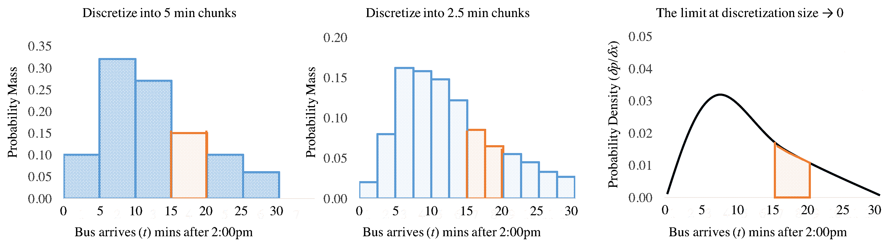

# 连续分布

> 原文：[`chrispiech.github.io/probabilityForComputerScientists/en/part2/continuous/`](https://chrispiech.github.io/probabilityForComputerScientists/en/part2/continuous/)

* * *

到目前为止，我们看到的所有随机变量都是**离散**的。在 CS109 中我们看到的所有情况下，这意味着我们的随机变量只能取整数值。现在是我们考虑**连续**随机变量的时候了，这些随机变量可以在实数域（$\R$）中取值。连续随机变量可以用来表示具有任意精度的测量（例如身高、体重、时间）。

## 从离散到连续

为了从考虑离散随机变量的思维过渡到考虑连续随机变量的思维，让我们从一个思想实验开始：想象你正在跑着去赶公交车。你知道你将在下午 2:15 到达，但你不知道公交车何时到达，并想将下午 2 点之后的分钟数视为一个随机变量 $T$，这样你就可以计算你需要等待超过五分钟的概率 $P(15 < T < 20)$。

我们立即面临一个问题。对于离散分布，我们会描述随机变量取特定值的概率。对于连续值，如公交车到达的时间，这没有意义。例如，如果我问你：公交车在下午 2:17 正好到达，以及 12.12333911102389234 秒的概率是多少？同样，如果我问你：一个孩子出生时体重恰好等于 3.523112342234 公斤的概率是多少，你可能会认为这个问题很荒谬。没有孩子的体重会精确到那个程度。实数可以有无限精度，因此考虑随机变量取特定值的概率有点令人困惑。

相反，让我们先通过将时间，我们的连续变量，分成 5 分钟的时间段来进行离散化。现在我们可以考虑类似的事情，比如，公交车在下午 2:00 到 2:05 之间到达的概率作为一个具有某种概率的事件（见下图中左边的图）。五分钟的时间段似乎有点粗糙。你可以想象，相反，我们可以将时间离散化成 2.5 分钟的时间段（中间的图）。在这种情况下，公交车在下午 2 点后 15 分钟到 20 分钟之间出现的概率是两个时间段的和，用橙色表示。为什么停止在这里呢？在极限情况下，我们可以不断地将时间分解成越来越小的片段。最终，我们将在每个时间点留下概率的导数，其中 $P(15 < T < 20)$ 的概率是那个导数在 15 到 20 之间的积分（右边的图）。

## 概率密度函数

在离散随机变量的世界中，一个随机变量最重要的性质是其概率质量函数（PMF），它会告诉你随机变量取任何值的概率。当我们进入连续随机变量的世界时，我们需要重新思考这个基本概念。在连续世界中，每个随机变量都有一个概率密度函数（PDF），它定义了随机变量取特定值的相对可能性。我们传统上用符号$f$表示概率密度函数，并以两种方式之一来表示它：$$ f(X=x) \quad \or \quad f(x) $$ 其中右侧的符号是简写，小写$x$表示我们正在讨论连续随机变量的相对可能性，而大写$X$表示随机变量。就像在公交车例子中，PDF 是概率在随机变量所有点的导数。这意味着 PDF 有一个重要的特性，即你可以对其积分以找到随机变量在范围$(a, b)$内取值的概率。

***定义***：连续随机变量

如果存在一个概率密度函数（PDF）$f(x)$，它接受实数值$x$，那么$X$是一个连续随机变量：$$ $$\begin{align*} &\P(a \leq X \leq b) = \int_a^b f(x) \d x \end{align*}$$ $$ 以下性质也必须成立。这些性质保持了公理，即$\P(a \leq X \leq b)$是一个概率：$$ $$\begin{align*} &0 \leq \P(a \leq X \leq b) \leq 1 \\ &\P(-\infty < X < \infty) = 1 \end{align*}$$ $$

一个常见的误解是将$f(x)$视为一个概率。它实际上是所谓的概率密度。它表示概率/单位$X$。通常，这只有在我们对 PDF 进行积分或比较概率密度时才有意义。正如我们讨论概率密度时所提到的，一个连续随机变量取特定值（无限精度）的概率是 0。

$$ \P(X = a) = \int_a^a f(x) \d x = 0 $$

这与在离散世界中我们经常讨论的随机变量取特定值的概率大不相同。

## 累积分布函数

拥有一个概率密度函数是很好的，但这意味着我们每次想要计算一个概率时都必须求解一个积分。为了避免这种不幸的命运，我们将使用一个称为累积分布函数（CDF）的标准。累积分布函数是一个函数，它接受一个数字并返回随机变量取值小于该数字的概率。它有一个令人愉快的特性，即如果我们有一个随机变量的累积分布函数，我们就不需要积分来回答概率问题！

对于连续随机变量$X$，累积分布函数，记作$F(x)$，为：$$ $$\begin{align*} &F(x) = P(X \leq x) = \int_{-\infty}^{x} f(x)\d x \end{align*}$$ $$

为什么 CDF 是随机变量取值小于输入值而不是大于的概率？这是一个惯例问题。但这是一个有用的惯例。大多数概率问题都可以通过了解 CDF（并利用积分从$-\infty$到$\infty$的结果为 1 的事实）简单解决。以下是一些仅使用 CDF 回答概率问题的例子：$$\begin{align*} &\text{概率查询} && \text{解决方案} && \text{解释} \\ &\P(X < a) && F(a) && \text{这是 CDF 的定义}\\ &\P(X \leq a) && F(a) && \text{技巧问题。 }\P(X = a) = 0\\ &\P(X > a) && 1 - F(a) && \P(X < a) + \P(X > a) = 1 \\ &\P(a < X < b) && F(b) - F(a) && F(a) + \P(a < X < b) = F(b)\\ \end{align*}$$

连续分布也适用于离散随机变量，但在离散世界中 CDF 的效用较小，因为我们的离散随机变量没有“封闭形式”的 CDF 函数（例如，没有任何求和）：$$\begin{align*} F_X(a) = \sum_{i = 1}^a P(X = i) \end{align*}$$

## 求解常数

设$X$为一个具有 PDF 的连续随机变量：$$\begin{align*} f(x) = \begin{cases} C(4x - 2x²) &\text{当 } 0 < x < 2 \\ 0 & \text{否则} \end{cases} \end{align*}$$ 在这个函数中，$C$是一个常数。$C$的值是多少？由于我们知道 PDF 必须加起来为 1：$$\begin{align*} &\int_0² C(4x - 2x²) \d x = 1 \\ &C\left(2x² - \frac{2x³}{3}\right)\bigg|_0² = 1 \\ &C\left(\left(8 - \frac{16}{3}\right) - 0 \right) = 1 \\ &C = \frac{3}{8} \end{align*}$$ 现在我们知道了$C$，$\P(X > 1)$是多少？$$\begin{align*} \P(X > 1) &=\int_1^{\infty}f(x) \d x \\ &= \int_1² \frac{3}{8}(4x - 2x²) \d x \\ &= \frac{3}{8}\left(2x² - \frac{2x³}{3}\right)\bigg|_1² \\ &= \frac{3}{8}\left[\left(8 - \frac{16}{3}\right) - \left(2 - \frac{2}{3}\right)\right] = \frac{1}{2} \end{align*}$$

## 连续变量的期望和方差

对于连续随机变量$X$：$$\begin{align*} &E[X] = \int_{-\infty}^{\infty} x f(x) dx \\ &E[g(X)] = \int_{-\infty}^{\infty} g(x) f(x) dx \\ &E[X^n] = \int_{-\infty}^{\infty} x^n f(x) dx \end{align*}$$

对于连续和离散随机变量：$$\begin{align*} &E[aX + b] = aE[X] + b\\ &\text{Var}(X) = E[(X - \mu)²] = E[X²] - (E[X])² \\ &\text{Var}(aX + b) = a² \text{Var}(X) \end{align*}$$
