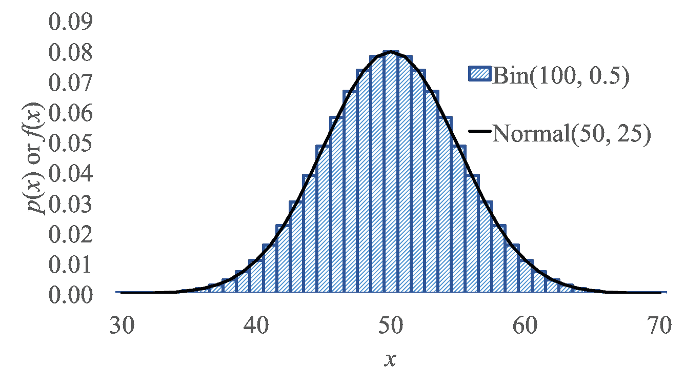
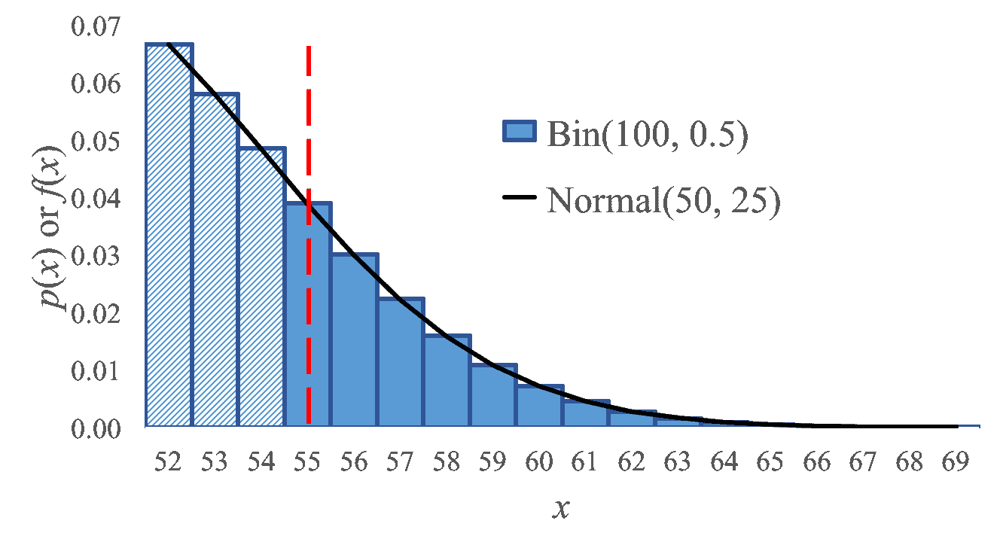

# 二项近似

> 原文：[`chrispiech.github.io/probabilityForComputerScientists/en/part2/binomial_approx/`](https://chrispiech.github.io/probabilityForComputerScientists/en/part2/binomial_approx/)

* * *

有时候，数值计算二项分布的概率特别困难，尤其是当 $n$ 很大时。例如，假设 $X \sim \text{Bin}(n = 10000, p = 0.5)$，你想计算 $\p(X > 5500)$。正确的公式是：\begin{align} \p(X > 55) &= \sum_{i = 5500}^{10000} \p(X=x) \\ &= \sum_{i = 5500}^{10000}{10000 \choose i}p^i(1-p)^{10000-i} \end{align}

这是一个难以计算的值。幸运的是，有一个更简单的方法。由于我们在“不确定性理论”部分将深入探讨的深层次原因，结果发现，当 $n$ 足够大时，二项分布可以很好地被正态分布和泊松分布近似。

当 $n$ 很大（>20）且 $p$ 很小（<0.05）时，使用泊松近似。每个实验结果之间有轻微的依赖关系是可以接受的

当 $n$ 较大（>20）且 $p$ 处于中等范围时，使用正态近似。具体来说，当方差大于 10 时，它被认为是一个准确的近似，换句话说：$np(1-p)>10$。在某些情况下，可以使用泊松分布或正态分布来近似二项分布。在这种情况下，选择正态分布！

## 泊松近似

当定义泊松分布时，我们证明了当 $n \rightarrow \infty$ 且 $p = \lambda/n$ 时，二项分布趋于泊松分布。同样的逻辑可以用来证明，当二项分布的 $n$ 和 $p$ 取极端值时，泊松分布是二项分布的一个很好的近似。泊松随机变量近似二项分布，其中 $n$ 很大，$p$ 很小，且 $\lambda = np$ 是“中等”的。有趣的是，为了计算我们关心的事情（概率质量函数、期望、方差），我们不再需要知道 $n$ 和 $p$。我们只需要提供 $\lambda$，我们称之为速率。在用泊松分布近似二项分布时，总是选择 $\lambda = n \cdot p$。

“中等”有不同的解释。接受的范围是 $n > 20$ 且 $p < 0.05$ 或 $n > 100$ 且 $p < 0.1$。

假设你想要发送一个长度为 $n = 10⁴$ 的比特串，其中每个比特独立地被 $p = 10^{-6}$ 污染。消息到达时未损坏的概率是多少？你可以使用 $\lambda = np = 10⁴ \cdot 10^{-6} = 0.01$ 的泊松分布来解决这个问题。语义上，$\lambda = 0.01$ 意味着我们期望每串有 $0.01$ 个损坏的比特，假设比特是连续的。设 $X \sim Poi(0.01)$ 为损坏的比特数。使用泊松分布的概率质量函数：$$\begin{align*} P(X = 0) &= \frac{\lambda^i}{i!}e^{-\lambda}\\ &= \frac{0.01⁰}{0!}e^{-0.01}\\ &\sim 0.9900498 \end{align*}$$ 我们也可以将 $X$ 模型化为二项分布，即 $X \sim Bin(10⁴, 10^{-6})$。这在计算机上计算是不可能的，但会得到相同的结果（直到百万分位）。

## 正态近似

对于 $n$ 很大且 $p$ 中等的二项分布，可以使用正态分布来近似二项分布。让我们对比一下正态分布和二项分布：

假设我们的二项分布是一个随机变量 $X \sim \text{Bin}(100, 0.5)$，我们想要计算 $P(X \geq 55)$。我们可以通过使用最接近的正态分布（在这种情况下 $Y \sim N(50, 25)$）来作弊。我们是如何选择那个特定的正态分布的？简单地说，选择一个均值和方差与二项分布期望和方差相匹配的正态分布。二项分布期望是 $np = 100 \cdot 0.5 = 50$。二项分布方差是 $np(1-p) = 100 \cdot 0.5 \cdot 0.5 = 25$。

你可以使用正态分布来近似二项分布 $X\sim \Bin(n,p)$。为此，定义一个正态分布 $Y \sim (E[X], Var(X))$。使用二项分布的期望和方差公式，$Y \sim (np, np(1-p))$。这种近似适用于大的 $n$ 和适中的 $p$。这会让你非常接近。然而，由于正态分布是连续的，而二项分布是离散的，我们必须使用连续性校正来离散化正态分布。

 $$\begin{align*} P(X = k) \sim P\left(k - \frac{1}{2} < Y < k + \frac{1}{2}\right) = \Phi\left( \frac{k - np + 0.5}{\sqrt{np(1-p)}} \right) - \Phi\left( \frac{k - np - 0.5}{\sqrt{np(1-p)}} \right) \end{align*}$$ 你应该习惯于决定使用哪种连续性校正。以下是一些离散概率问题及其连续性校正的例子：$$\begin{align*} &\text{离散（二项）概率问题} && \text{等效连续概率问题}\\ &P(X=6) && P(5.5 < X < 6.5) \\ &P(X\geq6) && P(X > 5.5) \\ &P(X > 6) && P(X > 6.5) \\ &P(X < 6) && P(X < 5.5) \\ &P(X \leq 6) && P(X < 6.5) \\ \end{align*}$$

**示例**：100 位访问你网站的访客被给予一个新的设计。设 $X$ = 被给予新设计并在你网站上花费更多时间的人数。如果你的 CEO 认为新设计没有效果，那么当 $X \geq 65$ 时，他会支持新设计。$P(\text{CEO 支持改变}|\text{它没有效果})$ 是多少？

$E[X] = np = 50$。$\Var(X) = np(1-p) = 25$。$\sigma = \sqrt{\Var(X)} = 5$。因此我们可以使用正态近似：$Y \sim \mathcal{N}(\mu = 50, \sigma² = 25)$。 $$\begin{align*} P(X \geq 65) &\approx P(Y > 64.5) = P\left(\frac{Y - 50}{5} > \frac{64.5 - 50}{5}\right) = 1 - \Phi(2.9) = 0.0019 \end{align*}$$

**示例：** 斯坦福大学录取了 2480 名学生，每个学生有 68%的几率入学。设$X$ = # 将会入学的学生数。$X\sim \Bin(2480, 0.68)$。求$P(X > 1745)$？

$E[X] = np = 1686.4$。$\var(X) = np(1-p) = 539.7$。$\sigma = \sqrt{\Var(X)} = 23.23$。因此我们可以使用正态近似：$Y \sim \mathcal{N}(\mu = 1686.4, \sigma² = 539.7)$。 $$\begin{align*} P(X > 1745) &\approx P(Y > 1745.5) \\ &\approx P\left(\frac{Y - 1686.4}{23.23} > \frac{1745.5 - 1686.4}{23.23}\right) \\ &\approx 1 - \Phi(2.54) = 0.0055 \end{align*}$$
