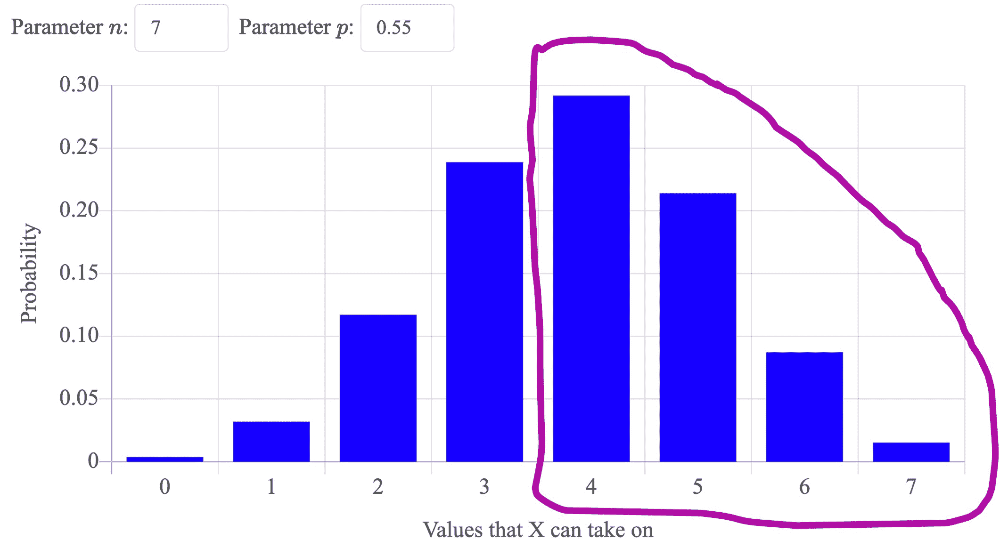

# 赢得系列赛

> 原文：[`chrispiech.github.io/probabilityForComputerScientists/en/examples/winning_series/`](https://chrispiech.github.io/probabilityForComputerScientists/en/examples/winning_series/)

* * *

金州勇士队是湾区篮球队。勇士队将在下一届 NBA 总决赛中与雄鹿队（另一支职业篮球队）进行一场最佳 7 场系列赛。如果你赢得至少 4 场比赛，他们将赢得系列赛。勇士队赢得系列赛的概率是多少？每场比赛都是独立的。每场比赛，勇士队赢得比赛的概率为 0.55。

这个问题等同于：抛一个偏硬币 7 次（得到正面的概率为 $p=0.55$）。至少得到 4 个正面的概率是多少？


*注意*：不失一般性，你可以想象这两支球队总是打满 7 场比赛，无论结果如何。技术上，一旦有一支球队赢得 4 场胜利，比赛就会停止，因为比赛的结果不再影响谁获胜。然而，你可以想象他们继续比赛。

勇士队赢得系列赛的概率是多少？请将你的答案保留到小数点后三位

一个关键步骤是定义一个随机变量，并认识到它是一个二项分布。设 $X$ 为赢得的比赛数。由于每场比赛都是独立的，$X \sim \Bin(n=7, p =0.55)$。问题是询问：$\P(X \geq 4)$？

为了回答这个问题，首先认识到：\begin{aligned}\P(X \geq 4) = &\P(X = 4) + \P(X = 5) \\ &+ \P(X = 6) + \P(X = 7)\end{aligned} 这是因为问题是在询问等号右侧每个事件的“或”的概率。由于这些事件；$X=4$，$X=5$，等等都是互斥的，所以“或”的概率就是这些概率的和。

\begin{aligned} \P(X \geq 4) &= \P(X = 4) + \P(X = 5) \\ &+ \P(X = 6) + \P(X = 7) \\ &= \sum_{i=4}⁷ P(X = i) \end{aligned}

这些概率都是 PMF 问题：

\begin{aligned} \P(X \geq 4) &= \sum_{i=4}⁷ P(X = i) \\ &= \sum_{i=4}⁷ {n \choose i} p^i (1-p)^{n-i} \\ &= \sum_{i=4}⁷ {7 \choose i} 0.55^i \cdot 0.45^{7-i} \end{aligned}

这里是那个方程的图形表示。它代表了 PMF 中这些列的和：



到目前为止，我们有一个可以用来找到答案的方程。但我们应该如何计算它？我们可以手动计算！或者使用计算器。或者，我们可以使用 Python，特别是 scipy 包：

```py
from scipy import stats

pr = 0
# calculate the sum
for i in range(4, 8): 
   # this for loop gives i in [4,5,6,7] 
   pr_i = stats.binom.pmf(i, n = 7, p = 0.55)
   pr += pr_i

print(f'P(X >= 4) = {pr}') 
```

这产生了正确的答案：

`P(X >= 4) = 0.6082877968750001`

### 有缺陷的解决方案

研究这个问题的一个好原因是这种常见的误解，即如何计算 $P(X \geq 4)$。了解为什么它是错误的很有价值。

**错误地尝试重建二项分布**

类似于我们定义的二项分布概率质量函数方程（参见：多次抛硬币），我们可以构建火箭队赢得七场系列赛的结果。

我们将选择 4 个火箭队获胜的槽位，我们不在乎其余的。它们可以是胜利或失败。在 7 场比赛中，选择 4 场火箭队获胜的比赛。有 ${7 \choose 4}$ 种这样做的方式。每个特定选择四场比赛获胜的概率是 $p⁴$，因为我们需要他们赢得这四场比赛，我们不在乎其余的。因此，概率是：

\begin{aligned} P(X \geq 4) = {7 \choose 4} p⁴ \end{aligned}

这个想法看起来不错，但不起作用。首先，我们可以通过考虑将 $p = 1.0$ 的情况来识别问题。在这种情况下，$P(X \geq 4) = {7 \choose 4} p⁴ = {7 \choose 4} 1⁴ = 35$。显然，35 不是一个有效的概率（这比 1 大得多）。因此，这不可能是对的答案。

但这种方法的错误在哪里呢？让我们列举他们考虑的 35 种不同结果。设 B = 我们不知道谁会赢。设 W = 火箭队获胜。这里每个结果是对系列赛中每场比赛的分配：

```py
    (B, B, B, W, W, W, W)
    (B, B, W, B, W, W, W)
    (B, B, W, W, B, W, W)
    (B, B, W, W, W, B, W)
    (B, B, W, W, W, W, B)
    (B, W, B, B, W, W, W)
    (B, W, B, W, B, W, W)
    (B, W, B, W, W, B, W)
    (B, W, B, W, W, W, B)
    (B, W, W, B, B, W, W)
    (B, W, W, B, W, B, W)
    (B, W, W, B, W, W, B)
    (B, W, W, W, B, B, W)
    (B, W, W, W, B, W, B)
    (B, W, W, W, W, B, B)
    (W, B, B, B, W, W, W)
    (W, B, B, W, B, W, W)
    (W, B, B, W, W, B, W)
    (W, B, B, W, W, W, B)
    (W, B, W, B, B, W, W)
    (W, B, W, B, W, B, W)
    (W, B, W, B, W, W, B)
    (W, B, W, W, B, B, W)
    (W, B, W, W, B, W, B)
    (W, B, W, W, W, B, B)
    (W, W, B, B, B, W, W)
    (W, W, B, B, W, B, W)
    (W, W, B, B, W, W, B)
    (W, W, B, W, B, B, W)
    (W, W, B, W, B, W, B)
    (W, W, B, W, W, B, B)
    (W, W, W, B, B, B, W)
    (W, W, W, B, B, W, B)
    (W, W, W, B, W, B, B)
    (W, W, W, W, B, B, B)
```

实际上，这 35 种结果中的任何一种的概率都是 $p⁴$。例如：(W, W, W, W, B, B, B)。火箭队需要赢得前 4 场独立的比赛：$p⁴$。然后有三个事件，任何一支球队都可能获胜。任意一支球队获胜的概率“B”是 1。这很有道理。要么火箭队赢，要么另一支球队赢。因此，我们任何给定结果的概率，也就是上述结果集中的行，是：$p⁴ \cdot 1³ = p⁴$

这里的错误是，这些结果**不是**互斥的，但答案却将它们视为互斥。在多次抛硬币的例子中，我们构建了格式为（T, T, T, H, H, T, H）的结果。这些结果实际上是互斥的。不可能同时存在两个不同的结果列表。另一方面，在“B”代表任意一支球队都可能赢的版本中，结果确实有重叠。例如，考虑上面例子中的两行：

```py
    (B, W, W, W, B, B, W)
    (B, W, W, W, B, W, B)
```

这些结果都可能发生（因此它们不是互斥的）。例如，如果火箭队赢得了所有 7 场比赛！或者火箭队赢得了除了第 1 场和第 5 场之外的所有比赛。这两个事件都满足。因为事件不是互斥的，如果我们想计算这些事件的“或”的概率，我们不能**仅仅**将每个事件的概率相加（这正是 $P(X \geq 4) = {7 \choose 4} p⁴$ 所暗示的。相反，你需要使用包含排除法来计算 35 个事件的“或”。或者，参见我们上面提出的答案。
