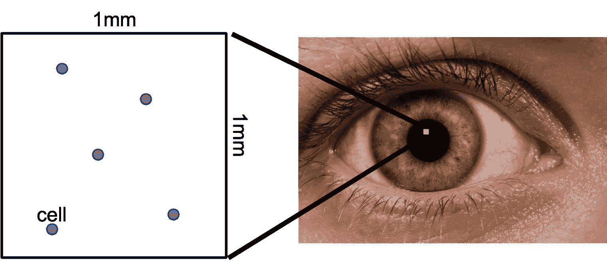
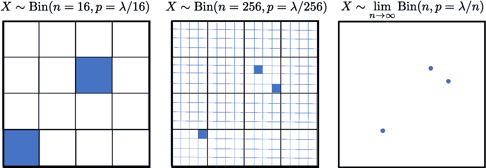

# 眼炎分级

> 原文：[`chrispiech.github.io/probabilityForComputerScientists/en/examples/grading_eye_inflammation/`](https://chrispiech.github.io/probabilityForComputerScientists/en/examples/grading_eye_inflammation/)

* * *

当患者有眼炎时，眼科医生会对炎症进行“分级”。在“分级”炎症时，他们随机查看患者眼睛中一个 1 毫米乘 1 毫米的平方区域，并计数他们看到的“细胞”数量。

这些计数存在不确定性。如果给定患者眼睛的真实平均细胞数是 6，医生可能仅通过偶然机会得到不同的计数（比如 4、5 或 7）。截至 2021 年，现代眼科医学对其炎症分级没有不确定性感！在这个问题中，我们将改变这一点。同时，我们将了解空间上的泊松分布。

为什么在 1x1 平方区域内观察到的细胞数量受泊松过程控制？

我们可以通过将平方区域离散化为固定数量的相等大小的桶来近似计数分布。每个桶要么有细胞，要么没有。因此，1x1 平方区域中的细胞计数是具有相等$p$的伯努利随机变量的和，因此可以建模为二项随机变量。这是一个近似，因为它不允许一个桶中有两个细胞。就像时间一样，如果我们使每个桶的大小无限小，这个限制就会消失，我们就会收敛到计数的真实分布。在极限情况下，即当$n \rightarrow \infty$时，二项分布真正由泊松随机变量表示。在这个上下文中，$\lambda$代表每 1$\times$1 样本的平均细胞数。见图 2。

对于一个特定的患者，细胞的真实平均速率是每 1x1 样本 5 个细胞。在单个 1x1 样本中，医生计数到 4 个细胞的概率是多少？

让$X$表示 1x1 样本中的细胞数量。我们注意到$X \sim \Poi(5)$。我们想找到$P(X=4)$。\[P(X=4) = \frac{5⁴ e^{-5}}{4!} \approx 0.175\]

* * *

### 多次观察

**请注意**！本节使用第三部分的概念。具体为变量独立性

对于一个特定的患者，细胞的真实平均速率是每 1mm 乘 1mm 样本 5 个细胞。为了更精确，医生在两个不同的、更大的**2mm 乘 2mm**样本中计数细胞。假设一个 2mm 乘 2mm 样本中的细胞发生与任何其他 2mm 乘 2mm 样本中的细胞发生独立。她计数第一个样本 20 个细胞和第二个样本 20 个细胞的概率是多少？

用 $Y_1$ 和 $Y_2$ 表示每个 2x2 样本中的细胞数量。由于 1x1 样本中有 5 个细胞，因此由于面积翻倍，2x2 样本中有 20 个样本，所以我们有 $Y_1 \sim \Poi(20)$ 和 $Y_2 \sim \Poi(20)$。我们想找到 $P(Y_1 = 20 \land Y_2 = 20)$。由于两个样本中的细胞数量是独立的，这相当于找到 $\P(Y_1 = 20) \P(Y_2=20)$。

### 估计 Lambda

**请注意！**本节使用第五部分的概念。具体来说，最大后验**炎症先验**：基于数百万历史患者，医生们已经了解到真实细胞率的真实概率密度函数为：$$\begin{align*} f(\lambda) = K \cdot \lambda \cdot e ^{-\frac{\lambda}{2}} \end{align*}$$ 其中 $K$ 是归一化常数，$\lambda$ 必须大于 0。

一位医生取了一个样本并计数了 4 个细胞。给出 $\lambda$ 更新概率密度的方程。使用“炎症先验”作为 $\lambda$ 值的先验概率密度。你的概率密度可能包含一个常数项。

令 $\theta$ 为真实率的随机变量。令 $X$ 为计数的随机变量 $$\begin{align*} f(\theta = \lambda | X = 4) &= \frac{P(X=4|\theta = \lambda) f(\theta = \lambda)}{P(X = 4)} \\ &= \frac{\frac{\lambda^{4} e^{-\lambda}}{4!} \cdot K \cdot \lambda \cdot e^{\lambda / 2}}{P(X = 4)} \\ &= \frac{K \cdot \lambda⁵ e^{-\frac{3}{2}\lambda}}{4! P(X=4)} \end{align*}$$

一位医生取了一个样本并计数了 4 个细胞。$\lambda$ 的最大后验估计是多少？

最大化前一部分计算出的参数的“后验”：$$\begin{align*} \argmax_\limits\lambda \frac{K \cdot \lambda⁵ e^{-\frac{3}{2}\lambda}}{4! P(X=4)} &= \argmax_\limits\lambda \lambda⁵ e^{-\frac{3}{2}\lambda} \\ \end{align*}$$ 取对数（保持 argmax，并且更容易求导）：$$\begin{align*} &= \argmax_\limits\lambda \log \left(\lambda⁵ e^{-\frac{3}{2}\lambda} \right) \\ &= \argmax_\limits\lambda \left(5 \log \lambda -\frac{3}{2}\lambda\right) \end{align*}$$ 对参数求导，并令其等于 0 $$\begin{align*} 0 &= \frac{\partial}{\partial \lambda} \left(5 \log \lambda -\frac{3}{2}\lambda\right) \\ 0 &= \frac{5}{\lambda} -\frac{3}{2} \\ \lambda &= \frac{10}{3} \end{align*}$$

用文字解释一下前两部分中两个 lambda 估计之间的区别。

第一部分的估计是一个“分布”（也称为软估计），而第二部分的估计是一个单一值（也称为点估计）。前者包含关于置信度的信息。$\lambda$ 的 MLE 估计是多少？MLE 估计不使用先验信念。对于泊松分布，MLE 估计简单地为观察值的平均值。在这种情况下，我们的单个观察值的平均值为 4。MLE 不是从单个数据点估计参数的很好工具。

病人在两天分别就诊。第一天医生计数 5 个细胞，第二天医生计数 4 个细胞。仅基于这个观察，并且将两天真实的比率视为独立，病人炎症好转的概率是多少（换句话说，他们的 $\lambda$ 是否减少）？

设 $\theta_1$ 为第一天的 $\lambda$ 的随机变量，$\theta_2$ 为第二天的 $\lambda$ 的随机变量。 $$\begin{align*} f(\theta_1 = \lambda | X = 5) &= K_1 \cdot \lambda⁶ e^{-\frac{3}{2}\lambda} \\ f(\theta_2 = \lambda | X = 4) &= K_2 \cdot \lambda⁵ e^{-\frac{3}{2}\lambda} \end{align*}$$ 问题是在问 $P(\theta_1 > \theta_2)$ 是多少？有几种方法可以精确计算这个值： $$\begin{align*} & \int_{\lambda_1=0}^\infty \int_{\lambda_2=0}^{\lambda_1} f(\theta_1 = \lambda_1, \theta_2 = \lambda_2) \\ &= \int_{\lambda_1=0}^\infty \int_{\lambda_2=0}^{\lambda_1} f(\theta_1 = \lambda_1) \cdot f(\theta_2 = \lambda_2) \\ &= \int_{\lambda_1=0}^\infty f(\theta_1 = \lambda_1) \int_{\lambda_2=0}^{\lambda_1} f(\theta_2 = \lambda_2) \\ &= \int_{\lambda_1=0}^\infty K_1 \cdot \lambda⁶ e^{-\frac{3}{2}\lambda} \int_{\lambda_2=0}^{\lambda_1} K_2 \cdot \lambda⁵ e^{-\frac{3}{2}\lambda} \end{align*}$$
