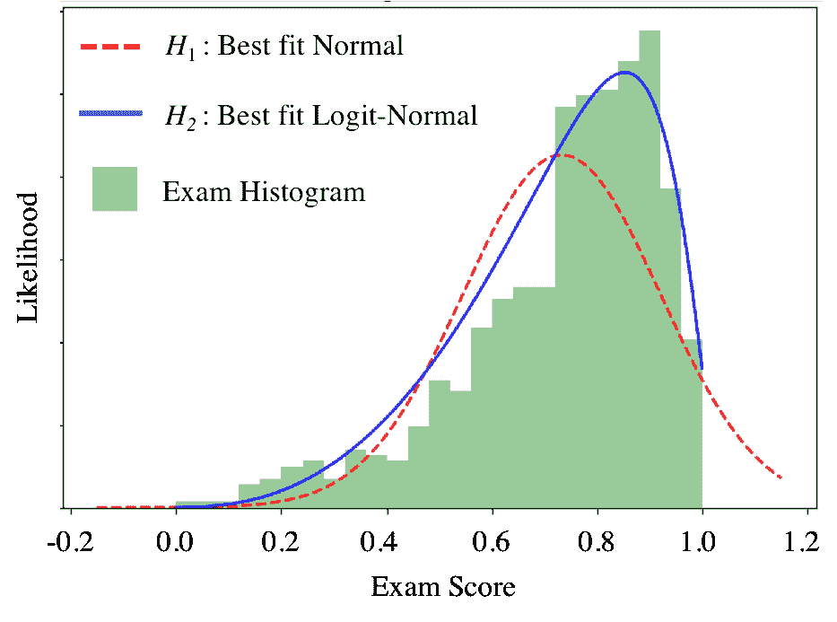

# 成绩并非正态分布

> 原文：[`chrispiech.github.io/probabilityForComputerScientists/en/examples/grades_not_normal/`](https://chrispiech.github.io/probabilityForComputerScientists/en/examples/grades_not_normal/)

* * *

有时候你只是想压缩正态分布：

**对数正态**

对数正态分布是通过对正态分布的随机变量应用一种特殊的“压缩”函数得到的连续分布。压缩函数将正态分布可以取的所有值映射到 0 到 1 的范围内。如果 $X \sim \text{LogitNormal}(\mu, \sigma²)$，它具有以下特性： $$\begin{align*} \text{PDF:}&& &f_X(x) = \begin{cases} \frac{1}{\sigma(\sqrt{2\pi})x(1 - x)}e^{-\frac{(\text{logit}(x) - \mu)²}{2\sigma²}} & \text{if } 0 < x < 1\\ 0 & \text{otherwise} \end{cases} \\ \text{CDF:} && &F_X(x) = \Phi\Big(\frac{\text{logit}(x) - \mu}{\sigma}\Big)\\ \text{Where:} && &\text{logit}(x) = \text{log}\Big(\frac{x}{1-x}\Big) \end{align*}$$

一种新的理论表明，对数正态分布比传统使用的正态分布更好地拟合考试成绩分布。让我们来测试一下！我们有一组考试分数，考试最低可能分数为 0，最高可能分数为 1，我们正在尝试在两个假设之间做出选择：

$H_1$：我们的成绩分数服从 $X\sim \text{Normal}(\mu = 0.7, \sigma² = 0.2²)$。

$H_2$：我们的成绩分数服从 $X\sim \text{LogitNormal}(\mu = 1.0, \sigma² = 0.9²)$。

在正常假设下，$H_1$，$P(0.9 < X < 1.0)$ 是多少？请提供两位小数的数值答案。

$$P(0.9 < X < 1.0) = \Phi\left(\frac{1.0 - 0.7}{0.2}\right) - \Phi\left(\frac{0.9 - 0.7}{0.2}\right) = \Phi(1.5) - \Phi(1.0) = 0.9332 - 0.8413 = 0.09$$

在对数正态假设下，$H_2$，$P(0.9 < X < 1.0)$ 是多少？

$$F_X(1.0) - F_X(0.9) = \Phi\Big(\frac{\text{logit}(1.0) - 1.0}{0.9}\Big) - \Phi\Big(\frac{\text{logit}(0.9) - 1.0}{0.9}\Big)$$ 我们可以通过数值方法求解：$$\Phi\Big(\frac{\text{logit}(1.0) - 1.0}{0.9}\Big) - \Phi\Big(\frac{\text{logit}(0.9) - 1.0}{0.9}\Big) = 1 - \Phi(1.33) \approx 0.91$$

在正常假设下，$H_1$，$X$ 可以取的最大值是多少？

$$\infty$$

在观察任何考试分数之前，你假设（a）两个假设中的一个正确，并且（b）最初，每个假设被正确选择的概率相等，$P(H_1)=P(H_2)=\frac{1}{2}$。然后你观察到一个单独的考试分数，$X = 0.9$。你对对数正态假设正确的更新概率是多少？

$$\begin{align*} P(H_2|X = 0.9) &= \frac{f(X = 0.9|H_2)P(H_2)}{f(X = 0.9|H_2)P(H_2) + f(X = 0.9|H_1)P(H_1)}\\ &= \frac{f(X = 0.9|H_2)}{f(X = 0.9|H_2) + f(X = 0.9|H_1)}\\ &= \frac{\frac{1}{\sigma(\sqrt{2\pi})0.9*(1 - 0.9)}e^{-\frac{(\text{logit}(0.9) - 1.0)²}{2*0.9²}}}{\frac{1}{\sigma(\sqrt{2\pi})0.9*(1 - 0.9)}e^{-\frac{(\text{logit}(0.9) - 1.0)²}{2*0.9²}} + \frac{1}{0.2\sqrt{2\pi}}e^{-\frac{(0.9 - 0.7)²}{2*0.2²}}} \end{align*}$$
