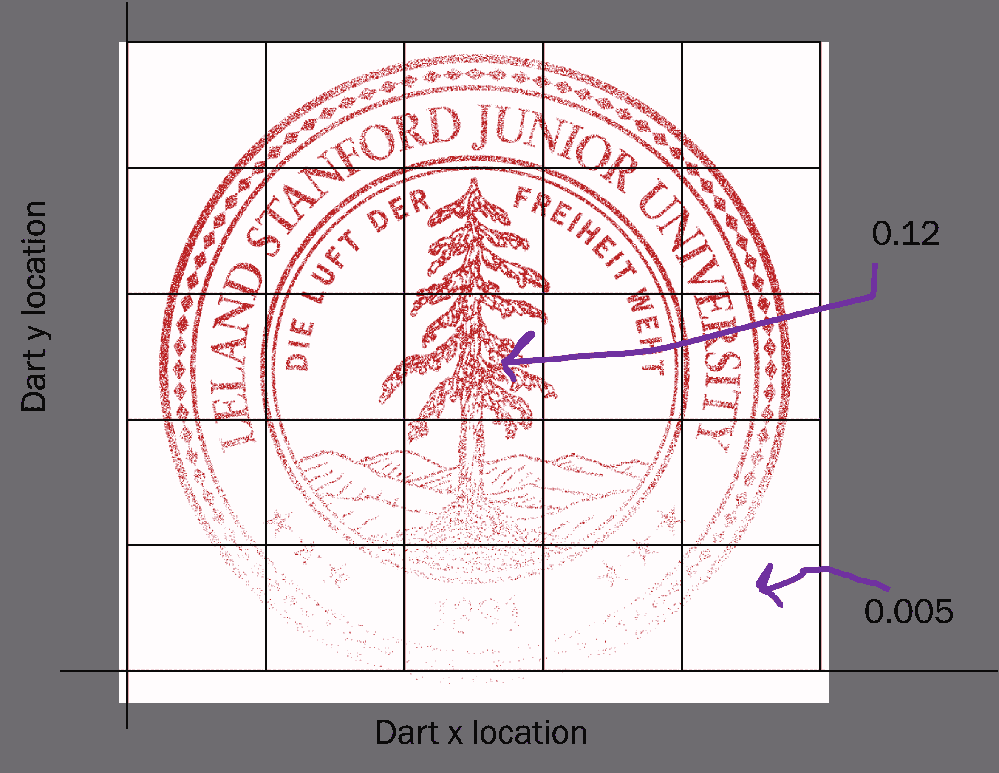
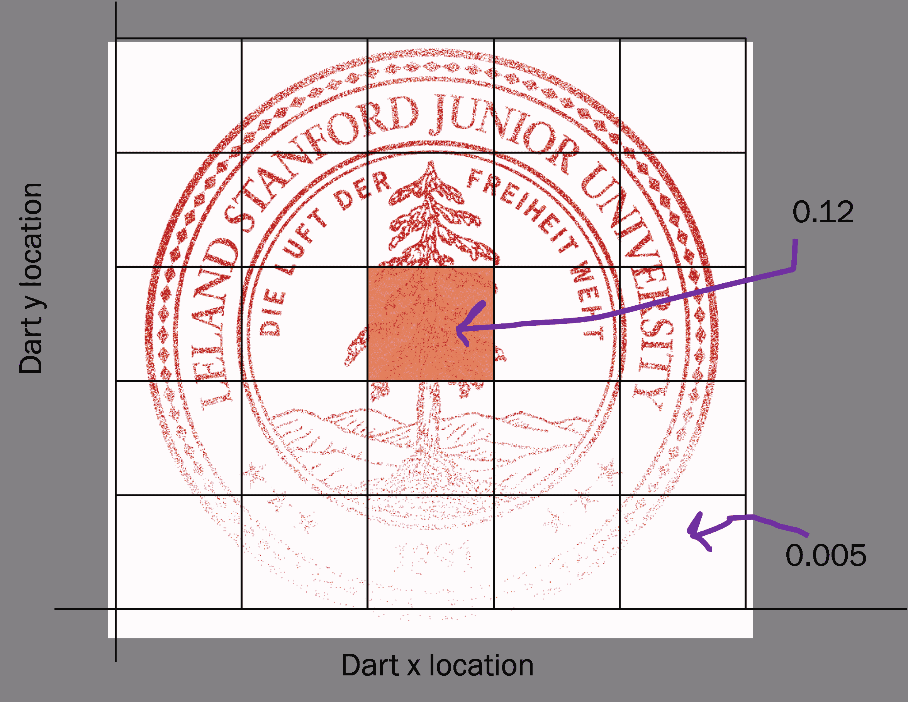
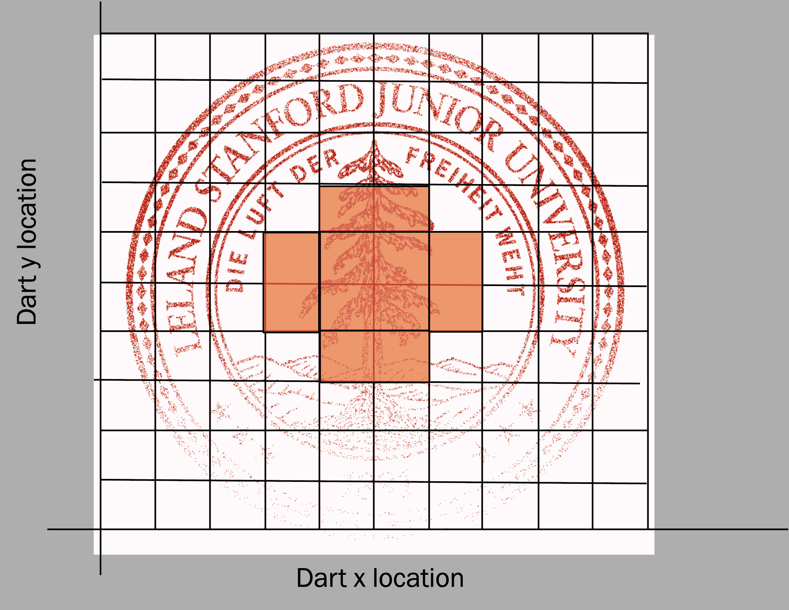
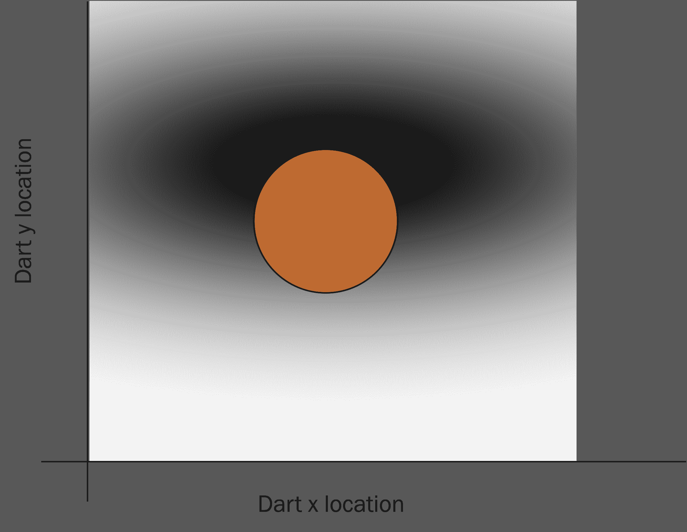
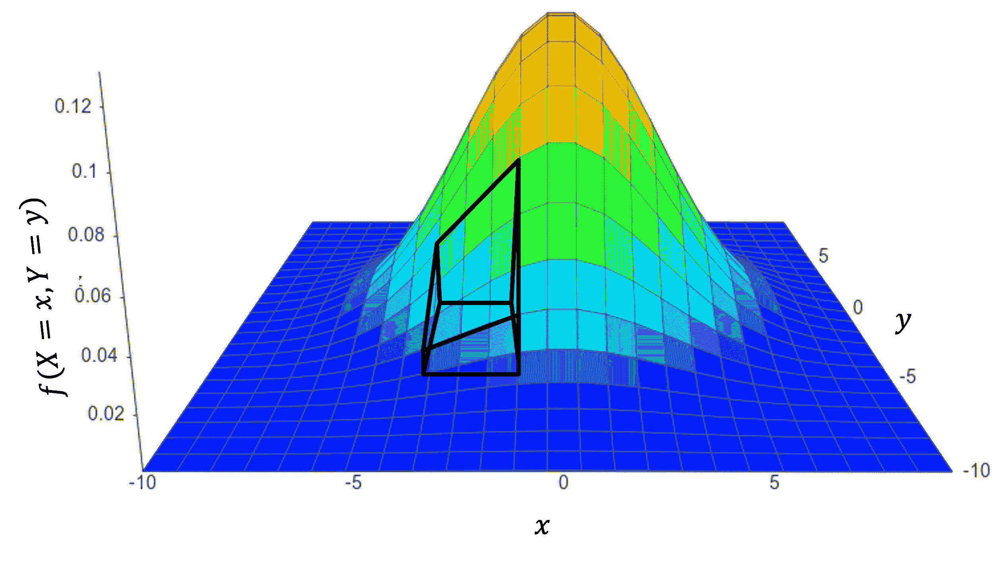
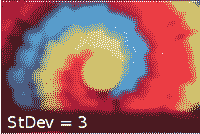
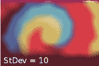

# 连续联合

> 原文：[`chrispiech.github.io/probabilityForComputerScientists/en/part3/continuous_joint/`](https://chrispiech.github.io/probabilityForComputerScientists/en/part3/continuous_joint/)

* * *

如果存在一个联合概率密度函数（PDF）$f$，使得随机变量$X$和$Y$是联合连续的，那么：$$\begin{align*} P(a_1 < X \leq a_2,b_1 < Y \leq b_2) = \int_{a_1}^{a_2} \int_{b_1}^{b_2} f(X=x,Y=y)\d y \text{ } \d x \end{align*}$$

使用概率密度函数（PDF）我们可以计算边缘概率密度：$$\begin{align*} f(X=a) &= \int_{-\infty}^{\infty}f(X=a,Y=y)\d y \\ f(Y=b) &= \int_{-\infty}^{\infty}f(X=x,Y=b)\d x \end{align*}$$

设 $F(x,y)$ 为累积分布函数（CDF）：$$\begin{align*} P(a_1 < X \leq a_2,b_1 < Y \leq b_2) = F(a_2,b_2) - F(a_1,b_2) + F(a_1,b_1) - F(a_2,b_1) \end{align*}$$

## 从离散联合到连续联合

联合考虑多个连续随机变量一开始可能难以直观理解。但我们可以借助一个有用的技巧来理解连续随机变量：从离散近似开始。以创建 CS109 徽标的例子来说明。它是通过向斯坦福标志的图像投掷五十万支飞镖（保留至少被一支飞镖击中的所有像素）生成的。飞镖可以击中标志上的任何连续位置，而这些位置的概率并不相等。相反，飞镖击中的位置受一个联合连续分布的支配。在这种情况下，只有两个同时存在的随机变量，即飞镖的 x 位置和 y 位置。每个随机变量都是连续的（它取实数值）。通过首先考虑离散化，思考联合概率密度函数会更加容易。我将把飞镖着陆区域划分为 25 个离散的桶：

左边是这种联合分布的概率质量可视化，右边是回答问题的可视化：飞镖击中中心一定距离内的概率。对于每个桶，都有一个单独的数字，即飞镖落入该特定桶的概率（这些概率是互斥的，且总和为 1）。

当然，这种离散化只是对联合概率分布的近似。为了得到更好的近似，我们可以创建更精细的离散化。在极限情况下，我们可以使我们的桶无限小，与每个桶关联的值成为概率的二阶导数。

为了在图中表示二维概率密度，我们使用值的深度来表示密度（越深表示密度越大）。另一种可视化这种分布的方法是从一个角度。这使得更容易意识到这是一个有两个输入和一个输出的函数。下面是同一密度函数的不同可视化：

就像在单随机变量情况下一样，我们现在用**密度**而不是概率来表示我们对连续随机变量的信念。回想一下，密度表示相对信念。如果$f(X = 1.1, Y = 0.9)$的密度是$f(X = 1.1, Y = 1.1)$的两倍，那么函数表示找到特定的组合$X = 1.1$和$Y=0.9$的可能性是两倍。

## 多元高斯

在这个例子中，所表示的密度恰好是联合连续分布的一个特例，称为多元高斯分布。实际上，它是一个所有构成变量都是独立的特殊情况。

***定义：独立多元高斯分布***。独立多元高斯分布可以用来模拟一组连续的联合随机变量 $\vec{X} = (X_1 \dots X_n)$，将其视为由独立的正态分布组成，具有均值 $\vec{\mu} = (\mu_1 \dots \mu_n)$ 和标准差 $\vec{\sigma} = (\sigma_1 \dots \sigma_n)$。注意我们现在有了向量中的变量（类似于 Python 中的列表）。多元分布的表示使用向量符号：$$\begin{align*} \vec{X} \sim \vec{\N}(\vec{\mu}, \vec{\sigma}) \end{align*}$$ 联合概率密度函数为：$$\begin{align*} f(\vec{x}) &= \prod_{i=1}^n f(x_i) \\ &= \prod_{i=1}^n \frac{1}{\sigma_i \sqrt{2\pi} } e ^{\frac{-(x-\mu_i)²}{2\sigma_i²}} \end{align*}$$ 联合累积分布函数为 $$\begin{align*} F(\vec{x}) &= \prod_{i=1}^n F(x_i) \\ &= \prod_{i=1}^n \Phi(\frac{x_i-\mu_i}{\sigma_i}) \end{align*}$$

***示例：高斯模糊***

就像许多单随机变量被假设为高斯分布一样，许多联合随机变量也可以假设为多元高斯分布。考虑以下高斯模糊的例子：

在图像处理中，高斯模糊是通过高斯函数模糊图像的结果。这是图形软件中广泛使用的效果，通常用于减少图像噪声。高斯模糊通过将图像与二维独立多元高斯（均值为 0，标准差相等）进行卷积来实现。

为了使用高斯模糊，你需要能够计算该二维高斯在像素空间中的概率质量。每个像素被赋予一个等于 X 和 Y 都在像素边界内的概率的权重。中心像素覆盖的区域是 $-0.5 ≤ x ≤ 0.5$ 和 $-0.5 ≤ y ≤ 0.5$。让我们在计算图像空间上离散化的高斯函数时进行一步。对于具有均值为 0 和标准差为 3 的多元高斯，中心像素的权重是多少？

设 $\vec{B}$ 为多元高斯分布，$\vec{B} \sim \N(\vec{\mu} = [0,0], \vec{\sigma} = [3,3])$。让我们计算这个多元高斯分布的累积分布函数 $F(x_1,x_2)$：$$\begin{align*} F(x_1,x_2) &= \prod_{i=1}^n \Phi(\frac{x_i-\mu_i}{\sigma_i}) \\ &= \Phi(\frac{x_1-\mu_1}{\sigma_1}) \cdot \Phi(\frac{x_2-\mu_2}{\sigma_2}) \\ &= \Phi(\frac{x_1}{3}) \cdot \Phi(\frac{x_2}{3}) \end{align*}$$

现在我们准备计算中心像素的权重：$$\begin{align*} \P&(-0.5 < X_1 \leq 0.5,-0.5 < X_2 \leq 0.5) \\ &= F(0.5,0.5) - F(-0.5,0.5) + F(-0.5,-0.5) - F(0.5,-0.5) \\ &=\Phi(\frac{0.5}{3}) \cdot \Phi(\frac{0.5}{3}) - \Phi(\frac{-0.5}{3}) \cdot \Phi(\frac{0.5}{3}) + \Phi(\frac{-0.5}{3}) \cdot \Phi(\frac{-0.5}{3}) - \Phi(\frac{0.5}{3}) \cdot \Phi(\frac{-0.5}{3})\\ &\approx 0.026 \end{align*}$$

如何使这个二维高斯模糊图像？维基百科解释道：“由于高斯函数的傅里叶变换仍然是另一个高斯函数，应用高斯模糊的效果是减少图像的高频成分；高斯模糊是一个低通滤波器” [[2](https://en.wikipedia.org/wiki/Gaussian_blur)]。
