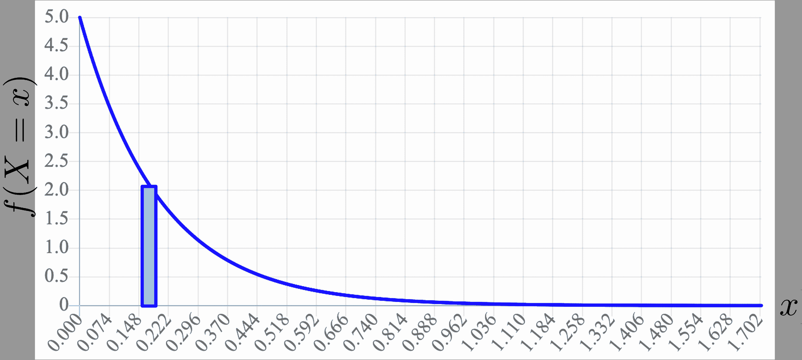

# 推理

> 原文：[`chrispiech.github.io/probabilityForComputerScientists/en/part3/inference/`](https://chrispiech.github.io/probabilityForComputerScientists/en/part3/inference/)

* * *

到目前为止，我们已经为如何用多个随机变量表示概率模型奠定了基础。这些模型特别有用，因为它们允许我们执行一个名为“推理”的任务，其中我们根据关于另一个随机变量的新信息更新模型中一个随机变量的信念。一般来说，推理是困难的！实际上，已经证明，在最坏的情况下，推理任务可以是 NP-Hard，其中$n$是随机变量的数量 [[1](https://www.sciencedirect.com/science/article/pii/000437029090060D)]。

首先，我们将通过两个随机变量（在本节中）来练习它。然后，在本单元的后面，我们将讨论一般情况下的推理，涉及许多随机变量。

之前我们研究了事件的条件概率。推理的第一个任务是理解如何结合条件概率和随机变量。离散和连续情况下的方程都是我们对条件概率理解的直观扩展：

## 离散条件概率

在离散情况下，即你的模型中的每个随机变量都是离散的，是条件概率（你在事件背景下学习的内容）的简单组合。回想一下，每个应用于随机变量的关系运算符定义了一个事件。因此，条件概率的规则直接适用：离散情况下的条件概率质量函数（PMF）：

设$X$和$Y$为离散随机变量。

***定义：*** 带有离散随机变量的条件定义。

$$\begin{align*} \P(X=x|Y=y)=\frac{P(X=x,Y=y)}{P(Y=y)} \end{align*}$$

***定义：*** 带有离散随机变量的贝叶斯定理。

$$\begin{align*} \P(X=x|Y=y)=\frac{P(Y=y|X=x)P(X=x)}{P(Y=y)} \end{align*}$$

在存在多个随机变量的情况下，使用缩写变得越来越有用！上述定义与以下符号相同，其中小写符号如$x$是事件$X=x$的缩写：$$\begin{align*} \P(x|y)=\frac{P(x,y)}{P(y)} \end{align*}$$ 条件定义适用于任何事件，因此我们也可以使用累积分布函数（CDF）来写出离散情况下的条件：$$\begin{align*} \P(X \leq a | Y=y) &= \frac{\P(X \leq a, Y=y)}{\p(Y=y)} \\ &= \frac{\sum_{x\leq a} \P(X=x,Y=y)}{\P(Y=y)} \end{align*}$$ 这里有一个巧妙的结果：这个最后项可以通过巧妙的手法重写。我们可以使求和扩展到整个分数：$$\begin{align*} \P(X \leq a | Y=y) &= \frac{\sum_{x\leq a} \P(X=x,Y=y)}{\P(Y=y)} \\ &= \sum_{x\leq a} \frac{\P(X=x,Y=y)}{\P(Y=y)} \\ &= \sum_{x\leq a} \P(X=x|Y=y) \end{align*}$$

实际上，将概率规则（如贝叶斯定理、全概率定律等）翻译成离散随机变量的语言变得非常直接：我们只需要回忆起，应用于随机变量的每个关系运算符定义了一个事件。

## 混合离散和连续

当我们想要使用我们的概率规则（如贝叶斯定理、全概率定律、链式法则等）来推理 *连续* 随机变量时，会发生什么？有一个简单的实际答案是：规则仍然适用，但我们必须用概率密度函数来替换概率术语。作为一个具体的例子，让我们看看只有一个连续随机变量的贝叶斯定理。

***定义：*** 混合离散和连续的贝叶斯定理。

设 $X$ 为连续随机变量，设 $N$ 为离散随机变量。$X$ 给定 $N$ 和 $N$ 给定 $X$ 的条件概率分别是：$$\begin{align*} f(X=x|N=n) = \frac{\P(N=n|X=x)f(X=x)}{\p(N=n)} && \end{align*}$$ $$\begin{align*} \p(N=n|X=x) = \frac{f(X=x|N=n)\p(N=n)}{f(X=x)} \end{align*}$$

这些方程可能看起来很复杂，因为它们混合了概率密度和概率。我们为什么相信它们是正确的？首先，注意当条件概率的左侧的随机变量是连续的时，我们使用密度，当它是离散的时，我们使用概率。这个结果可以通过观察得出：$$ \P(X = x) = f(X=x) \cdot \epsilon_x $$

在 $\epsilon_x \rightarrow 0$ 的极限下。要从密度函数中获得一个概率，就是要对该函数下的区域进行积分。如果你想要近似 $X = x$ 的概率，你可以考虑一个高度为 $f(X=x)$ 且宽度非常小的矩形的面积。随着这个宽度的减小，你的答案变得更加准确：

如果 $\epsilon_x$ 的值被留在公式中，那么它就会成为一个问题。然而，如果我们能让它们相互抵消，我们就可以得到一个有效的方程。这是在单变量或多个连续随机变量的背景下推导概率规则的关键洞察。再次，设 $X$ 为连续随机变量，设 $N$ 为离散随机变量：$$\begin{align*} \p(N=n|X=x) &= \frac{P(X=x|N=n)\p(N=n)}{P(X=x)} &&\text{贝叶斯定理}\\ &= \frac{f(X=x|N=n) \cdot \epsilon_x \cdot \p(N=n)}{f(X=x) \cdot \epsilon_x} &&\P(X = x) = f(X=x) \cdot \epsilon_x \\ &= \frac{f(X=x|N=n) \cdot \p(N=n)}{f(X=x)} &&\text{消去 } \epsilon_x \\ \end{align*}$$

这种策略不仅适用于贝叶斯定理。例如，当 $X$ 是连续的且 $N$ 是离散的时，这是全概率定律的一个版本：$$\begin{align*} f(X=x) &= \sum_{n \in N} f(X=x | N = n) \p(N = n) \end{align*}$$

## 连续随机变量的概率规则

上面的策略可以用来推导存在连续随机变量时的概率规则。当存在多个连续随机变量时，该策略同样适用。例如，这里是两个连续随机变量的贝叶斯定理。

***定义：*** 连续随机变量的贝叶斯定理。

设 $X$ 和 $Y$ 为连续随机变量。 $$\begin{align*} f(X=x|Y=y) = \frac{f(X=x,Y=y)}{f(Y=y)} \end{align*}$$

## 示例：连续变量的推理

考虑以下问题：

***问题：*** 在出生时，雌性大象的重量服从均值为 160kg，标准差为 7kg 的高斯分布。雄性大象的出生重量服从均值为 165kg，标准差为 3kg 的高斯分布。你所知道的新生大象的信息是它的重量为 163kg。它是一只雌性大象的概率是多少？

***答案：*** 设 $G$ 为一个指示器，表示大象是雌性。$G$ 是伯努利分布（p = 0.5）。设 $X$ 为大象重量的分布。

当 $G = 1$ 时，$X$ 服从正态分布 $N(μ = 160, σ² = 7²)$

当 $G = 0$ 时，$X$ 服从正态分布 $N(μ = 165, σ² = 3²)$ $$\begin{align*} \p(G = 1 | X = 163) &= \frac{f(X = 163 | G = 1) \P(G = 1)}{f(X = 163)} && \text{贝叶斯定理} \end{align*}$$ 如果我们能解这个方程，我们就会得到答案。$f(X = 163 | G = 1)$ 是什么？它是 $X$ 的 高斯概率密度函数，在点 $x = 163$ 处，$\mu=160, \sigma² = 7²$： $$\begin{align*} f(X = 163 | G = 1) &= \frac{1}{\sigma \sqrt{2 \pi}} e^{-\frac{1}{2}\Big(\frac{x-\mu}{\sigma}\Big)²} && \text{高斯概率密度函数} \\ &= \frac{1}{7 \sqrt{2 \pi}} e^{-\frac{1}{2}\Big(\frac{163-160}{7}\Big)²} && \text{在 $163$ 处的 $X$ 的概率密度函数} \end{align*}$$ 接下来我们注意到 $\P(G = 0) = \P(G = 1) = \frac{1}{2}$。将所有这些放在一起，并使用全概率公式来计算分母，我们得到： $$\begin{align*} \p&(G = 1 | X = 163) \\ &= \frac{f(X = 163 | G = 1) \P(G = 1)}{f(X = 163)} \\ &= \frac{f(X = 163 | G = 1) \P(G = 1)}{f(X = 163 | G = 1) \P(G = 1) + f(X = 163 | G = 0) \P(G = 0)}\\ &= \frac{\frac{1}{7 \sqrt{2 \pi}} e^{-\frac{1}{2}\Big(\frac{163-160}{7}\Big)²} \cdot \frac{1}{2}}{\frac{1}{7 \sqrt{2 \pi}} e^{-\frac{1}{2}\Big(\frac{163-160}{7}\Big)²} \cdot \frac{1}{2} + \frac{1}{3 \sqrt{2 \pi}} e^{-\frac{1}{2}\Big(\frac{163-165}{3}\Big)²} \cdot \frac{1}{2}} \\ &= \frac {\frac{1}{7} e^{-\frac{1}{2}\Big(\frac{9}{49}\Big)} } {\frac{1}{7} e^{-\frac{1}{2}\Big(\frac{9}{49}\Big)} + \frac{1}{3} e^{-\frac{1}{2}\Big(\frac{4}{9}\Big)²} }\\ &\approx 0.328 \end{align*}$$
