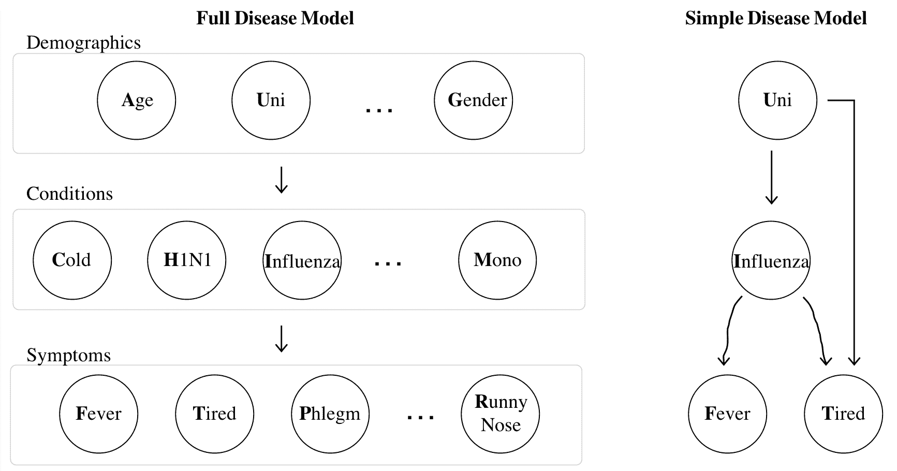

# 贝叶斯网络

> 原文：[`chrispiech.github.io/probabilityForComputerScientists/en/part3/bayesian_networks/`](https://chrispiech.github.io/probabilityForComputerScientists/en/part3/bayesian_networks/)

* * *

在这个阶段，我们已经为分析求解概率开发了工具。我们可以计算随机变量取特定值的可能性，即使它们与其他随机变量相互作用（我们称之为多元模型，或者说随机变量是联合分布的）。我们还开始了对样本和抽样的研究。

以 WebMD 症状检查器为例。WebMD 构建了一个概率模型，其中随机变量大致分为三类：症状、风险因素和疾病。对于任何观察到的症状和风险因素的组合，他们可以计算出任何疾病的概率。例如，他们可以计算我作为一个 21 岁的发烧且疲倦的女性患流感的概率：$P(I = 1 | A = 21, G = 1, T = 1, F = 1)$。或者他们可以计算我作为一个 30 岁流鼻涕的人患感冒的概率：$P(C = 1 | A = 30, R = 1)$。乍一看，这可能并不困难。但随着我们深入挖掘，我们会意识到这有多么困难。有两个挑战：(1) 模型：充分指定概率模型；(2) 推理：计算任何所需的概率。

## 贝叶斯网络

在我们深入探讨如何解决概率（即推理）问题之前，让我们花一点时间回顾一下专家医生如何指定这么多随机变量之间的关系。理想情况下，我们可以让专家坐下来并指定整个“联合分布”（参见关于多元模型的第一讲）。她可以通过写一个包含所有变量的单个方程来实现（这听起来就像是不可能的），或者她可以创建一个联合分布表，其中指定任何可能的变量赋值组合的概率。但事实证明这也不可行。为什么？想象一下，在我们的 WebMD 模型中有$N = 100$个二元随机变量。我们的专家医生将不得不为这些变量的$2^N > 10^{30}$种赋值组合中的每一种指定一个概率，这几乎接近于宇宙中的原子数量。幸运的是，有更好的方法。如果我们知道创建联合赋值的“生成”过程，我们可以简化我们的任务。基于生成过程，我们可以创建一个称为**贝叶斯网络**的数据结构。以下是两个关于疾病的随机变量网络：

对于疾病，影响流是定向的。人口统计随机变量的状态影响某人是否有特定的“条件”，这些条件又影响某人是否表现出特定的“症状”。在右侧是一个只有四个随机变量的简单模型。虽然这是一个不太有趣的模型，但在学习贝叶斯网络时更容易理解。是否在大学（二元）影响某人是否患有流感（二元）。是否患有流感影响某人是否发烧（二元），而大学和流感的状态影响某人是否感到疲倦（也是二元）。

在贝叶斯网络中，从随机变量 $X$ 到随机变量 $Y$ 的箭头表达了我们的假设，即 $X$ 直接影响 $Y$ 的可能性。我们说 $X$ 是 $Y$ 的**父节点**。为了完全定义贝叶斯网络，我们必须提供一种计算每个随机变量（$X_i$）在知道所有父节点取值的情况下概率的方法：$P(X_i = k | \text{Parents of }X_i \text{ take on specified values})$。以下是一个简单疾病模型的定义示例。回想一下，每个随机变量都是二元的：$$\begin{align*} & P(\text{Uni} = 1) = 0.8 \\ & P(\text{Influenza} = 1 | \text{Uni} = 1) = 0.2 && P(\text{Fever} = 1 | \text{Influenza} = 1) = 0.9 \\ & P(\text{Influenza} = 1 | \text{Uni} = 0) = 0.1 && P(\text{Fever} = 1 | \text{Influenza} = 0) = 0.05 \\ & P(\text{Tired} = 1 | \text{Uni} = 0, \text{Influenza} = 0) = 0.1 && P(\text{Tired} = 1 | \text{Uni} = 0, \text{Influenza} = 1) = 0.9 \\ & P(\text{Tired} = 1 | \text{Uni} = 1, \text{Influenza} = 0) = 0.8 && P(\text{Tired} = 1 | \text{Uni} = 1, \text{Influenza} = 1) = 1.0 \end{align*}$$

让我们用编程术语来解释这一点。为了编码贝叶斯网络，我们所需做的所有事情就是定义一个函数：`getProbXi(i, k, parents)`，该函数返回 $X_i$（索引为 `i` 的随机变量）在给定 $X_i$ 的每个父节点值的情况下取值 `k` 的概率：$P(X_i = x_i | \text{Values of parents of }X_i)$

**深入理解**：贝叶斯网络之所以如此有用，是因为“联合”概率可以以指数级减少空间来表示，即每个随机变量在其父节点值条件下的概率的乘积！不失一般性，让 $X_i$ 指第 $i$ 个随机变量（如果 $X_i$ 是 $X_j$ 的父节点，则 $i < j$）：$$\begin{align*} P&(\text{Joint}) = P(X_1 = x_1, \dots, X_n = x_n) = \prod_i P(X_i = x_i | \text{Values of parents of }X_i ) \end{align*}$$贝叶斯网络中隐含了哪些假设？使用链式法则，我们可以分解 $n$ 个随机变量的**精确**联合概率。为了使下面的数学更容易理解，我将使用 $x_i$ 作为 $X_i = x_i$ 事件的简称：$$\begin{align*} P(x_1, \dots, x_n) &= \prod_i P(x_i | x_{i-1}, \dots, x_1)\\ \end{align*}$$通过观察两个方程的差异，我们可以看到贝叶斯网络假设 $$P(x_i | x_{i-1}, \dots, x_1) = P(x_i | \text{Values of parents of }X_i)$$ 这是一个条件独立性声明。它表示，一旦你知道网络中变量 $X_i$ 的父节点值，关于非后裔的任何进一步信息都不会改变你对 $X_i$ 的信念。正式地说，我们说 $X_i$ 在其父节点条件下对其非后裔是条件独立的。那么，非后裔是什么？在一个图中，$X_i$ 的后裔是任何在以 $X_i$ 为起点的子树中的东西。其他所有东西都是非后裔。非后裔包括 $X_i$ 的“祖先”节点，以及与 $X_i$ 完全不相连的节点。在设计贝叶斯网络时，你不必直接考虑这个假设。如果节点之间的箭头遵循因果路径，这个假设自然就是好的。 

## 设计贝叶斯网络

设计贝叶斯网络有几个步骤。

1.  选择你的随机变量，并将它们作为节点。

1.  添加边，通常基于你对哪些节点直接导致其他节点的假设。

1.  为所有节点定义 $P(X_i = x_i | \text{Values of parents of }X_i )$。

如你所猜，我们可以手动完成步骤（2）和（3），或者让计算机根据数据尝试执行这些任务。第一个任务被称为“结构学习”，第二个是“机器学习”的一个实例。结构学习有完全自主的解决方案——但只有在你有大量数据的情况下才能很好地工作。或者，人们通常会计算一个称为相关性的统计量，它是所有随机变量对的统计量，以帮助设计贝叶斯网络的艺术形式。

在下一部分中，我们将讨论如何从数据中学习 $P(X_i = x_i | \text{Values of parents of }X_i )$。现在，让我们从（合理的）假设开始，即专家可以以方程或作为 python 的 `getProbXi` 函数写下这些函数。

## 下一步

太好了！我们有一个可行的方法来定义一个包含大量随机变量的网络。第一个挑战已经完成。我们还没有在贝叶斯网络中讨论连续或多项式随机变量。理论本身并没有变化：专家只需定义`getProbXi`来处理比 0 或 1 更多的`k`值。

贝叶斯网络对我们来说并不很有趣，除非我们能用它来解决不同的条件概率问题。我们如何对一个像贝叶斯网络这么复杂的网络进行“推理”呢？
