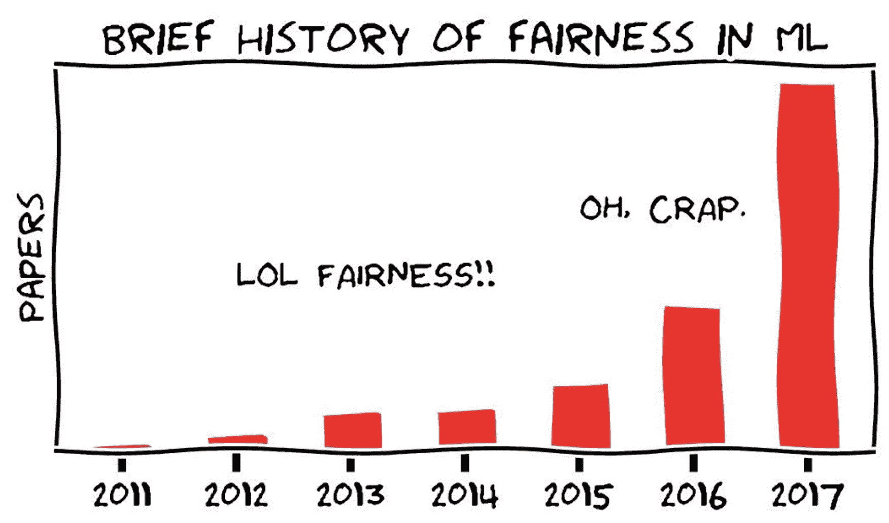

# 人工智能中的公平性

> 原文：[`chrispiech.github.io/probabilityForComputerScientists/en/examples/fairness/`](https://chrispiech.github.io/probabilityForComputerScientists/en/examples/fairness/)

* * *

人工智能常常给人一种客观和“公平”的印象。然而，算法是由人类制作的，并且由可能存在偏见的数据进行训练。有几个部署的人工智能算法的例子已经表明，它们基于性别、种族或其他受保护的群体做出有偏见的决策——即使没有这样的意图。

这些例子也引发了对算法公平性日益增长领域的研究需求。我们如何证明或展示一个算法是以我们认为适当的方式运行的？什么是公平？显然，这些问题很复杂，值得进行深入的讨论。这个例子简单，目的是为了介绍这个话题。

*ML 代表机器学习。Solon Barocas 和 Moritz Hardt，"机器学习中的公平性"，NeurIPS 2017*

## 什么是公平？

将使用人工智能算法来对一个人是否会偿还贷款进行二元预测（$G$ 代表猜测）。问题已经出现：该算法在二元受保护群体（$D$ 代表人口统计）方面是否“公平”？为了回答这个问题，我们将分析算法在历史数据上做出的预测。然后，我们将比较预测与真实结果（$T$ 代表真实）进行比较。考虑以下算法预测历史的联合概率表：

$D=0$

|  | $G=0$ | $G=1$ |
| --- | --- | --- |
| $T=0$ | 0.21 | 0.32 |
| $T=1$ | 0.07 | 0.28 |

$D=1$

|  | $G=0$ | $G=1$ |
| --- | --- | --- |
| $T=0$ | 0.01 | 0.01 |
| $T=1$ | 0.02 | 0.08 |

记住，单元格 $D=i,G=j,T=k$ 包含概率 $\P(D=i,G=j,T=k)$。联合概率表给出了所有事件组合的概率。记住，由于每个单元格都是互斥的，所以 $\sum_i \sum_j \sum_k \P(D=i,G=j,T=k) = 1$。注意，这种互斥的假设对于人口统计变量可能是问题（有些人可能是混血种族等），这给你一个提示，我们只是在公平性的讨论中刚刚触及表面。让我们使用这个联合概率来了解一些公平性的常见定义。

**练习联合边缘化**

$\p(D=0)$ 是什么？$\p(D=1)$ 是什么？

通过一种称为边缘化的过程，可以计算联合分布中随机变量子集的分配的概率：将所有该分配为真的单元格的概率相加。

$$ \begin{align} \p(D=1) &= \sum_{j \in \{0, 1\}} \sum_{k \in \{0, 1\}} \p(D= 1, G= j, T = k)\\ &= 0.01 + 0.01 + 0.02 + 0.08 = 0.12 \end{align} $$ $$ \begin{align} \p(D=0) &= \sum_{j \in \{0, 1\}} \sum_{k \in \{0, 1\}} \p(D= 0, G= j, T = k)\\ &= 0.21 + 0.32 + 0.07 + 0.28 = 0.88 \end{align} $$

注意到 $\p(D=0) + \p(D=1) = 1$。这意味着人口统计变量是互斥的。

**公平性定义 #1：奇偶性**

如果算法做出正预测（$G$ = 1）的概率在条件化人口统计变量时保持不变，则算法满足“奇偶性”。

这个算法是否满足“奇偶性”？

$$ \begin{align} P(G=1|D=1) &= \frac{P(G = 1, D = 1)}{P(D=1)} && \text{条件概率}\\ &= \frac{P(G = 1, D = 1, T= 0) + P(G=1, D = 1, T=1)}{P(D=1)} && \text{概率或}\\ &= \frac{0.01 + 0.08}{0.12} = 0.75 && \text{从联合概率得出} \end{align} $$ $$ \begin{align} P(G=1|D=0) &= \frac{P(G = 1, D = 0)}{P(D=0)} && \text{条件概率}\\ &= \frac{P(G = 1, D = 0, T= 0) + P(G=1, D = 0, T=1)}{P(D=0)} && \text{概率或}\\ &= \frac{0.32 + 0.28}{0.88} \approx 0.68 && \text{从联合概率得出} \end{align} $$

不满足。由于 $P(G=1|D=1) \neq P(G=1|D=0)$，此算法不满足奇偶性。当人口统计指标为 1 时，更可能猜测为 1。

**公平性定义 #2：校准**

如果算法正确（$G=T$）的概率在不受人口统计因素的影响下保持不变，则算法满足“校准”。

这个算法是否满足校准？

当 $P(G = T | D = 0) = P(G = T | D = 1)$ 时，算法满足校准。$$ \begin{align} P(G = T | D = 0) &= P(G = 1, T = 1 | D = 0) + P(G = 0, T = 0 | D = 0)\\ &= \frac{0.28 + 0.21}{0.88} \approx 0.56 \\ P(G = T | D = 1) &= P(G = 1, T = 1 | D = 1) + P(G = 0, T = 0 | D = 1)\\ &= \frac{0.08 + 0.01}{0.12} = 0.75 \end{align} $$ 不满足：$P(G = T | D = 0) \neq P(G = T | D = 1)$

**公平性定义 #3：机会均等**

如果算法预测正结果（$G=1$）的概率在给定结果发生（$T=1$）的情况下不受人口统计因素的影响，则算法满足“机会均等”。

这个算法是否满足“机会均等”？

当 $P(G = 1 | D = 0, T = 1) = P(G = 1 | D = 1, T = 1)$ 时，算法满足“机会均等”。$$ $$\begin{align*} P(G = 1 | D = 1, T = 1) &= \frac{P(G = 1 , D = 1, T = 1)}{P(D = 1, T = 1)}\\ &= \frac{0.08}{0.08 + 0.02} = 0.8 \\ P(G = 1 | D = 0, T = 1) &= \frac{P(G = 1 , D = 0, T = 1)}{P(D = 0, T = 1)}\\ &= \frac{0.28}{0.28 + 0.07} = 0.8 \end{align*}$$ $$ 满足：$P(G = 1 | D = 0, T = 1) = P(G = 1 | D = 1, T = 1)$

哪个定义看起来更正确？实际上，可以证明这三个定义不能同时优化，这被称为[机器公平性的不可能定理](https://arxiv.org/pdf/2007.06024.pdf)。换句话说，我们构建的任何 AI 系统都将不可避免地违反某些公平性概念。关于这个主题的更深入探讨，这里有一份关于最新研究的有用总结[Pessach 等人算法公平性](https://arxiv.org/pdf/2001.09784.pdf)。

## 性别阴影

在 2018 年，Joy Buolamwini 和 Timnit Gebru 在首届机器学习公平性、责任和透明度会议上发表了一项突破性成果，称为“性别阴影” [1]。他们展示了 Facebook、IBM 和 Microsoft 部署的面部识别算法，在观察浅色皮肤男性时比观察深色皮肤女性时在做出预测（在这种情况下是分类性别）方面要好得多。他们的工作揭示了生产级 AI 的几个不足：有偏见的训练数据集、优化平均准确性（这意味着大多数人口统计数据得到最多的权重）、缺乏对交叉性的认识，等等。让我们看看他们的部分结果。

*图由 Joy Buolamwini 和 Timnit Gebru 提供。面部识别算法在观察不同对象时表现差异很大。[1]*

Timnit 和 Joy 研究了三个训练以预测性别的分类器，并计算了几个统计数据。让我们看看其中一个统计数据，即面部识别分类器 IBM 的准确率：

|  | 女性 | 男性 | 深色 | 浅色 |
| --- | --- | --- | --- | --- |
| 准确率 | 79.7 | 94.4 | 77.6 | 96.8 |

使用公平性的语言，准确性度量 $\p(G=T)$。上表中“女性”所在的单元格表示在查看女性照片时的准确性 $\p(G=T|D = \text{女性})$。很容易证明这些生产级系统在“校准”方面非常糟糕：$$\p(G=T|D = \text{女性}) \neq \p(G=T|D = \text{男性})$$ $$\p(G=T|D = \text{浅色}) \neq \p(G=T|D = \text{深色})$$

我们为什么应该关注校准而不是其他公平性的定义？在这种情况下，分类器正在预测性别，其中正预测（例如预测女性）没有直接相关的奖励，就像我们上面的例子中预测某人是否应该获得贷款一样。因此，最显著的想法是：算法对不同性别的准确性是否相同（校准）？

男性/女性和浅色/深色皮肤照片之间的校准不足是一个问题。接下来，Joy 和 Timnit 展示了当查看交叉人口统计特征时，问题变得更加严重。

|  | 深色男性 | 深色女性 | 浅色男性 | 浅色女性 |
| --- | --- | --- | --- | --- |
| 准确率 | 88.0 | 65.3 | 99.7 | 92.9 |

如果算法根据校准是“公平”的，那么你预计准确性将不受人口统计特征的影响而相同。相反，几乎有 34.2 个百分点的差异！$\p(G=T|D = \text{深色女性})$ = 65.3，而 $\p(G=T|D = \text{浅色男性}) = 99.7$

[1] [Buolamwini, Gebru. 性别阴影。2018](http://proceedings.mlr.press/v81/buolamwini18a/buolamwini18a.pdf)

## 前进之路？

[Wadsworth 等人：通过对抗学习实现公平性](http://stanford.edu/~cpiech/bio/papers/fairnessAdversary.pdf)
