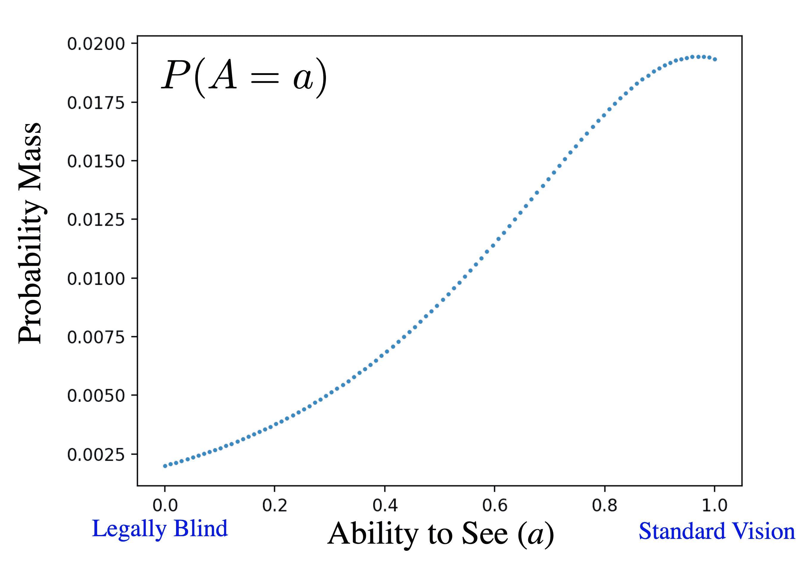
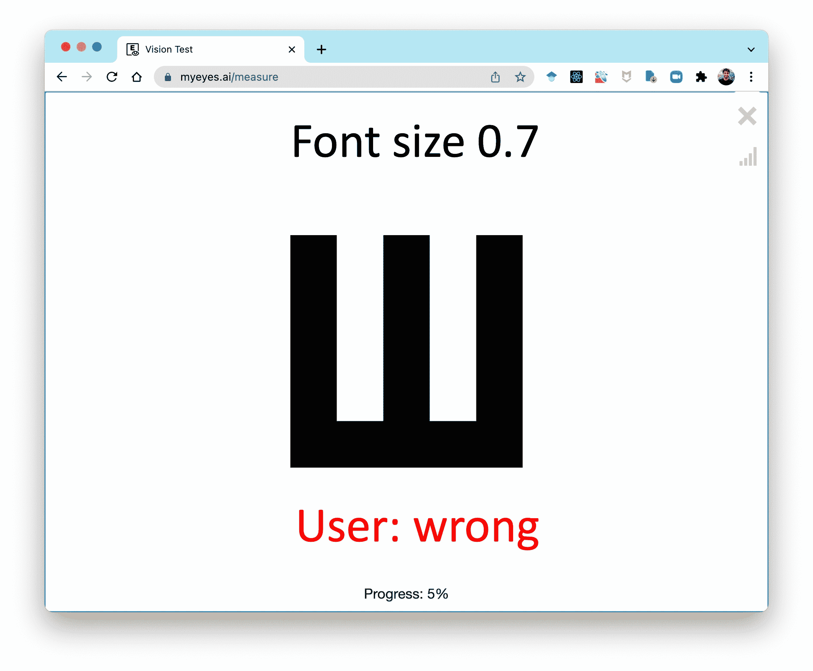
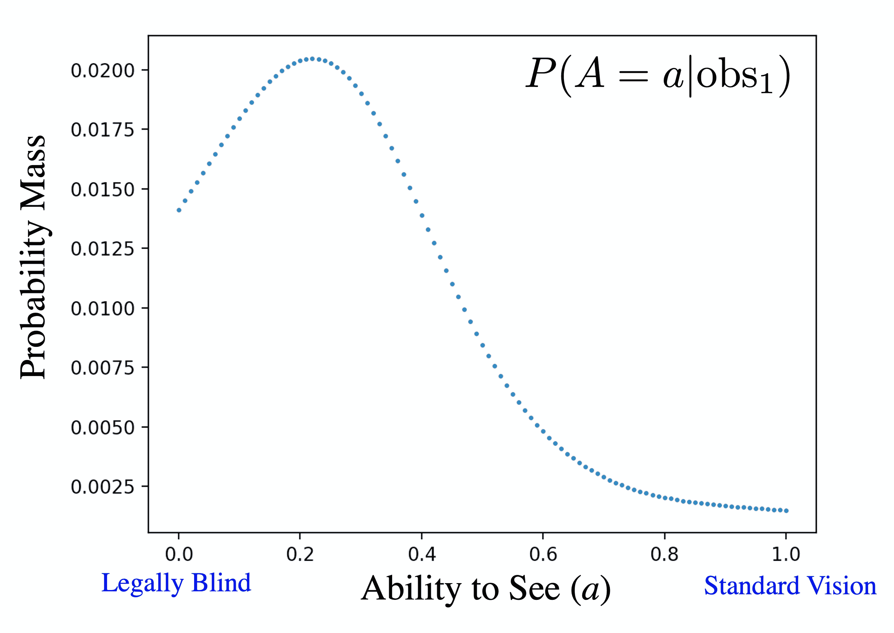

# 数字视力测试

> 原文：[`chrispiech.github.io/probabilityForComputerScientists/en/examples/digital_vision_test/`](https://chrispiech.github.io/probabilityForComputerScientists/en/examples/digital_vision_test/)

* * *

**故事：**这个问题最初是在 2017 年春季的 CS109 期末考试中提出的。这成长为一个与前学生 Ali Malik 以及斯坦福眼科医生 Charles Lin 的合作。我们意识到，这实际上是一种更准确测量视力准确度的方法。这个算法被称为斯坦福视力测试，或 StAT，后来被发表在 AAAI 的文章中，并被《科学》杂志和《柳叶刀》杂志报道。据我们所知，该算法仍然是根据视标测试推断视力能力最准确的方法。

您可以在这里找到斯坦福视力测试的演示：[`myeyes.ai/`](https://myeyes.ai/measure)。注意查看条形图标，以查看随着测试的进行，信念分布如何变化。

*### 数字视力测试

数字视力测试的目标是估计患者视力如何。您可以给患者一系列视力测试，观察他们的反应，然后根据这些反应最终做出诊断。在本章中，我们考虑翻滚 E 任务。患者会看到一个以选定字体大小的 E。E 将随机向上、向下、向左或向右书写，患者必须说出它面向哪个方向。他们的猜测要么是正确的，要么是错误的。患者将有一系列 20 个这样的任务。视力测试对需要眼镜的人很有用，但对于需要密切监测视力微妙下降的眼病患者来说可能至关重要。

数字视力测试中有两个主要任务：(1)根据患者的反应，推断他们的视力，以及(2)选择向患者展示的下一个字体大小。

### 如何表示看的能力？

能力是一个随机变量！我们定义$A$来表示某人看的能力。$A$的值介于 0.0（代表法定盲）和 1.0（代表标准视力）之间。虽然看的能力在理论上是一个连续的随机变量，但我们将看的能力离散化为百分之一。因此，$A \in \{0.00, 0.01, \dots, 0.99\}$。作为一个小插曲，视力可以表示为许多不同的单位（例如，基于对数单位的 LogMAR）。我们选择这个 0 到 1 的刻度，因为它使数学更容易解释。

$A$ 的先验概率质量函数，表示为 $\p(A=a)$，代表我们在看到任何关于患者的观测之前，对 $A$ 取值为 $a$ 的信念。这种先验信念来自人们视力自然分布的情况。为了使我们的算法最准确，先验应该最好地反映我们的患者群体。由于我们的眼科测试是为眼科医院的医生设计的，我们使用了眼科医院的历史数据来构建我们的先验。以下是 $P(A=a)$ 的图表表示：



*关于视力能力的先验信念*

这里是将相同的概率质量函数以表格形式呈现。之所以能够以表格形式呈现，是因为我们选择将 $A$ 离散化。在代码中，我们可以通过字典查找访问 $\p(A=a)$，即 `belief[a]`，其中 `belief` 存储整个概率质量函数：

| $a$ | $\P(A=a)$ |  | $a$ | $\P(A=a)$ |  | $a$ | $\P(A=a)$ |
| --- | --- | --- | --- | --- | --- | --- | --- |
| 0.00 | 0.0020 |  | 0.20 | 0.0037 |  | $\cdots$ |
| 0.01 | 0.0021 |  | 0.21 | 0.0038 |  | 0.81 | 0.0171 |
| 0.02 | 0.0021 |  | 0.22 | 0.0040 |  | 0.82 | 0.0173 |
| 0.03 | 0.0022 |  | 0.23 | 0.0041 |  | 0.83 | 0.0175 |
| 0.04 | 0.0023 |  | 0.24 | 0.0042 |  | 0.84 | 0.0177 |
| 0.05 | 0.0023 |  | 0.25 | 0.0043 |  | 0.85 | 0.0180 |
| 0.06 | 0.0024 |  | 0.26 | 0.0045 |  | 0.86 | 0.0181 |
| 0.07 | 0.0025 |  | 0.27 | 0.0046 |  | 0.87 | 0.0183 |
| 0.08 | 0.0026 |  | 0.28 | 0.0048 |  | 0.88 | 0.0185 |
| 0.09 | 0.0026 |  | 0.29 | 0.0049 |  | 0.89 | 0.0186 |
| 0.10 | 0.0027 |  | 0.30 | 0.0050 |  | 0.90 | 0.0188 |
| 0.11 | 0.0028 |  | 0.31 | 0.0052 |  | 0.91 | 0.0189 |
| 0.12 | 0.0029 |  | 0.32 | 0.0054 |  | 0.92 | 0.0190 |
| 0.13 | 0.0030 |  | 0.33 | 0.0055 |  | 0.93 | 0.0191 |
| 0.14 | 0.0031 |  | 0.34 | 0.0057 |  | 0.94 | 0.0192 |
| 0.15 | 0.0032 |  | 0.35 | 0.0058 |  | 0.95 | 0.0192 |
| 0.16 | 0.0033 |  | 0.36 | 0.0060 |  | 0.96 | 0.0192 |
| 0.17 | 0.0034 |  | 0.37 | 0.0062 |  | 0.97 | 0.0193 |
| 0.18 | 0.0035 |  | 0.38 | 0.0064 |  | 0.98 | 0.0192 |
| 0.19 | 0.0036 |  | 0.39 | 0.0066 |  | 0.99 | 0.0192 |

### 观测值

当患者开始测试时，你将开始收集观测值。考虑这个第一个观测值 $\text{obs}_1$，其中患者被展示了一个字体大小为 0.7 的字母，并回答了问题错误：



我们可以用字体大小和正确性来表示这个观测值。从数学上讲，这可以写成 $\text{obs}_1 = [0.7, \text{False}]$。在代码中，这个观测值可以存储为字典

```py
obs_1 = {
   "font_size":0.7,
   "is_correct":False
}
```

最终我们将有 20 个这样的观测值：$[\text{obs}_1, \text{obs}_2, \dots, \text{obs}_{20}]$。

### 推断能力

我们的首要任务是编写代码，根据观察结果更新我们的 $A$ 的概率质量函数。首先，让我们考虑如何根据单个观察结果 $\text{obs}$（顺便说一句：形式上这是随机变量 $\text{Obs}$ 取值为 $\text{obs}$ 的事件）更新我们对视觉能力的信念。我们可以使用 随机变量的贝叶斯定理：$$\begin{align*} \P(A=a|\text{obs}) &= \frac{\P(\text{obs}|A=a)P(A=a)}{\P(\text{obs})}\end{align*}$$ 这将在对视觉能力的每个赋值 $a$ 的 `for` 循环内部进行计算。我们如何计算贝叶斯定理表达式中每个项？我们已经有先验 $\p(A=a)$ 的值，我们可以使用全概率公式计算分母 $\p(\text{obs})$：$$\begin{align*} \P(\text{obs}) &= \sum_x \P(\text{obs}, A=x) && \href{ ../../part1/law_total/}{\text{LOTP}} \\ &= \sum_x P(\text{obs} | A=x)P(A=x)&&\text{链式法则} \end{align*}$$ 注意到这个新的 $\p(\text{obs})$ 表达式中的项已经出现在贝叶斯定理方程的分子中。因此，在代码中我们将（1）为每个 $a$ 的值计算分子，将其存储为信念的值，（2）计算所有这些项的总和，（3）将每个信念值除以总和。执行步骤 2 和 3 的过程也被称为归一化：

```py
def update_belief(belief, obs):
    """
    Take in a prior belief (stored as a dictionary) for a random 
    variable representing how well someone can see based on a single
    observation (obs). Update the belief based using Bayes' Theorem
    """
    # loop over every value in the support of the belief RV
    for a in belief:
        # the prior belief P(A = a)
        prior_a = belief[a]
        # the obs probability P(obs | A = a)
        likelihood = calc_likelihood(a, obs)
        # numerator of Bayes' Theorem
        belief[a] = prior_a * likelihood
    # calculate the denominator of Bayes' Theorem
    normalize(belief)

  def normalize(belief):
    # in place normalization of a belief dictionary
    total = belief_sum(belief)
    for key in belief:
        belief[key] /= total

  def belief_sum(belief):
    # get the sum of probability mass for a discrete belief
    total = 0
    for key in belief:
        total += belief[key]
    return total
```

在这一点上，我们有一个表达式和相应的代码来更新我们对给定观察到的视觉能力的信念。然而，我们**缺少**一种计算 $\p(\text{obs}|A=a)$ 的方法。在我们的代码中，这个表达式是当前未定义的 `calc_likelihood(a, obs)` 函数。在下一节中，我们将介绍如何计算这个“似然”函数。在这样做之前，让我们看看应用 `update_belief` 对一个具有上述单个观察结果 `obs_1` 的患者的结果的例子。

`obs_1` 表示这位患者识别了一个相当大的字母（字体大小为 0.7）错误。因此，在我们的后验中，我们认为他们视力不佳，尽管我们有很多不确定性，因为只有一次观察。这种信念在我们的更新后的概率质量函数 $A$，$\p(A = a | \text{obs}_1)$，称为后验中得到了表达。以下是 `obs_1` 的后验看起来像什么。请注意，后验 $\p(A=a|\text{obs}_1)$ 仍然像先验 $\p(A=a)$ 一样用字典表示：



*患者识别字体大小为 0.7 的字母错误时，对视觉能力的后验信念表明患者视力不佳。*

### 似然函数

我们还没有完成！我们还没有说明我们将如何计算 $\p(\text{obs}|A=a)$。在贝叶斯定理中，这个术语被称为“似然”。我们眼科检查的似然将是一个函数，它返回输入 $a$ 和 $\text{obs}$ 的概率。在 Python 中，这将是一个函数 `calc_likelihood(a, obs)`。在这个函数中，`obs` 是一个单独的观察值，如上面描述的 `obs_1`。想象一下对似然函数的具体调用。这个调用将返回一个具有 0.5 真实视力的人得到字体大小为 0.7 的信件错误的概率。

```py
# get an observation
obs = {
  "font_size":0.7,
  "is_correct":False
}
# calculate likelihood for obs given a, P(obs | A = a)
calc_likelihood(a = 0.5, obs)
```

在继续之前，让我们对似然函数做两个关键的说明：

**注意 1**：在计算似然项 $\p(\text{obs}|A=a)$ 时，我们不需要估计 $A$，因为它出现在条件式的右侧。在似然项中，我们被告知 *确切地* 了解一个人的视力有多好。他们的视力确实是 $a$。不要被 $a$ 是一个（非随机）变量的事实所迷惑。在计算似然函数时，这个变量将有一个数值。

**注意 2**：变量 `obs` 代表一次单独的患者互动。它包含两部分：字体大小和一个布尔值，表示患者是否正确地收到了信件。然而，我们认为字体大小不是一个随机变量。相反，我们认为它是一个由计算机固定的常数。因此，$\p(\text{obs}|A=a)$ 可以简化为 $\p(\text{correct}|A=a)$。"correct" 是指随机变量 Correct 取 `True` 或 `False` 值的事件：$$\begin{align*} \p(&\text{obs}|A=a) \\ &= \p(\text{correct}, f|A=a) && \text{obs 是一个元组} \\ &= \p(\text{correct}|A=a) && f \text{ 是一个常数} \end{align*}$$

定义似然函数 $\p(\text{correct}|A=a)$ 涉及更多的医学和教育理论，而不是概率理论。你不需要为这门课程了解这些！但了解这些仍然很有趣，而且没有似然函数，我们不会有完整的代码。所以，让我们深入探讨。

视力测试似然函数的一个非常实用的起点来自一个经典的教育模型，称为 "[项目反应理论](https://en.wikipedia.org/wiki/Item_response_theory)"，也称为 IRT。IRT *假设* 一个能力为 $a$ 的学生得到难度为 $d$ 的问题正确的概率是由一个容易计算的函数控制的：$$\begin{align*} \p(&\text{Correct} = \text{True}|a) \\ &= \text{sigmoid}(a-d) && d \text{ 是难度} \\ &= \frac{1}{1+e^{-(a-d)}} \\ \end{align*}$$ 其中 $e$ 是 [自然对数底数](https://en.wikipedia.org/wiki/E_(mathematical_constant)) 常数，$\text{sigmoid}(x) = \frac{1}{1+e^{-x}}$。[Sigmoid 函数](https://en.wikipedia.org/wiki/Sigmoid_function) 是一个方便的函数，它接受任何实数值输入，并返回一个在 $[0, 1]$ 范围内的对应值。

这个 IRT 模型引入了一个新的常数：字母的难度$d$。正确响应给定字号的字母有多难？在考虑大字号比小字号更容易的情况下，建模难度的最简单方法是将字号为$f$的字母的难度定义为$d = 1-f$。将这个值代入：$$\begin{align*} \p(&\text{Correct} = \text{True}|a)\\ &= \text{sigmoid}(a-[1-f])\\ &= \text{sigmoid}(a-1+f)\\ &= \frac{1}{1+e^{-(a-1+f)}} \end{align*}$$ 现在我们有一个完整、尽管简单化的似然函数！在代码中，它看起来会是这样：

```py
def calc_likelihood(a, obs):
    # returns P(obs | A = a) using Item Response Theory
    f = obs["font_size"]
    p_correct_true = sigmoid(a + f - 1)
    if obs["is_correct"]:
        return p_correct_true
    else:
        return 1 - p_correct_true

def sigmoid(x):
    # the classic squashing function. All outputs are [0,1]
    return 1 / (1 + math.exp(-x)) 
```

注意，项目反应理论返回患者回答字母正确答案的概率。在上面的代码中，注意如果患者猜错了字母，我们会做什么：$$\p(\text{Correct} = \text{False}|a,f) = 1-\p(\text{Correct} = \text{True}|a,f)$$

在斯坦福视力测试的出版版本中，我们在几个方面扩展了项目反应理论。我们有一个表示患者通过随机猜测得到正确答案的概率的项，以及一个表示即使他们知道正确答案也会犯错误（即“失误”）的项。我们还观察到，底限指数函数似乎比 sigmoid 函数更准确。这些扩展超出了本章的范围，因为它们不是概率洞察的核心。更多细节请参阅原始论文[1]。

### 多次观察

如果你有多次观察呢？对于多次观察，唯一会改变的是似然项$\p(\text{Observations}|A=a)$。我们假设每个观察都是独立的，条件是能够看到。形式上 $$\p(\text{obs}_1, \dots, \text{obs}_{20} |A=a) = \prod_i \p(\text{obs}_i|A=a)$$ 因此，所有观察的似然将是每个观察自身似然的乘积。这在数学上等同于计算一个观察的后验，并将后验作为新的先验。

### 完整代码

这里是给定观察推断视力能力的完整代码，不包括用户界面函数和先验信念的文件读取：

```py
 def main():
    """
    Compute your belief in how well someone can see based 
    off an eye exam with 20 questions at different fonts
    """
    belief_a = load_prior_from_file()
    observations = get_observations()
    for obs in observations:
        update_belief(belief_a,obs)
    plot(belief_a)

def update_belief(belief, obs):
    """
    Take in a prior belief (stored as a dictionary) for a random 
    variable representing how well someone can see based on a single
    observation (obs). Update the belief based using Bayes' Theorem
    """
    # loop over every value in the support of the belief RV
    for a in belief:
        # the prior belief P(A = a)
        prior_a = belief[a]
        # the obs probability P( obs | A = a)
        likelihood = calc_likelihood(a, obs)
        # numerator of Bayes' Theorem
        belief[a] = prior_a * likelihood
    # calculate the denominator of Bayes' Theorem
    normalize(belief)

def calc_likelihood(a, obs):
    # returns P(obs | A = a) using Item Response Theory
    f = obs["font_size"]
    p_correct = sigmoid(a + f - 1)
    if obs["is_correct"]:
        return p_correct
    else:
        return 1 - p_correct

# ----------- Helper Functions -----------

def sigmoid(x):
    # the classic squashing function. All outputs are [0,1]
    return 1 / (1 + math.exp(-x))

def normalize(belief):
    # in place normalization of a belief dictionary
    total = belief_sum(belief)
    for key in belief:
        belief[key] /= total

def belief_sum(belief):
    # get the sum of probability mass for a discrete belief
    total = 0
    for key in belief:
        total += belief[key]
    return total
```

### 选择下一个字号

在这一点上，我们已经找到了一种方法来计算在任何测试点我们对患者视力好坏信念的概率质量函数。这为我们留下了一个额外的任务：在数字视力测试中，我们需要为患者选择下一个要显示的字体大小。而不是展示一个预定的集合，我们应该根据我们对患者视力好坏的当前信念做出选择。我们受到了汤普森抽样的启发，这是一种能够平衡探索不确定性和聚焦于你最自信信念的算法。在选择字体大小时，我们只是从我们的当前信念 $A$ 中抽取一个样本，然后选择我们认为具有该样本值能力的人能够以 80% 的准确率看到的字体大小。我们选择 80% 的常数，以便视力测试不会过于痛苦。

从这个应用中得出的一个有趣的结论是，有许多问题你可以从这门课程中学到知识，并改进当前的技术状态！通常最具创造性的任务是认识到在哪里可以有效地应用基于计算机的概率。即使是对于视力测试，这也不是故事的结束。从 CS109 开始的斯坦福视力测试只是通往更精确数字视力测试旅程中的一步。./总是有更好的方法。有什么想法吗？

* * *

发表物和新闻报道：

| [1] | [斯坦福视力测试：一种使用贝叶斯技术和人类视觉反应发现的精确视力测试](https://ojs.aaai.org/index.php/AAAI/article/view/5384/5240). 人工智能协会 |
| --- | --- |
| [2] | [数字化视力测试](https://www.thelancet.com/journals/lancet/article/PIIS0140-6736(21)02149-8/fulltext). 《柳叶刀》杂志。 |
| [3] | [眼，机器人：人工智能显著提高了经典视力检查的准确性](https://www.science.org/content/article/eye-robot-artificial-intelligence-dramatically-improves-accuracy-classic-eye-exam). 《科学》杂志。 |

特别感谢共同发明斯坦福视力测试的 Ali Malik*。
