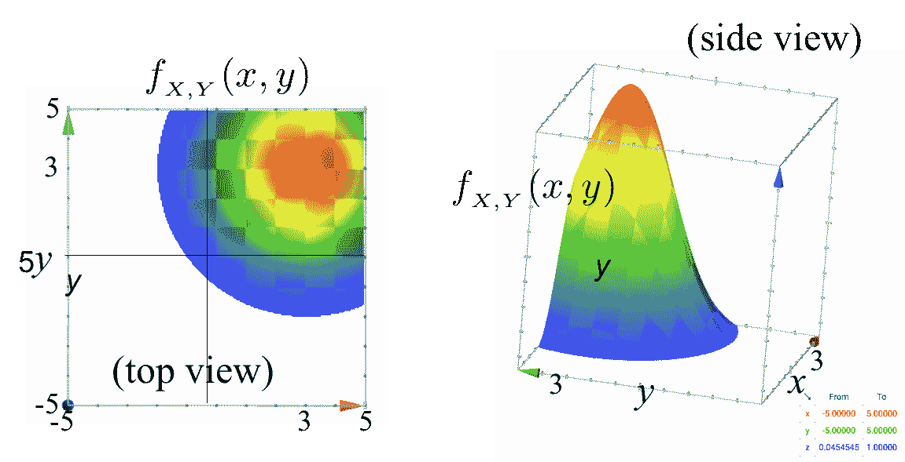
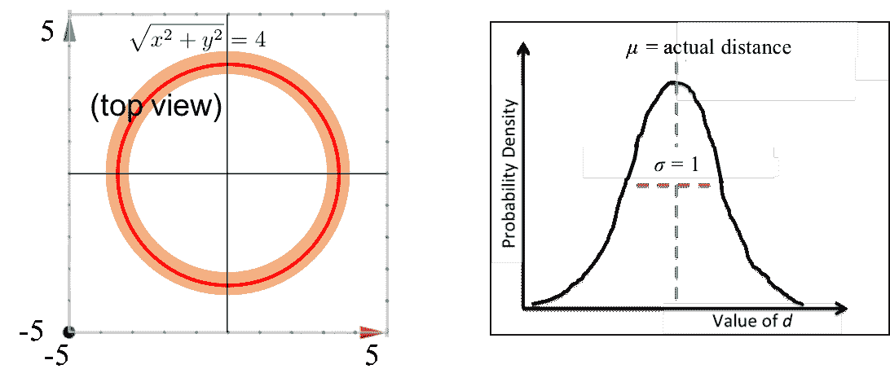
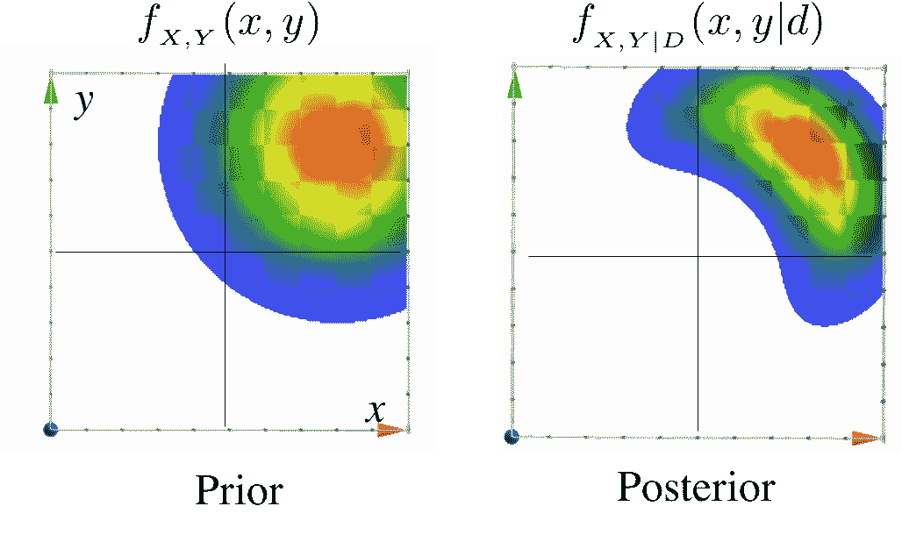

# 二维跟踪

> 原文：[`chrispiech.github.io/probabilityForComputerScientists/en/examples/tracking_in_2D/`](https://chrispiech.github.io/probabilityForComputerScientists/en/examples/tracking_in_2D/)

* * *

**警告：** 在学习联合分布和推理之后，你已经拥有了跟随本例所需的所有技术能力。然而，这非常非常困难。主要是因为你需要同时理解三个复杂的东西：(1) 如何表示连续联合分布，(2) 概率模型中的推理，以及 (3) 相当复杂的观察概率计算。

在本例中，我们将探讨在二维空间中跟踪一个物体的难题。该物体存在于某个 $(x, y)$ 位置，但我们不确定确切的位置！因此，我们将使用随机变量 $X$ 和 $Y$ 来表示位置。 $$\begin{align*} f(X = x, Y = y) &= f(X = x) \cdot f(Y = y) && \text{在先验中 X 和 Y 是独立的} \\ &= \frac{1}{\sqrt{2 \cdot 4 \cdot \pi}}\cdot e ^{-\frac{(x-3)²}{2 \cdot 4}} \cdot \frac{1}{\sqrt{2 \cdot 4 \cdot \pi}}\cdot e ^{-\frac{(y-3)²}{2 \cdot 4}} && \text{使用正态分布的 PDF 公式} \\ &= K_1 \cdot e ^{-\frac{(x-3)² + (y-3)²}{8}} && \text{所有常数都放入 } K_1 \end{align*}$$ 这种正态分布的组合称为二元分布。以下是先验 PDF 的可视化。 

跟踪一个物体的有趣之处在于根据观察更新你对它位置的信念的过程。比如说，我们从位于原点的声纳设备中获取了一个仪器读数。仪器报告说物体距离为 4 个单位。我们的仪器并不完美：如果真实距离是$t$个单位，那么仪器给出的读数将服从均值为$t$、方差为 1 的正态分布。让我们可视化这个观察结果：基于我们对先验信息噪声的了解，我们可以计算在给定物体真实位置$X$、$Y$的情况下，看到特定距离读数$D$的条件概率。如果我们知道物体位于$(x, y)$的位置，我们可以计算出到原点的真实距离$\sqrt{x² + y²}$，这将给出仪器高斯分布的均值：$$\begin{align*} f(D = d | X = x, Y = y) &= \frac{1}{\sqrt{2 \cdot 1 \cdot \pi}}\cdot e ^{-\frac{\big(d-\sqrt{x² + y²}\big)²}{2 \cdot 1}} && \text{正态概率密度函数，其中 } \mu = \sqrt{x² + y²} \\ &= K_2\cdot e ^{-\frac{\big(d-\sqrt{x² + y²}\big)²}{2 \cdot 1}} && \text{所有常数都放入 } K_2 \end{align*}$$那么，我们尝试用实际数字来验证一下。假设物体的位置在$(1, 1)$，仪器读数 1 比 2 更有可能吗？$$\begin{align*} \frac{f(D = 1 | X = 1, Y = 1)}{f(D = 2 | X = 1, Y = 1) } &= \frac {K_2\cdot e ^{-\frac{\big(1-\sqrt{1² + 1²}\big)²}{2 \cdot 1}}} {K_2\cdot e ^{-\frac{\big(2-\sqrt{1² + 1²}\big)²}{2 \cdot 1}}} && \text{将条件概率密度函数 D 代入}\\ &= \frac {e ⁰} {e^{-1/2}} \approx 1.65 && \text{注意$K_2$如何相互抵消} \end{align*}$$在这个阶段，我们有一个先验信念和一个观察结果。我们希望根据这个观察结果计算一个更新的信念。这是一个经典的贝叶斯公式场景。我们使用联合连续变量，但这并不会使数学变得复杂多少，只是意味着我们将处理密度而不是概率：$$\begin{align*} f&(X =x, Y =y | D =4) \\ &= \frac{f(D = 4| X = x, Y =y) \cdot f(X = x, Y = y)}{f(D =4)} && \text{使用密度进行贝叶斯计算}\\ &= \frac{K_1 \cdot e^{-\frac{[4 - \sqrt{x² + y²})²]}{2}} \cdot K_2 \cdot e^{-\frac{[(x - 3)² + (y - 3)²]}{8}}}{f(D = 4)} && \text{代入}\\ &= \frac{K_1 \cdot K_2}{ { f(D =4)}} \cdot e ^{-\big[\frac{[4 - \sqrt{x² + y²})²]}{2} + \frac{[(x - 3)² + (y - 3)²]}{8} \big]} && \text{$f(D=4)$相对于$(x,y)$是常数}\\ &= K_3 \cdot e ^{-\big[\frac{(4 - \sqrt{x² + y²})²}{2} + \frac{[(x - 3)² + (y - 3)²]}{8} \big]} && \text{$K_3$是新的常数} \end{align*}$$哇！这看起来像是一个非常有趣的函数！你已经成功计算了更新的信念。让我们看看它是什么样子。这是一个图，左边是我们的先验，右边是我们的后验：多么美丽啊！它就像是一个二维正态分布与一个圆的结合。但是等等，那个常数怎么办！我们不知道$K_3$的值，但这不是问题，原因有两个：第一个原因是，如果我们想要计算两个位置的相对概率，$K_3$将会相互抵消。第二个原因是，如果我们真的想知道$K_3$的值，我们可以解出它。这种数学在数百万个应用中每天都在使用。如果有多个观察结果，方程会变得非常复杂（甚至比这个还要复杂）。为了表示这些复杂函数，通常使用一个叫做粒子滤波的算法。
