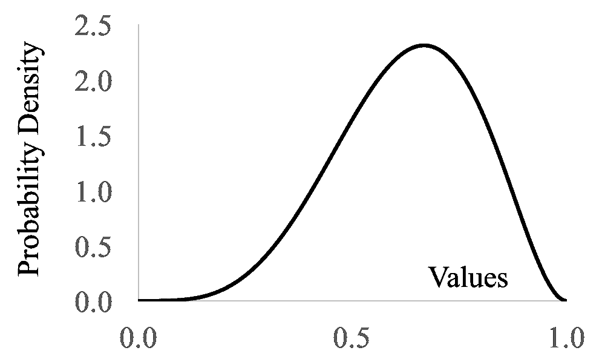

# 贝塔分布

> 原文：[`chrispiech.github.io/probabilityForComputerScientists/en/part4/beta/`](https://chrispiech.github.io/probabilityForComputerScientists/en/part4/beta/)

* * *

贝塔分布是最常被用作概率分布的分布。在本节中，我们将非常元地讨论我们如何表示概率。到目前为止，概率只是 0 到 1 范围内的数字。然而，如果我们对我们的概率有不确定性，那么用随机变量来表示我们的概率（从而表达我们信念的相对可能性）是有意义的。

**贝塔随机变量**

| 符号： | $X \sim \Beta(a, b)$ |
| --- | --- |
| 描述： | 在观察到 $a-1$ 次成功和 $b-1$ 次失败后，对二项分布中概率 $p$ 的值的一个信念分布。 |
| 参数： | $a > 0$，成功次数加 1 $b > 0$，失败次数加 1 |
| 支持集： | $x \in [0, 1]$ |
| PDF 方程： | $f(x) = B(a,b) \cdot x^{a-1} \cdot (1-x)^{b-1}$ 其中 $B(a,b) = \frac{\Gamma(a)\Gamma(b)}{\Gamma(a+b)}$ |
| CDF 方程： | 没有封闭形式 |
| 期望： | $\E[X] = \frac{a}{a+b}$ |
| 方差： | $\var(X) = \frac{ab}{(a+b)²(a+b+1)}$ |
| PDF 图： |

参数 $a$：参数 $b$：

<canvas id="betaPdf" style="max-height: 400px"></canvas>

## 在 10 次抛掷中观察到 9 次正面后，你对 $p$ 的信念是什么？

假设我们有一枚硬币，我们想知道它出现正面的真实概率 $p$。我们抛掷硬币 10 次，观察到 9 次正面和 1 次反面。基于这个证据，你对 $p$ 的信念是什么？根据概率的定义，我们可以猜测 $p\approx\frac{9}{10}$。这个数字是一个非常粗略的估计，特别是因为它只基于 10 次抛掷硬币。此外，“点值” $\frac{9}{10}$ 没有能力表达它的不确定性。

我们能否有一个随机变量来表示真实概率？形式上，让 $X$ 表示硬币出现正面的真实概率。我们不使用 $P$ 符号表示随机变量，所以 $X$ 将会使用。如果 $X = 0.7$，则正面的概率是 0.7。$X$ 必须是一个支持集为 $[0, 1]$ 的连续随机变量，因为概率是连续值，必须在 0 和 1 之间。

在抛掷硬币之前，我们可以说我们对硬币出现正面的概率的信念是均匀的：$X \sim \Uni(0, 1)$。设 $H$ 为观察到的正面次数的随机变量，设 $T$ 为观察到的反面次数的随机变量。$\P(X =x | H = 9, T = 1)$ 是多少？

这个概率很难想象！然而，用条件反转来推理概率要容易得多：$P(H = 9, T = 1 | X= x)$。这个术语提出了一个问题：在正面出现的真实概率为 $x$ 的情况下，10 次抛硬币中出现 9 个正面和 1 个反面的概率是多少？请你自己证明这个概率只是一个二项概率质量函数，其中 $n=10$ 次实验，$p=x$，在 $k=9$ 个正面处评估：$$ P(H = 9, T = 1 | X= x) = {10 \choose 9}x^{9} (1-x)^{1} $$

我们遇到了一个完美的随机变量 贝叶斯定理 的场景。我们知道一个方向上的条件概率，但我们想了解另一个方向：$$\begin{align*} f(&X = x|H =9, T=1) \\ &= \frac{P(H =9, T=1|X=x) \cdot f(X=x)}{P(H =9, T=1)} && \text{贝叶斯定理}\\ &= \frac{ {10 \choose 9} x^{9} (1-x)^{1} \cdot f(X=x)}{P(H =9, T=1)} && \text{二项概率质量函数}\\ &= \frac{ {10 \choose 9} x^{9} (1-x)^{1} \cdot 1}{P(H =9, T=1)} && \text{均匀概率密度函数}\\ &= \frac{ {10 \choose 9} }{P(H =9, T=1)} x^{9} (1-x)^{1} && \text{常数移到前面}\\ &= K \cdot x^{9} (1-x)^{1} && \text{重命名常数}\\ \end{align*}$$

让我们来看看那个函数。目前我们可以让 $K = 110$。无论 $K$ 的值如何，我们都会得到相同的形状，只是进行了缩放：

<canvas id="betaPdf9heads" style="max-height: 400px"></canvas>

这是一个多么美丽的图像。它告诉我们相对似然与控制我们抛硬币的概率之间的关系。以下是该图表的一些观察结果：

1.  即使只有 10 次抛硬币，我们也非常有信心，真实概率大于 0.5。

1.  $X=0.9$ 发生的概率几乎是 $X=0.6$ 的 10 倍。

1.  $f(X=1) = 0$，这是有道理的。如果正面的概率是 1，我们怎么可能抛出那个一个反面呢？

***等等，为什么？***

在上述 $f(X = x|H =9, T=1)$ 的推导中，我们提出了 $P(H =9, T=1)$ 是一个常数的说法。很多人觉得这很难相信。为什么是这样呢？

将 $P(H =9, T=1)$ 与 $P(H =9, T=1 | X= x)$ 并列起来可能会有所帮助。后者说的是“在真实概率为 $x$ 的情况下，9 个正面的概率是多少”。前者说的是“在所有可能的 $x$ 分配下，9 个正面的概率是多少”。如果你想要计算 $P(H =9, T=1)$，你可以使用全概率公式：$$\begin{align*} P(&H =9, T=1) \\ &= \int_{y=0}^{1} P(H =9, T=1 | X= y) f(X=y) \end{align*}$$ 这是一个很难计算的数字，但实际上它是一个与 $x$ 无关的常数。

## 贝塔推导

让我们使用 $h$ 表示观察到的正面数量，$t$ 表示观察到的反面数量，将上一节中的推导进行推广。

如果我们让 $H =h $ 表示观察到 $h$ 个正面，让 $T=t$ 表示在 $h+t$ 次抛硬币中观察到 $t$ 个反面。我们想要计算概率密度函数 $f(X=x|H=h,T=t)$。我们可以使用完全相同的步骤序列，从贝叶斯定理开始：$$\begin{align*} f(&X = x|H =h, T=t) \\ &= \frac{P(H =h, T=t|X=x)f(X=x)}{P(H =h, T=t)} && \text{贝叶斯定理}\\ &= \frac{ { {h+t} \choose h} x^h(1-x)^t}{P(H =h, T=t)} && \text{二项概率质量函数，均匀概率密度函数}\\ &= \frac{ { {h+t} \choose h}}{P(H =h, T=t)}x^h(1-x)^t && \text{移项}\\ &= \frac{1}{c} \cdot x^h(1-x)^t && \text{其中 } c = \int_0¹ x^h(1-x)^t dx \end{align*}$$

当我们使用贝叶斯方法来估计概率时，得到的方程定义了一个概率密度函数，从而定义了一个随机变量。这个随机变量被称为贝塔分布，其定义如下：

对于 $X \sim \Beta(a,b)$ 的概率密度函数（PDF）如下：$$\begin{align*} f(X=x) = \begin{cases} \frac{1}{B(a,b)}x^{a-1}(1-x)^{b-1} &\mbox{if } 0 < x < 1 \\ 0 & \mbox{otherwise} \end{cases} &&\mbox{where } B(a,b) = \int_0¹x^{a-1}(1-x)^{b-1}dx \end{align*}$$贝塔分布的期望值 $E[X] = \frac{a}{a + b}$ 和方差 $Var(X) = \frac{ab}{(a+b)²(a+b+1)}$。所有现代编程语言都有用于计算贝塔累积分布函数（CDF）的包。在 CS109 中，我们不会要求手动计算 CDF。

为了模拟我们对硬币出现正面的概率的估计：设 $a = h + 1$ 和 $b = t + 1$。贝塔分布被用作随机变量，以表示在估计抛硬币之外的概率信念分布。例如，也许一种药物已经给过 6 名患者，其中 4 名已被治愈。我们可以将我们对药物治愈患者概率的信念表达为 $X \sim \Beta(a=5,b=3)$：

注意，对于治愈患者的概率，最可能的信念是 $4/6$，即治愈患者的比例。这个分布表明，我们持有非零信念，认为概率可能不是 $4/6$。概率为 0.01 或 0.09 的可能性不大，但概率为 0.5 的可能性相当合理。

## 贝塔分布作为先验

你可以将 $X \sim \Beta(a, b)$ 设置为先验，以反映你认为在抛硬币之前硬币的偏差。这是一个主观判断，代表了 $a+b- 2$ 个“想象”试验，其中 $a-1$ 个正面和 $b-1$ 个反面。如果你观察到 $h + t$ 个实际试验，其中 $h$ 个正面，你可以更新你的信念。你的新信念将是，$X \sim \Beta(a+h, b+t)$。使用先验 $\Beta(1,1) = \Uni(0, 1)$ 等同于说我们没有看到任何“想象”试验，因此先验地我们对硬币一无所知。这里是对先验也是贝塔分布时 $X$ 分布的证明：

如果我们的先验信念是 $X \sim \Beta(a, b)$，那么我们的后验是 $\Beta(a+h, b+t)$：$$\begin{align*} f(&X = x|H =h, T=t) \\ &= \frac{P(H =h, T=t|X=x)f(X=x)}{P(H =h, T=t)} && \text{贝叶斯定理}\\ &= \frac{ { {h+t} \choose h} x^h(1-x)^t \cdot \frac{1}{c} \cdot x^{a-1}(1-x)^{b-1} } {P(H =h, T=t)} && \text{Beta PMF, Uniform PDF}\\ &= K \cdot x^h(1-x)^t \cdot x^{a-1}(1-x)^{b-1} && \text{Combine Constants}\\ &= K \cdot x^{a+h-1}(1-x)^{b+t-1} && \text{Combine Like Bases}\\ \end{align*}$$ 这就是 $\Beta(a+h, b+t)$ 的概率密度函数。

如果我们有一个贝塔先验信念，那么我们的后验信念也是贝塔，这非常方便。在代码和证明中，如果随着时间的推移你需要对信念进行多次更新，贝塔分布特别方便。这种在观察前后分布类型保持不变的性质被称为共轭先验。

快速问题：你能否随意构造先验和想象中的试验？有些人认为这没问题（他们被称为贝叶斯主义者），有些人认为你不应该构造先验信念（他们被称为频率主义者）。一般来说，对于小数据集，如果你能够提出一个好的先验信念，这将使你更擅长做出预测。

观察：贝塔先验和均匀先验（我们最初使用的）之间有一个深刻的联系。结果是 $\Beta(1,1) = \Uni(0,1)$。回想一下，$\Beta(1,1)$ 表示没有想象中的正面和没有想象中的反面。
