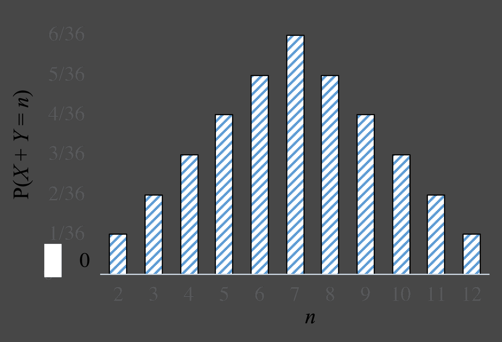

# 添加随机变量

> 原文：[`chrispiech.github.io/probabilityForComputerScientists/en/part4/summation_vars/`](https://chrispiech.github.io/probabilityForComputerScientists/en/part4/summation_vars/)

* * *

在本节关于不确定性理论中，我们将探讨概率论中的某些重要结果。作为一个温和的介绍，我们将从卷积开始。卷积是一种非常复杂的说法，即“将两个不同的随机变量相加”。这个名字来源于添加两个随机变量需要你“卷积”它们的分布函数。详细研究是很有趣的，因为（1）许多自然过程可以建模为随机变量的和，并且（2）因为数学家在证明卷积定理方面取得了重大进展。对于某些特定的随机变量，计算卷积有封闭形式的方程。重要的是，卷积是随机变量的和，而不是对应随机变量的概率密度函数（PDF）的加和。

1.  添加两个随机变量

1.  独立泊松分布之和

1.  独立二项分布之和

1.  独立正态分布之和

1.  独立均匀分布之和

## 添加两个随机变量

推导两个随机变量和的似然表达式需要有趣的洞察。如果你的随机变量是离散的，那么 $X + Y = n$ 的概率是 $X$ 在 $[0, n]$ 范围内取值，$Y$ 取值使得两者之和为 $n$ 的互斥情况的和。这里有一些例子：$X = 0 \and Y = n$，$X = 1 \and Y = n - 1$ 等。事实上，所有互斥情况都可以在和中列举出来：

***定义：离散变量卷积的通用规则*** $$\p(X + Y = n) = \sum_{i=-\infty}^{\infty} \p(X = i, Y = n- i)$$

如果随机变量是独立的，你可以进一步分解项 $\p(X = i, Y = n- i)$。让我们探讨一些 $X+Y=n$ 的互斥情况：

| $i$ | $X$ | $Y$ |  |
| --- | --- | --- | --- |
| 0 | 0 | $n$ | $\P(X=0,Y=n)$ |
| 1 | 1 | $n-1$ | $\P(X=1,Y=n-1)$ |
| 2 | 2 | $n-2$ | $\P(X=2,Y=n-2)$ |
|  | ... |
| $n$ | $n$ | 0 | $\P(X=n,Y=0)$ |

考虑两个独立骰子的和。设 $X$ 和 $Y$ 为每个骰子的结果。以下是和 $X + Y$ 的概率质量函数：

让我们利用这个上下文来练习推导两个变量的和，在这种情况下 $\p(X + Y = n)$，从离散随机变量卷积的一般规则开始。我们首先考虑 $n$ 在 2 到 7 之间的值。在这个范围内，对于 $i$ 在 1 到 $n-1$ 之间的所有值，$\p(X = i, Y = n- i) = \frac{1}{36}$。对于 $i$ 范围之外的值，$n- i$ 不是一个有效的骰子结果，$\p(X = i, Y = n- i) = 0$：$$\begin{align*} \p&(X + Y = n) \\ &= \sum_{i=-\infty}^{\infty} \p(X = i, Y = n- i) \\ &= \sum_{i=1}^{n-1} \p(X = i, Y = n- i) \\ &= \sum_{i=1}^{n-1} \frac{1}{36}\\ &= \frac{n-1}{36} \end{align*}$$

对于 $n$ 大于 7 的值，我们可以使用相同的方法，尽管不同的 $i$ 值会使 $\p(X = i, Y = n- i)$ 非零。

这个一般规则的推导有一个连续的等价形式：$$\begin{align*} &f(X+Y = n) = \int_{i=-\infty}^{\infty} f(X = n-i, Y=i) \d i \end{align*}$$

## 独立泊松的和

对于任何两个泊松随机变量：$X ~ \sim \Poi(\lambda_1)$ 和 $Y ~ \sim \Poi(\lambda_2)$，这两个随机变量的和也是一个泊松分布：$X +Y ~ \sim \Poi(\lambda_1 + \lambda_2)$。即使 $\lambda_1$ 不等于 $\lambda_2$，这也成立。

我们如何证明上述结论？

***示例推导：***

让我们来证明两个独立的泊松随机变量的和也是泊松分布。设 $X\sim\Poi(\lambda_1)$ 和 $Y\sim\Poi(\lambda_2)$ 是两个独立的随机变量，且 $Z = X + Y$。$P(Z = n)$ 是多少？

$$\begin{align*} P(Z = n) &= P(X + Y = n) \\ &= \sum_{k=-\infty}^{\infty} \p(X = k, Y = n- k) & \text{(卷积)}\\ &= \sum_{k=-\infty}^{\infty} P(X = k) P(Y = n - k) & \text{(独立性)}\\ &= \sum_{k=0}^n P(X = k) P(Y = n - k) &\text{(X 和 Y 的范围)}\\ &= \sum_{k=0}^n e^{-{\lambda_1}} \frac{\lambda_1^k}{k!} e^{-{\lambda_2}} \frac{\lambda_2^{n-k}}{(n-k)!} & \text{(泊松概率质量函数)} \\ &= e^{-(\lambda_1 + \lambda_2)} \sum_{k=0}^n \frac{\lambda_1^k \lambda_2^{n-k}}{k!(n-k)!} \\ &= \frac{ e^{-(\lambda_1 + \lambda_2)}}{n!} \sum_{k=0}^n \frac{n!}{k!(n-k)!} \lambda_1^k \lambda_2^{n-k} \\ &= \frac{ e^{-(\lambda_1 + \lambda_2)}}{n!} (\lambda_1 + \lambda_2)^n & \text{(二项式定理)} \end{align*}$$

注意，二项式定理（我们在这个课程中没有涉及，但常用于展开多项式等场景）表明，对于两个数 $a$ 和 $b$ 以及正整数 $n$，$(a+b)^n = \sum_{k=0}^n \binom{n}{k} a^k b^{n-k}$。

## 相等 $p$ 的独立二项式的和

对于任何两个具有相同“成功”概率 $p$ 的独立二项式随机变量：$X ~ \sim \Bin(n_1,p)$ 和 $Y ~ \sim \Bin(n_2,p)$，这两个随机变量的和也是一个二项式：$X +Y ~ \sim \Bin(n_1 + n_2,p)$。

希望这个结果是有意义的。卷积是 $X$ 和 $Y$ 之间的成功次数。由于每个试验的成功概率相同，现在有 $n_1 + n_2$ 个试验，它们都是独立的，因此卷积只是一个新的二项分布。当两个二项分布随机变量的参数 $p$ 不同时，这个规则不成立。

## 独立正态分布的和

对于任意两个独立的正态随机变量 $X ~ \sim \mathcal{N}(\mu_1,\sigma_1²)$ 和 $Y ~ \sim \mathcal{N}(\mu_2,\sigma_2²)$，这两个随机变量的和仍然是一个正态分布：$X +Y ~ \sim \mathcal{N}(\mu_1 + \mu_2,\sigma_1² + \sigma_2²)$。

再次强调，这仅适用于两个正态分布是独立的情况。

## 独立均匀分布的和

如果 $X$ 和 $Y$ 是独立的均匀随机变量，其中 $X \sim \Uni(0,1)$ 和 $Y \sim \Uni(0,1)$：$$\begin{align*} f(X+Y=n) = \begin{cases} n &\mbox{if } 0 < n \leq 1 \\ 2-n & \mbox{if } 1 < n \leq 2 \\ 0 & \mbox{else} \end{cases} \end{align*}$$***示例推导***:

计算独立均匀随机变量 $X \sim \Uni(0,1)$ 和 $Y \sim \Uni(0,1)$ 的 $X + Y$ 的概率密度函数？首先，将独立随机变量的一般卷积方程代入：$$\begin{align*} f(X+Y=n) &= \int_{i=0}^{1} f(X=n-i, Y=i)di\\ &= \int_{i=0}^{1} f(X=n-i)f(Y=i)di && \text{独立性}\\ &= \int_{i=0}^{1} f(X=n-i)di && \text{因为 } f(Y=y) = 1 \end{align*}$$结果发现，这不是最容易积分的。通过尝试在范围 $[0,2]$ 内的几个不同的 $n$ 值，我们可以观察到我们试图计算的 PDF 在 $n=1$ 处是不连续的，因此我们可以将其视为两种情况：$n < 1$ 和 $n > 1$。如果我们为这两种情况分别计算 $f(X+Y=n)$ 并正确约束积分的界限，我们就可以得到每个情况的简单封闭形式：$$\begin{align*} f(X+Y=n) = \begin{cases} n &\mbox{if } 0 < n \leq 1 \\ 2-n & \mbox{if } 1 < n \leq 2 \\ 0 & \mbox{else} \end{cases} \end{align*}$$
