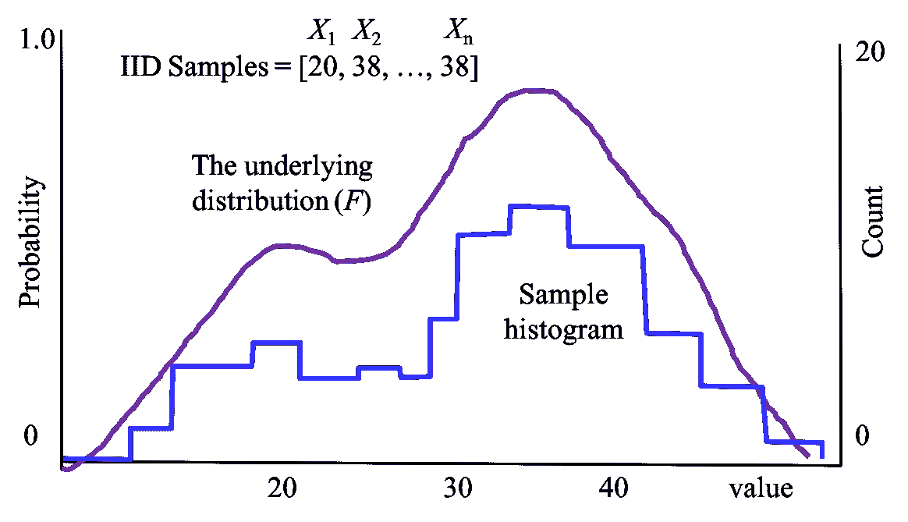

# 抽样

> 原文：[`chrispiech.github.io/probabilityForComputerScientists/en/part4/samples/`](https://chrispiech.github.io/probabilityForComputerScientists/en/part4/samples/)

* * *

在本节中，我们将讨论从总体中计算出的统计数据。然后，我们将讨论关于原始总体的概率声明——这是大多数科学学科的基本要求。

假设你是不丹的国王，你想了解你国家人民的平均幸福感。你不能询问每一个人，但你可以询问一个随机子样本。在下一节中，我们将考虑基于子样本可以做出的原则性声明。假设我们随机抽取了 200 名不丹人，并询问他们的幸福感。我们的数据看起来像这样：${72, 85, \dots, 71}$。你也可以将其视为一个包含 $n$ = 200 个独立同分布（独立，同分布）的随机变量 ${X_1, X_2, \dots, X_n}$ 的集合。

## 理解样本

抽样的理念很简单，但细节和数学符号可能很复杂。这里有一张图片来展示所有涉及的想法：

理论上，存在某个大型总体（例如居住在不丹的 774,000 人）。我们随机抽取了 $n$ 个人作为样本，其中总体中的每个人都有同等的机会被纳入我们的样本。我们从每个人那里记录一个数字（例如他们报告的幸福感）。我们将从第 i 个人那里抽取的数字称为 $X_i$。可视化你的样本 ${X_1, X_2, \dots, X_n}$ 的一种方法是为它们的值制作直方图。

我们假设所有的 $X_i$ 都是同分布的。这意味着我们假设有一个单一的潜在分布 $F$，我们从其中抽取了样本。回想一下，离散随机变量的分布应该定义一个概率质量函数。

## 从样本中估计均值和方差

我们假设我们观察到的数据是从同一潜在分布（$F$）中独立同分布（IID）的，具有真实的均值（$\mu$）和真实的方差（$\sigma²$）。由于我们无法与不丹的所有人交谈，我们必须依靠我们的样本来估计均值和方差。从我们的样本中，我们可以计算出样本均值（$\bar{X}$）和样本方差（$S²$）。这些是我们对真实均值和真实方差的最好猜测。 $$\begin{align*} \bar{X} &= \sum_{i=1}^n \frac{X_i}{n} \\ S² &= \frac{1}{n-1}\sum_{i=1}^n (X_i - \bar{X})² \end{align*}$$ 第一个问题要问的是，这些估计是无偏的吗？是的。无偏意味着如果我们重复进行许多次抽样过程，我们估计的期望值应该等于我们试图估计的真实值。我们将证明这一点对于$\bar{X}$。$S²$的证明在讲义中。 $$\begin{align*} E[\bar{X}] &= E[\sum_{i=1}^n \frac{X_i}{n}] = \frac{1}{n}E\left[\sum_{i=1}^n X_i\right] \\ &= \frac{1}{n}\sum_{i=1}^n E[X_i] = \frac{1}{n}\sum_{i=1}^n \mu = \frac{1}{n}n\mu = \mu \end{align*}$$

样本均值的方程似乎与我们对期望的理解有关。同样可以说样本方差，除了方程分母中令人惊讶的$(n-1)$。为什么是$(n-1)$？那个分母是必要的，以确保$E[S²] = \sigma²$。

证明背后的直觉是样本方差计算每个样本与样本均值的距离，**而不是**真实均值。样本均值本身也在变化，我们可以证明它的方差也与真实方差有关。

## 标准误差

好的，你让我相信我们对均值和方差的估计是无偏的。但现在我想知道我的样本均值相对于真实均值可能会变化多少。 $$\begin{align*} \text{Var}(\bar{X}) &= \text{Var}(\sum_{i=1}^n \frac{X_i}{n}) = \left(\frac{1}{n}\right)² \text{Var}\left(\sum_{i=1}^n X_i\right) \\ &= \left(\frac{1}{n}\right)² \sum_{i=1}^n\text{Var}( X_i) =\left(\frac{1}{n}\right)² \sum_{i=1}^n \sigma² = \left(\frac{1}{n}\right)² n \sigma² = \frac{\sigma²}{n}\\ &\approx \frac{S²}{n} \\ \text{Std}(\bar{X}) &\approx \sqrt{\frac{S²}{n}} \end{align*}$$

这个术语，Std($\bar{X}$)，有一个特殊的名称。它被称为标准误差，这是你在科学论文中报告均值估计的不确定性（以及如何获得误差条）的方式。太好了！现在我们可以为不丹人计算所有这些美好的统计数据。但等等！你从未告诉我如何计算 Std($S²$)。这是很难的，因为中心极限定理不适用于$S²$的计算。相反，我们需要一种更通用的技术。参见下一章：Bootstrapping

假设我们计算的幸福样本有 $n$ = 200 人。样本均值是 $\bar{X} = 83$（这里的单位是什么？幸福分数？）样本方差是 $S² = 450$。现在我们可以计算出我们均值估计的标准误差为 1.5。当我们报告我们的结果时，我们将说我们对不丹平均幸福分数的估计是 83 $\pm$ 1.5。我们对幸福方差的估计是 450 $\pm$ ?。
