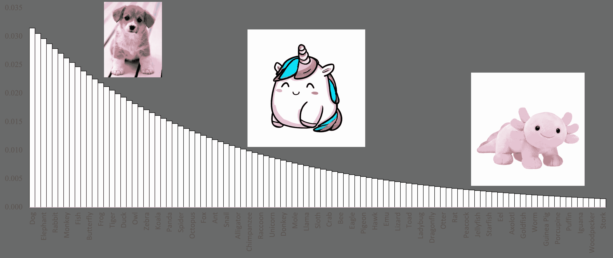
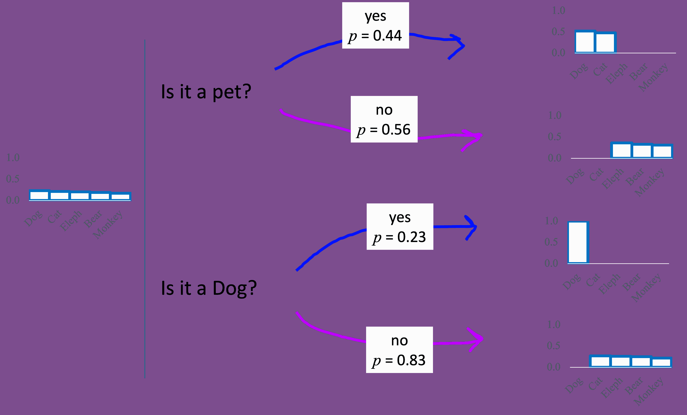
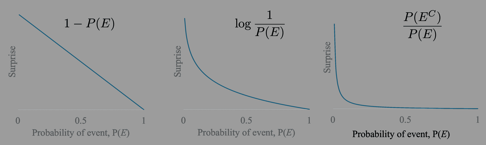
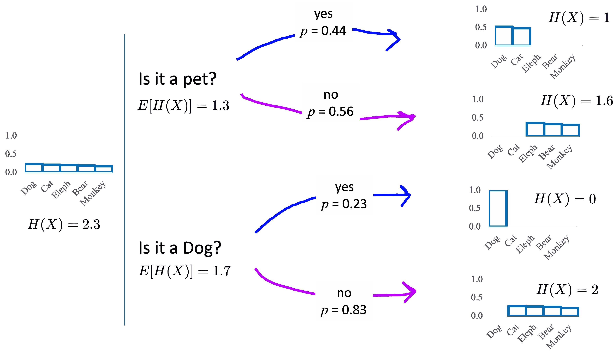

# 信息论

> 原文：[`chrispiech.github.io/probabilityForComputerScientists/en/part4/information_theory/`](https://chrispiech.github.io/probabilityForComputerScientists/en/part4/information_theory/)

* * *

信息论是一个极其强大的视角，在众多算法中扮演着核心角色，包括决策树、WordleBot、自适应测试、最佳扑克玩法甚至数据压缩（如霍夫曼编码或 JPEG 文件）！本章的目标是在展示信息论的强大功能的同时，尽可能保持内容的直接性。为此，一个很好的起点是思考如何编写一个能够玩“想一个动物”问答游戏的机器人。

### 想一个动物！

“想一个动物”游戏是这样的：人类将要想一个动物。我们假设他们选择动物的概率分布是已知的（基于四岁孩子对动物的喜爱程度）：



你的算法任务是选择下一个要问的问题。假设你被提供了一个包含经典问题（如）的“是”或“否”问题库：

+   它是宠物吗？

+   它住在水里吗？

+   你在想着狗吗？

### 选择最佳问题

我们如何选择最佳问题来提问呢？考虑一个简化版的游戏，有五种动物（狗、猫、大象、熊和猴子），并且只有两个问题可供选择：“它是宠物吗？”和“它是狗吗？”对于每个问题，我们可以使用全概率公式来思考回答“是”或“否”的概率。甚至更好！对于每个可能的问题和每个可能的答案，如果我们看到那个问题的答案，我们可以思考由此产生的动物概率质量函数！

我们已经非常接近了！如果我们能够量化四个结果概率质量函数的不确定性，我们就可以简单地选择一个最小化我们对人们所想动物预期不确定性的问题。这种不确定性的量化形式上称为“熵”，它是信息论中的关键概念。

### 从高层次衡量不确定性

让 $X$ 是任何随机变量。量化 $X$ 的概率质量函数所代表的多少不确定性的一个非常优雅的方法是思考 $X$ 可能取的所有值，并对每个值计算如果 $X$ 确实取了那个值你会多么惊讶。如果你对这些惊讶值的加权求和，你会得到随机变量的预期惊讶值

$$\begin{align*} &\text{不确定性}(X) \\ &= E[\text{惊讶}(X)] \\ &= \sum_x \text{惊讶}(x) \cdot P(X=x) \end{align*}$$ 这就是核心思想！主要剩余的任务是定义我们所说的“事件惊讶”是什么。

### 事件惊讶度衡量

如果我们被告知 $X$ 取值 $x$，我们应该如何量化我们会感到的惊讶程度？有几种方法可以量化惊讶，所有这些方法都是基于事件 $\P(X=x)$ 的概率。以下是三种合理的惊讶函数：



所有这些函数都符合以下要求：

+   低概率事件令人惊讶

+   高概率事件并不令人惊讶

+   惊讶是概率的单调递减函数

由于许多原因，信息理论使用中间方程的变体来定义惊讶：$$\text{Surprise}(E) = \log_2 \frac{1}{P(E)}$$

观察事件 $P(E)$ 和 $\text{Surprise}(E)$ 的值之间的关系，我们可以观察到一些直观的关系：

| 事件概率 $P(E)$ | 事件惊讶 $\text{Surprise}(E) = \log_2 \frac{1}{P(E)}$ |
| --- | --- |
| 1/2 | 1 |
| 1/4 | 2 |
| 1/8 | 3 |
| 1/16 | 4 |
| 1/32 | 5 |
| 1/64 | 6 |
| 1/128 | 7 |

如果一个概率为 $P(E) = 1/16$ 的事件发生，我们将比一个概率为 $P(E) = 1/2$ 的事件发生时感到四倍的“惊讶”。这感觉很好！

***定义：*** 事件的惊讶（信息含量）

事件 E 的信息含量，也称为惊讶或自信息，是一个随着事件概率的降低而增加的函数。当概率接近 1 时，事件的惊讶值较低，但如果概率接近 0，事件发生的惊讶值较高。这种关系由以下函数描述：

$$\begin{align*} \text{Surprise}(E) &= \log_2 \Big(\frac{1}{\p(E)} \Big) \end{align*}$$ 这可以写成（以一种更令人困惑的方式）：$$\begin{align*} \text{Surprise}(E) &= \log_2 \Big(\frac{1}{\p(E)} \Big) \\ &= \log_2 \p(E)^{-1} \\ &= -\log_2 \p(E) \end{align*}$$ 在事件惊讶的初始定义中，函数名 $I$ 被用作惊讶的简称。$I$ 代表“信息含量”或“自信息”，这是惊讶的另一种名称。

我们还可以讲述许多其他的故事，来说明为什么 $\log_2 \frac{1}{\p(E)}$ 是我们衡量惊讶程度的绝佳选择。信息理论的奠基人克劳德·香农选择了以 2 为底的对数，因为这可以使你用比特（如计算机中使用的 0 和 1 值）来表达你的惊讶程度。信息理论有许多应用，但最初是在他试图找到一种方法来最优地压缩基于文本的数据时发明的！

### 随机变量的不确定性（熵）

现在我们已经有了惊讶的正式定义，我们可以重新审视随机变量不确定性的计算。

***定义：*** 随机变量的不确定性（熵）

让 $H$ 成为衡量我们对随机变量 $X$ 不确定性的度量。定义 $H$ 为观察 $X$ 分配的预期惊喜。$H(X) = E[\text{Surprise}(X)]$。使用无意识统计学家定律和事件惊喜的定义，我们可以展开 $H$ 的公式如下：

$$ H(X) = \sum_{x \in X} \log_2 \Big(\frac{1}{\p(X=x)}\Big) \cdot \p(X=x) $$ 不确定度 ($H$) 也可以（以更令人困惑的方式）重写为：$$\begin{align*} \text{H}(X) &= \sum_{x \in X} \text{Surprise}(X=x) \cdot P(X=x) \\ &= \sum_{x \in X} \log_2 \frac{1}{P(X=x)} \cdot P(X=x) \\ &= \sum_{x \in X} \log_2 P(X=x) ^{-1}\cdot P(X=x) \\ &= \sum_{x \in X} - \log_2 P(X=x)\cdot P(X=x) \\ &= - \sum_{x \in X} \log_2 P(X=x)\cdot P(X=x) \\ &= - \sum_{x \in X} \log_2 P(X=x)\cdot P(X=x) \end{align*}$$

这里是计算随机变量不确定度 $(H)$ 的代码，基于其概率质量函数：

```py
import numpy as np

def calc_uncertainty(pmf):
  """
  Calculate how much uncertainty is represented by this 
  probability mass function. Also known as the Entropy of a
  random variable, H(X).
  """
  uncertainty = 0
  for x in pmf:
      p_x = pmf[x]
      # skip zero probabilities
      if p_x == 0: continue
      suprise_x = np.log2(1/p_x)
      uncertainty += suprise_x * p_x
  return uncertainty 
```

现在我们已经拥有了在“想一个动物”游戏中选择最佳问题的所有理论工具。对于每个可能的概率质量函数，我们都可以计算该 PMF 的不确定度 $(H)$：



问题“它是宠物吗？”的预期不确定度为 1.3。问题“它是狗吗？”的预期不确定度为 1.7。因此，如果我们问“它是宠物吗？”这个问题，我们预期对朋友所想的动物会更有信心。

这只是信息论众多应用之一！
