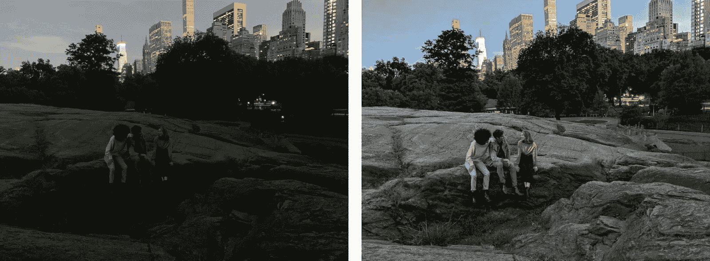

# 夜视功能

> 原文：[`chrispiech.github.io/probabilityForComputerScientists/en/examples/night_sight/`](https://chrispiech.github.io/probabilityForComputerScientists/en/examples/night_sight/)

* * *

在这个问题中，我们探讨如何使用概率论在黑暗中拍照。数码相机有一个传感器，在照片拍摄的持续时间中捕获光子以生成图片。然而，这些传感器容易受到“噪声”的影响，即撞击镜头的光子数量的随机波动。在问题的范围内，我们只考虑单个像素。噪声光子到达表面的到达率是恒定的。

*左：使用标准照片捕获的照片。右：使用快门连拍的同张照片 [[1](https://ai.googleblog.com/2018/11/night-sight-seeing-in-dark-on-pixel.html)].*

对于噪声，标准差是关键！为什么？因为如果相机可以计算预期的噪声量，它可以直接减去它。但是围绕平均值的波动（以标准差衡量）会导致相机无法简单减去的测量变化。

### 第一部分：标准照片

首先，让我们计算以标准方式拍照时的噪声量。如果照片拍摄的持续时间是 1000 𝜇s，那么像素在单次拍照中捕获的光子数量的标准差是多少？请注意，噪声光子以每微秒 10 光子的速率（𝜇s）落在特定的像素上。

**标准照片中的噪声：**正如你可能猜到的，因为照片以恒定的速率撞击相机，并且彼此独立，所以撞击任何像素的噪声照片数量被建模为泊松分布！对于给定的噪声率，设$X$为撞击像素的噪声照片数量：$$X \sim \Poi(\lambda = 10,000).$$ 注意，10,000 是 1000𝜇s 内撞击的平均光子数（持续时间以微秒为单位乘以每微秒的光子数）。泊松的标准差简单地等于其参数的平方根，$\sqrt{\lambda}$。因此，捕获的噪声光子的标准差为 100（相当高）。

### 第二部分：快门拍摄

为了减轻噪声，斯坦福大学的毕业生意识到你可以进行快门拍摄（连续快速拍摄多张照片）并累加捕获的光子数量。由于手机相机的限制，相机在 1000μs 内最多可以拍摄 15 张照片，每张照片的持续时间为 66μs。如果我们对 15 张照片的快门拍摄进行平均，光子数量的标准差是多少？

**快门拍摄中的噪声：**

设 $Y$ 为单个像素捕获的 15 张照片中光子散粒噪声的平均数量。我们想要计算 $\text{Var}(Y)$。具体来说，$Y = \frac{1}{15}\sum_{i=1}^{15} X_i$，其中 $X_i$ 是第 i 张照片中的散粒噪声光子数量。类似于前一部分：$$X_i \sim \Poi(\lambda = 66 \cdot 10)$$ 由于 $X_i$ 是泊松分布，$\E[X_i] = 660$ 和 $\Var(X_i) = 660$。

由于 $Y$ 是独立同分布随机变量的平均值，中心极限定理将会发挥作用。此外，根据中心极限定理的规则，$Y$ 的方差将等于 ${1}/{n}\cdot \Var(X_i)$。 $$\begin{align*} \Var(Y) &= {1}/{n}\cdot \Var(X_i) \\ &= 1/15 \cdot 660 = 44 \end{align*}$$ 因此，标准差将是这个方差的平方根 $\Std(Y) = \sqrt{44}$，这大约是 6.6。这是一个巨大的散粒噪声减少！

* * *

*问题由 Will Song 和 Chris Piech 提出。由谷歌的 Night Sight 提供。*
