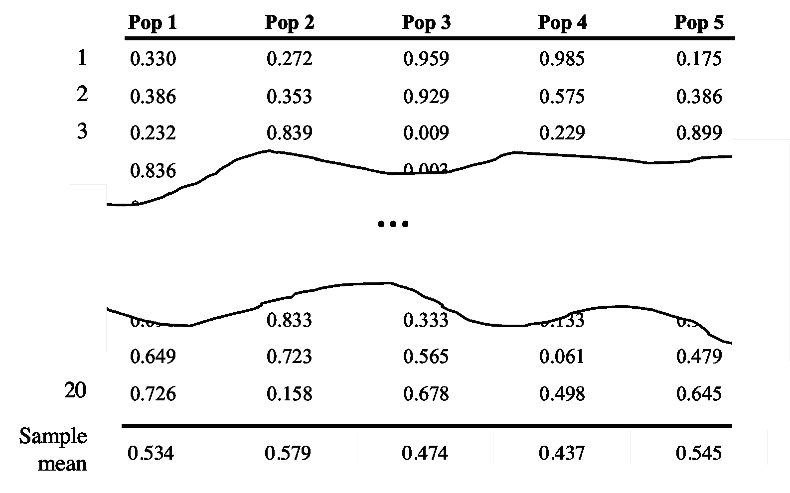

# P-Hacking

> 原文：[`chrispiech.github.io/probabilityForComputerScientists/en/examples/p_hacking/`](https://chrispiech.github.io/probabilityForComputerScientists/en/examples/p_hacking/)

* * *

结果表明，科学有一个缺陷！如果你测试了许多假设，但只报告了具有最低 p 值的那个，那么你更有可能得到一个虚假的结果（一个由机会产生而不是真实模式的结果）。

回顾 p 值：p 值原本是用来表示虚假结果概率的。它是如果两个总体实际上完全相同，则在数据集中观察到至少与观察到的均值差异（或你测量的任何统计量）一样大的差异的概率。p 值 < 0.05 被认为是“统计上显著的”。在课堂上，我们比较了两个总体的样本均值并计算了 p 值。如果我们有 5 个总体并寻找具有显著 p 值的成对比较，这被称为 p-hacking！

为了探索这个想法，我们将寻找一个完全随机的数据集中的模式——每个值都是均匀分布（0,1），并且与其他任何值独立。在这个玩具数据集中，任何均值差异都没有明显的意义。然而，我们可能只是偶然地发现一个看似统计上显著的结果。以下是一个包含 5 个随机总体、每个总体有 20 个样本的模拟数据集的例子：



上表中的数字只是为了演示目的。你不应该基于这些数字得出结论。我们称每个总体为随机总体，以强调其中没有模式。

### 有许多比较

你有多少种方法可以从一组五个总体中选择一对进行比较？总体内元素的价值以及成对的顺序都不重要。

$$\binom{5}{2}$$

### 理解从均匀分布（0,1）中抽取 20 个样本的均值分布的近似

均匀分布（0, 1）的方差是多少？

设 $Z \sim \Uni(0, 1)$ $$\begin{align*} \Var(Z) &= \frac{1}{12}(\beta - \alpha) \\ &=\frac{1}{12} (1-0)\\ &= \frac{1}{12} \end{align*}$$

从均匀分布（0,1）中抽取 20 个样本的均值分布的近似是什么？

设 $Z_1...Z_n$ 是独立同分布的 $\Uni(0,1)$。设 $\bar{X} = \frac{1}{n} \sum_{i=1}^{n} Z_i$。 \[\E[X] = \frac{1}{n} \sum_{i=1}^{n} E[Z_i] = \frac{1}{n} \sum_{i=1}^{n} 0.5 = \frac{n}{n} 0.5 = 0.5\] $$\begin{align*} \Var(X) &= \Var\left(\frac{1}{n} \sum_{i=1}^{n} Z_i\right) \\ &= \frac{1}{n²} \Var\left( \sum_{i=1}^{n} Z_i\right)\\ &= \frac{1}{n²} \sum_{i=1}^{n} \Var\left(Z_i\right) \\ &= \frac{1}{n²} \sum_{i=1}^{n} v \\ &= \frac{n}{n²} v = \frac{v}{n} = \frac{v}{20} = \frac{1}{240} \end{align*}$$ 使用中心极限定理，$\bar{X}\sim N\left(\mu = 0.5 , \sigma² = \frac{1}{240}\right)$

从一个总体减去另一个总体的均值分布的近似是什么？注意：如果第一个总体的均值小于第二个总体，则此值可能为负。

设 $X_1$ 和 $X_2$ 为总体均值。

$X_1\sim N(\mu = 0.5 , \sigma² = \frac{1}{240})$

$X_2\sim N(\mu = 0.5 , \sigma² = \frac{1}{240})$ 期望值计算简单，因为 $$E[X_1 - X_2] = E[X_1] - E[X_2] = 0$$ $$\begin{align*} \Var(X_1 - X_2) &= \Var(X_1) + \Var(X_2) \\ &= \frac{1}{120} \end{align*}$$ 独立正态分布的和（或差）仍然是正态分布：\fbox{$Y \sim N(\mu = 0, \sigma² = \frac{v}{10})$}(8 分) 如果只有两个种群，那么最小的均值差异$k$，使得差异在统计上显著是多少？换句话说，观察到均值差异为$k$或更大的概率小于 0.05。这个问题的一个棘手之处在于要认识到距离的双向性。如果$P(Y<-k)$或$P(Y > k)$，我们会认为这是一个显著的距离。 $$\begin{align*} P(Y < -k) + P(Y > k) &= 0.05 \\ F_Y(-k) + (1 - F_Y(k)) &= 0.05 \\ (1-F_Y(k)) + (1 - F_Y(k)) &= 0.05 \\ 2 - 2F_Y(k) &= 0.05 \\ F_Y(k) &= 0.975 \end{align*}$$ 现在我们需要求逆$\Phi$来得到$k$的值。 $$\begin{align*} 0.975 &= \Phi\Big(\frac{k - 0}{\sqrt{v/10}}\Big) \\ \Phi^{-1}(0.975) &= \frac{k}{\sqrt{v/10}} \\ k &= \Phi^{-1}(0.975)\sqrt{v/10} \end{align*}$$(5 分) 给出一个表达式，表示 5 个随机种群中最小的样本均值小于 0.2 的概率。设$X_i$为种群$i$的样本均值。 $$\begin{align*} P(min\{X_1 ... X_n\} < 0.2) &= P\left(\bigcup_{i=1}^{5} X_i < 0.2\right) \\ &= 1 - P\left(\left(\bigcup_{i=1}^{5} X_i < 0.2\right)^{\complement}\right) \\ &= 1 - P\left(\bigcap_{i=1}^{5} X_i \geq 0.2\right) \\ &= 1 - \prod_{i=1}⁵ P(X_i \ge 0.2) \\ &= 1 - \prod_{i=1}⁵ 1 - \Phi\Big(\frac{0.2 - 0.5}{\sqrt{v/20}}\Big) \\ \end{align*}$$(7 分) 使用以下函数编写代码，估计在 5 个种群中找到均值差异的概率，这种差异被认为是显著的（使用设计用于比较两个种群的 bootstrap 方法）。至少运行 10,000 次模拟来估计你的答案。你可以使用以下辅助函数。

```py
# the smallest difference in means that would look statistically significant
k = calculate_k()

# create a matrix with n_rows by n_cols elements, each of which is Uni(0, 1)
matrix = random_matrix(n_rows, n_cols)

# from the matrix, return the column (as a list) which has the smallest mean
min_mean_col = get_min_mean_col(matrix)

# from the matrix, return the row (as a list) which has the largest mean
max_mean_col = get_max_mean_col(matrix)

# calculate the p-value between two lists using bootstrapping (like in pset5)
p_value = bootstrap(list1, list2)

```

编写伪代码：

```py
n_significant = 0
k = calculate_k()
for i in range(N_TRIALS): 
    dataset = random_matrix(20, 5)
    col_max = get_max_mean_col(dataset)
    col_min = get_min_mean_col(dataset)}
    diff = np.mean(col_max) - np.mean(col_min)}
    if diff >= k: 
        n_significant += 1}

print(n_significant / N_TRIALS)

```
