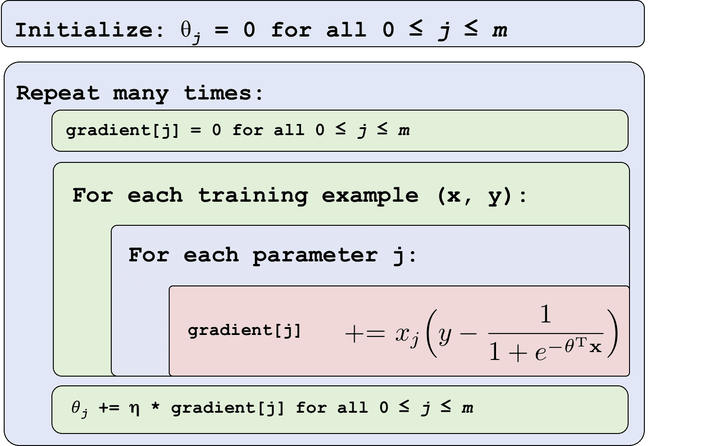

# 逻辑回归

> 原文：[`chrispiech.github.io/probabilityForComputerScientists/en/part5/log_regression/`](https://chrispiech.github.io/probabilityForComputerScientists/en/part5/log_regression/)

* * *

逻辑回归是一种分类算法（我知道，这个名字很糟糕。或许逻辑分类会更好一些），它通过尝试学习一个近似 $\P(y|x)$ 的函数来工作。它假设 $\P(y|x)$ 可以近似为应用在输入特征线性组合上的 sigmoid 函数。学习逻辑回归非常重要，因为逻辑回归是人工神经网络的基本构建块。

从数学上讲，对于一个单个训练数据点（$\mathbf{x}, y$），逻辑回归假设：$$\begin{align*} P(Y=1|\mathbf{X}=\mathbf{x}) &= \sigma(z) \text{ 其中 } z = \theta_0 + \sum_{i=1}^m \theta_i x_i \end{align*}$$ 这个假设通常以等价的形式写出：$$\begin{align*} P(Y=1|\mathbf{X}=\mathbf{x}) &=\sigma(\mathbf{\theta}^T\mathbf{x}) &&\text{ 其中我们总是将 $x_0$ 设置为 1}\\ P(Y=0|\mathbf{X}=\mathbf{x}) &=1-\sigma(\mathbf{\theta}^T\mathbf{x}) &&\text{ 根据概率的总法则} \end{align*}$$ 使用这些方程来表示 $Y|X$ 的概率，我们可以创建一个算法，该算法选择 $\theta$ 的值，以最大化所有数据的概率。我首先将陈述对数概率函数和关于 $\theta$ 的偏导数。然后我们将在（a）展示一个可以选择 $\theta$ 的最优值的算法，以及（b）展示这些方程是如何推导出来的。

一个重要的事实是：给定参数（$\theta$）的最佳值，逻辑回归通常可以很好地估计不同类别标签的概率。然而，给定不良的，甚至随机的 $\theta$ 值，它的工作表现会很差。逻辑回归机器学习算法的“智能”程度取决于 $\theta$ 的良好值。

## 符号

在我们开始之前，我想确保我们对于符号的使用是一致的。在逻辑回归中，$\theta$ 是一个长度为 $m$ 的参数向量，我们将根据 $n$ 个训练样本来学习这些参数的值。参数的数量应该等于每个数据点的特征数量。

在逻辑回归中，我们经常使用的一些符号你可能不太熟悉：$$\begin{align*} \mathbf{\theta}^T\mathbf{x} &= \sum_{i=1}^m \theta_i x_i = \theta_1 x_1 + \theta_2 x_2 + \dots + \theta_m x_m && \text{点积，也称为加权求和}\\ \sigma(z) &= \frac{1}{1+ e^{-z}} && \text{sigmoid 函数} \end{align*}$$

## 对数似然

为了选择逻辑回归参数的值，我们使用最大似然估计（MLE）。因此，我们将有两个步骤：（1）写出对数似然函数；（2）找到最大化对数似然函数的 $\theta$ 值。

我们预测的标签是二元的，我们的逻辑回归函数的输出应该是标签为 1 的概率。这意味着我们可以（并且应该）将每个标签解释为一个伯努利随机变量：$Y \sim \text{Bern}(p)$ 其中 $p = \sigma(\theta^T \textbf{x})$。

首先，这里有写出一个数据点的概率的超级简洁方法（回想这是伯努利概率质量函数的方程形式）：$$\begin{align*} P(Y=y | X = \mathbf{x}) = \sigma({\mathbf{\theta}^T\mathbf{x}})^y \cdot \left[1 - \sigma({\mathbf{\theta}^T\mathbf{x}})\right]^{(1-y)} \end{align*}$$

现在我们知道了概率质量函数，我们可以写出所有数据的似然：$$\begin{align*} L(\theta) =& \prod_{i=1}^n P(Y=y^{(i)} | X = \mathbf{x}^{(i)}) && \text{独立训练标签的似然}\\ =& \prod_{i=1}^n \sigma({\mathbf{\theta}^T\mathbf{x}^{(i)}})^{y^{(i)}} \cdot \left[1 - \sigma({\mathbf{\theta}^T\mathbf{x}^{(i)}})\right]^{(1-y^{(i)})} && \text{代入伯努利的似然} \end{align*}$$ 如果你取这个函数的对数，你得到逻辑回归报告的对数似然。对数似然方程是：$$\begin{align*} LL(\theta) = \sum_{i=1}^n y^{(i)} \log \sigma(\mathbf{\theta}^T\mathbf{x}^{(i)}) + (1-y^{(i)}) \log [1 - \sigma(\mathbf{\theta}^T\mathbf{x}^{(i)})] \end{align*}$$

回想一下，在最大似然估计（MLE）中，唯一剩下的步骤就是选择参数（$\theta$）以最大化对数似然。

## 对数似然的梯度

现在我们有了对数似然函数，我们只需要选择最大化它的$\theta$值。我们可以通过使用优化算法找到$\theta$的最佳值。然而，为了使用优化算法，我们首先需要知道对数似然相对于每个参数的偏导数。首先，我将给你偏导数（这样你可以看到它是如何被使用的）。然后，我将向你展示如何推导它：$$\begin{align*} \frac{\partial LL(\theta)}{\partial \theta_j} = \sum_{i=1}^n \left[ y^{(i)} - \sigma(\mathbf{\theta}^T\mathbf{x}^{(i)}) \right] x_j^{(i)} \end{align*}$$

## 梯度下降优化

我们的目标是选择参数（$\theta$）以最大化似然，并且我们知道对数似然相对于每个参数的偏导数。我们已经准备好使用我们的优化算法了。

在逻辑回归的情况下，我们不能从数学上求解$\theta$。相反，我们使用计算机来选择$\theta$。为此，我们采用一个称为梯度下降（优化理论中的经典算法）的算法。梯度下降背后的思想是，如果你持续地向下走小步（在负梯度的方向上），你最终会到达局部最小值。在我们的情况下，我们想要最大化我们的似然。正如你所想象的，最小化我们似然的负值将等同于最大化我们的似然。

导致每个小步骤的参数更新可以计算如下：$$\begin{align*} \theta_j^{\text{ new}} &= \theta_j^{\text{ old}} + \eta \cdot \frac{\partial LL(\theta^{\text{ old}})}{\partial \theta_j^{\text{ old}}} \\ &= \theta_j^{\text{ old}} + \eta \cdot \sum_{i=1}^n \left[ y^{(i)} - \sigma(\mathbf{\theta}^T\mathbf{x}^{(i)}) \right] x_j^{(i)} \end{align*}$$其中$\eta$是我们采取的步长的大小。如果你继续使用上述方程更新$\theta$，你将收敛到$\theta$的最佳值。你现在有一个智能模型。以下是逻辑回归的梯度上升算法的伪代码：

小贴士：别忘了，为了学习$\theta_0$的值，你可以简单地定义$\textbf{x}_0$始终为 1。

## 导数

在本节中，我们提供了对数似然梯度的数学推导。这些推导值得了解，因为这些思想在人工神经网络中得到了广泛的应用。

我们的目标是计算对数似然相对于每个 theta 的导数。首先，这是 sigmoid 函数相对于其输入的导数的定义：$$\begin{align*} \frac{\partial}{\partial z} \sigma(z) = \sigma(z)[1 - \sigma(z)] && \text{要得到相对于$\theta$的导数，使用链式法则} \end{align*}$$花点时间来欣赏 sigmoid 函数导数的美丽。sigmoid 具有如此简单的导数的原因在于 sigmoid 分母中的自然指数。

由于似然函数是对所有数据的求和，而在微积分中，和的导数是各个导数的和，因此我们可以专注于计算一个示例的导数。theta 的梯度仅仅是每个训练数据点的这个项的总和。

首先，我将向您展示如何通过困难的方式计算导数。然后，我们将探讨一种更简单的方法。对于一个数据点 $(\mathbf{x}, y)$ 的梯度导数：$$\begin{align*} \frac{\partial LL(\theta)}{\partial \theta_j} &= \frac{\partial }{\partial \theta_j} y \log \sigma(\mathbf{\theta}^T\mathbf{x}) + \frac{\partial }{\partial \theta_j} (1-y) \log [1 - \sigma(\mathbf{\theta}^T\mathbf{x}] && \text{项之和的导数}\\ &=\left[\frac{y}{\sigma(\theta^T\mathbf{x})} - \frac{1-y}{1-\sigma(\theta^T\mathbf{x})} \right] \frac{\partial}{\partial \theta_j} \sigma(\theta^T \mathbf{x}) &&\text{log $f(x)$ 的导数}\\ &=\left[\frac{y}{\sigma(\theta^T\mathbf{x})} - \frac{1-y}{1-\sigma(\theta^T\mathbf{x})} \right] \sigma(\theta^T \mathbf{x}) [1 - \sigma(\theta^T \mathbf{x})]\mathbf{x}_j && \text{链式法则 + sigma 的导数}\\ &=\left[ \frac{y - \sigma(\theta^T\mathbf{x})}{\sigma(\theta^T \mathbf{x}) [1 - \sigma(\theta^T \mathbf{x})]} \right] \sigma(\theta^T \mathbf{x}) [1 - \sigma(\theta^T \mathbf{x})]\mathbf{x}_j && \text{代数操作}\\ &= \left[y - \sigma(\theta^T\mathbf{x}) \right] \mathbf{x}_j && \text{消去项} \end{align*}$$

## 《微分不再流泪》

那是艰难的方法。逻辑回归是人工神经网络的基石。如果我们想要扩展规模，我们就必须习惯于一种更简单的方式来计算导数。为此，我们必须欢迎我们老朋友链式法则的回归。根据链式法则：$$\begin{align*} \frac{\partial LL(\theta)}{\partial \theta_j} &= \frac{\partial LL(\theta)}{\partial p} \cdot \frac{\partial p}{\partial \theta_j} && \text{其中 } p = \sigma(\theta^T\textbf{x})\\ &= \frac{\partial LL(\theta)}{\partial p} \cdot \frac{\partial p}{\partial z} \cdot \frac{\partial z}{\partial \theta_j} && \text{其中 } z = \theta^T\textbf{x} \end{align*}$$ 链式法则是微积分的分解机制。它允许我们通过将其分解成更小的部分来计算复杂的偏导数（$\frac{\partial LL(\theta)}{\partial \theta_j}$）。$$\begin{align*} LL(\theta) &= y \log p + (1-y) \log (1 - p) && \text{其中 } p = \sigma(\theta^T\textbf{x}) \\ \frac{\partial LL(\theta)}{\partial p} &= \frac{y}{p} - \frac{1-y}{1-p} && \text{通过求导得到} \end{align*}$$ $$\begin{align*} p &= \sigma(z) && \text{其中 }z = \theta^T\textbf{x}\\ \frac{\partial p}{\partial z} &= \sigma(z)[1- \sigma(z)] && \text{通过求导得到 sigmoid 函数} \end{align*}$$ $$\begin{align*} z &= \theta^T\textbf{x} && \text{如前所述}\\ \frac{\partial z}{\partial \theta_j} &= \textbf{x}_j && \text{只有 $\textbf{x}_j$ 与 $\theta_j$ 交互} \end{align*}$$ 这些导数都更容易计算。现在我们只需将它们相乘。$$\begin{align*} \frac{\partial LL(\theta)}{\partial \theta_j} &= \frac{\partial LL(\theta)}{\partial p} \cdot \frac{\partial p}{\partial z} \cdot \frac{\partial z}{\partial \theta_j} \\ &= \Big[\frac{y}{p} - \frac{1-y}{1-p}\Big] \cdot \sigma(z)[1- \sigma(z)] \cdot \textbf{x}_j && \text{通过代入每个项} \\ &= \Big[\frac{y}{p} - \frac{1-y}{1-p}\Big] \cdot p[1- p] \cdot \textbf{x}_j && \text{因为 }p = \sigma(z)\\ &= [y(1-p) - p(1-y)] \cdot \textbf{x}_j && \text{相乘得到} \\ &= [y - p]\textbf{x}_j && \text{展开} \\ &= [y - \sigma(\theta^T\textbf{x})]\textbf{x}_j && \text{因为 } p = \sigma(\theta^T\textbf{x}) \end{align*}$$
