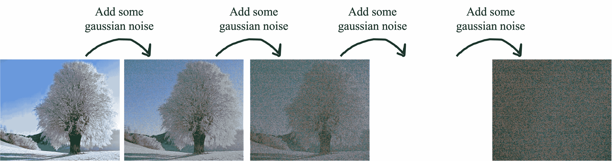
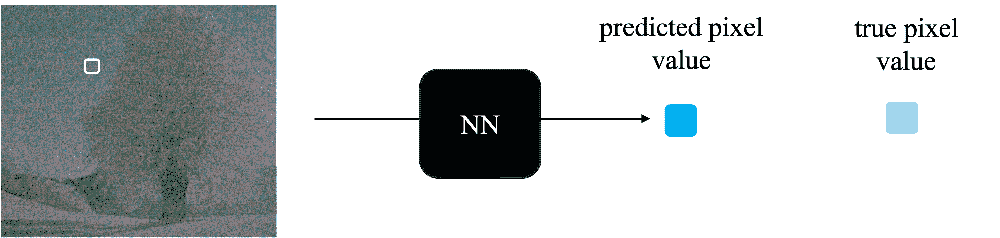

# 扩散

> 原文：[`chrispiech.github.io/probabilityForComputerScientists/en/part5/diffusion/`](https://chrispiech.github.io/probabilityForComputerScientists/en/part5/diffusion/)

* * *

### 扩散任务

**目标：** 创建一个可以从“树照片分布”生成树木图片的模型

**数据：** 许多树木图片：

### 整体思路

通过迭代地向像素添加高斯噪声来补充你的数据集，然后训练一个深度学习模型来去除噪声。

合理的步骤数量是每次添加 10% 的噪声，这样在 10 个时间步之后，每个像素都是完全噪声。

关键任务是训练一个深度神经网络来预测像素的“去噪”值：

损失：预测像素和真实颜色之间的均方误差。将你的神经网络的参数设置为最小化损失。然后你就有了一个可以一次去除 10% 噪声的模型。从随机噪声开始，然后运行它通过你的去噪神经网络 10 次。

### 扩散模型的原理

扩散模型的魔力在于高斯噪声过程。让我们分解一下：

#### 1. 添加噪声：正向过程

在每个步骤 \( t \) 中，我们对像素值添加高斯噪声：\[ x_{t+1} = x_t + n_t \quad \text{where } n_t \sim N(0, \sigma²). \] 这逐渐将原始图像转换为纯噪声。

#### 2. 去除噪声：逆向过程

要逆转这个过程，我们需要条件分布 \( x_{t-1} | x_t \)。这里令人惊讶的部分是：

**关键事实 #1：** \( x_{t-1} | x_t \) 是具有已知方差的 Gaussian

如果噪声方差 \( \sigma² \) 足够小，\( x_{t-1} | x_t \) 的分布可以近似为：\[ x_{t-1} | x_t \sim N(\mu_{t-1}(x_t), \sigma²), \] 其中：

+   \( \mu_{t-1}(x_t) \)：Gaussian 的均值，它依赖于 \( x_t \)。

+   \( \sigma² \)：噪声的已知方差。

这是一个好消息！这意味着我们只需要估计均值 \( \mu_{t-1}(x_t) \) 来完全描述 \( x_{t-1} | x_t \)。

#### 3. 训练神经网络

**关键事实 #2：** 你只需要标准回归！

为了训练神经网络，我们需要它预测高斯均值 \( \mu_{t-1}(x_t) \)。我们如何衡量预测的质量？

预测的高斯 \( q_\theta(x_{t-1} | x_t) \)（来自神经网络）和真实的高斯 \( p(x_{t-1} | x_t) \) 之间的差异可以通过 **KL 散度** 来衡量。幸运的是，在这种情况下：\[ \text{最小化 KL 散度 } \Leftrightarrow \text{最小化均方误差 (MSE)}. \] 这只因为分布是 Gaussian。因此，我们可以简单地训练神经网络来最小化其预测的像素值（\( \mu_{t-1}(x_t) \)）和真实像素值之间的 MSE。

一旦训练完成，神经网络可以迭代地去除图像噪声，从随机噪声开始，直到生成清晰、逼真的图像。

#### 4. 完整的扩散算法

这里是扩散模型的完整工作流程：

1.  **正向过程：** 向图像添加高斯噪声，将其转换为纯噪声。

1.  **反向过程：** 训练一个神经网络来预测均值 \( \mu_{t-1}(x_t) \) 并逐步去除噪声。

1.  **图像生成：** 从随机噪声开始，反向运行神经网络 \( T \) 次以生成逼真的图像。

这种优雅的方法结合了简单的高斯噪声和深度学习的力量，以生成惊人的结果！

* * *

### 关键思想 #1 的证明草图

**主张：** 当噪声方差 \( \sigma² \) 足够小时，\( x_{t-1} | x_t \) 大约是高斯分布。

我们从贝叶斯定理开始，表示条件概率：\[ \p(x_{t-1} | x_t) = \frac{ \p(x_t | x_{t-1}) \p(x_{t-1}) }{ \p(x_t) } \] 我们将考虑这个表达式的对数。这是因为高斯的对数是二次函数，这将使我们的数学更容易。我们可以写出：\[ \log \p(x_{t-1} | x_t) = \log \p(x_t | x_{t-1}) + \log \p(x_{t-1}) - \log \p(x_t) \] 让我们分解这个表达式中的各项。

**正向过程似然：**

在正向过程中，给定 \( x_{t-1} \) 的 \( x_t \) 是高斯分布：\[ \p(x_t | x_{t-1}) = \frac{1}{\sqrt{2 \pi \sigma²}} \exp\left(-\frac{(x_t - x_{t-1})²}{2 \sigma²}\right). \] 取对数，我们得到：\[ \log \p(x_t | x_{t-1}) = -\frac{(x_t - x_{t-1})²}{2 \sigma²} + \text{constant} \] **关于 \( x_{t-1} \) 的先验：**

先验 \( p(x_{t-1}) \) 是 \( x_{t-1} \) 在前一步的概率。这个很难知道！一棵树的像素的先验分布是什么？然而，我们采用一个非常巧妙的技巧。其对数密度可以在 \( x_t \) 附近对 \( x_{t-1} \) 进行泰勒展开，假设 \( x_{t-1} \) 接近 \( x_t \)：\[ \log \p(x_{t-1}) \approx \log \p(x_t) + \Big[ \frac{\partial}{\partial x} \log \p(x_t) \Big] (x_{t-1} - x_t) \] **完成平方：**

上面的表达式中涉及两个涉及 \( x_{t-1} \) 和 \( x_t \) 差别的项。作为一个有用的步骤，我们将对这些项进行平方完成。

对这些项的总和进行平方完成：\[ -\frac{(x_t - x_{t-1})²}{2 \sigma²} + \Big[ \frac{\partial}{\partial x} \log \p(x_t) \Big] (x_{t-1} - x_t) \] 首先，重写 \( (x_t - x_{t-1})² \)：\[ (x_t - x_{t-1})² = (x_{t-1} - x_t)² \] 这使我们能够将总和重写为：\[ -\frac{1}{2 \sigma²} (x_{t-1} - x_t)² + \Big[ \frac{\partial}{\partial x} \log \p(x_t) \Big] (x_{t-1} - x_t) \]

提取 \( -\frac{1}{2 \sigma²} \) 以使二次项更加明确：\[ -\frac{1}{2 \sigma²} \left[ (x_{t-1} - x_t)² - 2 \sigma² \Big[ \frac{\partial}{\partial x} \log \p(x_t) \Big] (x_{t-1} - x_t) \right] \]

括号内的表达式是 \( (x_{t-1} - x_t) \) 的二次表达式。让我们对以下表达式完成平方：\[ (x_{t-1} - x_t)² - 2 \sigma² \Big[ \frac{\partial}{\partial x} \log \p(x_t) \Big] (x_{t-1} - x_t) \]

这使我们能够将二次表达式重写为：\[ \left[ (x_{t-1} - x_t) - \sigma² \Big[ \frac{\partial}{\partial x} \log \p(x_t) \Big] \right]² - \left( \sigma² \Big[ \frac{\partial}{\partial x} \log \p(x_t) \Big] \right)² \]

将其代入。让 \( K \) 代表常数：$$\begin{align*} \log \p(x_{t-1} | x_t) &= \log \p(x_t | x_{t-1}) + \log \p(x_{t-1}) - \log \p(x_t) \\ &= -\frac{(x_t - x_{t-1})²}{2 \sigma²} + \Big(\log \p(x_t) + \Big[ \frac{\partial}{\partial x} \log \p(x_t) \Big] (x_{t-1} - x_t)\Big) - \log \p(x_t) + K \\ &= -\frac{(x_t - x_{t-1})²}{2 \sigma²} + \Big[ \frac{\partial}{\partial x} \log \p(x_t) \Big] (x_{t-1} - x_t)+ K \\ &= -\frac{1}{2 \sigma²} \left[ \left( x_{t-1} - x_t - \sigma² \Big[ \frac{\partial}{\partial x} \log \p(x_t) \Big] \right)² \right] + K \end{align*}$$

**最终结果**：回想一下高斯概率密度函数的对数看起来是这样的：

设 \( X \sim N(\mu, \sigma²) \)。\( X \) 的概率密度函数的对数是什么？$$\log \P(X=x) = -\frac{1}{2 \sigma²} (x - \mu)² + K$$从上面的公式中，我们可以看到 \( x_{t-1} | x_t \) 是高斯分布。我们如何知道这一点？分布与正态分布的对数密度相同，除了加性因子。 \[ x_{t-1} | x_t \sim N\left( \mu_{t-1}, \sigma² \right), \] 其中：\[ \mu_{t-1} = x_t + \sigma²\Big[ \frac{\partial}{\partial x} \log \p(x_t) \Big] \] 方差保持为 \( \sigma² \)，这是从正向过程中固定的。
