# 一：L1.1 - 正则表达式 📝

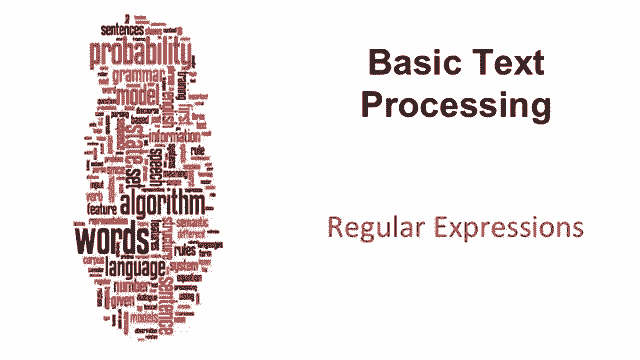

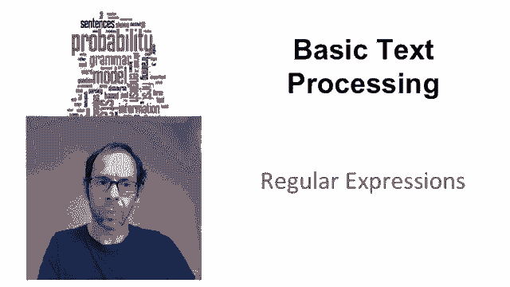

在本节课中，我们将要学习文本处理。正则表达式是文本处理中最基础、最核心的工具。

## 概述

正则表达式是一种用于指定文本字符串的形式语言。假设我们需要在文本文档中查找“woodchuck”这个词。这个词可能有多种写法，例如单数形式、复数形式（带`s`）、首字母大写或小写，以及这些形式的任意组合。我们需要工具来处理这类问题。

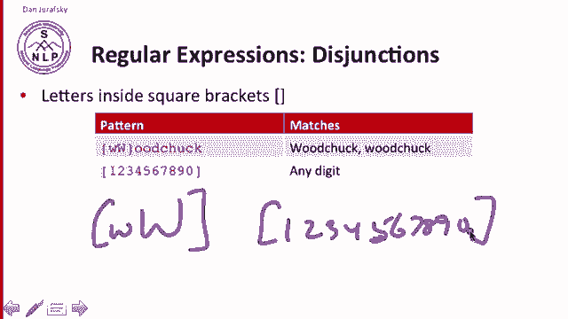

## 基本工具：析取

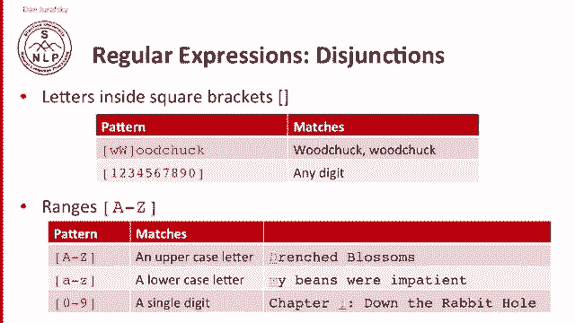

正则表达式中最简单的工具是析取。方括号 `[]` 在正则表达式模式中表示匹配括号内的任意一个字符。

例如，模式 `[Ww]oodchuck` 可以匹配 `woodchuck` 或 `Woodchuck`。同样，`[1234567890]` 可以匹配任意一个数字。连续书写所有数字很繁琐，因此我们可以使用范围表示法。

*   `[0-9]` 表示匹配 `0` 到 `9` 之间的任意一个数字。
*   `[A-Z]` 表示匹配 `A` 到 `Z` 之间的任意一个大写字母。

让我们看看具体如何工作。

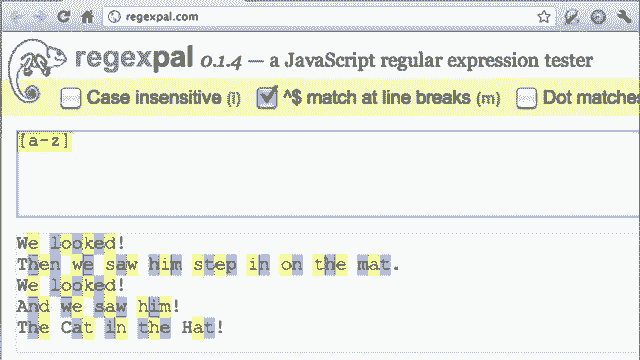

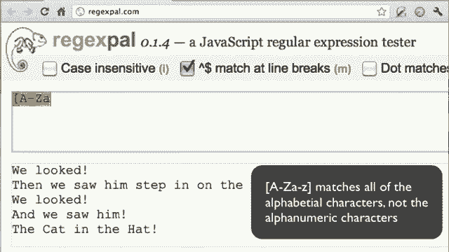

这里有一个使用正则表达式工具 `RegExr` 进行搜索的例子。我们有一段来自苏斯博士的文本：“we looked, and we saw him step in on the mat. we looked and we saw him the cat in the hat.”

我们可以尝试析取操作：
*   模式 `[Ww]` 可以匹配所有大写 `W` 和小写 `w`。
*   模式 `[EM]` 可以匹配所有 `E` 和 `M`。
*   使用范围：模式 `[A-Z]` 匹配所有大写字母。
*   模式 `[a-z]` 匹配所有小写字母。
*   模式 `[A-Za-z0-9]` 匹配所有字母数字字符。请思考一下如何匹配所有字母数字字符。

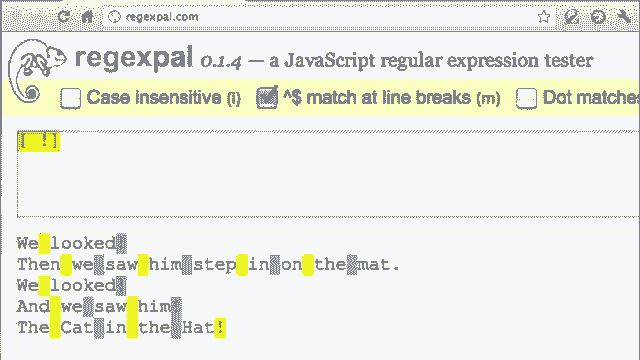

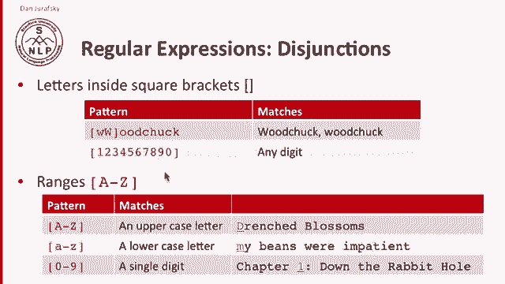

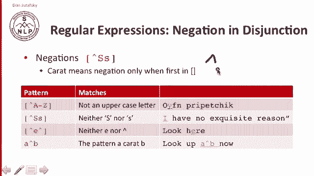

我们也可以匹配一些非字母数字字符。例如，模式 `[ !]` 可以匹配空格和感叹号，如图所示。

## 否定

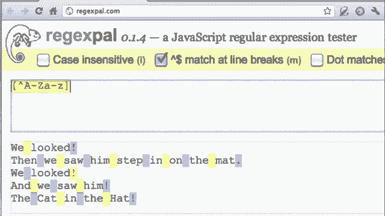

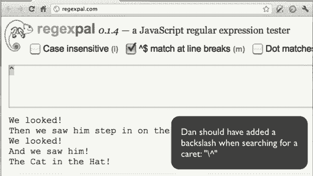

在析取中，我们有时需要否定，即排除某些字符集。例如，我们想匹配“非大写字母”。这可以通过在方括号内使用脱字符 `^` 来实现。

*   `[^A-Z]` 表示匹配任何不是大写字母 `A` 到 `Z` 的字符。
*   `[^Aa]` 表示匹配既不是大写 `A` 也不是小写 `a` 的字符。
*   `[^E^]` 表示匹配不是 `E` 也不是 `^` 的字符。

注意，脱字符 `^` 紧接在开方括号 `[` 之后才表示“否定”，在其他位置就只是一个普通的 `^` 字符。

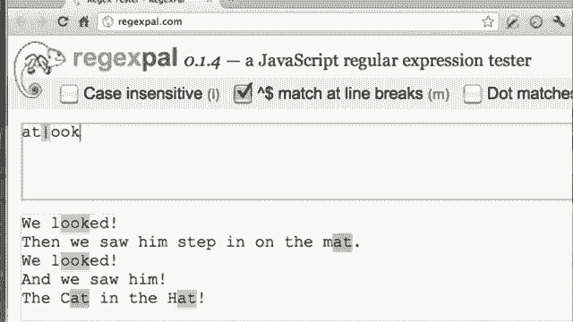

让我们看看具体示例：
*   模式 `[^A-Z]` 匹配所有非大写字母。
*   模式 `[^!]` 匹配大多数字符（非感叹号）。
*   模式 `[^A-Za-z]` 匹配所有非字母字符，如图所示，只有空格和感叹号被匹配。
*   模式 `^` 尝试匹配脱字符本身，但文本中没有，所以没有匹配项。

## 管道符号析取

另一种用于更长字符串的析取方式是管道符号 `|`，有时也称为“或”操作符。

*   `groundhog|woodchuck` 表示匹配字符串 `groundhog` 或 `woodchuck`。
*   管道符号有时可以实现与方括号类似的功能，例如 `a|b|c` 等同于 `[abc]`。

我们可以组合使用这些符号。例如，`[Gg]roundhog|[Ww]oodchuck` 可以匹配首字母大小写不同的“groundhog”或“woodchuck”。

在我们的例子中：
*   模式 `looked|step` 可以匹配单词“looked”和“step”。
*   模式 `at|ook` 可以匹配所有包含“at”或“ook”的字符串片段。

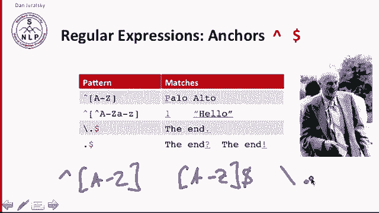

## 特殊字符与运算符

正则表达式中有几组非常重要的特殊字符。

*   **问号 `?`**：表示前一个字符是可选的。
    *   例如：`colou?r` 可以匹配 `color`（没有 `u`）或 `colour`（有 `u`）。
*   **克莱尼星号 `*`**（以 Stephen Kleene 命名）：匹配前一个字符的零次或多次出现。
    *   例如：`O*h!` 可以匹配 `Oh!`、`OOh!`、`OOOh!` 等。
*   **克莱尼加号 `+`**：匹配前一个字符的一次或多次出现。
    *   例如：`O+h!` 可以匹配 `Oh!`、`OOh!`、`OOOh!` 等，但不能匹配 `h!`。
*   **点号 `.`**：匹配任意单个字符（除换行符外，取决于模式）。
    *   例如：`beg.n` 可以匹配 `begin`、`beg3n`、`beg n` 等。
*   **脱字符 `^`**（在方括号外）：匹配行的开头。
    *   例如：`^[A-Z]` 匹配行首的大写字母。
*   **美元符号 `$`**：匹配行的结尾。
    *   例如：`[A-Z]$` 匹配行尾的大写字母。
*   **转义字符 `\`**：由于点号 `.` 是特殊字符，如果要匹配字面意义上的句点，需要使用反斜杠转义。
    *   例如：`\.` 匹配一个真正的句点字符，而 `.` 匹配任意字符。

让我们看一些例子：
*   模式 `O+` 匹配一个或多个连续的 `O`。
*   模式 `^[A-Z]` 匹配行首的大写字母。
*   模式 `[A-Z]$` 匹配行尾的大写字母（本例中没有）。
*   模式 `[!.]$` 匹配行尾的感叹号或句点。
*   模式 `\.` 匹配所有句点。如果不转义，模式 `.` 会匹配所有字符。

## 综合示例：查找单词“the”

让我们通过一个具体例子来实践。假设我们有句子：“The other one there, the blithe one.” 我们想找出其中所有的单词“the”。

1.  **初步尝试**：最简单的模式是 `the`。它能找到小写的“the”，但会漏掉大写的“The”，同时也会错误匹配“**the**re”和“bli**the**”中的“the”。
2.  **解决大小写问题**：使用析取 `[Tt]he`。现在可以匹配“The”了，但“there”和“blithe”的问题依然存在。
3.  **提高精确度**：我们需要确保“the”前后没有字母字符（即它是一个独立的单词）。我们可以使用非字母字符来界定。
    *   首先，确保后面是非字母：`[Tt]he[^A-Za-z]`。这解决了“there”的问题（因为‘r’是字母），但“blithe”的问题还在（因为前面是字母‘l’）。
    *   然后，确保前面也是非字母：`[^A-Za-z][Tt]he[^A-Za-z]`。现在，我们成功匹配了所有独立的“the”单词。

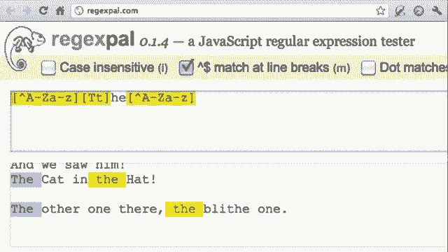

这个过程中，我们处理了两种错误：
*   **假阳性（Type I 错误）**：匹配了不该匹配的字符串（如“there”）。通过增加模式的**精确度（Precision）** 来减少此类错误。
*   **假阴性（Type II 错误）**：漏掉了该匹配的字符串（如大写的“The”）。通过增加模式的**召回率（Recall）** 来减少此类错误。

在自然语言处理中，我们经常需要在这两类错误之间进行权衡和优化。

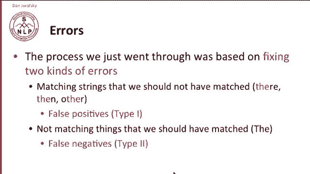
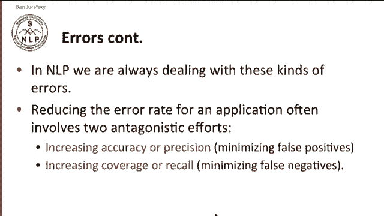

## 总结

本节课中我们一起学习了正则表达式的基础知识。

正则表达式在文本处理中扮演着极其重要的角色。我们看到的这些简单正则表达式序列，通常是任何文本处理任务的初级模型。对于更复杂的任务，我们将会使用更强大的机器学习分类器。但即使在那时，正则表达式也常被用作分类器的特征，对于捕捉文本中的一般化模式非常有用。

因此，在后续的学习和实践中，你会反复用到正则表达式。

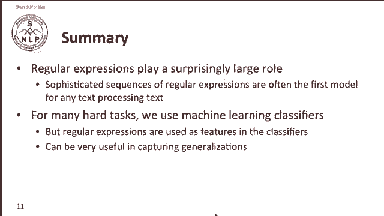

