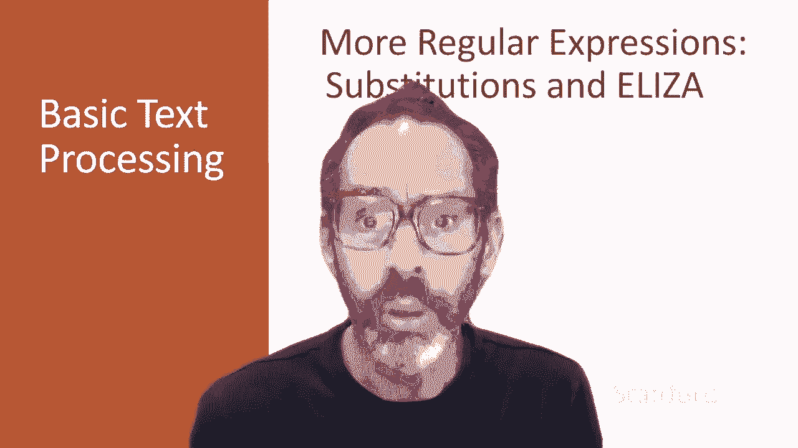
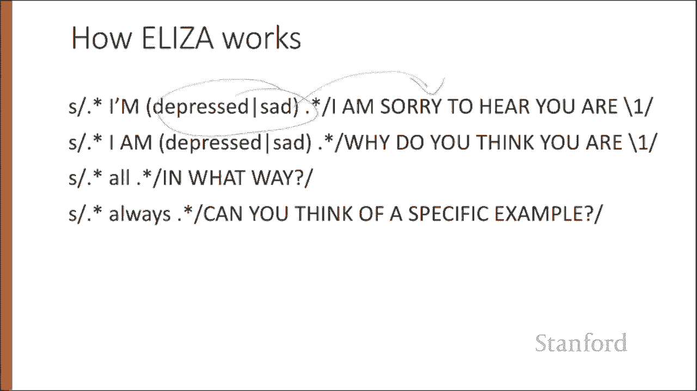
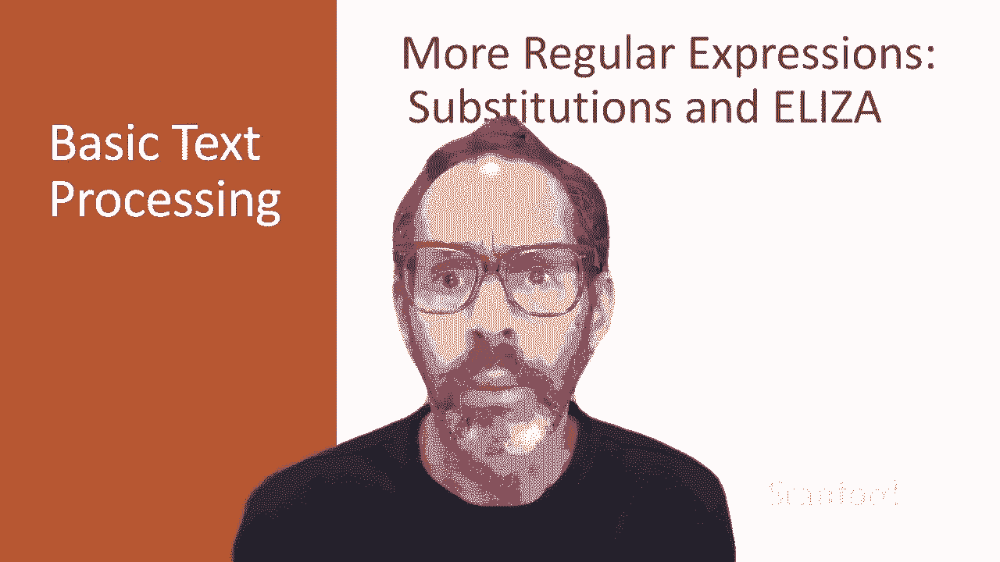

# 二：L1.2 - 正则进阶（替换等操作） 🔄

在本节课中，我们将学习如何使用正则表达式进行字符串的修改操作，特别是替换功能。正则表达式在修改字符串时扮演着非常强大的角色。这种字符串替换是早期最重要的自然语言处理系统之一——1966年的聊天机器人Eliza——的关键组成部分。



---

## 替换语法

替换的语法很简单。例如，在Python中，`re.sub()` 命令可用于将匹配正则表达式的字符串更改为另一个替换字符串。

```python
re.sub(pattern, repl, string)
```

---

## 捕获组

通常，能够引用匹配第一个模式的字符串的特定子集是很有用的。为此，我们可以使用捕获组。捕获组是一种将模式的一部分存储到寄存器中的方法，以便我们稍后可以在替换字符串中引用它。

假设我们想给所有数字（例如这里的35）加上尖括号，即我们希望将“35”替换为“<35>”。

我们可以使用圆括号将模式捕获到寄存器中，寄存器会有编号。我们可以通过编号引用它们，例如 `\1` 将代表寄存器一中的内容。

在替换命令的第一个字符串中，这些圆括号意味着：获取此处的正则表达式（在本例中是一个数字序列）并将其放入寄存器一（因为它是我们替换模式中的第一组圆括号）。然后，在指定要替换成什么时，`\1` 表示我们在第一组圆括号中匹配到的任何内容，接着我们可以添加两个尖括号，从而将“35”转换为“<35>”。

---

## 多个捕获组

在非常复杂的模式中，我们可能需要使用多个寄存器。以下是一个示例，我们可能捕获两个字符串，然后按顺序引用它们（第一个字符串，第二个字符串），接着按顺序引用它们。

我们可以匹配“the faster they ran, the faster we ran”，但无法匹配“the faster they ran, the faster we ate”，因为“ate”与 `\2` 不匹配，而 `\2` 在本例中是字符串“ran”。

---

## 非捕获组

这里存在一个问题：圆括号用于指定捕获组，但它们也是我们对术语进行分组的方式，例如用于像匹配“people”或“cats”的字符串这样的析取表达式。我们如何指定我们使用圆括号仅用于分组而非捕获呢？

我们只需在开括号后添加 `?:`。这里的 `?:` 意味着：将这些括号仅视为分组，而非捕获。因此，这个正则表达式不会捕获匹配“some”或“a few”的任何内容，但会捕获匹配“people”或“cats”的任何内容，并将其放入第一个寄存器 `\1`。所以，这将匹配“some cats”这样的短语，但不会匹配“some some”这样的短语，因为 `\1` 不匹配“some”，它匹配“cats”。因此，第一组括号在寄存器编号和存储方面被忽略。

---

## 前后查找断言

最后，有时我们需要预测未来，在文本中向前查看某个模式是否匹配，但我们不打算推进匹配光标，这样我们可以在模式出现时处理它。这些前后查找断言利用了 `(?...)` 语法，我们刚刚介绍了非捕获组。

- `(?=pattern)` 运算符：如果模式出现，则为真，但它是零宽度的，意味着匹配指针不前进。
- `(?!pattern)` 负向先行断言：仅当模式不匹配时才返回真，同样也是零宽度的。

负向先行断言通常在我们解析某些复杂模式但想要排除特殊情况时使用。例如，这里的最后一个模式匹配行首的任何单个单词，但该单词不以“volcano”开头。

---

## Eliza：一个简单的聊天机器人示例

替换和捕获组在实现像Eliza这样的简单聊天机器人时非常有用。Eliza是最重要的历史性自然语言处理系统之一，由先驱人工智能研究员Joseph Weizenbaum于1966年创建。它模拟了一位罗杰斯式心理学家，一种强调镜像反馈他们所听到内容的治疗师。

Eliza是一个非常简单的程序，仅使用模式匹配来识别像“I need X”这样的短语，并将其转换为合适的输出，例如“What would it mean to you if you got X?”。这种简单技术在这个领域取得了成功，因为Eliza实际上不需要了解任何信息来模仿罗杰斯式心理治疗师。这是少数几种听众可以表现得好像对世界一无所知的对话类型之一。

以下是1966年与Eliza进行示例对话的一些片段。Eliza对人类对话的模仿非常成功。许多与Eliza互动的人开始相信它真正理解了他们和他们的问题。在非常有先见之明的早期工作中，Weizenbaum指出了将人类品质归因于人工代理的伦理问题，我们将在对话讲座中回到这个问题。

Eliza主要由一系列替换模式组成，带有一些用于决定选择哪些模式的控制逻辑，以及一些我们稍后会讨论的更高级别的对话结构。但在这里，我们可以看到捕获组的示例，用于生成我们在上一张幻灯片中看到的字符串。

例如，我们可能会捕获作者用来描述自己的形容词，然后说一些与这些特定形容词相关的内容。或者，当用户使用包含“all”或“always”等词的通用陈述时，使用简单模式来询问更多细节。

---



## 总结



在本节课中，我们一起学习了正则表达式的进阶操作，特别是字符串替换功能。我们探讨了捕获组和非捕获组的使用，了解了如何引用匹配的子字符串。我们还介绍了前后查找断言，这是一种在不消耗字符的情况下检查模式是否匹配的强大工具。最后，我们通过历史性的聊天机器人Eliza的示例，看到了这些技术在实际应用中的价值。正则表达式替换和前后查找等强大工具将在各种场景中发挥作用。稍后，当我们讨论如何构建能够进行对话交互的智能体时，我们将再次回到Eliza的例子。