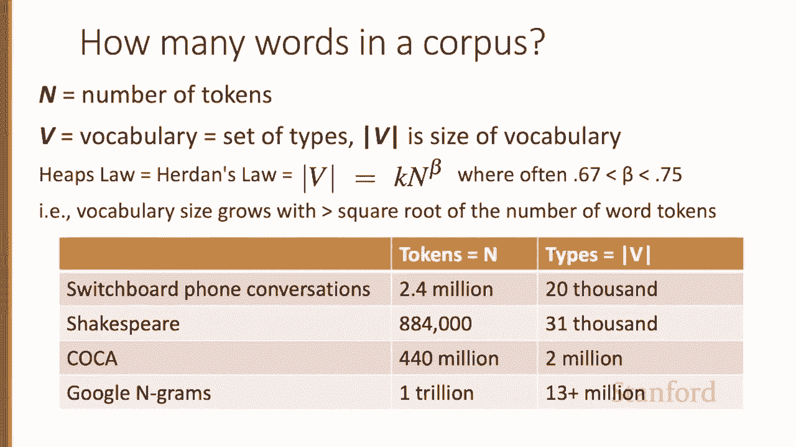
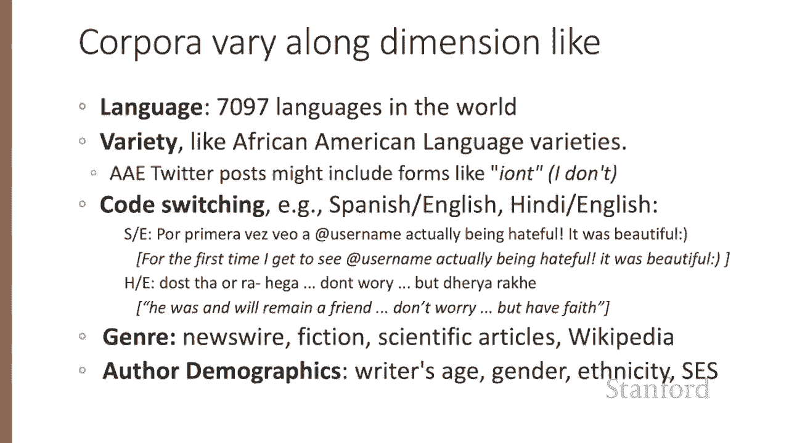
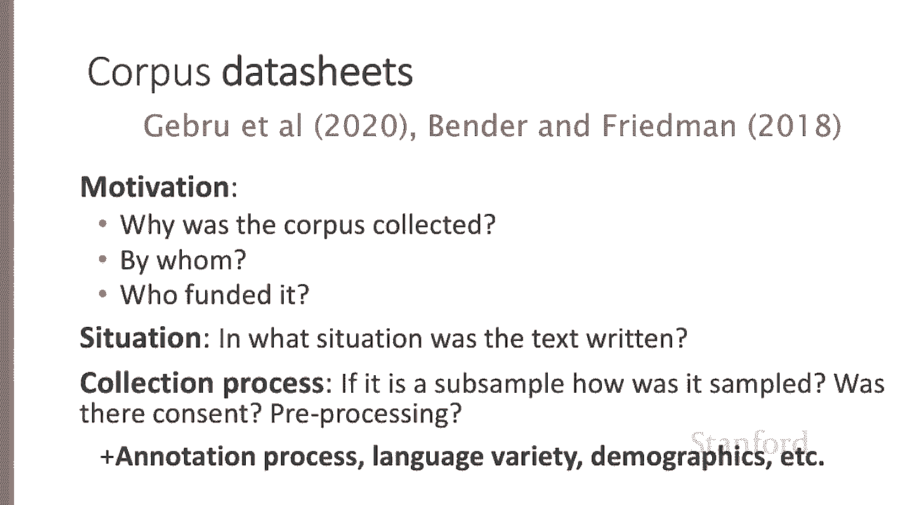

# 三：L1.3 - 词汇与语料集

在本节课中，我们将学习文本处理的基础知识，重点探讨词汇的基本属性（例如，如何计算词汇数量）以及语料集（即文本集合）的概念和不同类型语料集在研究中的特性。

---

## 🔢 如何计算句子中的词汇数量

上一节我们介绍了文本处理的基本概念，本节中我们来看看如何具体计算一个句子中的词汇数量。这是一个看似简单但实际复杂的问题。

例如，考虑这个句子：“I do main... mainly business data processing.” 这个句子有多少个单词？答案取决于我们如何定义“单词”。句子中的“main”是一个片段，而“um”则是一个填充停顿词。在语音识别等特定应用中，我们可能需要计算这些元素。

再看另一个例子：“How many cats are in the cat house?” 这里的“cat”和“cats”是同一个词吗？这引出了**词元**和**词形**的区别。

*   **词元**：指具有相同词干、词性和含义的词汇基本形式。例如，“cat”和“cats”属于同一个词元（CAT）。
*   **词形**：指词汇在文本中出现的具体表面形式，包括所有屈折变化。例如，“cat”和“cats”是不同的词形。

因此，计算词汇时，明确目标是统计词元还是词形至关重要。

---

## 📊 词例与词类型

现在，让我们分析另一个句子片段：“They lay back on the San Francisco grass and looked at the stars and the.” 这个句子有多少个单词？请暂停视频并尝试自己计算。

同样，答案取决于计数方式：

*   **词类型**：指句子中**唯一**出现的不同单词的数量。例如，句子中“the”出现了两次，但作为词类型只计数一次。
*   **词例**：指句子中出现的**每一个**单词实例的总数。例如，两个“the”会分别计数。

此外，“San Francisco”是一个单词还是两个？这同样取决于我们的应用场景和目标。在报告词汇数量时，明确说明使用的是词例数还是词类型数非常重要。

在语料库研究中，我们通常使用以下符号：
*   **N**：代表语料库中的总**词例**数。
*   **V**：代表**词汇表**，即所有唯一**词类型**的集合。词汇表的大小（词类型的数量）记为 **|V|**。

词例数（N）和词类型数（|V|）之间存在一种经验关系，称为**赫普定律**（Heap‘s Law）。该定律指出，词汇表的大小大致与词例数的平方根成正比。公式表示为：

**|V| ≈ k * N^β**

其中，k和β是常数（对于英语文本，β通常在0.6到0.8之间）。这意味着，随着语料库规模（N）的增长，新词出现的速度会逐渐放缓。

---

## 🌍 语料集的多样性及其属性

词汇并非凭空出现在语料库中。任何文本都是由特定的作者、在特定的时间、使用特定的语言变体、为特定的功能而创作的。因此，当我们研究语料集时，需要考虑其多个维度的属性。

以下是影响语料集特性的几个关键维度：

*   **语言与变体**：世界上有约7000种语言，每种语言对“词”的定义可能不同。即使在同一种语言（如英语）内部，也存在不同的变体（如非洲裔美国人白话英语）。
*   **语码转换**：全球多数人使用多种语言，有时会在同一句子中混合使用，这种现象称为语码转换。处理社交媒体等数据时必须考虑这一点。
*   **文体与体裁**：语料集可能包含新闻、小说、非虚构作品、科学论文或维基百科等百科全书文本，不同的文体用词差异很大。
*   **作者人口统计学特征**：作者的年龄、性别、种族和社会经济地位等因素都会影响文本的语言特征。

---

## 📋 语料集数据表的重要性

由于语料集存在上述多样性，在创建或使用一个语料集时，仔细查阅其**数据表**至关重要。数据表应详细记录语料集的元数据，以确保研究的可重复性和伦理性。

一个完整的数据表通常包含以下信息：

*   **动机与目的**：为何以及由谁收集此语料集。
*   **创作情境**：文本在何种情境下创作（如是否与他人对话）。
*   **采集过程**：采样方法、作者是否知情同意。
*   **预处理与标注**：数据经过了哪些清洗、处理，以及是否有任何人工标注（如词性、句法树等）。
*   **基本属性**：涵盖之前提到的语言、变体、体裁、作者信息等。

在构建自己的语料集时，详细记录这些决策同样重要。

---

## ✅ 总结

本节课中，我们一起学习了词汇与语料集分析的核心基础。我们明确了**词例**与**词类型**、**词元**与**词形**的关键区别，并介绍了描述它们规模的符号（N, V, |V|）及**赫普定律**。我们还探讨了语料集的多样性，强调必须关注其语言、变体、体裁、作者和采集背景等属性，并通过**数据表**来规范记录这些信息。理解这些概念是进行任何有意义的文本数据分析的第一步。