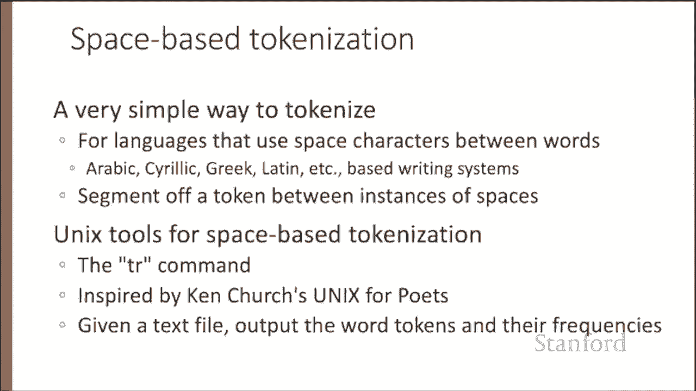
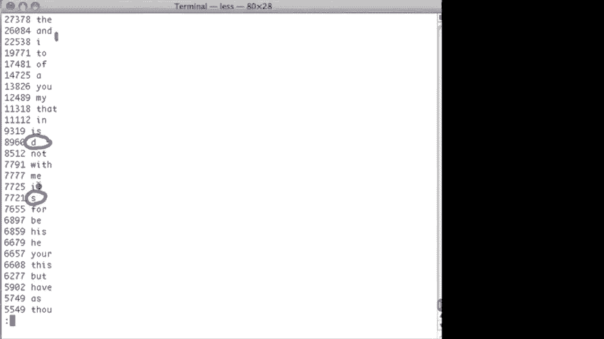
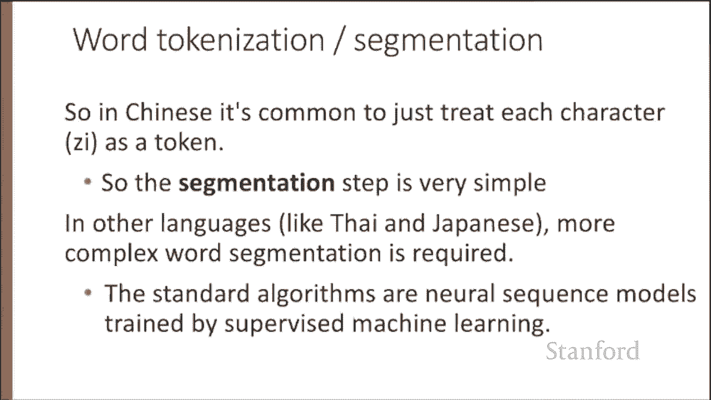

#  四：L1.4 - 分词与预处理 📚

在本节课中，我们将学习文本归一化，这是一个将文本转换为标准单词或句子格式的过程。我们将从**分词**开始，即把文本切分成代表单个单词或词部分的**词元**。这是所有自然语言处理任务的基础步骤。

---

## 🧠 文本归一化概述

每个自然语言处理任务都需要文本归一化。我们通常认为归一化至少涉及三个过程。

*   首先是**分词**或切分出单词。
*   一旦我们完成了分词，就需要将它们**规范化**为一种标准格式。
*   此外，我们还需要切分更大的语块，例如句子，有时甚至是段落。


---



## 🔤 基于空格的分词

分词最简单的方法是使用字符之间的空格。这对于拥有空格字符的语言（例如使用拉丁文字系统、阿拉伯文、西里尔文或希腊文的语言）非常有效。在这种方法中，单词被定义为空格之间的内容。

接下来，我们介绍一些简单的 Unix 工具，用于文本处理，并从 `tr` 命令开始，它对基于空格的分词很有用。我们的目标是获取一个文本文件，并输出词元及其频率。

以下是用于文本处理的一些标准 Unix 工具。这里有一个莎士比亚全集语料库。让我们从提取语料库中的所有单词开始。

我们将使用 `tr` 程序来实现。`tr` 程序接收字符，并将该字符的每个实例映射为另一个字符。我们指定 `tr -c`，这意味着“补集”。即，将所有不属于指定集合的字符转换为另一个字符。

在本例中，是将所有非字母字符转换为换行符。这样，我们将莎士比亚作品中的所有句号、逗号和空格替换为换行，从而创建每行一个单词的格式。

```bash
tr -c 'A-Za-z' '\n'
```

现在，我们已经将这首十四行诗转换为每行一个单词。接下来，我们将对这些单词进行排序。

让我们查看唯一的词型。为此，我们将使用 `sort` 和 `uniq` 程序。`uniq` 程序将接收排序后的文件，并告诉我们每个唯一词型出现的次数。

```bash
sort | uniq -c
```

这样，我们就得到了莎士比亚作品中所有单词及其左侧的计数。这是 `uniq` 程序的输出结果。我们知道，在莎士比亚作品中，大写的 “Achievement” 出现了一次，“Achilles” 出现了 79 次，“acquaint” 出现了六次，依此类推。

如果不仅能按字母顺序查看这些单词，还能按频率顺序查看，那就更好了。让我们获取相同的单词列表，现在按频率重新排序。

```bash
sort -nr
```

现在，我们得到了莎士比亚作品中最常见的单词：“the”，其次是 “I”，然后是 “and”，并且我们拥有莎士比亚作品中的实际计数。这样，我们就得到了按频率排序的莎士比亚词汇表。

这里存在一些问题。一个是单词 “and” 出现了两次，因为我们没有将大写单词映射为小写单词。因此，让我们先修复大小写映射问题。

让我们再次尝试。我们将把莎士比亚作品中的所有大写字母映射为小写字母，然后通过管道传递给另一个 `tr` 程序实例，该实例将所有非字母字符替换为换行符。接着，我们将像之前一样进行排序：使用 `uniq -c` 查找所有独立的词型，然后再次排序，`-n` 表示按数字排序，`-r` 表示从最高值开始。然后，我们将查看结果。

```bash
tr 'A-Z' 'a-z' | tr -c 'a-z' '\n' | sort | uniq -c | sort -nr
```

现在，我们已经解决了 “and” 的问题，因此现在只有小写的 “and”，而不会出现大写的 “and”。但是，我们遇到了另一个问题。我们这里有一个 “d”。为什么 “d” 或 “s” 在莎士比亚作品中如此频繁？



---

## ⚠️ 分词中的复杂情况

当然，在大多数实际情况中，分词并不像使用简单的 Unix 工具所建议的那样简单。

一个问题是你不能盲目地删除标点符号，因为有些单词的标点符号是单词的一部分，例如 **Ph.D.** 或 **A&T**。存在许多这类标点符号与分词交互的情况。

*   价格可能包含美元符号、句点或欧元符号。
*   日期可能包含斜杠或破折号。
*   当然，网址、话题标签和电子邮件地址都包含标点符号，必须以特殊方式处理。

另一个问题是**附着语**。附着语是一个不能独立存在的单词。例如，英语单词 “we’re” 中的 “’re” 是缩略形式并附着在 “we” 上；或者在法语中，单词 “l’homme” 中的 “l’” 倾向于附着在相邻的单词上。对于这些附着语，我们必须决定是否要将它们作为单独的单词分离出来。

关于什么算作一个单词的问题也适用于**多词表达式**。例如，“New York” 应该算作一个单词还是两个单词？“rock and roll” 是一个单词还是三个单词？

因此，大多数针对英语或具有类似书写系统的语言的标准分词程序都会处理每个这些问题。例如，自然语言工具包中有一个简单的 Python 分词器，它使用小型正则表达式来处理连字符、缩写、货币符号等。

---

## 🌏 无空格语言的分词

但是，对于那些单词之间没有空格的语言呢？许多语言，如中文、日文、泰文等，不使用空格来分隔单词。在这些语言中，我们如何决定词元边界应该在哪里？

让我们以中文分词为例。中文单词由称为“汉字”的字符组成，每个字符代表一个称为**语素**的意义单位（我们将在后面讨论语素）。每个单词平均由大约两个半字符组成，但在中文中，决定什么算作一个单词是复杂的，并且没有一致的意见。

想象以下中文句子：“姚明进入东决赛”，意思是“Yao Ming reaches the finals”。

*   这是三个词吗？`[姚明] [进入] [东决赛]`
*   也许是五个词？`[姚] [明] [进入] [东] [决赛]`（也许我们将姚明的姓和名分开，也许“决赛”真的包含两部分：“总”和“决赛”的其余部分？）
*   或者我们可以完全将其切分为字符。`[姚] [明] [进] [入] [东] [决] [赛]`（现在，“进入”这个词的两个部分，它们本身都是动词，变成了独立的单词。所以，一切都变成了一个字符。）

事实上，最后一种解决方案非常常见。在中文中，将字符视为词元是非常普遍的。这样，分词就变得非常简单。

但在其他语言，如泰文和日文中，则需要更复杂的词语切分。在这里，标准的算法是通过监督机器学习训练的神经序列模型，我们将在课程后面讨论这些内容。

---

## 📝 课程总结




在本节课中，我们一起学习了分词作为文本归一化的重要步骤。我们介绍了两种基线方法：**基于空格的分词**和**基于字符的分词**。在未来的课程中，我们将转向更先进的方法。