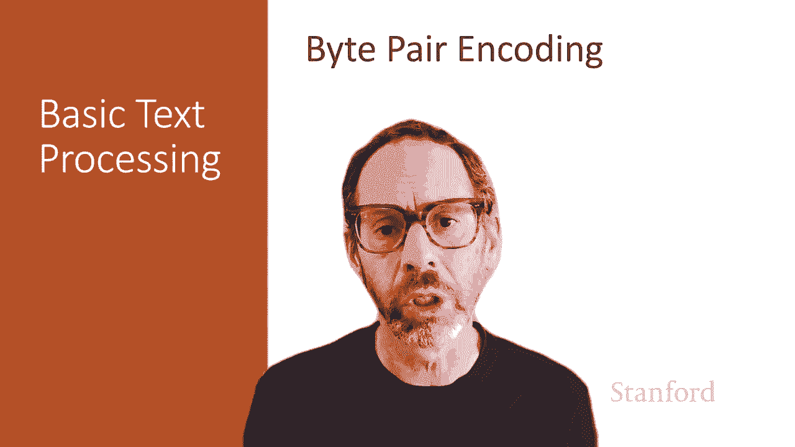
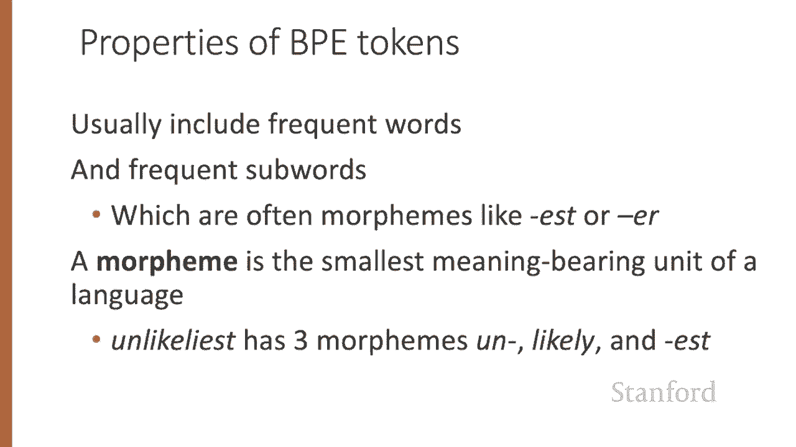
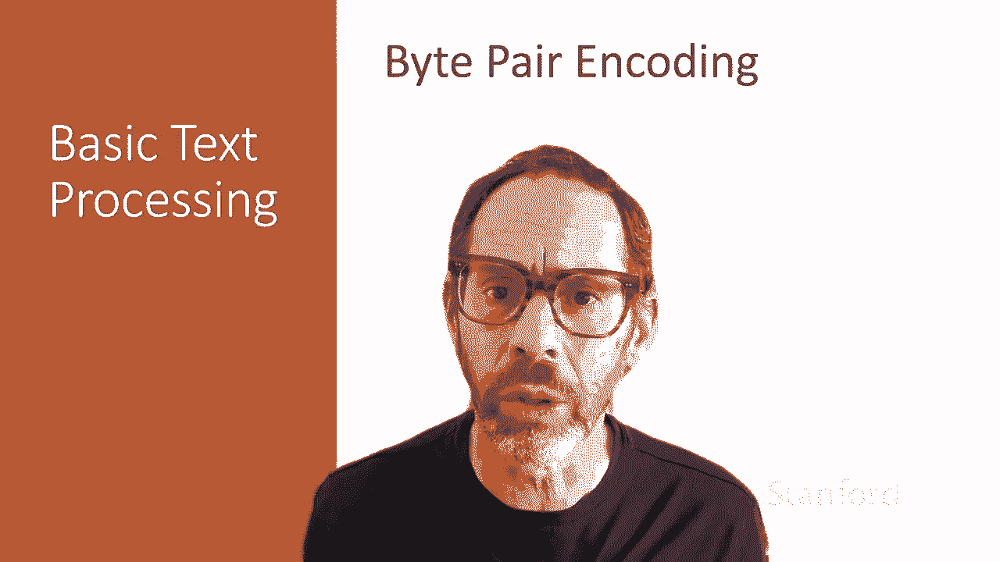

# 五：L1.5 - 字节对编码 (BPE) 🧩



在本节课中，我们将学习**字节对编码**算法。这是一种基于语料库统计，将文本切分成词元的方法。

上一节我们介绍了基础的按空格或字符分词的方法。本节中我们来看看如何利用数据本身来指导分词过程。这类算法通常被称为**子词分词**，因为生成的词元既可以是完整的单词，也可以是单词的一部分。

## 算法概述

字节对编码等子词分词算法通常包含两个部分：
1.  **词元学习器**：接收训练语料库，并归纳出一个词元词汇表。
2.  **词元切分器**：根据从训练语料库学到的词汇表，对新的测试句子进行分词。

接下来，我们先详细介绍词元学习器的核心步骤。

## 词元学习器：构建词汇表

我们从一个初始词汇表开始，它包含语料库中所有独立的字符。

以下是构建词汇表的核心步骤：

1.  我们首先在训练语料库中找出**出现频率最高**的相邻符号对（例如字母A和B）。
2.  然后，我们将这个新组合“AB”作为一个**新的符号**添加到词汇表中。
3.  接着，我们在整个训练语料库中，将所有相邻的“A B”替换为这个新符号“AB”。
4.  我们将重复以上步骤K次，K是算法的一个参数。

我们可以用更形式化的方式描述这个过程：

```python
# 伪代码描述
初始化词汇表 V = 语料库中所有唯一字符
for i in range(K): # 进行K次合并
    在语料库C中找到出现频率最高的相邻词元对 (X, Y)
    创建新词元 Z = X + Y
    将 Z 加入词汇表 V
    将语料库C中所有相邻的 (X, Y) 替换为 Z
返回最终词汇表 V
```

## 一个重要的补充：词尾标记

在实践中，大多数子词分词算法会在以空格分隔的单词内部运行。因此，我们通常会在分词前，在每个空格前添加一个特殊的**词尾标记**（常用下划线 `_` 表示）。

让我们通过一个具体的例子来理解整个过程。

## 实例演示

假设我们有如下语料库：
`low low low low lowest newer newer newer newer newer wider wider wider new new`

首先，我们在每个空格前添加词尾标记 `_`，得到：
`low_ low_ low_ low_ lowest_ newer_ newer_ newer_ newer_ newer_ wider_ wider_ wider_ new_ new_`

初始词汇表包含所有唯一字符：`{d, e, i, l, n, o, r, s, t, w, _}`。

为了方便演示，我们用计数方式表示语料库：
*   `low_` 出现 5 次
*   `lowest_` 出现 1 次
*   `newer_` 出现 5 次
*   `wider_` 出现 3 次
*   `new_` 出现 2 次

现在，我们开始执行合并步骤：

1.  **第一轮合并**：找出最常相邻的字符对。`e` 和 `r` 相邻出现了 9 次（在 `newer_` 和 `wider_` 中）。我们将它们合并为新符号 `er`，加入词汇表，并替换语料库中所有 `e r` 为 `er`。
2.  **第二轮合并**：现在，最常相邻的是新符号 `er` 和词尾标记 `_`，出现了 9 次。合并为 `er_` 并加入词汇表。
3.  **后续合并**：继续此过程。接下来合并 `n` 和 `e` 为 `ne`，然后合并 `ne` 和 `w` 为 `new`，接着合并 `l` 和 `o` 为 `lo`，再合并 `lo` 和 `w` 为 `low`，等等。

经过多轮合并后，我们的词汇表将包含原始字符以及诸如 `er`, `er_`, `ne`, `new`, `lo`, `low`, `low_` 等新词元。

## 词元切分器：应用至新文本

在训练阶段，我们基于训练语料库的频率确定了合并的顺序。在测试阶段，我们将**贪婪地**按照这个学到的顺序应用这些合并规则，而不再考虑测试文本中的频率。

例如，对于测试字符串 `newer_`：
*   首先应用第一条规则：将 `e r` 合并为 `er`，得到 `ner_`。
*   然后应用后续规则，最终可能被分词为完整的词元 `newer_`（如果该词元已在词汇表中）。

对于测试字符串 `lower_`：
*   应用规则后，可能会被分词为两个词元：`low` 和 `er_`，因为词汇表中不存在 `lower_` 这个完整的词元。

## BPE 的特点

生成的 BPE 词元具有以下特点：
*   **高频词**通常会被保留为完整词元。
*   **高频子词**（通常是词缀）也会成为独立词元，例如 `-er`, `-est`。
*   这些子词常常对应语言的**语素**（最小的意义单位）。例如单词 `unlikely` 包含语素 `un-`, `like`, `-ly`。BPE 算法有较大可能识别出这些语素，尽管并非总是如此。



## 总结



本节课中我们一起学习了**字节对编码**算法。它是一种基于语料库统计的子词分词方法，通过不断合并高频相邻符号对来构建词汇表，并能有效地将新文本切分成词元。BPE 及其变体（如 WordPiece）在自然语言处理领域被广泛使用，是许多现代 NLP 模型（如 BERT、GPT）分词的基础。