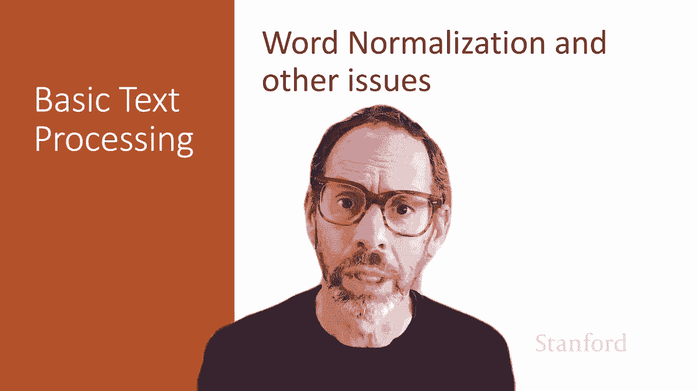
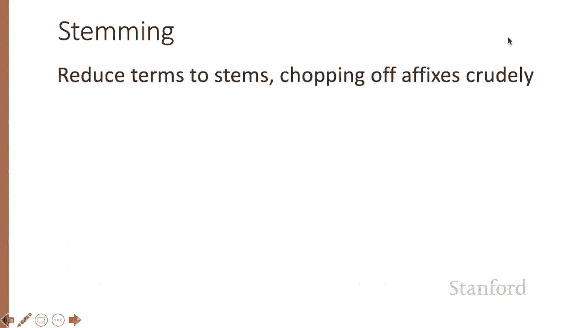
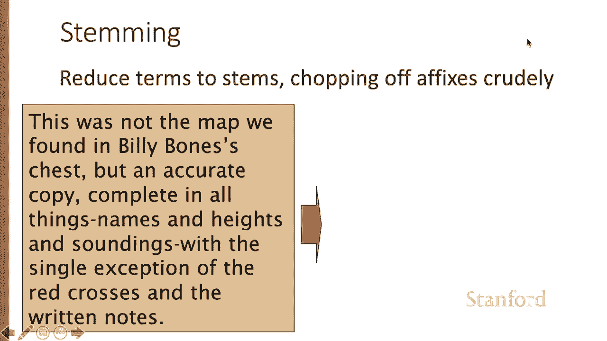
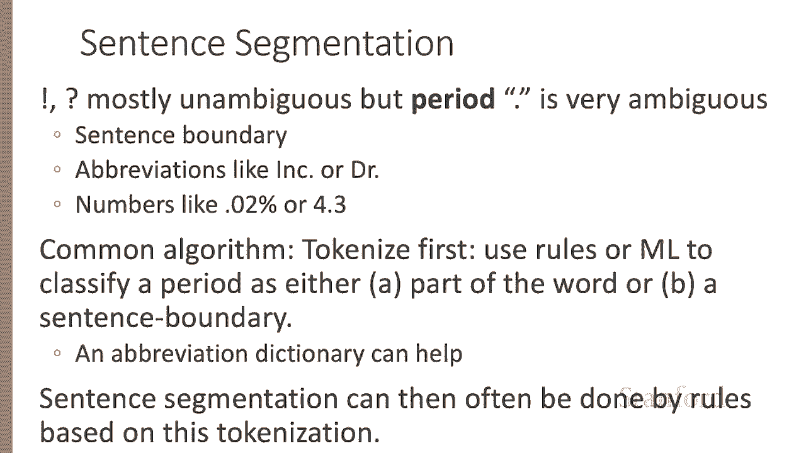
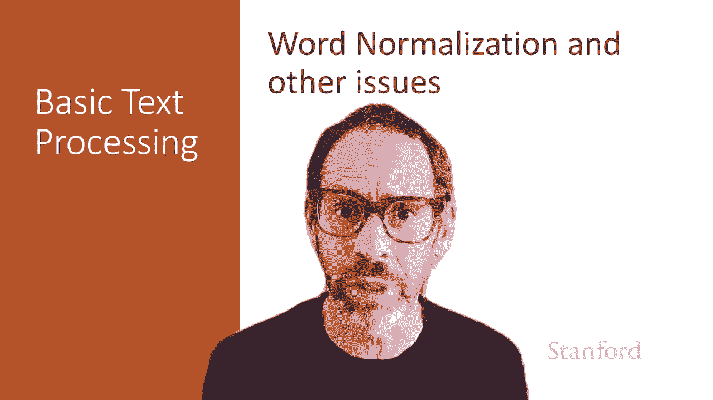

#  六：L1.6 - 词归一化与其他相关议题 📚

在本节课中，我们将要学习如何将文本中的词汇转换为标准格式，这个过程称为词归一化。我们还将讨论句子分割，即将文本语料库分解为更大的话语单元，如句子或段落。

---

## 🔤 词归一化概述

词归一化是将词汇置于标准格式的过程，这需要我们做出一些决策。例如，我们应该将“USA”表示为“U.S.A.”还是“USA”？我们需要选择一个标准格式，之后无论遇到哪种形式，都将其映射为我们决定的标准形式。

许多类似的决策需要处理。例如，在转录语音时，如果有人说“a”，这个单词是否应该包含连字符？此外，我们还需要考虑词元。我们之前讨论过词形（如“am”、“are”）和词元（如“be”）。何时应该保留词形，何时又应该进行词形还原？

---

## 🔠 大小写折叠

我们还需要决定是否进行大小写折叠。例如，在信息检索中，将所有字母转换为小写是非常常见的做法。用户在搜索引擎中输入的查询通常使用小写。因此，如果我们要将用户的输入与搜索的语料库进行匹配，将其映射为小写是安全的。

一个可能的例外是，如果用户在句子中间输入了大写字母，我们可能希望利用这些信息来帮助决定如何搜索他们寻找的文本。但对于大多数自然语言处理应用，如情感分析、信息提取和机器翻译，大小写确实很重要。例如，在英语中，大写的“US”与小写的“us”含义截然不同。

---

## 📖 词形还原

另一个归一化决策是是否进行词形还原。词元是一个词的共享词根，也对应于字典中的词目。例如，我们可能将“am”、“are”映射为词目“be”，或将“car’s”映射为单词“car”。在像西班牙语这样比英语有更多屈折变化的语言中，例如“quiero”（我想要）或“quieres”（你想要），我们会将其映射为不定式形式“querer”，这就是词元。

对一个句子进行词形还原，例如“He is reading detective stories.”，我们会得到“He be read detective story.”。这样，我们去除了复数形式，并将“reading”还原为“read”等。

词形还原是通过形态分析完成的。形态素是构成词的最小意义单位，我们通常区分两种形态素：词干（承载核心意义的单位）和词缀（附加在词干上，通常具有某种语法功能的部分）。形态分析器的任务是将一个词分解为形态素。例如，“cats”有词干“cat”和词缀“-s”。分析器的任务就是将“cats”分解为“cat”和“-s”。更复杂的情况，如西班牙语“amarían”（他们将会爱），我们会将其分解为词干“am-”和表示第三人称复数、将来时虚拟式的形态特征。

---

## ✂️ 词干提取

词干提取是词形还原的一种简化形式。在词干提取中，我们不是映射到真正的形态词元，而是简单地、粗略地截断词缀。这种方法具有简单性的优势。

例如，如果我们有以下句子作为输入：
> This was not the map we found in Billy Bones’s chest, but an accurate copy.

运行词干提取器后，我们会得到非常粗糙的输出。它做了一些有用的处理，例如，它将“heights”去掉了“s”得到“height”，这是一个很好的词形还原操作。它将“soundings”变成了“sound”，去掉了“-ings”。但它也去掉了“was”上的“s”，这就不太有用了。它还将所有结尾的“y”改成了“i”，并去掉了所有“-ate”结尾，所以“accurate”变成了“accur”。同样，“exception”变成了“except”。结果是，我们以牺牲精确度为代价提高了召回率。我们可能会找到更多我们正在寻找的单词，但也可能会找到一些我们可能并不寻找的单词。

词干提取的一个标准算法称为波特词干提取器。波特词干提取器非常简单，基于一系列按顺序运行的改写规则。例如，它会有这样的规则：将“-ational”变为“-ate”，或移除“-ing”，但仅当前面有元音时。所以输入“motoring”，如果我们在这里看到一个元音如“o”，现在我们可以移除“-ing”。或者，将“-sses”变为“-ss”。所以对于像“grasses”这样的词，可以移除“-es”。

然而，对于许多语言，这些简单的方法并不适用。许多语言具有非常复杂的形态。例如，土耳其语是一种具有黏着性形态的语言，由许多形态素构成非常长的单词。著名的例子是土耳其语单词，意思是“表现得好像你是我们无法文明化的那些人之一”。它包含“文明化”、“导致”、“不能”、“过去时”、“复数”等形态素。因此，处理具有复杂形态的语言需要更丰富的形态分析算法。

---

## 🔗 句子分割

最后，我们通常希望将文本分解为更大的话语块，如句子。在英语句子分割中，通常可以仅依靠结尾标点来做很多工作。如果你看到一个感叹号或问号，很可能就是句子的结尾。然而，句号则有些歧义。句号可以表示句子边界，但也可以是缩写的一部分，如“Inc.”或“Dr.”，或者数字中的小数点。

一个常见的算法是首先进行分词。我们将使用规则或构建一个机器学习分类器，将句号分类为单词的一部分（如“Dr.”或“Inc.”或数字中的句点）或句子边界。我们的分类器做出这个决策，为此，拥有一个缩写词典可能会有所帮助。如果我们有该语言中像“Inc.”和“Dr.”这样的单词列表，那将对分类决策有用。

然后，基于这个更复杂的分词任务，我们根据非常简单的规则进行句子分割。

---

## 📝 总结

在本节课中，我们一起学习了词归一化与句子分割。词归一化是将词汇转换为标准格式的关键步骤，涉及大小写折叠、词形还原和词干提取等决策。句子分割则是将文本分解为有意义的句子单元，通常依赖于标点符号和上下文信息。这些步骤是文本处理的重要基础，为后续的自然语言处理任务（如信息检索、情感分析和机器翻译）做好准备。