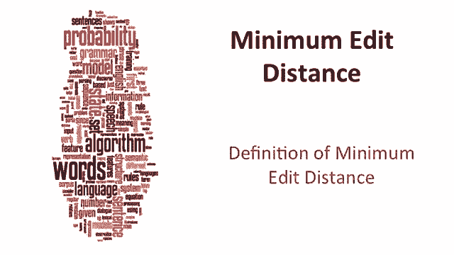
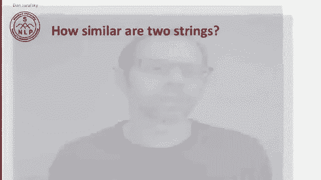
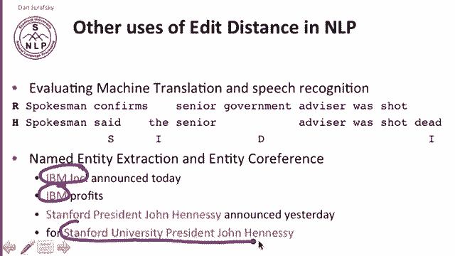
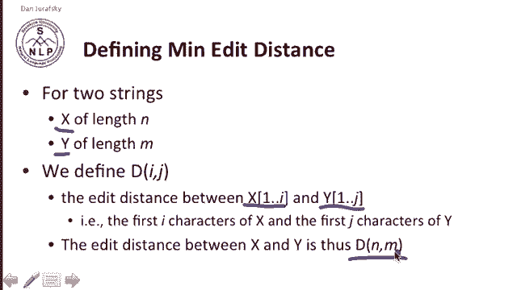
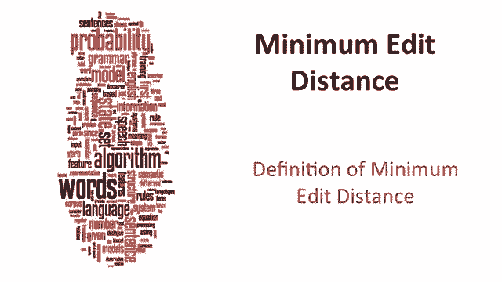

# 七：L2.1 - 最小编辑距离定义 📏

在本节课中，我们将学习**最小编辑距离**的定义。最小编辑距离是衡量两个字符串相似度的一种方法，它在拼写纠错、计算生物学和机器翻译等多个领域都有广泛应用。

## 什么是字符串相似度问题？ 🤔

最小编辑距离是解决字符串相似度问题的一种方式。它衡量两个字符串有多相似。

让我们看一个具体例子：拼写纠错。用户输入了“GRAFFE”，他们真正想输入的是什么？将这个问题具体化的一种方法是，询问以下哪个单词与用户输入的字母更接近：`graph`、`giraffe` 还是 `giraffe`。

字符串相似度问题也出现在计算生物学中。我们拥有核苷酸序列（如 ACGT），并试图进行比对。一个好的比对应该能告诉我们，来自两个样本的两个特定序列以某种方式对齐，并存在一定误差。

这种字符串或序列相似性的概念，在机器翻译、信息抽取和语音识别等领域也普遍存在。

## 编辑距离的定义 📝

两个字符串之间的**最小编辑距离**，是指将一个字符串转换为另一个字符串所需的最少编辑操作次数。

编辑操作通常包括以下三种：
*   **插入**：添加一个字符。
*   **删除**：移除一个字符。
*   **替换**：将一个字符替换为另一个字符。

你可以想象更复杂的操作，比如**换位**或长距离移动，但我们通常避免使用这些。

例如，我们有字符串 `intention` 和 `execution`。下图展示了一种对齐方式，显示了许多字母通过一些替换操作对齐，并且存在一些空缺。`execution` 中的字母 `C` 与一个空缺对齐，`intention` 中的字母 `I` 也与一个空缺对齐。

我们可以将这种对齐看作是一系列生成该对齐的操作集合。

要将 `intention` 转换为 `execution`，我们需要：
1.  删除 `I`。
2.  将 `n` 替换为 `E`。
3.  将 `T` 替换为 `x`。
4.  插入 `C`。
5.  将 `n` 替换为 `U`。

其余字母 `E`、`T`、`I`、`O`、`N` 都相同。因此，如果每个操作的成本为 1，那么编辑距离就是 5。

如果替换操作的成本为 2（这被称为 **莱文斯坦距离**，其中插入和删除成本为 1，替换成本为 2），那么这两个字符串之间的距离就是 8。

## 编辑距离的应用场景 🌍

上一节我们介绍了编辑距离的基本定义，本节中我们来看看它在不同领域的具体应用。

### 在计算生物学中

我们见过碱基序列，我们的任务是找出这个 `A` 与那个 `A` 对齐，这个 `G` 与那个 `G` 对齐，等等。例如，这里的 `C` 与那里的空缺对齐，这表明存在某种插入操作。我们同样可以通过显示字符之间的对齐线来表示这种对齐关系。

因此，在生物学中的任务是：给定两个序列，将每个字母与另一个序列中的字母或空缺进行对齐。

### 在机器翻译中

编辑距离在机器翻译中无处不在。例如，我们想衡量一个机器翻译系统的表现如何。

假设我们的机器翻译系统将某个中文句子翻译为：“the spokesman said the senior advisor was shot dead”。而人类专家翻译的版本是：“spokesman confirmed senior government advisor was shot”。

我们可以通过计算两个句子之间有多少单词发生了变化来衡量它们的差异：
*   **替换**：`confirmed` 被替换为 `said`。
*   **插入**：单词 `the` 和 `dead`。
*   **删除**：单词 `government`。

因此，通过将机器翻译结果与人工翻译进行比较，可以衡量机器翻译的质量。

### 在命名实体识别中

在命名实体识别等任务中，我们想知道 `IBM Inc.` 和 `IBM` 是否是同一个实体，或者 `Stanford University President John Hennessy` 和 `Stanford President John Hennessy` 是否是同一个实体。

我们可以使用编辑距离来发现它们非常相似，只有一个单词不同。通过测量单词差异的数量，我们可以提高命名实体识别及其他任务的准确性。

## 如何寻找最小编辑距离？ 🧠

好了，那么我们如何找到这个最小编辑距离呢？

算法的直觉是搜索一条**路径**。这里的路径指的是从起始字符串到最终字符串的一系列编辑操作序列。

以下是搜索路径的要素：
*   **初始状态**：我们要转换的单词。
*   **操作符集合**：插入、删除、替换。
*   **目标状态**：我们想要得到的单词。
*   **路径成本**：到达目标所需的编辑次数，这是我们试图最小化的目标。

例如，从 `intention` 出发，路径的一部分可以是：删除一个字母得到 `ntention`，插入一个字母得到 `eintention`，或者替换一个字母得到 `ntention`。这些都是从 `intention` 出发，最终可能通过无数种方式转换成其他字符串的路径片段。

所有可能序列的搜索空间是巨大的，因此我们不能天真地遍历所有序列。解决这个“大量可能路径”问题的直觉在于，许多路径最终会到达相同的中间状态。因此，如果两个字符串的第二部分相同，我们不必记录每一种转换方式，只需保留到达每个已访问状态的最短路径即可。

## 最小编辑距离的形式化定义 🔢

上一节我们介绍了寻找最小编辑距离的直观思路，本节中我们来看看它的形式化定义。

我们将最小编辑距离形式化定义如下：

对于两个字符串，设字符串 `X` 的长度为 `N`，字符串 `Y` 的长度为 `M`。

我们定义一个距离矩阵 `D[i][j]`，它表示字符串 `X` 的前 `i` 个字符（1 到 i）与字符串 `Y` 的前 `j` 个字符（1 到 j）之间的编辑距离。

因此，整个两个字符串之间的距离将是 `D[N][M]`，因为字符串的长度分别是 N 和 M。

以上就是我们对最小编辑距离的定义。

## 总结 📚

本节课中我们一起学习了**最小编辑距离**。我们首先了解了它如何用于衡量字符串相似度，并给出了其正式定义，即通过最少的插入、删除和替换操作次数来转换字符串。我们还探讨了它在拼写纠错、计算生物学、机器翻译和命名实体识别等多个领域的应用。最后，我们介绍了寻找最小编辑距离的基本算法思路及其形式化定义，为后续学习具体的动态规划算法打下了基础。