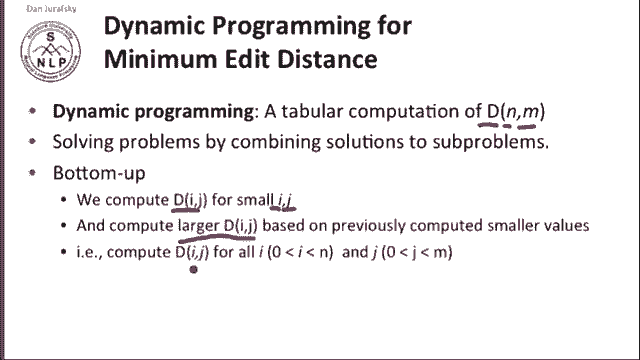
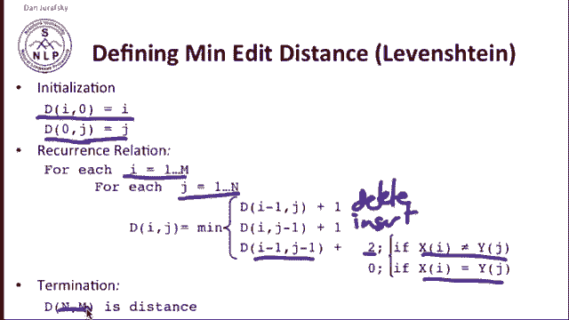
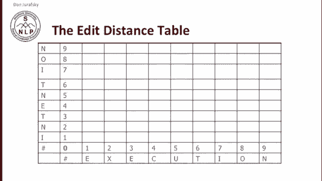
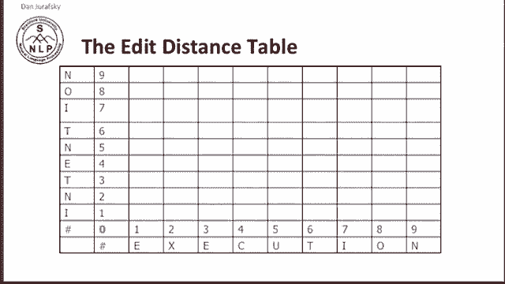
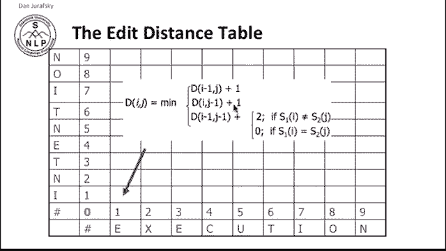
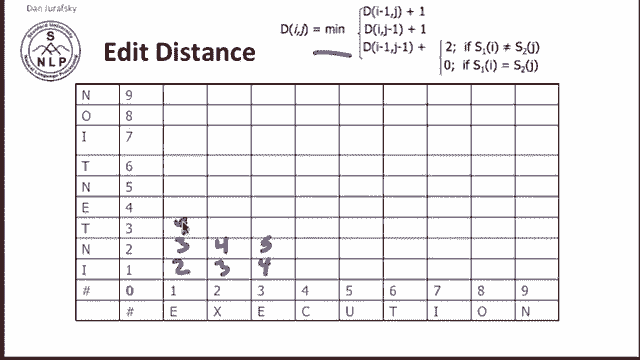

# 八：L2.2 - 最小编辑距离计算 📘

在本节课中，我们将学习如何计算两个字符串之间的最小编辑距离。最小编辑距离是指将一个字符串转换为另一个字符串所需的最少编辑操作次数，这些操作通常包括插入、删除和替换。我们将重点介绍使用动态规划这一标准算法来解决此问题。

动态规划是一种表格化的计算方法。其核心思想是通过组合子问题的解来求解原问题。具体来说，我们将通过计算字符串 **X**（长度为 **n**）和字符串 **Y**（长度为 **m**）的所有前缀子串之间的距离，来逐步推导出整个字符串之间的距离。

我们将为字符串 **X** 的长度为 **i** 的前缀和字符串 **Y** 的长度为 **j** 的前缀计算距离 **D[i][j]**。最终，**D[n][m]** 即为两个完整字符串之间的最小编辑距离。

接下来，我们来看定义最小编辑距离的具体公式。这里我们以莱文斯坦距离为例，其操作成本定义为：插入成本为 **1**，删除成本为 **1**，替换成本为 **2**。

首先，我们定义初始化条件。对于字符串 **X** 的前 **i** 个字符，将其转换为空字符串的成本是删除所有这些字符的成本，即 **i**。同理，将空字符串转换为字符串 **Y** 的前 **j** 个字符的成本是插入这些字符的成本，即 **j**。

初始化公式如下：
*   **D[i][0] = i**
*   **D[0][j] = j**

然后，我们定义递推关系。在填充动态规划表格时，任意单元格 **D[i][j]** 的值可以通过三种先前状态推导出来，我们取其中成本最小的路径：
1.  从 **D[i-1][j]** 而来，表示删除 **X** 的第 **i** 个字符，成本为 **D[i-1][j] + 1**。
2.  从 **D[i][j-1]** 而来，表示在 **Y** 中插入一个字符，成本为 **D[i][j-1] + 1**。
3.  从 **D[i-1][j-1]** 而来，表示将 **X** 的第 **i** 个字符替换为 **Y** 的第 **j** 个字符。如果这两个字符相同，则替换成本为 **0**；如果不同，则成本为 **2**。因此，总成本为 **D[i-1][j-1] + (0 或 2)**。

递推公式总结如下：
**D[i][j] = min( D[i-1][j] + 1, D[i][j-1] + 1, D[i-1][j-1] + (0 if X[i]==Y[j] else 2) )**

最终，两个字符串之间的最小编辑距离即为表格右下角的值：**D[n][m]**。

现在，我们可以根据上述公式来填充整个动态规划表格。每个单元格的值都依赖于其上方、左方和左上方的单元格。

让我们以字符串 **“intention”** 和 **“execution”** 为例进行演算。

首先初始化表格。**D[0][0]** 表示两个空字符串之间的距离，显然为 **0**。第一行表示将空字符串转换为 **“execution”** 的前缀所需的插入成本。第一列表示将 **“intention”** 的前缀转换为空字符串所需的删除成本。

现在计算 **D[1][1]**，即字符串 **“i”** 到 **“e”** 的距离。根据公式，我们需要计算三个值：
*   **D[0][1] + 1** = 1 + 1 = 2 （从“”到“e”后，再删除“i”）
*   **D[1][0] + 1** = 1 + 1 = 2 （从“i”到“”后，再插入“e”）
*   **D[0][0] + (2)** = 0 + 2 = 2 （将“i”替换为“e”，成本为2）

三者最小值是 **2**，因此 **D[1][1] = 2**。

按照此方法，我们可以逐步填充整个表格。例如，**D[4][3]** 表示将 **“inte”** 转换为 **“exe”** 的最小编辑距离。

最终，我们得到完整的动态规划表格。表格右下角单元格 **D[9][9]** 的值 **8**，就是将 **“intention”** 转换为 **“execution”** 所需的莱文斯坦距离。

**莱文斯坦距离 = 8**

这就是计算最小编辑距离的标准动态规划算法。

---

本节课中，我们一起学习了最小编辑距离的概念及其核心算法——动态规划。我们了解了如何通过初始化条件和递推关系来填充一个动态规划表格，从而高效地计算出两个字符串之间的最小编辑距离。通过 **“intention”** 到 **“execution”** 的实例演算，我们直观地看到了算法每一步的执行过程。