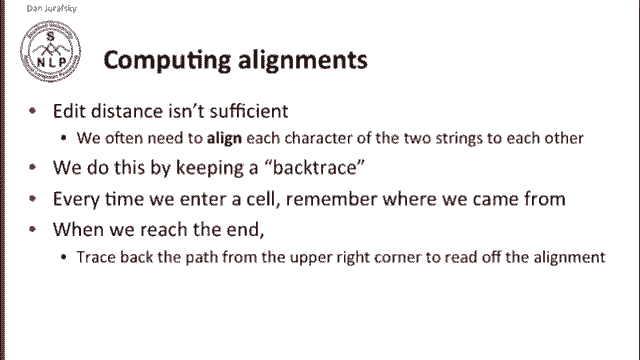
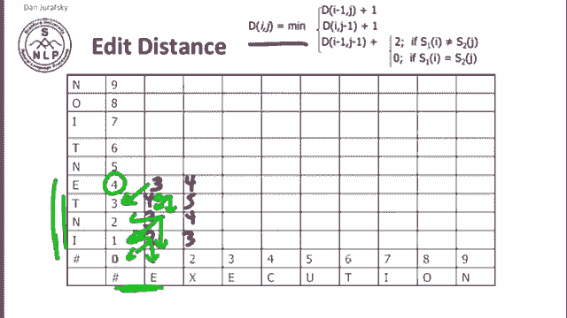
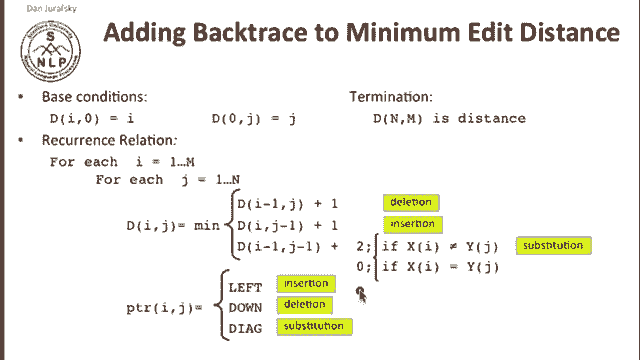
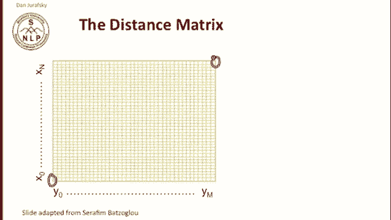
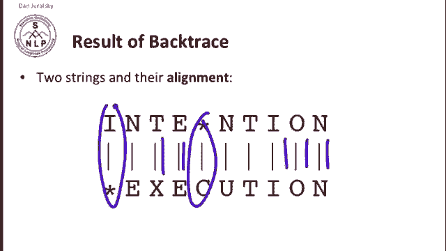
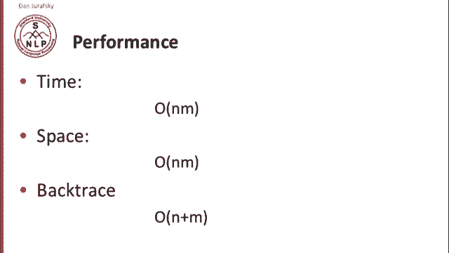

# 九：L2.3 - 回溯与对齐计算 📝


在本节课中，我们将要学习如何计算两个字符串之间的编辑距离，并进一步学习如何获取它们之间的具体对齐方式。对齐能告诉我们一个字符串中的每个符号如何对应到另一个字符串中，这在拼写检查、机器翻译乃至计算生物学等应用中都非常重要。

## 为什么需要对齐？🔍

知道两个字符串之间的编辑距离很重要，但这通常还不够。

我们常常需要更多信息，即两个字符串之间的对齐关系。

我们想知道字符串 X 中的哪个符号对应字符串 Y 中的哪个符号，这对于编辑距离的任何应用都很重要，从拼写检查到机器翻译，甚至在计算生物学中也是如此。

计算这种对齐的方法是保留一个回溯指针。



回溯指针是一个简单的指针，当我们填充动态规划矩阵的每个单元格时，它会记录我们是从哪个单元格转移过来的。当我们到达矩阵的右上角（即最终结果）时，我们可以利用这些指针一路回溯，从而读出完整的对齐方式。

## 回溯在实践中如何工作？🧩

让我们看看这在实践中如何运作。我们再次给出编辑距离中每个单元格的计算公式。

以下是计算每个单元格值的核心公式：

```
D[i][j] = min(
    D[i-1][j] + 1,      # 删除
    D[i][j-1] + 1,      # 插入
    D[i-1][j-1] + cost  # 替换（cost: 字符相同为0，不同为2）
)
```

如果我们填入之前看到的一些值，我们可以开始分析。

我们可以问，这个值 2 是如何得到的？

2 是我们从三个可能的值中选取的最小值。这个 2 是字符串 “I” 和 “E” 之间的距离。

我们通过以下方式得到它：要么是空字符串与 “E” 的对齐距离加上插入一个额外的 “I” 的成本（即 1 + 1 = 2），要么是 0 + 2 = 2，要么是 1 + 1 = 2。

所以我们有三个不同的来源值。如果我们问我们是从哪条最小路径来的，实际上它们都一样，我们可以来自其中任何一个。对于值 3 也是如此，我们计算它为 2+1、1+2 或 2+1 的最小值，所以它可能来自这里、这里或这里。类似地，对于其他单元格也是如此。

这里我们有一个距离差异。字符串 “INTE” 和 “E” 之间的距离。我们可以通过计算将 “INTE” 转换为空字符串的成本，然后为 “E” 添加一次插入来计算，但那样会是 4 + 1 = 5，成本很高。实际上，从 “INTE” 到 “E” 有一个更便宜的方法，那就是匹配这个 “E” 和那个 “E” 的成本为 0。所以，之前 “INT” 与空字符串的对齐距离是 3，我们加上 0 就得到了 3。

因此，这个值 3 的最小路径明确地来自那个值 3。虽然在有些情况下，一个单元格可能来自多个地方，但在这个例子中，它明确地来自前一个 3。



## 构建回溯指针矩阵

我们要为数组中的每个单元格都进行这个操作。

结果将类似于这样，对于每个单元格，我们都标明了它所有可能的来源。你会看到，在很多情况下，任何路径都可能成立。例如，这个 6 可能来自任何地方。

但关键的是，这个最终的对齐结果，即表示 “intention” 和 “execution” 之间最终编辑距离的 8，我们的回溯告诉我们它来自 “intentio” 和 “executio” 的最佳对齐，而后者又来自 “intenti” 和 “executi” 的最佳对齐，依此类推。


因此，我们可以沿着这条路径回溯，得到一个对齐结果，告诉我们这个 “N” 匹配那个 “N”，这个 “O” 匹配那个 “O”，等等。但可能在这里我们有一个插入操作，而不是一个完美的对齐。

计算回溯非常简单。

我们采用之前见过的最小编辑距离算法。

这里我已经为你标记了各种情况。当我们查看一个单元格时，我们可能在进行删除、插入或替换操作。

我们只需添加指针：在插入的情况下，我们指向左边；在删除的情况下，我们指向下方；在替换的情况下，我们指向对角线。我在之前的幻灯片上已经用箭头展示了这一点。



## 对齐路径与最优子结构

我们可以观察这个距离矩阵，并思考从起点到终点的所有路径。

从起点到点 (n, m) 的任何一条非递减路径，都对应于两个序列的某种对齐方式。

一个最优的对齐，是由最优的子序列对齐组成的。

正是这个思想，使得使用动态规划来解决这个任务成为可能。

我们回溯的结果是两个字符串以及它们之间的对齐关系。

因此，我们将知道哪些部分是完全匹配的，哪些部分是通过替换对齐的，以及何时应该进行插入或删除操作。




## 算法性能分析 ⚙️

这个算法的性能如何？


在时间复杂度上，它是 **O(n*m)**，因为我们的距离矩阵大小为 n*m，并且我们只填充每个单元格一次。

在空间复杂度上也是如此。

对于回溯，在最坏情况下，如果我们有 n 次删除和 m 次插入，我们需要访问 n + m 个单元格，但不会超过这个数量。




## 总结

本节课中，我们一起学习了用于计算对齐的回溯算法。

我们了解到，仅知道编辑距离是不够的，通常还需要具体的对齐信息。通过动态规划矩阵和回溯指针，我们可以高效地计算出两个字符串之间的最优对齐方式，明确标出匹配、替换、插入和删除操作。该算法的时间复杂度和空间复杂度均为 O(n*m)，是一种非常实用的字符串比对技术。




这就是我们用于计算对齐的回溯算法。


