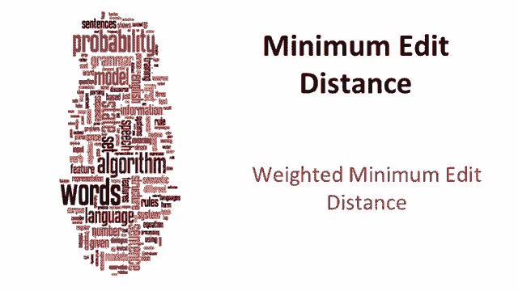
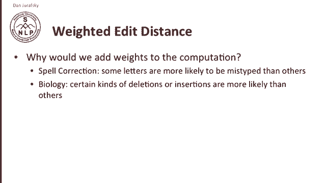
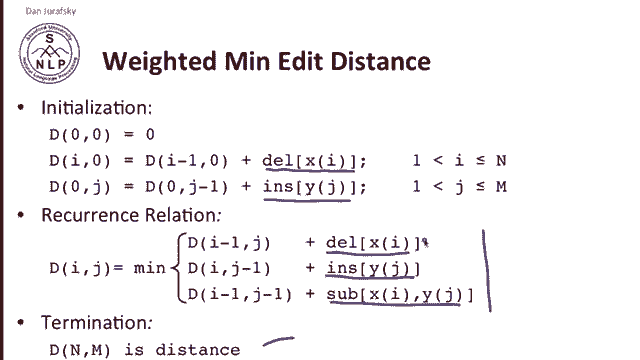
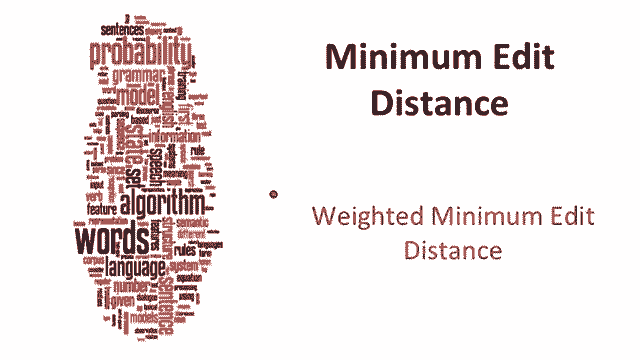

# 十：L2.4- 加权的最小编辑距离 🧮

在本节课中，我们将要学习**加权的最小编辑距离**。我们将探讨为何需要为编辑操作赋予不同的权重，以及如何在算法中实现这种加权计算。通过具体的应用场景，如拼写纠错和生物学序列分析，我们将理解加权编辑距离的实际意义。

---

最小编辑距离可以被赋予权重。为什么我们要在计算编辑距离时加入权重呢？

考虑拼写纠错等特定应用场景。很明显，某些字母被误输入的可能性比其他字母更高。在生物学领域，由于学科本身的限制，某些类型的删除或插入操作也更为常见。

例如，在拼写领域：

上图展示了一个拼写错误的混淆矩阵。观察这个矩阵可以发现，字母 **E** 很容易与 **A** 或 **O** 混淆。元音字母之间容易混淆。但字母 **A** 和 **B** 混淆的可能性则非常低。因此，人们常犯的拼写错误具有系统性。

这种系统性不仅体现在元音字母之间，还受到键盘布局的影响。人们更可能用另一只手的同源手指或按错相邻的按键。因此，在特定领域（如拼写或生物学）的限制下，某些编辑操作会比其他的更可能发生。

为了体现这一点，我们将对算法稍作修改，引入权重。在莱文斯坦距离中，插入和删除的成本是1，替换的成本是2。在加权最小编辑距离中，我们只需在每次操作时查找一个特定的成本值。

以下是算法的核心修改：

*   **初始化**：不再为每个删除操作简单地加1，而是使用每个被删除符号的实际删除成本，并将所有删除成本累加。
*   **插入操作**：同样，不再为每个插入操作加1，而是使用每个插入符号的插入成本，并将它们累加。
*   **递推关系**：在递推关系中，我们将加入特定的删除、插入和替换成本。即，删除特定字符、插入特定字符或进行替换操作的成本是多少。
*   **终止条件**：最终，我们使用相同的终止条件。

我们将使用独立的小型查找表来记录每个符号的删除、插入和替换成本。

顺便提一下，“动态规划”这个名字从何而来？以下是理查德·贝尔曼自传中的一些引述。贝尔曼是动态规划的发明者。有趣的是，他告诉我们，他提出“动态规划”这个名字，实际上是一种公关手段，目的是让这个算法听起来更激动人心。这可能是最早为了品牌化、让算法听起来更吸引人而被命名的算法之一。

这就是我们加权最小编辑距离的算法。

---

本节课中，我们一起学习了加权最小编辑距离的概念。我们了解到，在实际应用中，不同的编辑操作具有不同的可能性或“成本”，因此需要为它们分配权重。通过修改标准的最小编辑距离算法，引入基于查找表的特定操作成本，我们可以更精确地计算两个序列之间的差异，从而在拼写纠错、生物信息学等领域得到更符合实际的结果。