# 十一：L2.5 - 计算生物学中的最小编辑距离 🧬

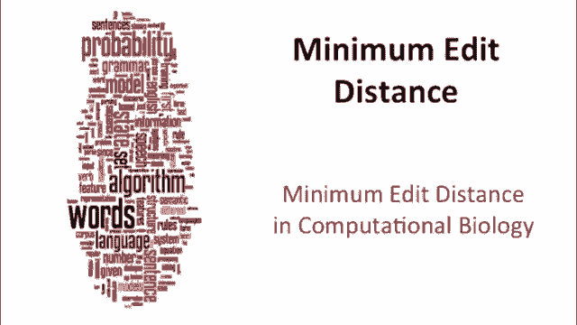

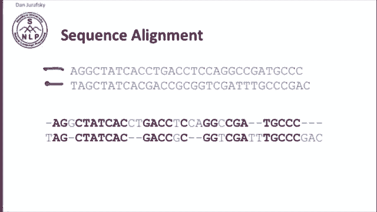

在本节课中，我们将要学习最小编辑距离在计算生物学领域中的一些高级变体。这些变体在分析生物序列（如核苷酸或蛋白质序列）时扮演着特殊角色。我们将了解如何调整标准算法以适应生物学中的特定需求，例如处理序列重叠或寻找局部相似区域。

## 计算生物学中的序列比对

上一节我们介绍了最小编辑距离的基本概念，本节中我们来看看它在计算生物学中的具体应用。

在计算生物学中，我们比对的是核苷酸序列或蛋白质序列。我们的任务是处理两个字符串，并生成一个类似下图的比对结果。

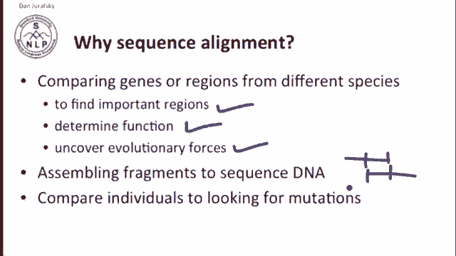

这在生物学中非常重要，原因有很多。我们可以用于在基因组中寻找特定区域、发现基因功能、通过比较不同物种来研究进化关系。此外，在DNA测序和片段组装中，我们也需要寻找重叠片段并进行匹配，或者通过比较个体来寻找突变位点，发现序列间的相似与差异。

## 从距离到相似度

在自然语言处理中，我们通常讨论**距离**，目标是**最小化**距离，并为操作分配**权重**。

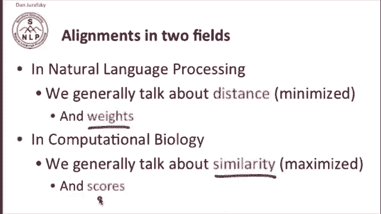

然而，在计算生物学中，我们更常讨论**相似度**，目标是**最大化**相似度。我们关注两个事物有多相似，因此我们尝试最大化某个值，并且通常使用**分数**而非权重来描述。

## 尼德曼-翁施算法

在计算生物学中，我们刚刚看过的最小编辑距离标准算法被称为**尼德曼-翁施算法**。

下图展示了该算法，它与我们之前看到的算法本质相同。通常，我们用 `D` 表示插入和删除的成本，并用一个小的 `S` 值表示替换的正负分值。在生物学中，通常为匹配项分配**正分**，为插入和删除操作分配**成本**（负分）。

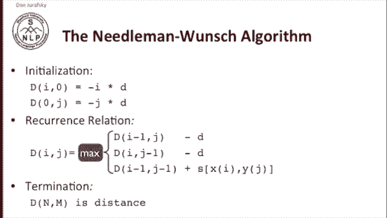

以下是尼德曼-翁施算法的动态规划矩阵。请注意，与自然语言处理中的一般做法不同，在计算生物学中，我们通常将原点放在**左上角**。

## 重叠检测变体

首先，让我们看看计算生物学中一些重要的算法变体。其中一种情况是允许在字符串的开头和结尾存在**无限制的间隙**。

这通常发生在当我们有两小段DNA序列，并且知道其中一段的端点可能与另一段的端点重叠，但其他位置可能没有关联时。例如，这里有一条长序列，另一条也是长序列，但可能只有这一部分与那一部分重叠。我们不希望因为序列开头或结尾存在不匹配的内容而受到惩罚，因此我们希望修改算法，使其**不惩罚末端的间隙**。

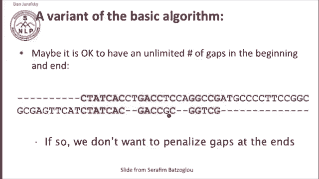

实际上，可能存在多种不同类型的此类重叠。这可能发生在进行测序并处理重叠读数时，或者当我们在一段较大的序列中寻找某个基因片段时。

用于重叠检测的动态规划算法变体，即**重叠检测变体**，只对标准算法进行少量修改。

以下是该算法的修改步骤。

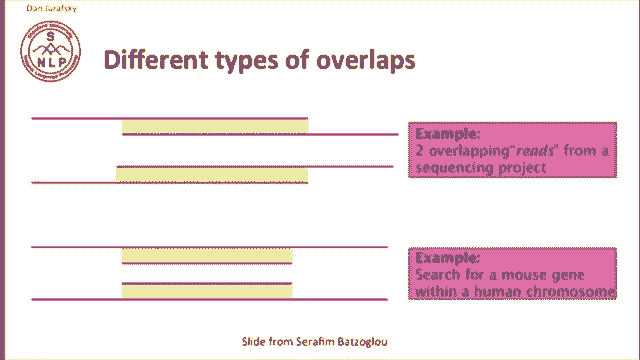

首先，我们改变初始化条件，使得从一个长字符串开始并删除或插入所有内容时**成本为零**。

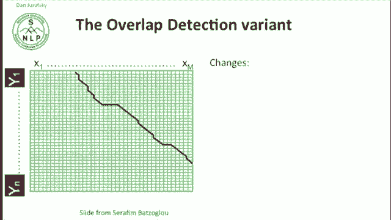

在标准算法中，第一行和第一列的初始化公式为 `-i * D` 和 `-j * D`。在重叠检测变体中，我们去除了这些惩罚项，因为允许比对路径从矩阵中间某个点（即重叠开始处）以零成本开始。这样，我们就不必为匹配序列开头之前的所有内容而受罚。

其次，终止条件也发生变化。我们不再从矩阵的**右下角**开始回溯，因为允许比对不必延伸到序列末端。相反，我们会在**最后一行或最后一列**中寻找分数**最大值**的位置，并从那里开始回溯。

## 局部比对问题

与尼德曼-翁施算法或用于字符串距离的标准动态规划算法类似的另一个扩展是**局部比对问题**。

假设我们有两个字符串：`X`（长度为 `m`）和 `Y`（长度为 `n`）。我们希望找到两个**子串**，使得它们的相似度最大。例如，在 `X` 和 `Y` 中，我们可能希望找出相似度最高的子串，比如 `CCGGG`。

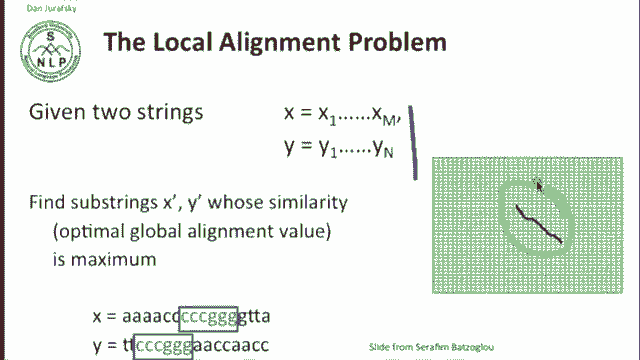

这与我们之前看到的**重叠检测变体**非常相似，但不同之处在于，它不仅允许我们在开头和结尾忽略未比对序列，而且允许在**任何位置**忽略。也就是说，最佳比对可以完全出现在序列中间的某个区域。

为了修改尼德曼-翁施算法以允许任何类型的局部比对，新版本被称为**史密斯-沃特曼算法**。

首先，与重叠检测变体一样，我们将初始化条件改为零，即不因起始字符串而惩罚自己。

其次，我们将进行一项关键修改：在计算每个单元格时，我们不仅会从三个来源（上方、左方、左上方）中选择最大值，还会将 **0** 作为一个选项加入比较。公式如下：

`score[i][j] = max(0, score[i-1][j-1] + s(x_i, y_j), score[i-1][j] + D, score[i][j-1] + D)`

其中，`s(x_i, y_j)` 是字符 `x_i` 和 `y_j` 的匹配分数，`D` 是间隙惩罚（通常为负值）。

这样做的生物学意义是，当我们谈论最大化相似度时，如果某些区域差异很大导致分数变得非常负，我们可以选择从零重新开始，相当于**丢弃那些完全无法比对的区域**。

## 史密斯-沃特曼算法的终止

史密斯-沃特曼算法的终止条件取决于我们的目标。

*   如果我们只想找到**最佳的局部比对**，我们会在整个矩阵中寻找**分数最大值**的位置，并从那里开始回溯。
*   如果我们想找到所有分数超过某个阈值 `T` 的局部比对，那么我们会找到所有分数大于 `T` 的位置，并分别从这些位置回溯。

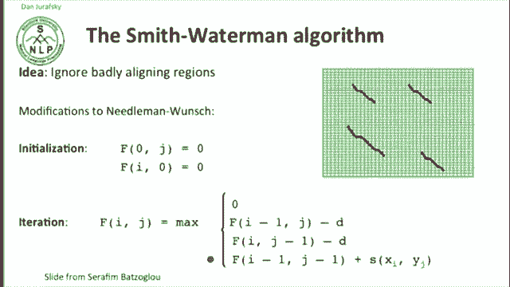

这里可能会因为存在重叠的局部比对而变得复杂。但若只寻找最佳局部比对，则相对简单。

## 局部比对示例

让我们看一个局部比对的例子。假设规则是：两个符号匹配得 **+1** 分，任何删除、插入或替换操作得 **-1** 分。

现在，寻找字符串 `ATC A` 和 `A ATC` 之间的所有局部比对。

首先，因为进行局部比对，我们将矩阵的第一行和第一列初始化为0。

填充矩阵后，我们寻找可以作为回溯起点的、具有最大值的单元格。这里我们发现两个这样的单元格。

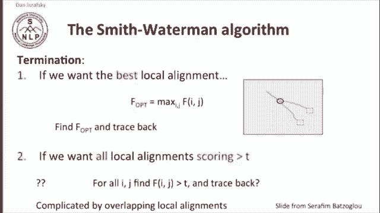

*   其中一个对应比对 `A T C A T` 和 `A T T A T`。这里有四个匹配和一个不匹配，因此相似度分数为 **3**。
*   另一个对应比对 `ATC` 和 `ATC`。这里有三个匹配符号，分数也是 **3**。

## 总结

本节课中，我们一起学习了最小编辑距离在计算生物学中的几种高级变体。

我们首先回顾了计算生物学中序列比对的基本目标，并理解了从“最小化距离”到“最大化相似度”的思维转变。接着，我们深入探讨了两种重要的算法变体：

1.  **重叠检测变体**：通过修改初始化和终止条件，允许在序列开头和结尾存在无惩罚的间隙，适用于处理可能重叠的序列片段，如DNA测序读数。
2.  **局部比对问题与史密斯-沃特曼算法**：通过将0纳入动态规划递推公式的最大值比较，并修改初始化，使得算法能够找出两个序列内部相似度最高的子区域，这对于在长序列中寻找保守的功能域或相似片段至关重要。

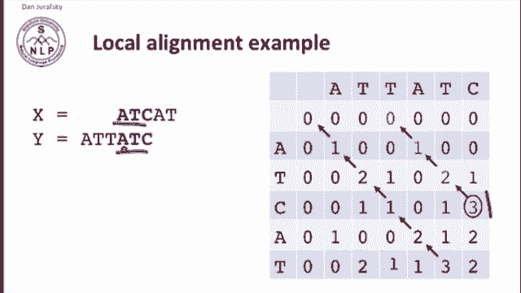

这些变体扩展了最小编辑距离的应用范围，使其成为计算生物学中序列分析不可或缺的工具。

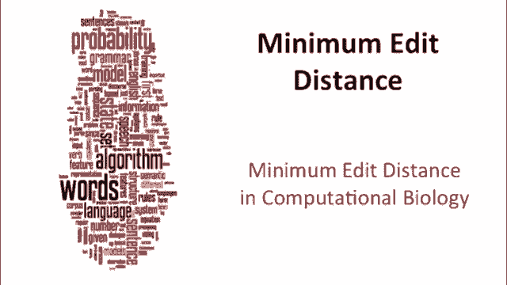

