# 十二：L3.1 - N-gram 语言模型介绍 📚 

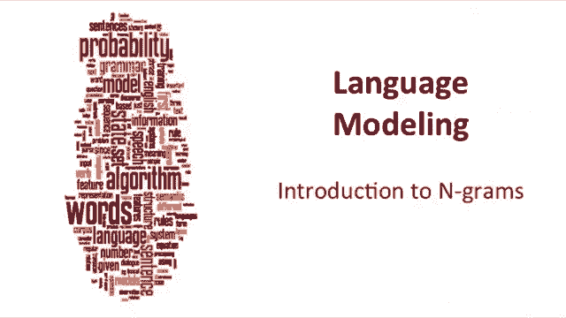

在本节课中，我们将要学习自然语言处理中一个非常重要的主题——语言建模。我们将了解语言模型的目标、其应用场景，并重点介绍一种简单而强大的建模方法：N-gram 模型。

---

## 🎯 语言模型的目标

语言模型的目标是为一个句子或一个词序列分配一个概率。

我们为何需要为句子分配概率？这出现在各种应用中。

在机器翻译中，我们希望通过概率来区分好的翻译和坏的翻译。例如，“high winds tonight” 可能比 “large winds tonight” 是更好的翻译，因为 “high winds” 在语言中搭配得更好。

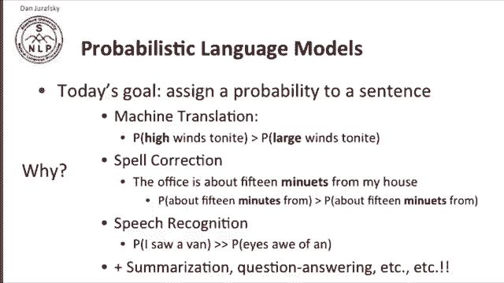

在拼写纠错中，我们看到像 “15 minues from my house” 这样的短语。这很可能是 “minutes” 的拼写错误。让我们做出这个判断的一条信息是，“15 minutes from” 这个短语比 “15 minues from” 出现的可能性大得多。

在语音识别中，像 “I saw a van” 这样的短语，比一个听起来语音相似但可能性低得多的短语 “eyes awe of an” 更可能出现。

事实证明，语言建模在摘要生成、问答系统等几乎所有自然语言处理任务中都扮演着重要角色。

---

## 🔍 如何计算句子概率

一个语言模型的目标是计算一个句子或一个词序列的概率。

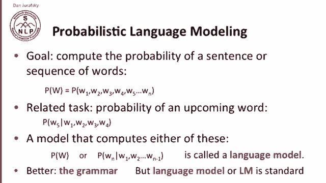

给定一个词序列 W₁ 到 W_N，我们要计算它们的概率 P(W)。我们用大写 W 表示从 W₁ 到 W_N 的序列。

这与计算下一个词出现的概率任务密切相关。所以，P(W₅ | W₁, W₂, W₃, W₄) 与计算 P(W₁, W₂, W₃, W₄, W₅) 高度相关。

一个能计算这两者之一——要么是 P(W)（整个序列的联合概率），要么是给定前序词时最后一个词的条件概率——的模型，我们称之为语言模型。技术上，这告诉我们这些词组合在一起有多好，我们通常用“语法”这个词来描述，但“语言模型”（常缩写为 LM）已成为标准术语。

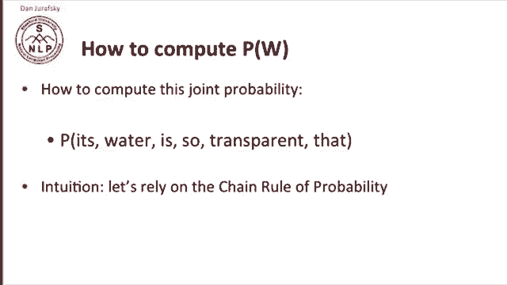

---

## ⛓️ 利用概率链式法则

那么，我们如何计算这个联合概率呢？例如，我们想计算短语 “its water is so transparent that” 的概率。

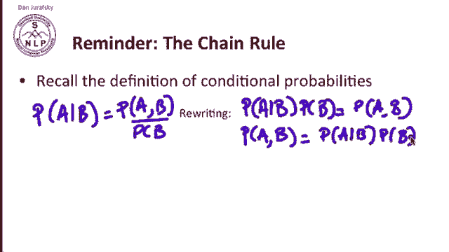

语言建模的直觉是，我们将依赖于概率的链式法则。让我们回顾一下条件概率的定义。

P(A | B) = P(A, B) / P(B)

我们可以将其重写为：P(A | B) * P(B) = P(A, B)。或者反过来：P(A, B) = P(A | B) * P(B)。

我们可以将其推广到更多变量。因此，整个序列 A, B, C, D 的联合概率是：

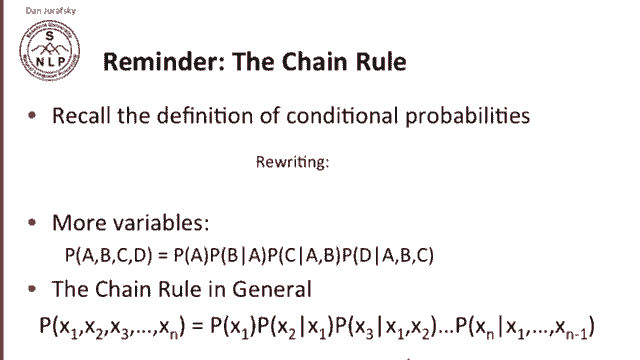

P(A, B, C, D) = P(A) * P(B | A) * P(C | A, B) * P(D | A, B, C)

这是链式法则更一般的形式：任何变量序列的联合概率，等于第一个的概率乘以第二个给定第一个的条件概率，再乘以第三个给定前两个的条件概率，依此类推，直到最后一个给定前 N-1 个的条件概率。

现在，链式法则可以应用于计算句子中词的联合概率。

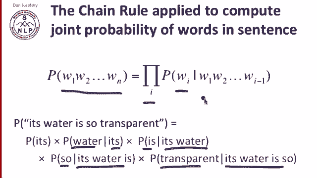

假设我们有短语 “its water is so transparent”。根据链式法则，该序列的概率是：

P(its, water, is, so, transparent) = P(its) * P(water | its) * P(is | its, water) * P(so | its, water, is) * P(transparent | its, water, is, so)

更正式地说，一个词序列的联合概率是每个词给定其之前所有词的条件概率的乘积。

---

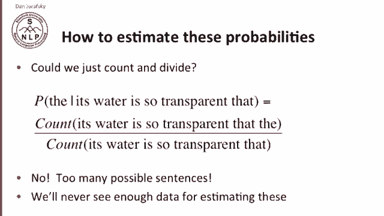

## ❓ 如何估计这些概率？

我们能否通过计数和除法来计算这些概率？我们通常通过计数和除法来计算概率。例如，要计算 “the” 在 “its water is so transparent that” 之后出现的概率，我们可以统计 “its water is so transparent that the” 出现的次数，除以 “its water is so transparent that” 出现的次数。

但我们不能这样做。原因在于，可能的句子数量太多，我们永远无法估计所有这些概率。我们无法获得足够的数据来统计所有可能的英语句子的出现次数。

---

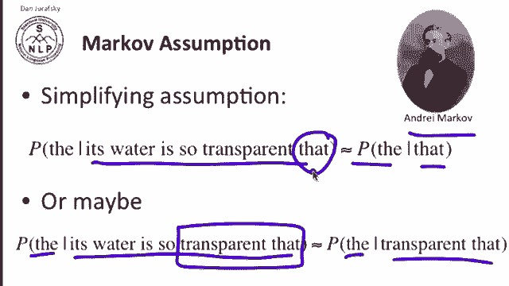

## 🧠 马尔可夫假设

因此，我们采用一种称为马尔可夫假设的简化方法，以安德烈·马尔可夫命名。

马尔可夫假设建议，我们不再计算 P(the | its water is so transparent that)，而是通过计算 P(the | that) 来估计，即只考虑序列中的最后一个词 “that”。或者，我们也可以计算 P(the | transparent that)，即只考虑最后两个词。

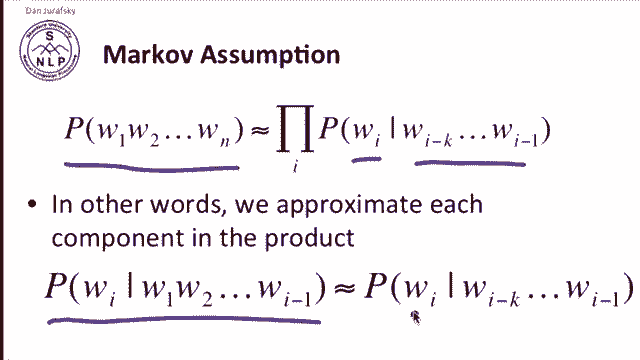

马尔可夫假设就是：我们只关注前一个或前几个词，而不是整个上下文。

更正式地说，马尔可夫假设指出，一个词序列的概率是每个词的条件概率的乘积，而每个词的条件概率仅由其前几个词决定。

换句话说，在链式法则的乘积中，我们用一个更简单的、仅基于最后几个词的概率 P(W_i | W_{i-k} ... W_{i-1}) 来估计 P(W_i | W₁ ... W_{i-1})。

---

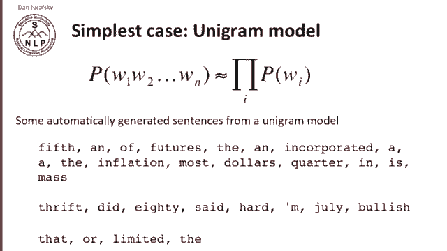

## 📊 N-gram 模型

以下是几种常见的 N-gram 模型：

**一元模型 (Unigram Model)**：这是最简单的马尔可夫模型。在一元模型中，我们简单地通过各个词（一元组）概率的乘积来估计整个词序列的概率。如果我们通过随机挑选词来生成句子，结果看起来就像“词沙拉”。例如，自动生成的句子可能是：“fifth an of this”。在一元模型中，词是相互独立的。

**二元模型 (Bigram Model)**：在二元模型中，我们以前一个词为条件。我们通过前一个词来估计一个词给定整个前缀的概率。如果使用二元模型生成随机句子，句子看起来会更像英语一些，但仍然存在问题。例如：“outside new car parking lot of the agreement reached”。

**三元及更高阶模型 (Trigram and Higher-order Models)**：我们可以将 N-gram 模型进一步扩展到三元组（三个词）、四元组或五元组。

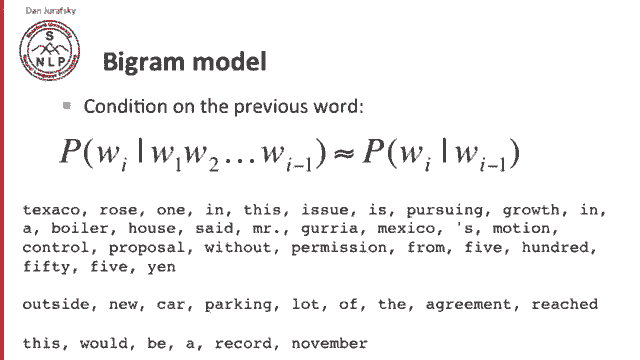

---

## ⚖️ N-gram 模型的局限性

总的来说，N-gram 模型显然是对语言的一种不充分的建模。

原因在于语言存在长距离依赖。例如，如果我想预测句子 “The computer which I had just put into the machine room on the fifth floor ___” 的下一个词，并且我只以前一个词 “floor” 为条件，我很难猜出是 “crashed”。但实际上，“crashed” 是句子的主要动词，而 “computer” 是主语。如果我们知道 “computer” 是主语，我们就更有可能猜出 “crashed”。

这种长距离依赖意味着，一个真正优秀的英语词预测模型必须考虑大量的长距离信息。

然而，在实践中，我们通常可以使用这些 N-gram 模型，因为局部信息，特别是当我们使用三元组和四元组时，通常已经足够约束，在大多数情况下可以解决我们的问题。

---

## 📝 总结

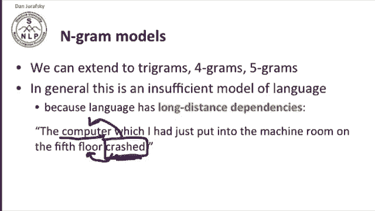

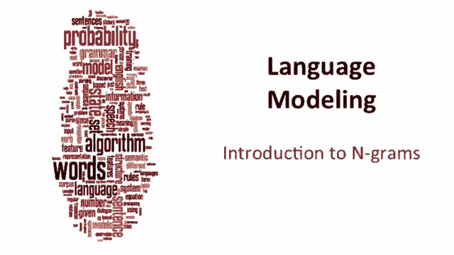

本节课中，我们一起学习了语言建模的基本概念。我们了解到语言模型的核心目标是为句子分配概率，并广泛应用于机器翻译、拼写纠错和语音识别等领域。为了应对数据稀疏问题，我们引入了马尔可夫假设，并在此基础上学习了一元模型、二元模型等 N-gram 模型。虽然 N-gram 模型因忽略长距离依赖而存在局限性，但其简单有效，在实践中仍被广泛使用。