# 十三：L3.2 - 计算 N-gram 概率 📊

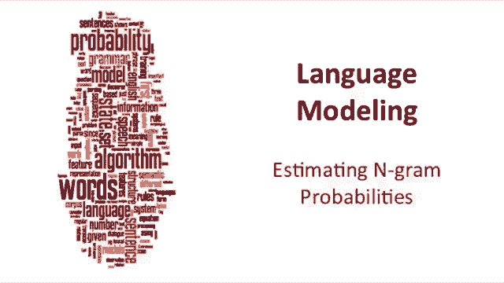

在本节课中，我们将学习如何估计 N-gram 语言模型中的概率。我们将从最简单的二元语法（Bigram）模型开始，通过计数和归一化的方法计算概率，并理解这些概率背后反映的语言知识和现实世界信息。

---

## 🔢 如何估计 N-gram 概率？让我们从二元语法开始

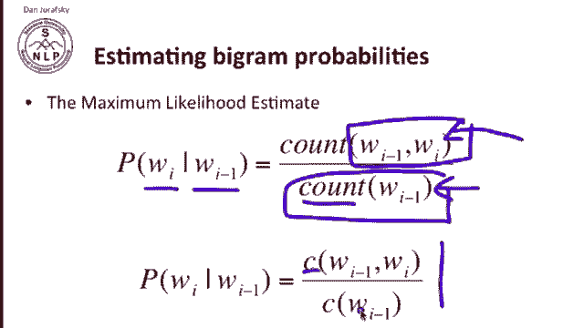

上一节我们介绍了 N-gram 模型的基本概念，本节中我们来看看如何具体计算其概率。我们使用最大似然估计（Maximum Likelihood Estimation, MLE）来计算二元语法的概率。

对于一个二元语法，单词 `w_i` 在给定前一个单词 `w_{i-1}` 情况下的条件概率，可以通过简单的计数来估计。我们统计单词 `w_{i-1}` 和 `w_i` 一起出现的次数，然后除以单词 `w_{i-1}` 单独出现的总次数。

用公式表示如下：

**P(w_i | w_{i-1}) = C(w_{i-1}, w_i) / C(w_{i-1})**

其中，`C` 代表计数（Count）。这个公式的含义是：在所有出现 `w_{i-1}` 的情况下，`w_i` 紧随其后出现的比例。

---

## 📖 通过一个简单例子理解计算过程

让我们通过一个具体的例子来理解上述公式。假设我们有一个来自苏斯博士的微型语料库，包含以下三个句子：

*   `<s> I am Sam </s>`
*   `<s> Sam I am </s>`
*   `<s> I do not like green eggs and ham </s>`

其中，`<s>` 代表句子开始符号，`</s>` 代表句子结束符号。

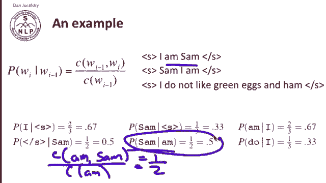

现在，让我们计算一些概率。

首先，计算 `P(I | <s>)`，即句子以“I”开头的概率。

*   分子：`<s>` 和 `I` 一起出现的次数（即“I”紧跟 `<s>` 的次数）。在语料库中，这发生了两次（第一句和第三句）。
*   分母：`<s>` 出现的总次数。在三个句子中，`<s>` 出现了三次。

因此，`P(I | <s>) = 2 / 3 ≈ 0.67`。

再计算另一个例子，`P(Sam | am)`，即在单词“am”之后出现“Sam”的概率。

*   分子：“am”和“Sam”一起出现的次数。这发生了一次（在第一句中：“I am Sam”）。
*   分母：“am”出现的总次数。在语料库中，“am”出现了两次（第一句和第二句）。

因此，`P(Sam | am) = 1 / 2 = 0.5`。

---

## 📊 在更大语料库中观察二元语法计数与概率

为了获得更现实的统计结果，我们来看一个更大的语料库。这个语料库来自一个关于加州伯克利餐厅的对话系统，包含近一万个句子。

以下是计算过程中的一些核心数据表。

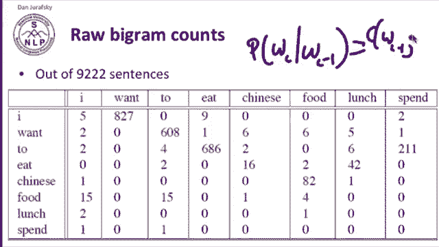

首先，我们得到原始的二元语法计数表。这个表格展示了任意两个单词连续出现的次数。

| 前一个词 (w_{i-1}) | 当前词 (w_i) | 联合计数 C(w_{i-1}, w_i) |
| :--- | :--- | :--- |
| I | I | 5 |
| I | want | 827 |
| want | to | 680 |
| to | eat | 686 |

（注：表格中还有很多计数为0的组合，例如“want”后从未直接跟过“want”，“Chinese”后从未直接跟过“to”。）

为了将这些计数转化为概率，我们需要用前一个单词的单字词（Unigram）计数进行归一化。以下是部分单词的单字词计数：

*   `C(I) = 2533`
*   `C(want) = 927`
*   `C(to) = 608`

现在，我们可以计算具体的二元语法概率了。例如：

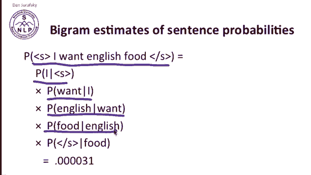

`P(to | want) = C(want, to) / C(want) = 680 / 927 ≈ 0.66`

这意味着，在语料库中，当人们说出“want”这个词时，下一个词是“to”的概率非常高，约为66%。同时，那些计数为0的组合，其概率也为0。

---

## 🧮 利用二元语法概率计算句子概率

计算出所有的二元语法概率后，我们就可以估计一个完整句子的概率了。这是语言建模的最终目标。

计算方法是：将句子中每个单词基于前一个单词的条件概率相乘。

例如，计算句子 `<s> I want English food </s>` 的概率：

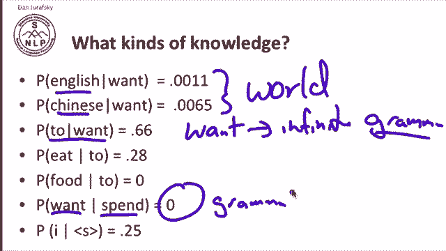

`P(<s> I want English food </s>) = P(I | <s>) * P(want | I) * P(English | want) * P(food | English) * P(</s> | food)`

---

## 💡 二元语法概率揭示了什么知识？

这些计算出的概率并非随机数字，它们编码了丰富的语言和世界知识。

*   **世界知识**：为什么 `P(Chinese | want)` 通常高于 `P(English | want)`？这可能反映了现实世界中，中餐比英国菜更受欢迎，人们更常询问中餐。
*   **语法知识**：为什么 `P(to | want)` 如此之高？这反映了英语语法规则：动词“want”后面通常接带“to”的不定式。
*   **结构零值**：为什么 `P(want | spend)` 是0？因为“spend want”这种两个动词连续出现的形式在标准英语语法中是不被允许的。这是一个由语法规则导致的“结构零值”。
*   **偶然零值**：为什么 `P(food | to)` 在这个特定语料库中是0？你完全可以想象出“to food”出现在一个句子中（例如某种特定语境）。这里的零值仅仅是因为在训练数据中从未出现过这种组合，这是一个“偶然零值”。

---

## ⚙️ 实践技巧：使用对数概率

在实际应用中，我们通常不以原始概率的形式存储和计算，而是使用它们的**对数概率**。这样做有两个主要原因：

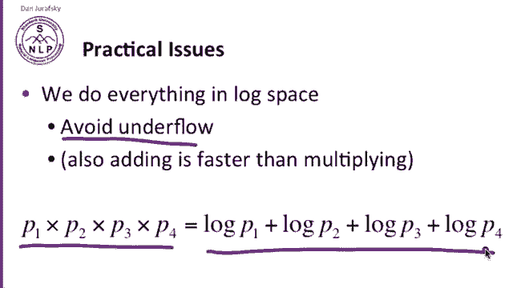

1.  **防止下溢**：长句子的概率是许多小于1的小数相乘，结果会是一个极其微小的数字，可能导致计算机算术下溢（Underflow）。将对数相加等价于原始概率相乘，但能有效避免数值过小的问题。
2.  **计算效率**：加法运算通常比乘法运算更快。

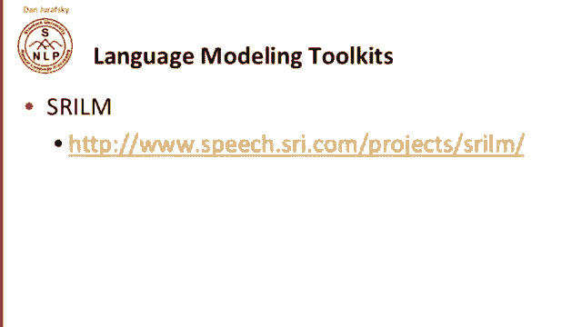

因此，我们存储和操作的是 `log(P(w_i | w_{i-1}))`。计算句子概率时，我们将这些对数概率相加，而不是将原始概率相乘。

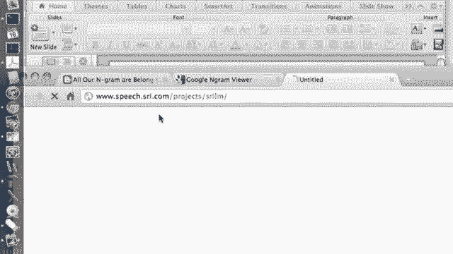

---

## 🧰 公开可用的语言建模资源

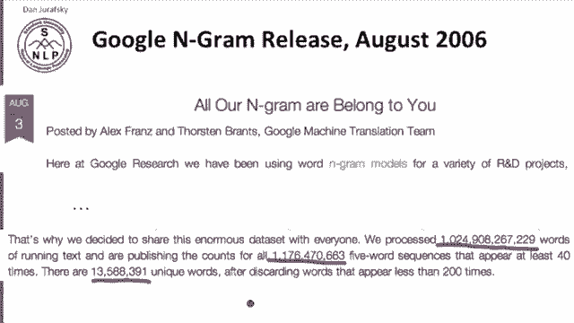

有许多公开的工具和语料库可以帮助你进行语言建模实践：

以下是几个重要的资源：

*   **SRI 语言建模工具包 (SRILM)**：一个功能强大、广泛使用的语言模型工具包，可用于训练和评估 N-gram 模型。
*   **Google N-gram 语料库**：一个包含超过一万亿个词条（5-grams）和1300万个独立单词的庞大数据集，适用于各种 N-gram 应用研究。
    *   示例：在该语料库中，短语“serve as the indication”出现了72次。
*   **Google Books N-gram 语料库**：这个语料库允许你绘制特定单词在谷歌图书中随时间变化的出现频率曲线，支持美式英语、英式英语、中文、法语、德语等多种语言的语料。

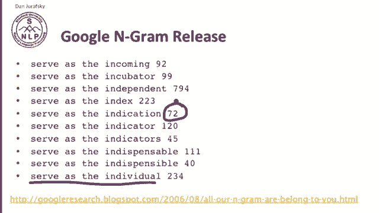

---

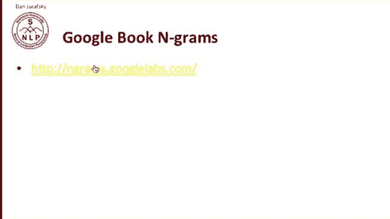

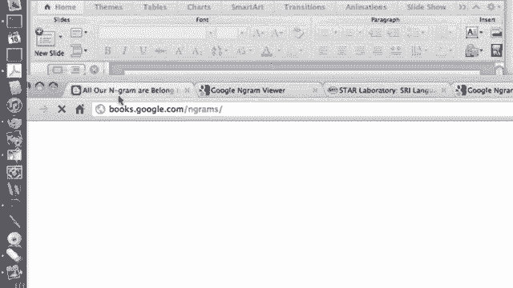

## 📝 课程总结

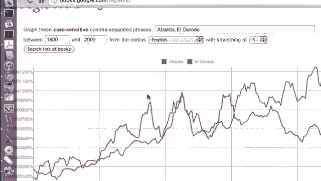

本节课中我们一起学习了计算 N-gram 概率的核心方法。

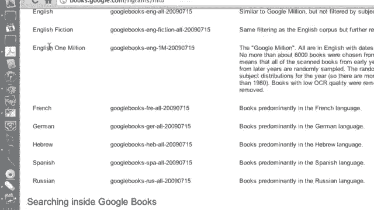

1.  我们掌握了使用**最大似然估计**计算二元语法概率的公式：`P(w_i | w_{i-1}) = C(w_{i-1}, w_i) / C(w_{i-1})`。
2.  我们通过一个小型例子逐步演练了概率的计算过程。
3.  我们观察了更大语料库中的计数和概率分布，并理解了概率值为零的两种情况：**结构零值**和**偶然零值**。
4.  我们学会了如何将单个二元语法概率组合起来，通过连乘计算整个句子的概率。
5.  我们探讨了二元语法概率背后所蕴含的**世界知识**和**语法知识**。
6.  我们了解了在实际应用中，使用**对数概率**来防止计算下溢和提高效率的重要性。
7.  最后，我们介绍了一些公开可用的**语言建模工具包和大型语料库**，如 SRILM 和 Google N-gram，为后续的实践提供了资源方向。