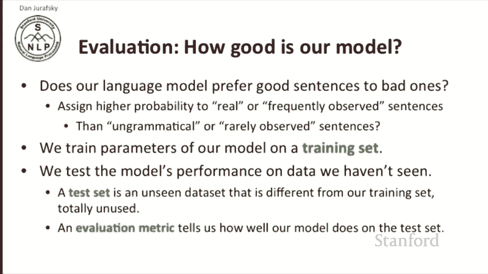
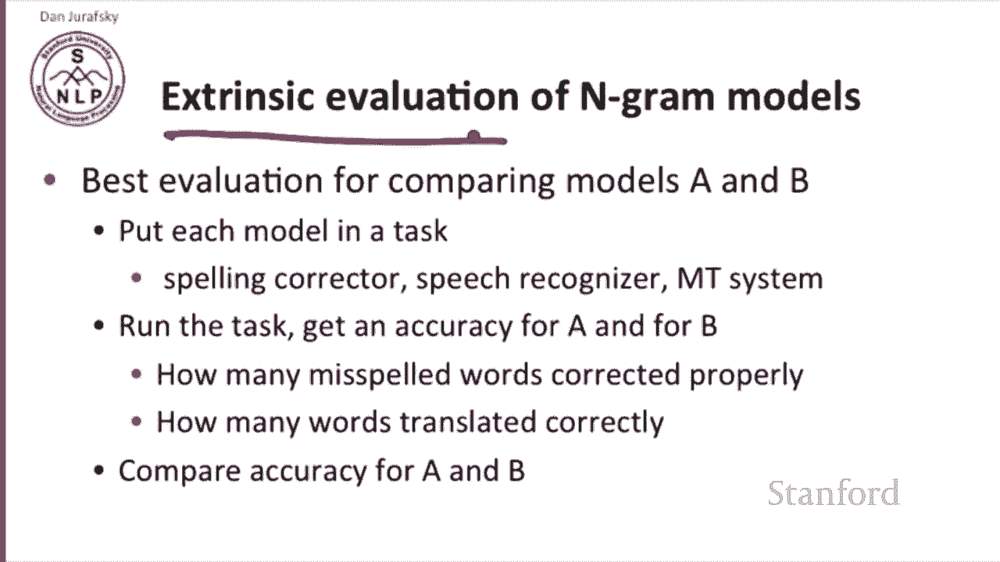
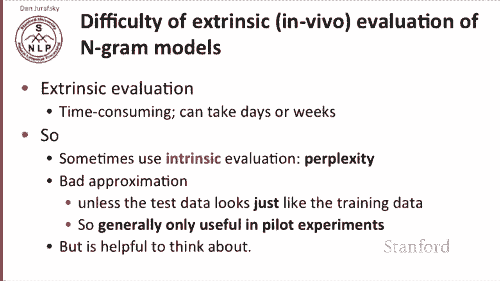
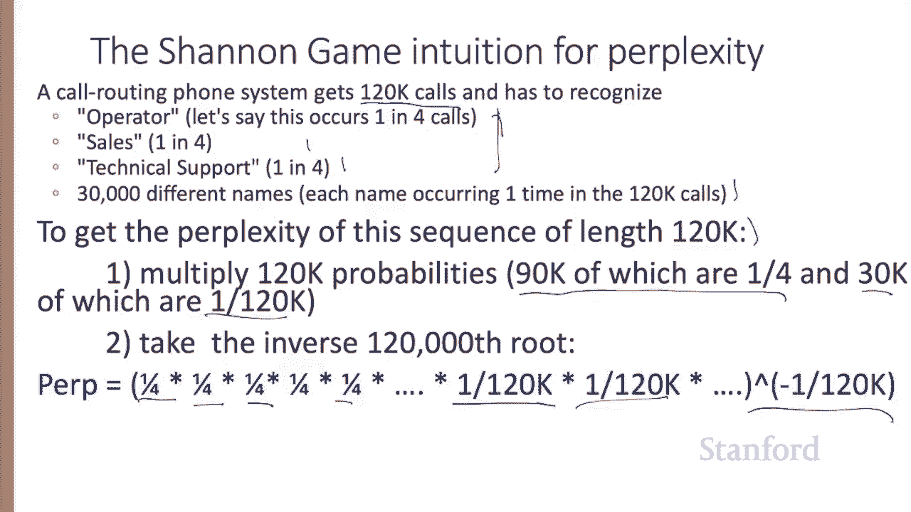
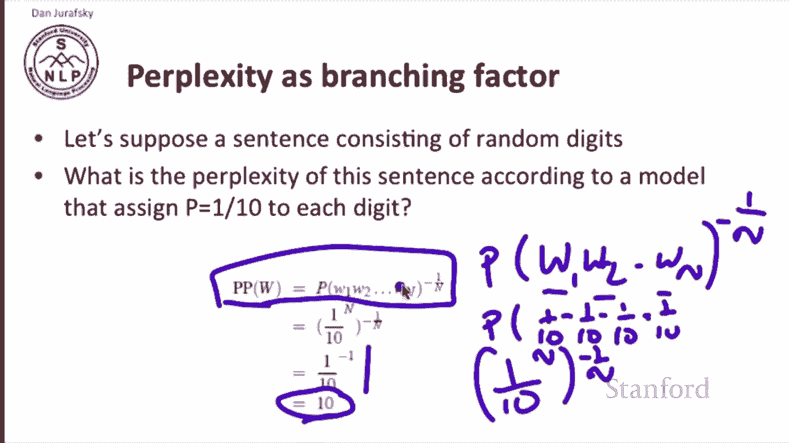
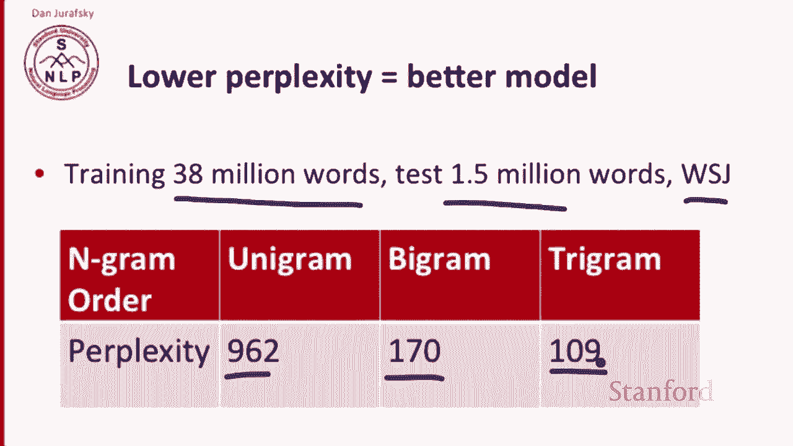
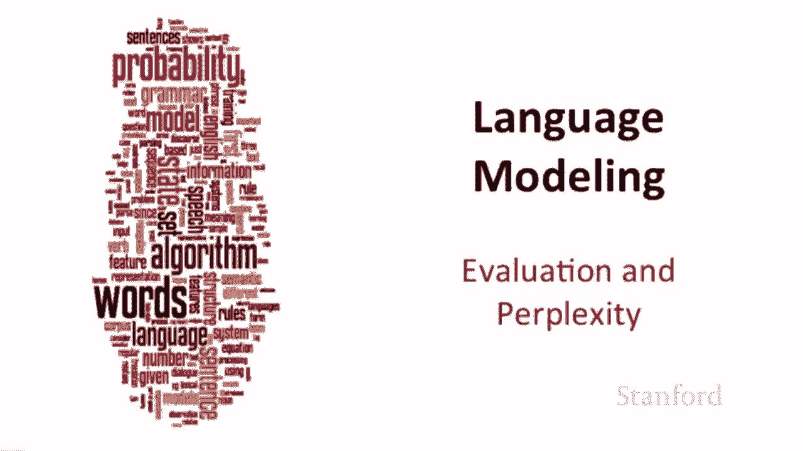

# 十四：L3.3 - 评估准则（困惑度等）📊

在本节课中，我们将学习如何评估语言模型的性能。我们将重点介绍两种主要的评估方法：外部评估和内部评估，并深入探讨最常用的内部评估指标——困惑度。

---

## 外部评估与内部评估

上一节我们介绍了语言模型的基本概念。本节中我们来看看如何评估一个语言模型的好坏。

一个好的语言模型，通常指能更好地区分“好”句子与“坏”句子的模型。具体来说，我们希望模型能为真实或常见的句子分配更高的概率，而为不合语法或罕见的句子分配较低的概率。

我们通常在训练集上训练模型参数，然后在未见过的测试集上评估其性能。这需要一个评估指标来衡量模型在测试集上的表现。

以下是两种主要的评估方法：

*   **外部评估**：将语言模型置于实际应用任务中（如拼写检查、语音识别、机器翻译），通过比较任务完成度（如正确翻译的单词数）来评估模型优劣。这种方法也称为“体内评估”。
*   **内部评估**：不依赖具体应用，直接评估语言模型本身的性能。最常用的内部评估指标是**困惑度**。

外部评估虽然直接，但通常耗时较长。因此，在初步实验中，我们常使用困惑度作为快速评估工具，但最终仍需结合外部评估来全面判断模型性能。

---

## 困惑度的直观理解 🤔

困惑度的思想可以追溯到克劳德·香农提出的“词语预测游戏”。其核心是：一个优秀的语言模型应该能更准确地预测下一个出现的词语。

例如，给定句子“I always order pizza with cheese and”，一个好的模型可能会预测下一个词是“mushrooms”或“pepperoni”，而预测“fried rice”或另一个“and”的可能性则极低。模型预测实际出现词语的能力越强，其质量就越高。

总结来说，更好的语言模型能为测试集中的句子（即实际出现的句子序列）赋予更高的概率。困惑度正是基于这个概率计算出的一个标准化指标。

---

## 困惑度的定义与计算 🧮

困惑度是测试集概率的归一化度量，它考虑了句子的长度，使得我们可以比较不同长度的测试集。

对于一个由N个词组成的测试句子 \( W = w_1, w_2, ..., w_N \)，其困惑度 \( PP(W) \) 定义为：

\[
PP(W) = P(w_1 w_2 ... w_N)^{-\frac{1}{N}}
\]

根据概率的链式法则，整个句子的概率可以分解为每个词在其历史上下文条件下概率的乘积。对于二元语法模型，我们可以用二元概率来近似：

\[
P(w_1 w_2 ... w_N) \approx \prod_{i=1}^{N} P(w_i | w_{i-1})
\]

因此，困惑度也可以表示为：

\[
PP(W) = \sqrt[N]{\prod_{i=1}^{N} \frac{1}{P(w_i | w_{i-1})}}
\]

从公式可以看出，**最小化困惑度等价于最大化测试集的概率**。

---

## 困惑度的另一种解释：加权平均分支因子 🌳

困惑度还有另一种直观解释：它代表了模型在预测下一个词时，面临的“加权平均分支因子”或平均不确定性。

*   如果下一个词有10种等可能的选择，那么困惑度就是10。
*   在一个语音识别系统中，如果需要识别30,000个等可能的名字，那么该任务的困惑度就是30,000。
*   考虑一个更现实的例子：一个自动电话接线系统，25%的概率听到“operator”，25%听到“sales”，25%听到“technical support”，剩下25%的概率均匀分布在30,000个名字上。计算其加权平均分支因子，得到的困惑度约为54。

这个“加权平均分支因子”的解释，与之前“归一化概率的倒数”的定义在数学上是等价的。例如，对于一个由随机数字（每个数字概率为1/10）组成的序列，无论多长，其困惑度计算出来都是10。

---

## 困惑度的实际意义与局限性 ⚠️

一般来说，**困惑度越低，模型越好**。因为它意味着模型对实际出现的数据有更强的预测能力，不确定性更低。

例如，在一个实验中：
*   一元语法模型在测试集上的困惑度为962。
*   二元语法模型的困惑度降至170。
*   三元语法模型的困惑度更低。

这显示了高阶模型通常能获得更低的困惑度。

然而，需要注意的是，困惑度是一个内部评估指标。它只有在测试数据与训练数据分布相似时，才能较好地近似外部评估的效果。因此，它通常用于前期实验和模型调试，最终模型选择仍需结合具体任务的外部评估结果。

---

## 总结 📝

本节课我们一起学习了语言模型的评估方法。
我们介绍了**外部评估**（通过下游任务表现评估）和**内部评估**（直接评估模型本身）。
我们重点探讨了**困惑度**这一核心内部评估指标，理解了它的两种直观含义：**归一化测试集概率的倒数**和**加权平均分支因子**。
我们学习了困惑度的计算公式，并认识到**更低的困惑度通常意味着更好的模型性能**。
最后，我们明确了困惑度的适用场景与局限性，强调最终评估应结合外部任务指标。