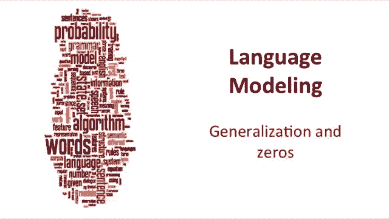
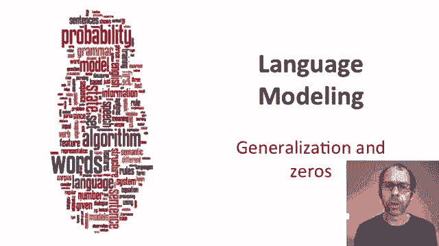
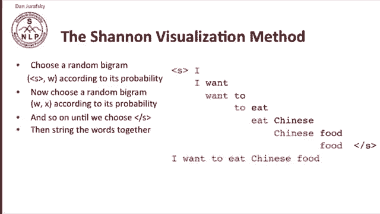
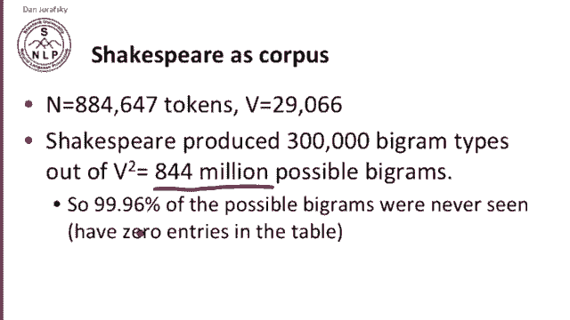
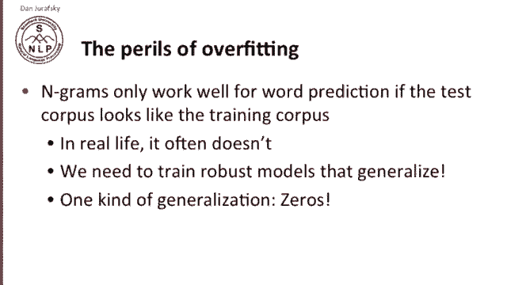
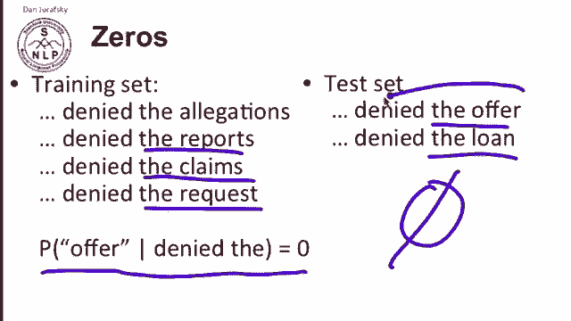
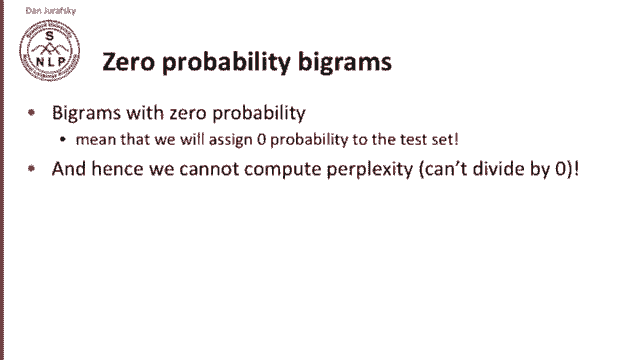
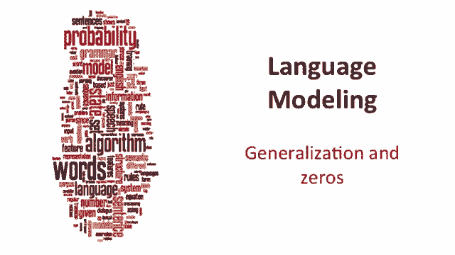

# 十五：L3.4 - 泛化与零概率处理 📚

在本节课中，我们将要学习语言模型中的一个核心挑战：如何处理在训练数据中从未出现过的N元语法（即零概率事件）。我们将通过香农可视化方法理解问题，并探讨其在实际应用中的影响，特别是如何通过泛化技术来改进模型。

---

## 🔍 香农可视化方法

上一节我们介绍了最大似然估计构建N元语法模型。本节中我们来看看如何直观地理解这些模型。

香农提出了一种可视化方法，用于展示通过最大似然估计构建的实际N元语法模型。以下是该方法的步骤：

1.  根据其概率，随机选择一个以“句子开始”标记为第一个词的二元组。
2.  掷骰子，选择出现的任意一个二元组。假设我们首先选择了“开始 I”。
3.  接着，以刚生成的词（例如“I”）作为开头，根据概率选择下一个词，例如“want”。
4.  重复此过程，直到选择到“句子结束”标记。

最终，我们将这些词串联起来，生成了一个句子：`I want to eat Chinese food.`

香农可视化方法能揭示我们构建的N元语法模型的许多特性。

---

## 🎭 不同语料库的生成示例

以下是使用不同模型在莎士比亚作品上训练后生成的随机句子示例：

*   **一元语法句子**：`Every enter now severally so let Hill he late speaks or.`
    *   这些句子质量不高。
*   **二元语法句子**：`Why dost stand forth thy canopy forsooth he is this palpable hit the King Henry.`
    *   这些句子开始听起来像莎士比亚的风格。
*   **四元语法句子**：`It cannot be, but so. Will you not tell me who I am?`
    *   这些句子听起来非常逼真。

莎士比亚作品包含约80万个单词，词汇量约3万。在这些文本中，产生了约30万个不同的二元组类型。然而，所有可能的二元组组合数量是3万的平方，即8.44亿个。这意味着**99.96%的可能二元组从未出现**，它们在二元组概率表中对应的条目为零。

四元语法的情况甚至更糟。那些听起来像莎士比亚的四元语法句子，实际上就是莎士比亚的原句，因为在如此小的语料库中，特定的四元语法后通常只有一个可能的词。

---

## 📊 语料库差异与过拟合风险

如果我们观察另一个语料库，例如《华尔街日报》，情况则完全不同。

例如，以下是从《华尔街日报》语料库生成的三元语法句子：
`They also point to $99.6 billion from $2004063% of the rates of interest stores as Mexico and Brazil on market conditions.`

这听起来很像《华尔街日报》的风格。这两个英语语料库规模都算合理（数百万单词），但生成的莎士比亚句子和《华尔街日报》句子之间**完全没有重叠**。

这给我们一个重要的教训：**过拟合的危险**。N元语法模型只有在测试语料与训练语料相似时，才能很好地预测词语。如果你在《华尔街日报》上训练，却在莎士比亚作品上测试，预测效果会很差。在实际应用中，我们希望训练出**更健壮、泛化能力更好**的模型。

---

## 🧩 零概率问题

接下来，我们重点讨论一种泛化问题：**处理零概率事件**。这里的“零”指的是在训练集中从未出现，但在测试集中出现了的词语序列。

假设在训练集中，我们看到了以下短语：
`denied the allegations`
`denied the reports`
`denied the claims`
`denied the request`

但我们从未见过 `denied the offer`。因此，基于最大似然估计，条件概率 **P(offer | denied the) = 0**。

现在，在测试集中我们遇到了句子 `denied the offer` 和 `denied the loan`。这些序列的概率是多少？由于我们的概率是基于训练集训练的，这些序列的概率将为零。这会导致严重问题：如果我们是语音识别器，将永远无法识别这个短语；如果是机器翻译系统，将拒绝翻译成这个短语，并声称这不是正确的英语。

---

## ⚠️ 零概率的影响

**具有零概率的二元组意味着我们将为测试集分配零概率**。这导致我们无法计算困惑度（因为不能除以零）。因此，我们必须找到一种方法来处理这些零概率的二元组。

---

## 📝 总结

本节课中我们一起学习了：
1.  使用**香农可视化方法**理解N元语法模型的生成过程。
2.  认识到在不同语料库上训练的模型存在巨大差异，揭示了**过拟合的风险**。
3.  明确了语言模型中的核心挑战：**零概率问题**，即训练集中未出现但测试集中存在的N元语法。
4.  理解了零概率会导致模型在测试时失效，因此必须通过**泛化技术**（如平滑算法，将在后续课程介绍）来分配少量概率给未见事件，以构建更健壮的模型。