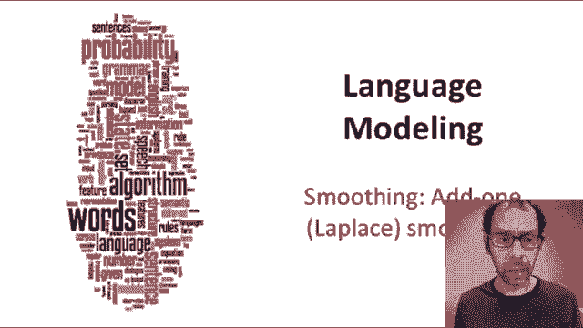
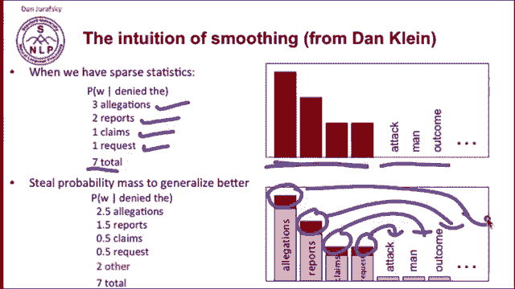
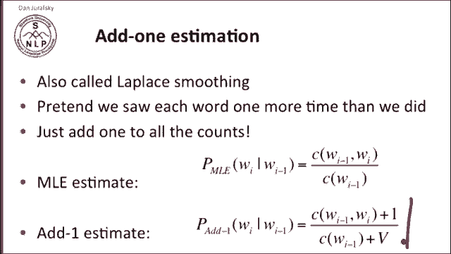
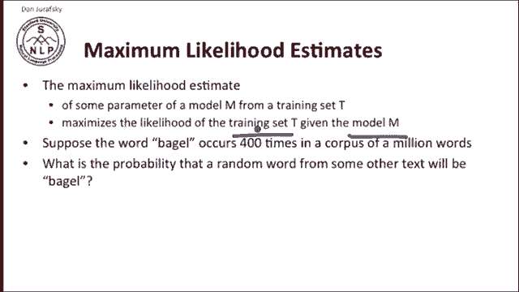
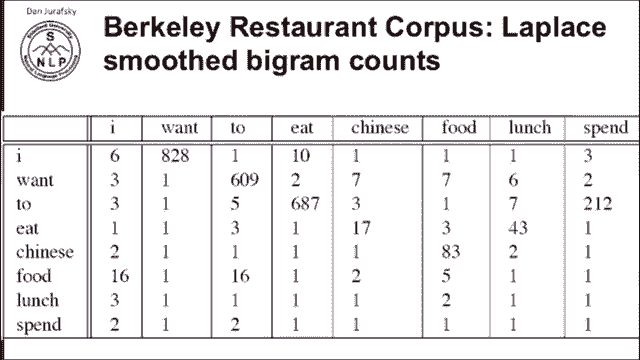
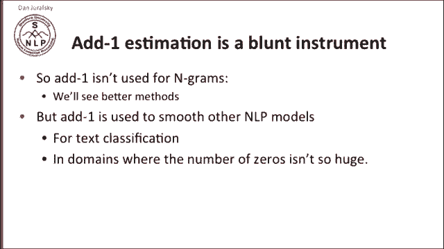
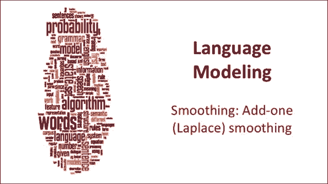

# 十六：L3.5 - 加一平滑 📚 

在本节课中，我们将要学习如何处理语言模型中出现的零概率问题，并详细介绍一种基础的解决方案——加一平滑（也称为拉普拉斯平滑）。我们将从直观理解平滑的概念开始，逐步深入到其数学公式和实际应用效果。

---

## 🧠 平滑的直观理解

上一节我们讨论了N-gram模型中的零概率问题。本节中我们来看看如何通过“平滑”技术来解决它。

假设在我们的训练数据中，我们看到了以下短语：“denied the allegations”、“denied the reports”、“denied the claim”、“denied the request”。我们据此计算了概率。在“denied the”之后，总共出现了7个不同的词，我们可以得到每个词出现的概率。

但我们希望模型能够处理未在训练数据中出现的情况，例如“denied the effort”或“denied the outcome”。因此，我们需要从已观测到的事件中“窃取”一小部分概率质量，并将其分配给未来可能遇到但训练数据中未出现的事件。

以下是我们的训练数据及其最大似然计数。这些词在“denied the”之后出现过，而那些从未出现过的词计数为零。我们希望从每个已出现词的计数中拿走一点概率，放到所有其他可能的词（或某个词集合）上，从而消除零概率。

---

## 🔢 加一平滑（拉普拉斯平滑）的原理

最简单的平滑方法称为加一估计或拉普拉斯平滑。其核心思想非常简单：我们假设每个词都比实际看到的情况多出现了一次。我们只需在所有计数上加一。

如果我们的**最大似然估计**公式是：
`P(w_i | w_{i-1}) = count(w_{i-1}, w_i) / count(w_{i-1})`

那么我们的**加一平滑估计**公式则变为：
`P_{add-1}(w_i | w_{i-1}) = [count(w_{i-1}, w_i) + 1] / [count(w_{i-1}) + V]`

这里，分母需要加上词汇表大小 **V**。这是因为我们为每一个可能跟在 `w_{i-1}` 后面的词都增加了一次计数。因此，分母的增加量不是1，而是所有可能的后继词数量，即词汇表大小 V。

---

## 📊 最大似然估计回顾

我多次使用了“最大似然估计”这个术语，让我们回顾一下它的含义。

给定一个训练集，模型某个参数的**最大似然估计**是使该训练集在该模型下出现的**可能性（似然）最大化**的那个值。我们有一个训练集，最大似然估计器能让我们从训练集中学习一个模型，这个模型使得训练集本身出现的可能性最大。

这是什么意思呢？假设单词“bagel”在一个百万词的语料库中出现了400次。我问：从另一段文本中随机抽取一个词是“bagel”的概率是多少？

根据我们语料库的**最大似然估计**，这个概率是 `400 / 1,000,000 = 0.004`。这个估计对于另一个语料库可能并不准确，但我们无法预知。然而，这个估计值使得“bagel”在百万词语料中出现400次的可能性最大，而这正是它在我们的训练语料中实际发生的情况。所以，我们是在最大化训练数据的似然。

**加一平滑**以及任何平滑技术，都是一种**非最大似然估计器**，因为我们改变了训练数据中实际出现的计数，以期获得更好的泛化能力。

---

## 🍽️ 加一平滑实例：Berkeley餐厅语料库

让我们回到Berkeley餐厅项目语料库的例子。如果我们对所有计数进行加一平滑处理，就会得到拉普拉斯平滑后的二元语法计数。现在，所有原本为零的计数都变成了一，其他所有计数也都增加了一。

现在，我们可以使用前面提到的加一平滑公式，根据这些新的计数来计算二元语法概率。

于是我们得到了所有平滑后的二元语法概率。例如，`P(want | i) = 0.26`，而所有原本为零的概率现在都变成了一个很小的非零值，例如 `0.00042`、`0.0026` 等。

我们还可以根据这些平滑后的概率，“重构”出能够自然产生这些概率的虚拟计数。我们取这些概率，并反推出能得出这些概率的原始计数应该是多少，以此观察加一平滑对我们的概率估计造成了多大的改变。

以下是重构后的计数。例如，“I”后面跟“want”出现了527次，“Chinese”后面跟“food”出现了8.2次。这些都是根据平滑概率反推的虚拟计数。

让我们将其与原始计数进行比较。在原始计数中，“want”跟在“i”后面出现了608次。而在平滑后的重构计数中，这个数字只有238次，几乎减少了三分之二。同样，“Chinese food”在原始计数中出现了82次，在重构计数中只有8.2次。

这表明，**加一平滑对我们的计数做出了巨大的改变**，有时改变因子甚至达到10倍。为了“窃取”足够的概率质量分配给海量的零计数事件，原始计数被大幅度地修改了。

---

## ⚖️ 加一平滑的优缺点与适用场景

换句话说，加一平滑是一个非常“钝”的工具。为了将概率质量分配给数量庞大的零概率事件，它对原始计数进行了非常剧烈的调整。

因此，**在实践中，我们通常不将加一平滑用于N-gram语言模型**，因为我们有更好的平滑方法（我们将在后续课程中介绍）。

然而，加一平滑确实被用于其他类型的自然语言处理模型中。例如，在**文本分类**或类似领域中，零值问题的规模没有N-gram模型中那么巨大，加一平滑仍然是一个有效且常用的选择。

---

## ✅ 课程总结

本节课中我们一起学习了：
1.  **零概率问题**：在N-gram模型中，未在训练数据中出现的事件概率为零，这会影响模型的泛化能力。
2.  **平滑的概念**：通过调整概率分布，为未出现事件分配非零概率。
3.  **加一平滑（拉普拉斯平滑）**：一种基础的平滑方法，通过给所有计数加一来实现。
4.  **其数学公式**：`P_{add-1}(w_i | w_{i-1}) = [count(w_{i-1}, w_i) + 1] / [count(w_{i-1}) + V]`。
5.  **实际效果**：加一平滑会显著改变原始计数，在N-gram模型中可能过于剧烈，但在其他NLP任务（如文本分类）中仍有应用价值。

理解加一平滑是学习更高级平滑技术（如古德-图灵估计、Kneser-Ney平滑等）的重要基础。