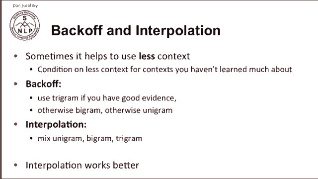
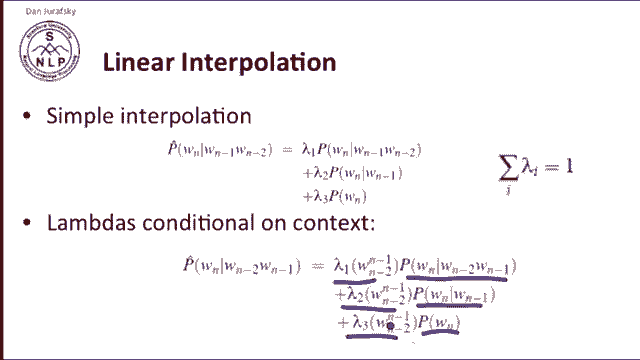
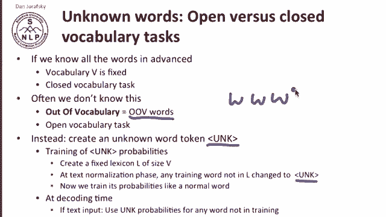
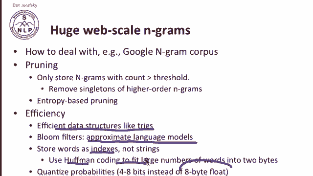
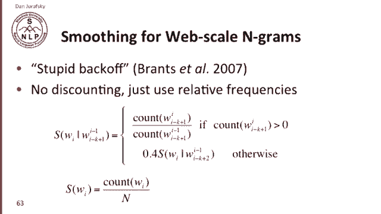
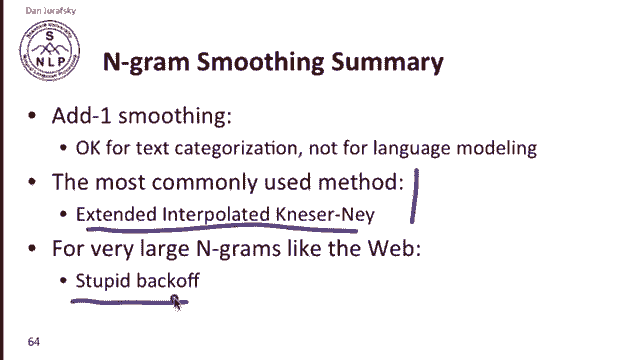
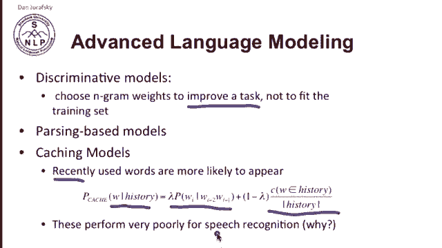

# 十七：L3.6 - 插值、回退及大型语言模型 📚

在本节课中，我们将要学习语言模型中的两种重要技术：**插值**与**回退**。我们还将探讨如何处理大规模语料库（如网络数据）中的语言建模问题，并简要介绍一些高级语言模型概念。

---

## 🔄 插值与回退

上一节我们介绍了N-gram模型的基本概念。本节中我们来看看，当模型遇到数据稀疏或不可靠的高阶N-gram时，如何通过**插值**和**回退**来改进概率估计。

**插值**的核心思想是，我们总是混合使用不同阶数的N-gram模型（如一元、二元、三元模型），以综合利用它们的信息。而**回退**则是在高阶N-gram证据不足时，才转而依赖低阶模型。在实践中，插值法通常比回退法效果更好。

---

## 📊 两种插值方法

以下是两种主要的插值方法：

### 1. 简单线性插值

在简单线性插值中，我们通过加权求和的方式，混合一元、二元和三元模型的概率。权重（λ）之和为1，以保证结果是一个有效的概率分布。

**公式**如下：
`P̂(wₙ|wₙ₋₂, wₙ₋₁) = λ₁·P(wₙ) + λ₂·P(wₙ|wₙ₋₁) + λ₃·P(wₙ|wₙ₋₂, wₙ₋₁)`

### 2. 上下文相关插值

这种方法更为复杂。我们仍然混合三种模型，但权重λ不再是固定的，而是依赖于当前的上下文（即前两个词是什么）。这允许模型根据上下文动态调整对不同阶数模型的依赖程度。

---

## 🧮 如何确定λ值？

通常，我们使用一个**留存语料库**（或称开发集）来设置λ值。

具体步骤如下：
1.  使用训练数据训练出N-gram模型。
2.  在留存数据上，寻找一组λ值，使得该留存数据的对数似然概率最大化。

---

## ❓ 处理未知词

当遇到训练集中从未出现过的词（即**集外词**）时，我们需要特殊处理。

以下是处理集外词的一种常用方法：
1.  在训练前，预先定义一个固定的词表。
2.  将训练数据中所有不在该词表中的词（通常是罕见词）替换为一个特殊的 `<UNK>` 标记。
3.  像对待普通词一样，在训练数据中统计 `<UNK>` 的N-gram概率。
4.  在解码（预测）时，任何未知词都被视为 `<UNK>`，并使用其对应的概率。

---

## 🌐 大规模N-gram的处理

面对像谷歌N-gram语料库这样的大规模数据时，我们需要高效的存储和计算策略。

以下是几种关键的技术：
*   **剪枝**：仅存储高频的N-gram。例如，可以移除所有只出现一次（单例）的高阶N-gram，以节省大量空间。
*   **高效数据结构**：使用**字典树**等结构来存储和查询N-gram。
*   **近似算法**：使用近似但高效的语言模型，可能无法得到精确概率，但速度更快。
*   **存储优化**：不存储完整的字符串，而是存储索引；使用霍夫曼编码压缩；对概率值进行量化，用少量比特存储。

---

## 🧹 大规模数据的平滑方法：Stupid Backoff

对于超大规模的N-gram，最流行的平滑算法之一是 **“Stupid Backoff”**。它之所以叫“Stupid”，是因为其规则非常简单，但在海量数据下效果很好。

其**算法**逻辑如下：
*   如果要计算 `S(wₙ|wₙ₋₂, wₙ₋₁)`，首先检查三元组 `(wₙ₋₂, wₙ₋₁, wₙ)` 的计数。
*   如果计数 > 0，则直接使用最大似然估计：`count(wₙ₋₂, wₙ₋₁, wₙ) / count(wₙ₋₂, wₙ₋₁)`。
*   如果计数为 0，则回退到二元概率，并乘以一个固定的折扣因子（如0.4）：`0.4 * S(wₙ|wₙ₋₁)`。
*   以此类推，直至回退到一元概率。

需要注意的是，Stupid Backoff 输出的 `S` 值并非严格意义上的概率（其总和可能不为1），但它作为评分函数在任务中（如搜索排序）表现优异。

---

## 🚀 高级语言模型议题

除了基础的N-gram，现代研究还关注更高级的语言建模技术：

以下是几个重要的研究方向：
*   **判别式模型**：不再以拟合训练数据为目标，而是直接优化下游任务（如机器翻译、语音识别）的性能来调整模型参数。
*   **基于句法的模型**：利用句法分析器提供的信息，而不仅仅是连续的词序列。
*   **缓存模型**：假设近期出现过的词更可能再次出现。因此，将词的概率与其在近期历史中的出现频率混合。但需注意，缓存模型在某些场景（如语音识别）中可能效果不佳。

---

## 📝 总结

本节课中我们一起学习了语言模型中的关键技术。我们了解了**插值法**如何综合不同阶数模型的信息，以及**回退法**如何在数据稀疏时提供支持。我们探讨了处理**未知词**和应对**大规模语料**的策略，特别是简单高效的 **Stupid Backoff** 算法。最后，我们简要介绍了判别式建模、句法模型和缓存模型等高级议题，为深入理解现代语言模型奠定了基础。