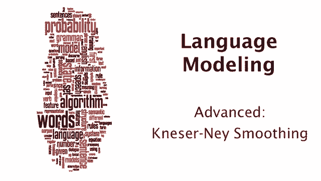
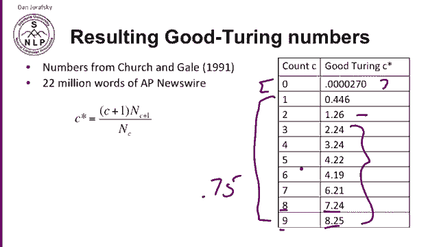
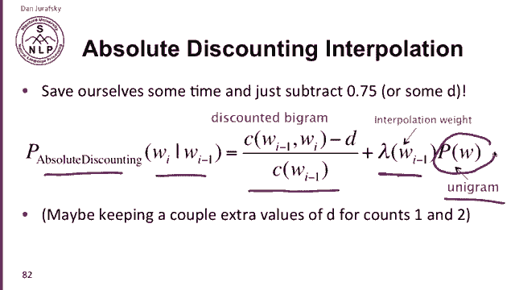
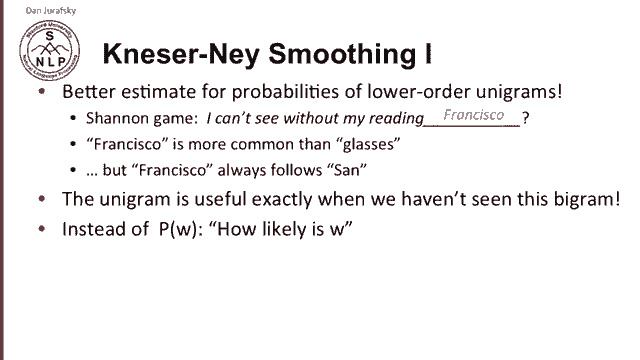
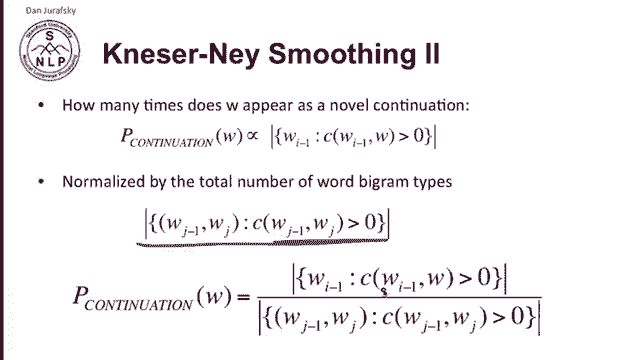
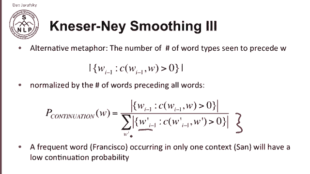
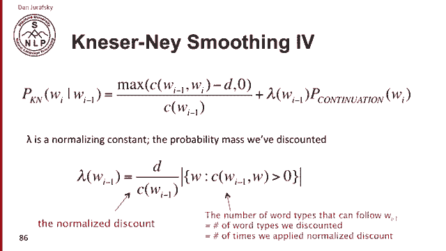
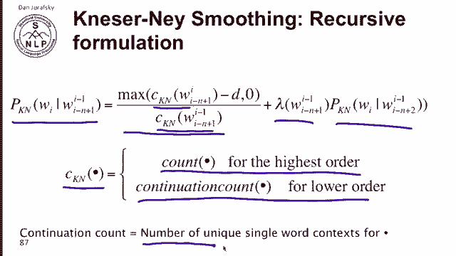

# 十八：L3.7 - Kneser-Ney 平滑 📚 



在本节课中，我们将要学习语言模型中最复杂的平滑技术之一——Kneser-Ney平滑。它不仅有优雅的数学直觉，而且在实践中（如语音识别和机器翻译）被广泛使用。我们将从绝对折扣平滑的直觉出发，逐步理解Kneser-Ney平滑的核心思想，并最终掌握其通用递归公式。

---

## 🧠 从古德-图灵到绝对折扣平滑

上一节我们介绍了古德-图灵估计。它通过折扣高频事件的计数，将节省出的概率质量分配给未见事件。观察古德-图灵折扣后的计数，你会发现一个规律：折扣后的计数与原始计数通常只相差一个固定的、较小的数值，例如原始计数减去0.75。



基于这个观察，我们可以直接采用一个固定的折扣值，而不必每次都进行复杂的古德-图灵计算。这种方法被称为**绝对折扣平滑**。

以下是绝对折扣平滑的公式（以二元语法为例）：

```math
P_{\text{abs}}(w_i | w_{i-1}) = \frac{\max(C(w_{i-1}, w_i) - D, 0)}{C(w_{i-1})} + \lambda(w_{i-1}) P(w_i)
```

其中，`D` 是一个固定的折扣值（例如0.75），`λ` 是一个插值权重，用于混合折扣后的二元概率和一元概率 `P(w_i)`。对于计数为1或2的情况，折扣值 `D` 可以单独设置以更精确地建模。



---

## 🔍 一元概率的问题与Kneser-Ney的直觉

绝对折扣平滑的问题在于其使用的一元概率 `P(w)`。让我们通过一个经典的香农游戏来理解这个问题。

假设我们有一个句子：“I can’t see without my reading __”。下一个词很可能是“glasses”。但如果我们考虑“Francisco”这个词，它作为一元词的出现频率可能比“glasses”更高。然而，“Francisco”几乎总是跟在“San”后面出现。因此，在“reading”这个上下文之后，我们不应该信任“Francisco”的高一元概率。

这个直觉引出了Kneser-Ney平滑的核心思想：在回退模型中，我们不应该使用一个词本身的概率（它有多常见），而应该使用它的**延续概率**——即这个词作为一个**新延续**出现的可能性有多大。

---

## 📊 如何计算延续概率

延续概率衡量的是一个词出现在多少种不同的二元语法类型中，即它前面可以有多少个不同的词。

具体来说，一个词 `w` 的延续概率 `P_{\text{cont}}(w)` 定义如下：

```math
P_{\text{cont}}(w) = \frac{|\{w_{i-1}: C(w_{i-1}, w) > 0\}|}{|\{(w_{j-1}, w_j): C(w_{j-1}, w_j) > 0\}|}
```

*   **分子**：是前面不同词 `w_{i-1}` 的数量，这些词与 `w` 共同组成了出现过的二元组。这衡量了 `w` 作为新延续的多样性。
*   **分母**：是整个语料库中所有出现过的二元语法类型（即不同的词对）的总数。



因此，像“Francisco”这样虽然总频次高，但只出现在少数上下文（如“San”）中的词，其延续概率会很低。

---



## ⚙️ Kneser-Ney平滑算法

结合绝对折扣的直觉和用于低阶n元语法的延续概率，我们就得到了Kneser-Ney平滑算法。

对于二元语法，其公式如下：

```math
P_{\text{KN}}(w_i | w_{i-1}) = \frac{\max(C(w_{i-1}, w_i) - D, 0)}{C(w_{i-1})} + \lambda(w_{i-1}) P_{\text{cont}}(w_i)
```



其中，`λ(w_{i-1})` 是一个归一化的权重，用于分配从高阶n元语法中折扣出的总概率质量。它的计算方式如下：

```math
\lambda(w_{i-1}) = \frac{D}{C(w_{i-1})} \times |\{w: C(w_{i-1}, w) > 0\}|
```

*   第一部分 `D / C(w_{i-1})` 是每个计数被折扣的相对量。
*   第二部分 `|{w: C(w_{i-1}, w) > 0}|` 是在当前上下文 `w_{i-1}` 之后出现的不同词的数量。
*   两者相乘，得到分配给所有可能延续词的总概率质量。

---

## 🔄 通用的递归公式

以上是二元语法的特例。Kneser-Ney平滑可以递归地应用于任意阶的n元语法。其通用递归公式如下：



```math
P_{\text{KN}}(w_i | w_{i-n+1}^{i-1}) = \frac{\max(C_{\text{KN}}(w_{i-n+1}^{i}) - D, 0)}{C_{\text{KN}}(w_{i-n+1}^{i-1})} + \lambda(w_{i-n+1}^{i-1}) P_{\text{KN}}(w_i | w_{i-n+2}^{i-1})
```

这里的关键区别在于计数函数 `C_{\text{KN}}(·)`：
*   对于最高阶的n元组（例如我们要计算概率的三元组），`C_{\text{KN}}` 使用**原始计数**。
*   当递归到低阶n元组（例如二元组和一元组）时，`C_{\text{KN}}` 使用我们之前定义的**延续计数**（即前面不同上下文的数目），而不是原始计数。

这种设计确保了在回退时，我们使用的是衡量“延续能力”的计数，而非单纯的频率，这与Kneser-Ney的核心直觉一脉相承。

---

## 📝 总结



本节课中我们一起学习了Kneser-Ney平滑。
1.  我们从**绝对折扣平滑**出发，理解了固定折扣值的直觉。
2.  我们发现了传统一元回退概率的缺陷，并引入了**延续概率**的核心概念——一个词作为新延续出现的可能性。
3.  我们将两者结合，推导出了**Kneser-Ney平滑**的具体公式，它通过折扣高阶n元计数，并将节省的概率质量按延续概率分配给低阶模型。
4.  最后，我们了解了Kneser-Ney平滑**通用的递归形式**，它通过区分最高阶原始计数和低阶延续计数，优雅地将这一思想扩展到任意阶的n元语法。

Kneser-Ney平滑因其出色的效果和优美的数学直觉，成为语言建模中最为流行和强大的平滑技术之一。