# 十九：L4.1 - 文本分类任务 📚 

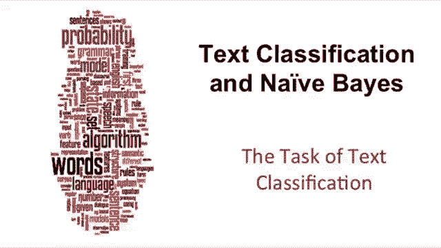

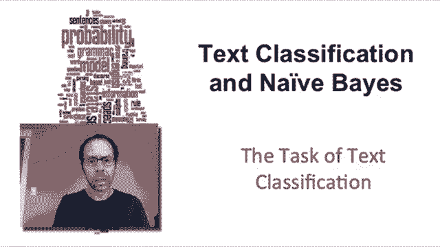

在本节课中，我们将介绍文本分类这一主题，以及朴素贝叶斯算法——这是进行文本分类最重要的方法之一。

---

## 📧 文本分类应用示例

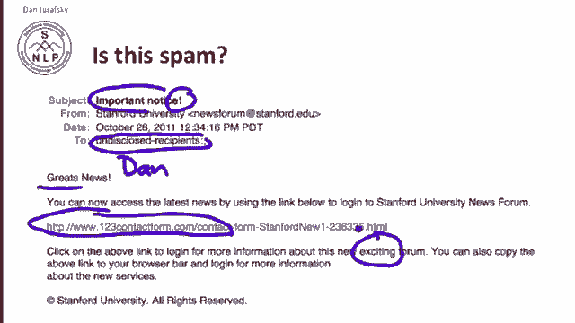

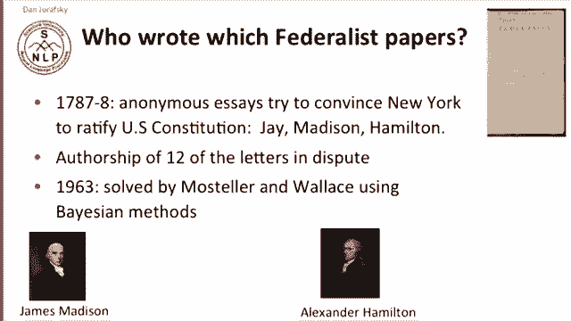

上一节我们介绍了文本分类的基本概念，本节中我们来看看一些具体的应用示例。

以下是文本分类的一些应用场景：

*   **垃圾邮件检测**：例如，一封邮件中可能包含拼写错误（如“gr8t”）、通用称呼（如“undisclosed recipients”）、可疑的URL或夸张的词语（如“exciting”），这些特征组合起来可以帮助分类器判断其为垃圾邮件。
*   **作者归属**：判断文本的作者是谁。一个著名的例子是判断《联邦党人文集》中匿名文章的作者是麦迪逊还是汉密尔顿，1963年研究者使用贝叶斯方法成功解决了这一问题，这也催生了我们将要讨论的朴素贝叶斯方法。
*   **性别识别**：判断作者的性别。研究表明，女性作者倾向于使用更多代词，而男性作者在名词短语中使用更多限定词和事实陈述。
*   **情感分析**：判断一段评论（如电影评论）的情感是积极还是消极。例如，“unbelievably disappointing”是负面评论，而“the greatest schoolball comedy ever filmed”是正面评论。这是非常重要的商业应用。
*   **主题分类**：为科学文章自动分配主题类别，例如在医学数据库中判断一篇文章属于“拮抗剂”、“血液供应”、“药物疗法”还是“流行病学”等主题。

---

## 🎯 文本分类任务定义

上一节我们看了一些应用，本节我们来正式定义文本分类任务。

文本分类的任务是：为任何一段文本分配一个主题类别。输入包括：
*   一个文档 **D**
*   一个固定的类别集合 **C = {c₁, c₂, ..., cⱼ}**

我们的目标是：给定文档 **D** 和类别集合 **C**，预测文档所属的类别 **c ∈ C**。

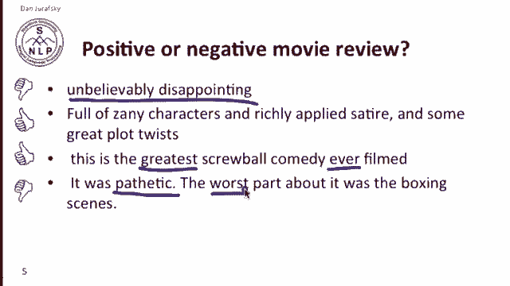

---

## ⚙️ 文本分类方法

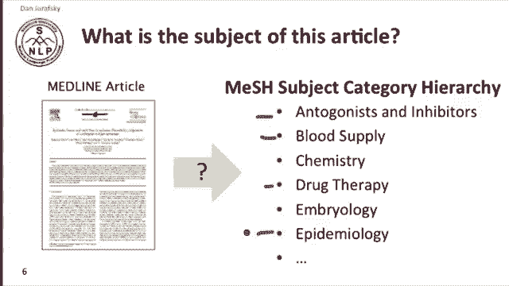

### 基于规则的方法

最简单的文本分类方法是使用手写规则。例如，在垃圾邮件检测中，可以制定如下规则：

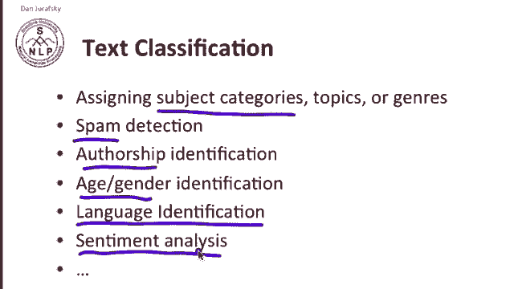

*   如果发件人在黑名单中，则标记为垃圾邮件。
*   如果邮件内容包含“millions of dollars”或“you have been selected”等短语，则标记为垃圾邮件。

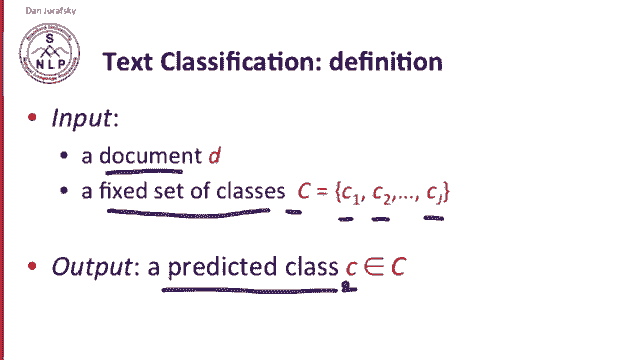

虽然专家精心设计的规则可以达到很高的准确率，但构建和维护这些规则成本高昂。因此，手写规则通常作为系统的一部分，与机器学习方法结合使用。

### 监督式机器学习方法

更主流的方法是监督式机器学习。除了文档 **D** 和类别集合 **C**，我们还需要一个**训练集**。训练集由许多已经人工标注好类别的文档组成。

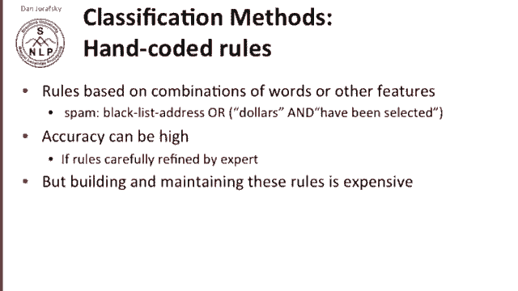

给定训练集，机器学习的目标是生成一个分类器 **γ**。分类器 **γ** 是一个函数，当输入一个新文档时，它能输出该文档的预测类别。

机器学习中有多种分类器，本节课我们将重点介绍**朴素贝叶斯分类器**。在本课程后续内容中，我们还会接触到逻辑回归、支持向量机（SVM）、K近邻（KNN）等其他分类器。

无论使用哪种分类器，文本分类的核心流程都是：从文档中提取特征，然后构建一个能根据这些特征判断文档类别的分类器。

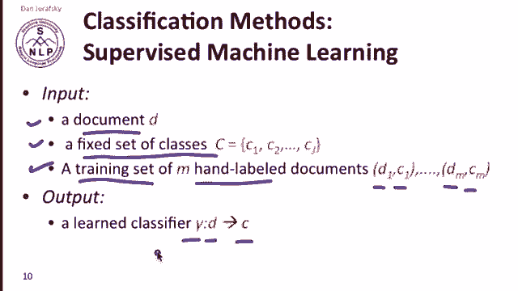

---

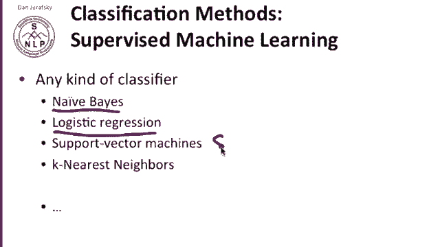

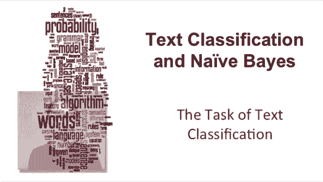

## 📝 总结

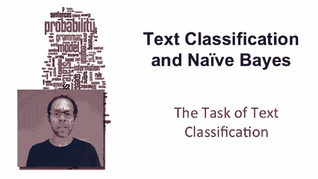

本节课中，我们一起学习了文本分类的基本概念。我们了解了文本分类的多种应用场景，如垃圾邮件检测、作者归属、情感分析等。我们明确了文本分类的任务定义：为文档分配预定义类别。最后，我们介绍了实现文本分类的两种主要方法：基于规则的方法和监督式机器学习方法，并指出后者是更通用和强大的解决方案，其中朴素贝叶斯算法是一个重要的基础分类器。