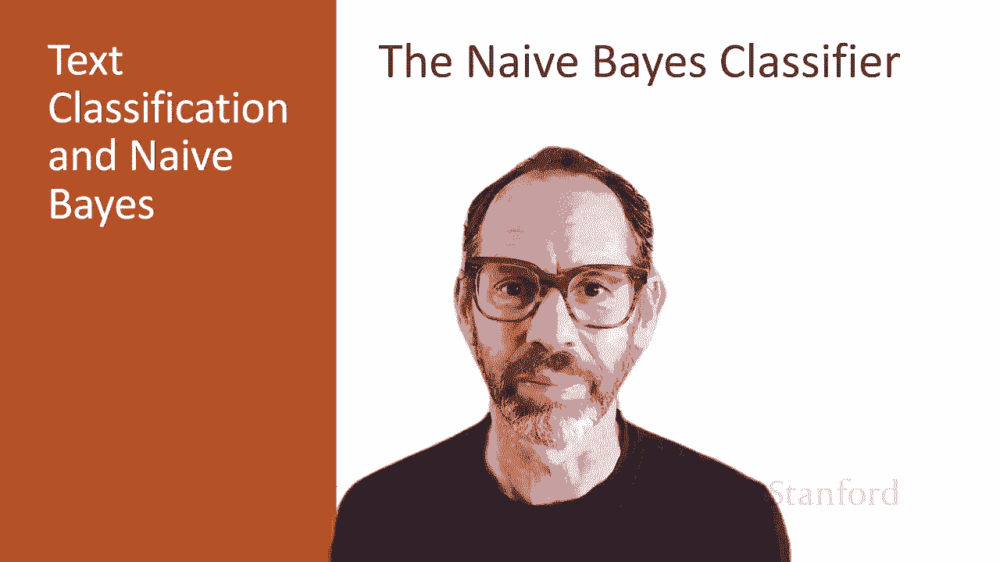
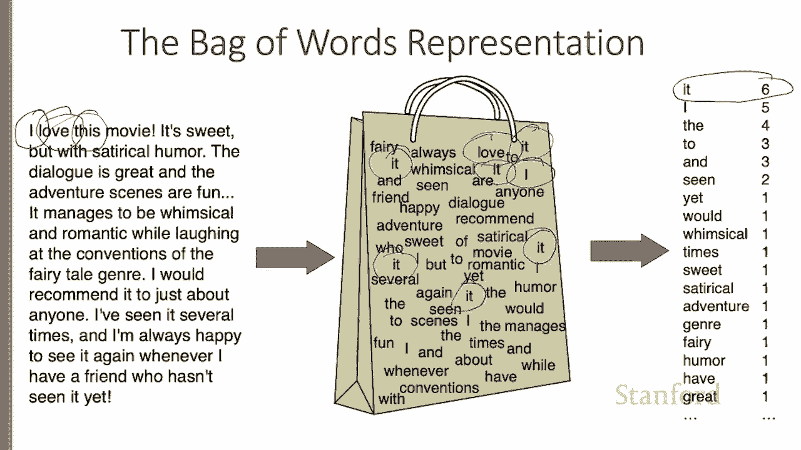
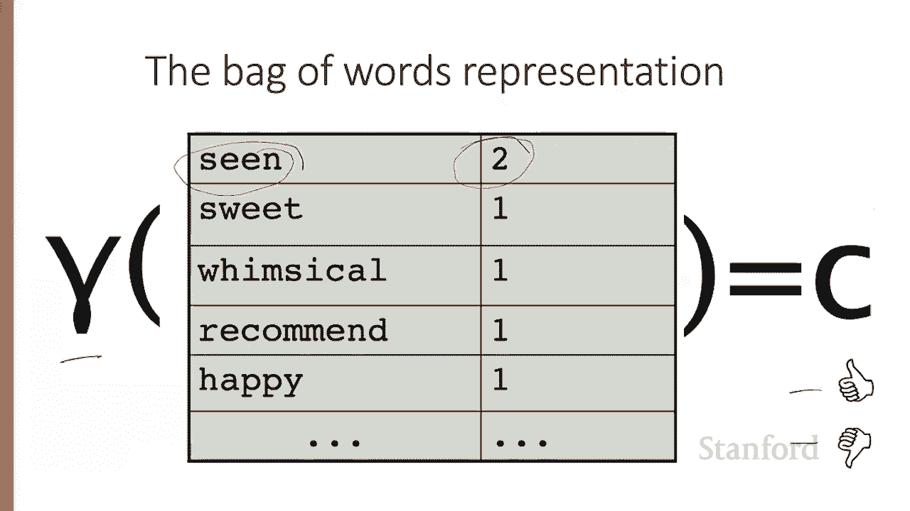
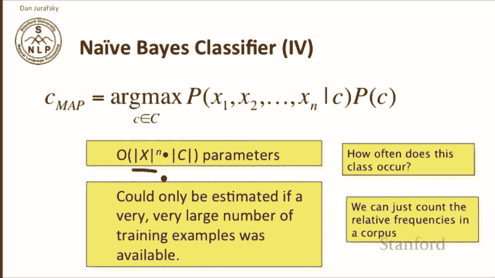
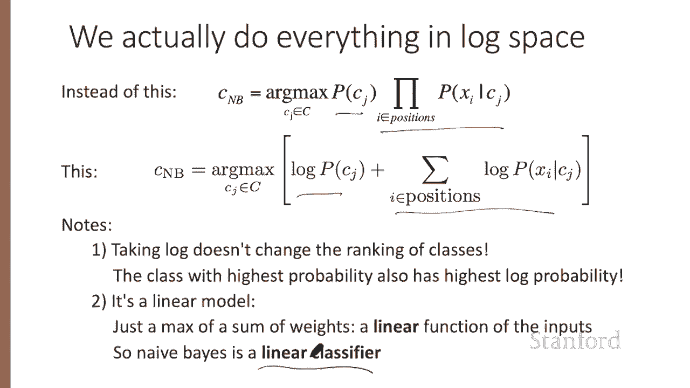
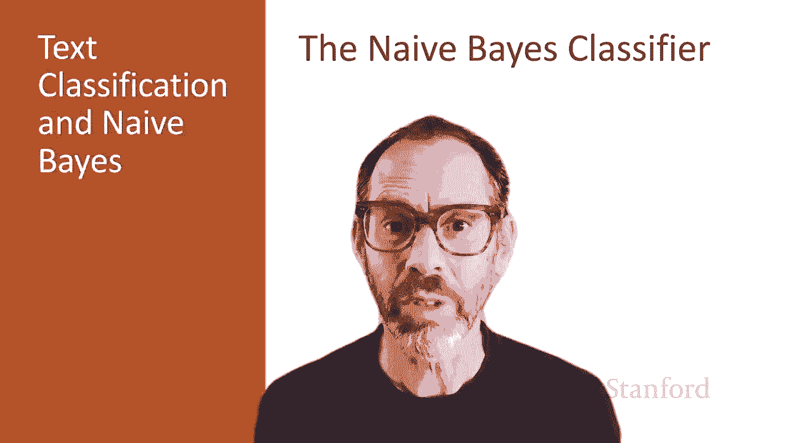

# 二十：L4.2 - 朴素贝叶斯分类器 📚 

在本节课中，我们将学习朴素贝叶斯分类器。这是一种基础的文本分类方法，通过它我们可以引入文本分类中出现的许多核心问题。

---

## 🧳 词袋模型

上一节我们介绍了朴素贝叶斯分类器的基本概念，本节中我们来看看它如何表示文档。朴素贝叶斯分类器基于一个非常简单的文档表示方法，称为“词袋模型”。

以下是一个电影评论示例：
> I love this movie. It's sweet, but with satirical humor.

在词袋表示法中，我们想象将这篇评论中的所有单词都扔进一个大纸袋并混合在一起。因此，我们不知道单词出现的顺序。单词“I”在袋子里，单词“love”也在袋子里，单词“this”也在。但袋子并不表示单词的顺序。

我们可以将这个词袋视为一个单词及其出现次数的列表。例如，单词“it”在这个袋子中出现了六次，单词“I”出现了五次，单词“the”出现了四次，以此类推，像“humor”、“have”或“great”这样的单词都只出现了一次。

---

## 🎯 分类器的任务

上一节我们了解了如何用词袋表示文档，本节中我们来看看分类器的目标。分类函数可以被看作一个函数 `γ`，它接收这个单词和计数的列表，并做出分类决策——例如“点赞”或“踩”（如果是二元分类）。或者，如果我们有更多类别，我们可以将其映射到其中一个类别。因此，我们的任务是将这个单词和计数的列表映射到某个类别。

---

## 📊 贝叶斯规则与分类

在分类任务中，我们有一个文档 `D` 和一个类别 `C`，我们的目标是为每个类别计算给定文档的条件概率 `P(C|D)`。我们将使用这个概率来选择最佳类别。

根据贝叶斯规则，这个概率等于：
`P(C|D) = P(D|C) * P(C) / P(D)`

让我们看看如何在分类器中使用它。最佳类别，即最大后验概率类别，是我们为文档分配的那个类别。它是所有类别中，使 `P(C|D)` 最大的那个类别。

根据贝叶斯规则，使 `P(C|D)` 最大的类别，同样也使 `P(D|C) * P(C) / P(D)` 最大。在贝叶斯分类的传统中，我们可以忽略分母 `P(D)`，因为对于比较所有类别来说，`P(D)` 是一个常数，不影响排序结果。

因此，最可能的类别 `C_map` 是最大化以下两个概率乘积的类别：
*   `P(D|C)`：我们称之为**似然**。
*   `P(C)`：我们称之为**先验**。

---

## 🔧 计算概率与简化假设

上一节我们推导了分类决策公式，本节中我们来看看如何计算其中的概率。计算类别的先验概率 `P(C)` 相对简单，可以通过统计某个语料库或数据集中该类别的相对频率来完成。

然而，计算给定类别的文档似然 `P(D|C)` 则复杂得多。为了使其可计算，朴素贝叶斯分类器做出了两个关键的简化假设。

以下是这两个假设：

1.  **词袋假设**：我们假设单词在文档中的位置无关紧要。我们只关心某个单词或特征是否出现，而不关心它出现在哪里。
2.  **条件独立性假设**：我们假设给定类别时，不同特征（例如单词）的出现是相互独立的。也就是说，一个单词的出现概率不依赖于其他单词的出现。

这两个假设都是不正确的简化，但在实践中，它们极大地简化了问题，使我们能够以较高的准确率解决问题。

基于这两个假设，我们可以将给定类别下整个特征集 `x1, x2, ..., xn` 的联合概率表示为一系列独立概率的乘积：
`P(x1, x2, ..., xn | C) = P(x1|C) * P(x2|C) * ... * P(xn|C)`

因此，朴素贝叶斯分类器选择的最佳类别是最大化以下公式的类别：
`C_map = argmax_C [ P(C) * ∏_i P(x_i | C) ]`

---

## 📝 应用于文本分类

现在，让我们具体看看如何将朴素贝叶斯应用于文本分类。首先，我们假设查看文本文档中的所有单词位置。

对于一个有 `n` 个单词的文档，对于每个类别 `C`，我们计算：
`P(C) * ∏_{i=1}^{n} P(word_i | C)`

然后，我们选择计算结果最高的类别作为文档的类别。

这个算法有一个潜在问题：`argmax` 计算涉及大量概率的连乘。由于概率都是介于0和1之间的小数，连乘可能导致浮点数下溢。

我们的解决方案是使用对数。因为 `log(a * b) = log(a) + log(b)`，所以我们可以将对数概率相加，而不是将概率相乘。

因此，我们最终的计算公式变为：
`C_map = argmax_C [ log P(C) + ∑_{i=1}^{n} log P(word_i | C) ]`

取对数不会改变类别的排序，最高概率的类别同样具有最高的对数概率。使用对数求和意味着我们创建了一个线性模型，我们是在对权重求和后取最大值。这清楚地表明朴素贝叶斯是一个线性分类器，而线性分类器是简单分类器家族中的重要成员。

---

## 🎓 总结

本节课中，我们一起学习了朴素贝叶斯文本分类器的基本原理。我们首先介绍了**词袋模型**作为文档的表示方法。然后，我们利用**贝叶斯规则**推导出分类决策公式，即选择最大化 `P(C) * P(D|C)` 的类别。为了实际计算，我们引入了两个关键的简化假设：**词袋假设**和**条件独立性假设**。最后，我们讨论了如何通过取**对数**来避免数值下溢问题，并指出朴素贝叶斯本质上是一个**线性分类器**。