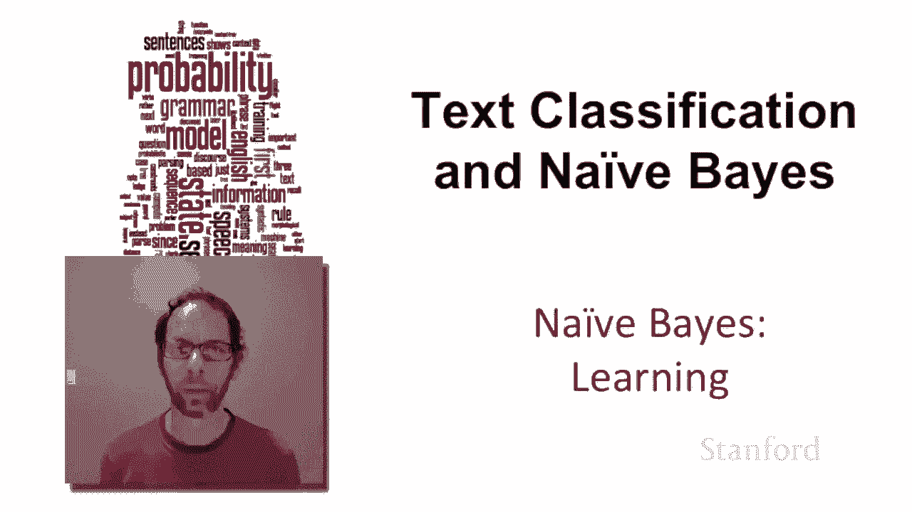
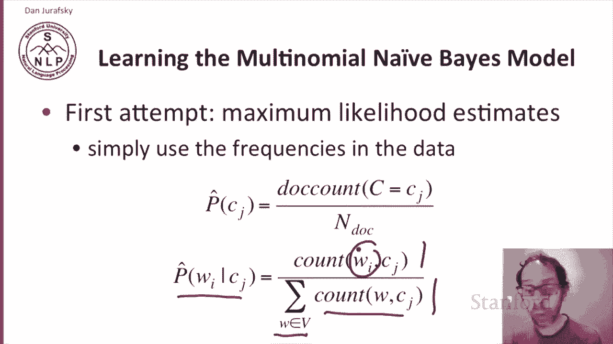
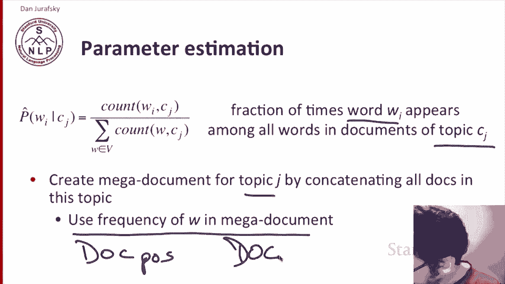
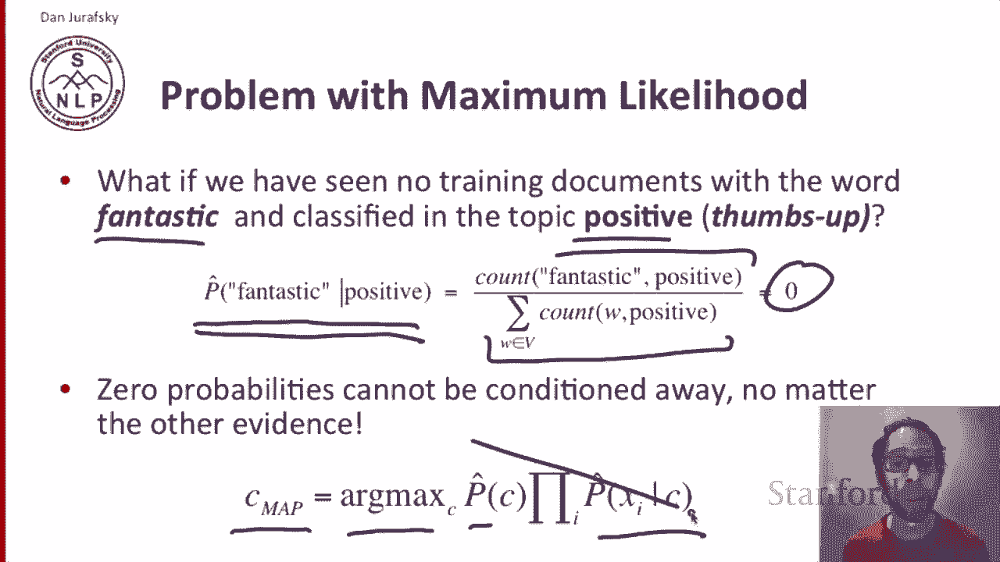
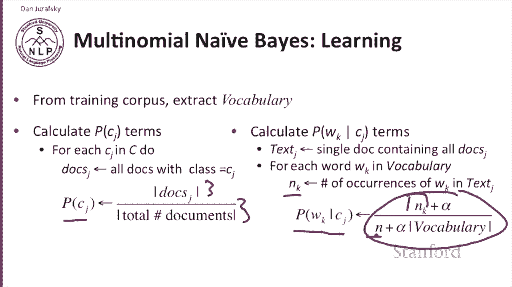
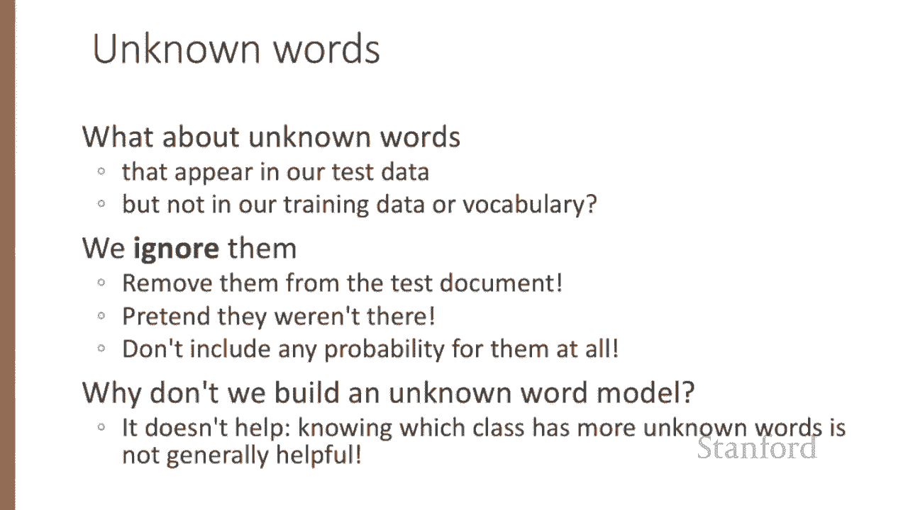
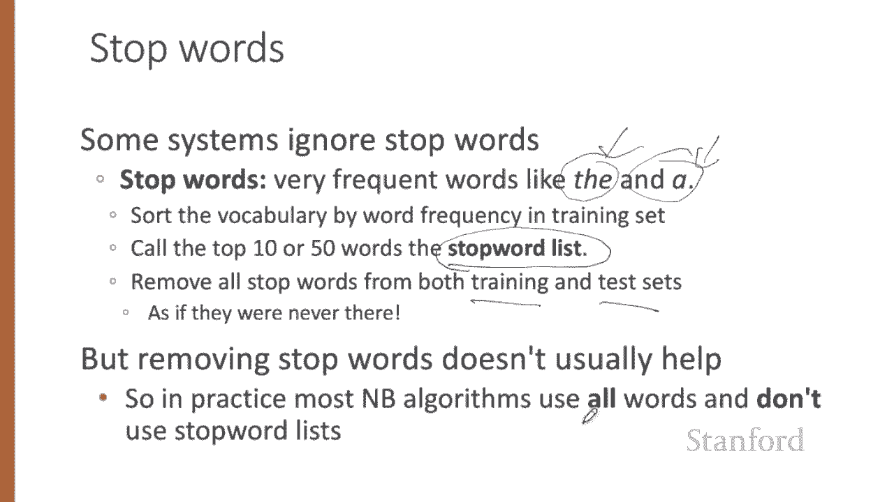
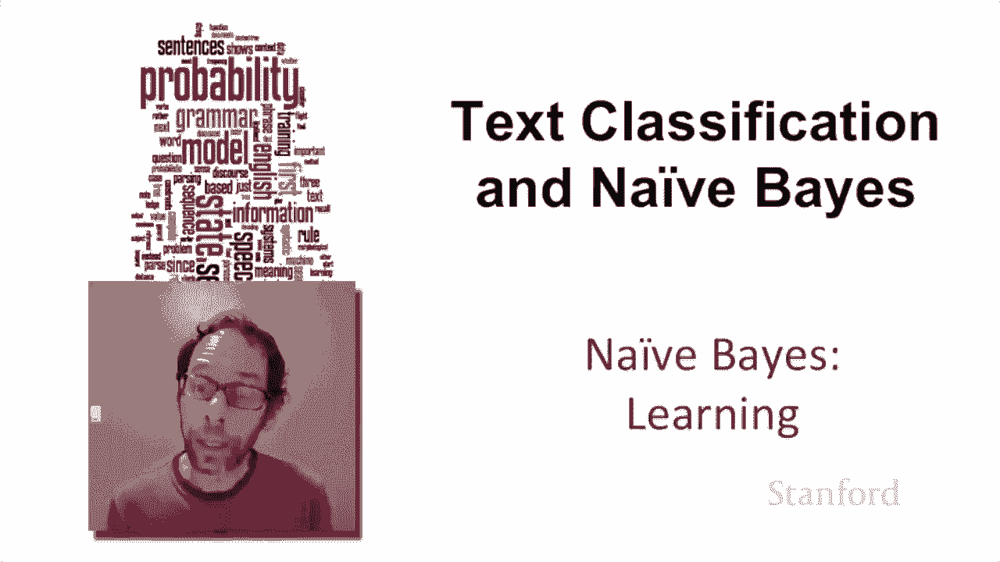

# 二十一：L4.3 - 朴素贝叶斯训练学习 🧠

在本节课中，我们将要学习如何训练朴素贝叶斯模型，即如何从数据中学习模型的参数。我们将重点介绍使用最大似然估计的简单方法，并探讨其潜在问题及解决方案。

---

## 最大似然估计 📊

学习多项式朴素贝叶斯模型最简单的方法是使用最大似然估计。其核心思想是直接使用数据中的频率来计算概率。

### 先验概率的计算

要计算一个文档属于特定类别 \( C_j \) 的先验概率 \( P(C_j) \)，我们可以统计所有文档的数量，然后计算其中属于类别 \( C_j \) 的文档所占的比例。公式如下：

\[
P(C_j) = \frac{\text{属于类别 } C_j \text{ 的文档数量}}{\text{文档总数}}
\]

### 似然概率的计算

对于似然概率，即给定类别 \( C_j \) 时，单词 \( w_i \) 出现的概率 \( P(w_i | C_j) \)，我们需要统计单词 \( w_i \) 在类别 \( C_j \) 的所有文档中出现的次数，然后除以类别 \( C_j \) 中所有单词的总数。公式如下：

\[
P(w_i | C_j) = \frac{\text{单词 } w_i \text{ 在类别 } C_j \text{ 中出现的次数}}{\text{类别 } C_j \text{ 中所有单词的总数}}
\]

具体操作时，我们会为每个类别 \( C_j \) 创建一个“超级文档”，即将所有属于该类别的文档拼接在一起。然后，我们在这个超级文档中计算每个单词的频率。

---

## 最大似然估计的问题与平滑处理 ⚠️

上一节我们介绍了使用最大似然估计计算参数的方法，本节中我们来看看这种方法存在的一个主要问题及其解决方案。

最大似然估计的一个关键问题是“零概率”问题。例如，假设单词“fantastic”在训练集的“正面”类别中从未出现过。那么，根据最大似然估计，其似然概率 \( P(\text{fantastic} | \text{positive}) \) 将为零。

这会导致严重问题，因为在分类时，我们计算的是后验概率 \( P(C_j | \text{文档}) \propto P(C_j) \times \prod_i P(w_i | C_j) \)。如果其中任何一个似然项为零，整个乘积就会变为零，导致模型永远无法选择该类别。

### 解决方案：加一平滑

解决零概率问题的标准方法是使用加一平滑（拉普拉斯平滑）。其做法是在计数时，为每个单词的计数都加上一个常数（通常为1）。

平滑后的似然概率计算公式变为：

\[
P_{\text{smooth}}(w_i | C_j) = \frac{\text{单词 } w_i \text{ 在类别 } C_j \text{ 中的出现次数} + 1}{\text{类别 } C_j \text{ 中所有单词的总数} + |V|}
\]

其中，\( |V| \) 是词汇表的大小。这样，即使某个单词在训练集中从未出现，其概率也不会为零。

---

## 参数计算步骤 📝

以下是训练朴素贝叶斯模型并计算参数的具体步骤：

1.  **提取词汇表**：从训练语料库中提取所有不同的单词，构成词汇表 \( V \)。
2.  **计算先验概率**：对于每个类别 \( C_j \)，计算其先验概率。
    *   找出所有属于类别 \( C_j \) 的文档集合 \( \text{Docs}_j \)。
    *   计算 \( P(C_j) = \frac{|\text{Docs}_j|}{\text{文档总数}} \)。
3.  **计算似然概率**：对于每个类别 \( C_j \) 和词汇表中的每个单词 \( w_k \)，计算平滑后的似然概率。
    *   为类别 \( C_j \) 创建超级文档 \( \text{Text}_j \)（拼接所有 \( \text{Docs}_j \) 中的文档）。
    *   在 \( \text{Text}_j \) 中统计单词 \( w_k \) 出现的次数，记为 \( n_k \)。
    *   计算 \( P_{\text{smooth}}(w_k | C_j) = \frac{n_k + \alpha}{N_j + \alpha \times |V|} \)，其中 \( N_j \) 是 \( \text{Text}_j \) 中的总词数，\( \alpha \) 是平滑参数（通常为1）。

---

## 处理未知词与停用词 🔍

### 未知词

未知词是指在测试集中出现，但未包含在训练集词汇表中的单词。

处理未知词的常见方法是直接忽略它们。在分类时，我们将这些词从测试文档中移除，不为其分配任何概率值。

通常不专门为未知词建立概率模型，因为简单地根据未知词数量来调整概率，对于区分类别通常没有帮助。

### 停用词

停用词是指在语料库中出现频率极高的词（如“the”、“a”、“is”）。

识别停用词的方法是：根据单词在训练集中的频率进行排序，取前K个（如50或100个）作为停用词列表。然后，在训练和测试阶段，直接移除这些停用词。

然而，在朴素贝叶斯文本分类中，移除停用词通常并不会带来显著的性能提升。因此，在实践中，大多数朴素贝叶斯分类器会使用所有单词，而不使用停用词列表。

---

## 总结 ✨

本节课中我们一起学习了朴素贝叶斯模型的训练过程。

我们首先介绍了使用最大似然估计来计算先验概率和似然概率的基本方法。接着，我们探讨了最大似然估计中存在的零概率问题，并引入了加一平滑技术来解决它。然后，我们详细列出了从数据中学习模型参数的具体步骤。最后，我们讨论了如何处理未知词和停用词，并指出在朴素贝叶斯分类中，通常忽略未知词并保留所有单词是更常见的做法。

通过学习，我们了解到训练朴素贝叶斯模型是一个参数计算相对直接的过程，关键在于通过平滑技术处理数据稀疏性问题，从而构建一个更鲁棒的分类器。